# Exploratory Data Analysis {#exploratory-data-analysis .r4ds-section}

## Introduction {#introduction-3 .r4ds-section}

This will also use data from the **nycflights13** package.
The **ggbeeswarm**, **lvplot**, and **ggstance** packages provide some additional functions used in some solutions.


```r
library("tidyverse")
library("nycflights13")
library("ggbeeswarm")
library("lvplot")
library("ggstance")
```

## Questions {#questions .r4ds-section}

## Variation {#variation .r4ds-section}

### Exercise 7.3.1 {.unnumbered .exercise data-number="7.3.1"}

<div class="question">

Explore the distribution of each of the `x`, `y`, and `z` variables in `diamonds`. What do you learn?
Think about a diamond and how you might decide which dimension is the length, width, and depth.

</div>

<div class="answer">

First, I'll calculate summary statistics for these variables and plot their distributions.

```r
summary(select(diamonds, x, y, z))
#>        x               y              z       
#>  Min.   : 0.00   Min.   : 0.0   Min.   : 0.0  
#>  1st Qu.: 4.71   1st Qu.: 4.7   1st Qu.: 2.9  
#>  Median : 5.70   Median : 5.7   Median : 3.5  
#>  Mean   : 5.73   Mean   : 5.7   Mean   : 3.5  
#>  3rd Qu.: 6.54   3rd Qu.: 6.5   3rd Qu.: 4.0  
#>  Max.   :10.74   Max.   :58.9   Max.   :31.8
```

```r
ggplot(diamonds) +
  geom_histogram(mapping = aes(x = x), binwidth = 0.01)
```

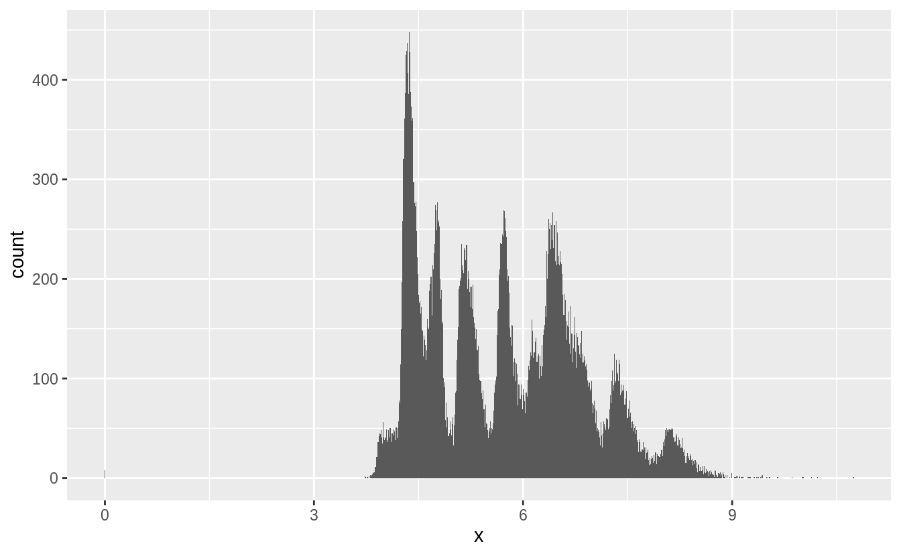

```r
ggplot(diamonds) +
  geom_histogram(mapping = aes(x = y), binwidth = 0.01)
```

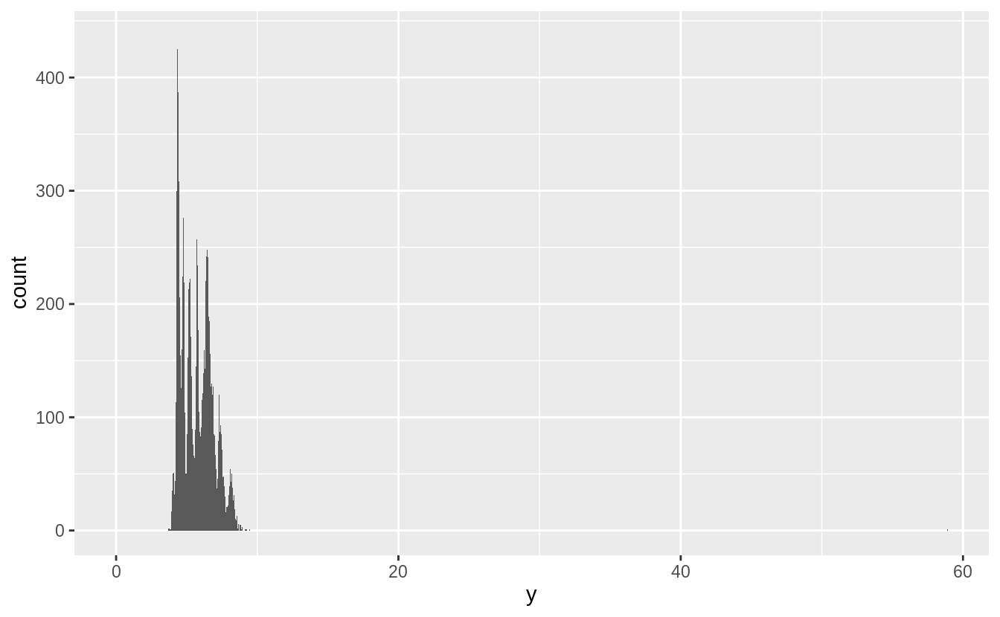

```r
ggplot(diamonds) +
  geom_histogram(mapping = aes(x = z), binwidth = 0.01)
```

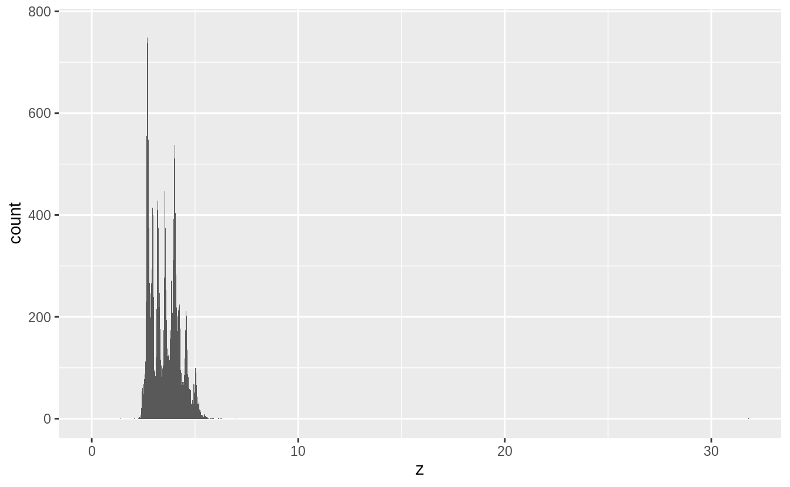


There several noticeable features of the distributions:

1.  `x` and `y` are larger than `z`,
1.  there are outliers,
1.  they are all right skewed, and
1.  they are multimodal or "spiky".

The typical values of `x` and `y` are larger than `z`, with `x` and `y` having inter-quartile 
ranges of 4.7--6.5, while `z` has an inter-quartile range of 2.9--4.0.

There are two types of outliers in this data.
Some diamonds have values of zero and some have abnormally large values of `x`, `y`, or `z`.

```r
summary(select(diamonds, x, y, z))
#>        x               y              z       
#>  Min.   : 0.00   Min.   : 0.0   Min.   : 0.0  
#>  1st Qu.: 4.71   1st Qu.: 4.7   1st Qu.: 2.9  
#>  Median : 5.70   Median : 5.7   Median : 3.5  
#>  Mean   : 5.73   Mean   : 5.7   Mean   : 3.5  
#>  3rd Qu.: 6.54   3rd Qu.: 6.5   3rd Qu.: 4.0  
#>  Max.   :10.74   Max.   :58.9   Max.   :31.8
```
These appear to be either data entry errors, or an undocumented convention in the dataset for indicating missing values.  An alternative hypothesis would be that values of zero are the
result of rounding values like `0.002` down, but since there are no diamonds with values of 0.01, that does not seem to be the case.

```r
filter(diamonds, x == 0 | y == 0 | z == 0)
#> # A tibble: 20 x 10
#>   carat cut     color clarity depth table price     x     y     z
#>   <dbl> <ord>   <ord> <ord>   <dbl> <dbl> <int> <dbl> <dbl> <dbl>
#> 1  1    Premium G     SI2      59.1    59  3142  6.55  6.48     0
#> 2  1.01 Premium H     I1       58.1    59  3167  6.66  6.6      0
#> 3  1.1  Premium G     SI2      63      59  3696  6.5   6.47     0
#> 4  1.01 Premium F     SI2      59.2    58  3837  6.5   6.47     0
#> 5  1.5  Good    G     I1       64      61  4731  7.15  7.04     0
#> 6  1.07 Ideal   F     SI2      61.6    56  4954  0     6.62     0
#> # … with 14 more rows
```

There are also some diamonds with values of `y` and `z` that are abnormally large.
There are diamonds with `y == 58.9` and `y == 31.8`, and one with `z == 31.8`. 
These are probably data errors since the values do not seem in line with the values of 
the other variables.

```r
diamonds %>%
  arrange(desc(y)) %>%
  head()
#> # A tibble: 6 x 10
#>   carat cut     color clarity depth table price     x     y     z
#>   <dbl> <ord>   <ord> <ord>   <dbl> <dbl> <int> <dbl> <dbl> <dbl>
#> 1  2    Premium H     SI2      58.9    57 12210  8.09 58.9   8.06
#> 2  0.51 Ideal   E     VS1      61.8    55  2075  5.15 31.8   5.12
#> 3  5.01 Fair    J     I1       65.5    59 18018 10.7  10.5   6.98
#> 4  4.5  Fair    J     I1       65.8    58 18531 10.2  10.2   6.72
#> 5  4.01 Premium I     I1       61      61 15223 10.1  10.1   6.17
#> 6  4.01 Premium J     I1       62.5    62 15223 10.0   9.94  6.24
```

```r
diamonds %>%
  arrange(desc(z)) %>%
  head()
#> # A tibble: 6 x 10
#>   carat cut       color clarity depth table price     x     y     z
#>   <dbl> <ord>     <ord> <ord>   <dbl> <dbl> <int> <dbl> <dbl> <dbl>
#> 1  0.51 Very Good E     VS1      61.8  54.7  1970  5.12  5.15 31.8 
#> 2  2    Premium   H     SI2      58.9  57   12210  8.09 58.9   8.06
#> 3  5.01 Fair      J     I1       65.5  59   18018 10.7  10.5   6.98
#> 4  4.5  Fair      J     I1       65.8  58   18531 10.2  10.2   6.72
#> 5  4.13 Fair      H     I1       64.8  61   17329 10     9.85  6.43
#> 6  3.65 Fair      H     I1       67.1  53   11668  9.53  9.48  6.38
```

Initially, I only considered univariate outliers. However, to check the plausibility
of those outliers I would informally consider how consistent their values are with
the values of the other variables. In this case, scatter plots of each combination
of `x`, `y`, and `z` shows these outliers much more clearly.

```r
ggplot(diamonds, aes(x = x, y = y)) +
  geom_point()
```

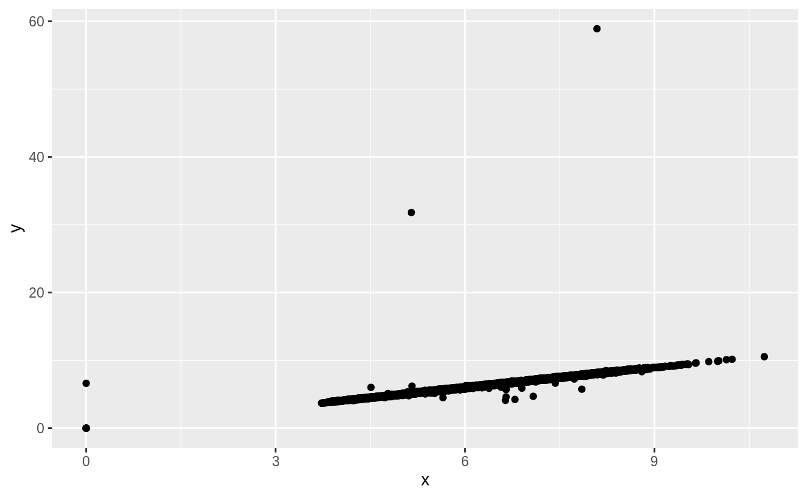

```r
ggplot(diamonds, aes(x = x, y = z)) +
  geom_point()
```

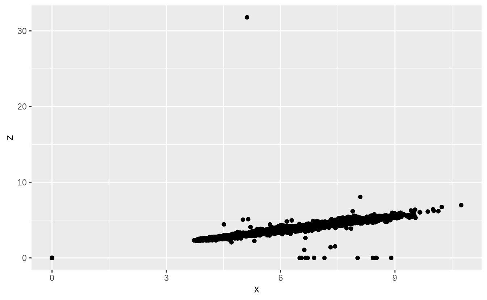

```r
ggplot(diamonds, aes(x = y, y = z)) +
  geom_point()
```

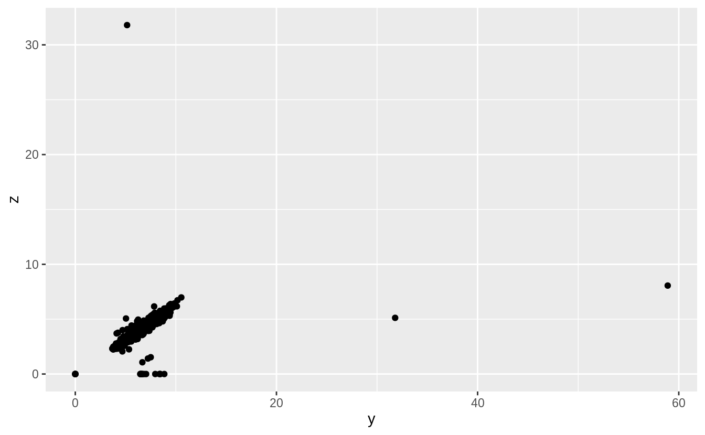

Removing the outliers from `x`, `y`, and `z` makes the distribution easier to see.
The right skewness of these distributions is unsurprising; there should be more smaller diamonds than larger ones and these values can never be negative.
More interestingly, there are spikes in the distribution at certain values.
These spikes often, but not exclusively, occur near integer values.
Without knowing more about diamond cutting, I can't say more about what these spikes represent. If you know, add a comment.
I would guess that some diamond sizes are used more often than others, and these spikes correspond to those sizes.
Also, I would guess that a diamond cut and carat value of a diamond imply values of `x`, `y`, and `z`. 
Since there are spikes in the distribution of carat sizes, and only a few different cuts, that could result in these spikes.
I'll leave it to readers to figure out if that's the case.

```r
filter(diamonds, x > 0, x < 10) %>%
  ggplot() +
  geom_histogram(mapping = aes(x = x), binwidth = 0.01) +
  scale_x_continuous(breaks = 1:10)
```


```r
filter(diamonds, y > 0, y < 10) %>%
  ggplot() +
  geom_histogram(mapping = aes(x = y), binwidth = 0.01) +
  scale_x_continuous(breaks = 1:10)  
```

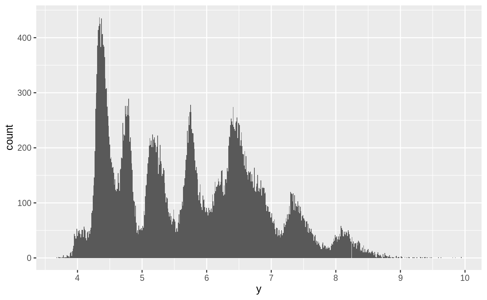

```r
filter(diamonds, z > 0, z < 10) %>%
  ggplot() +
  geom_histogram(mapping = aes(x = z), binwidth = 0.01) +
  scale_x_continuous(breaks = 1:10)    
```

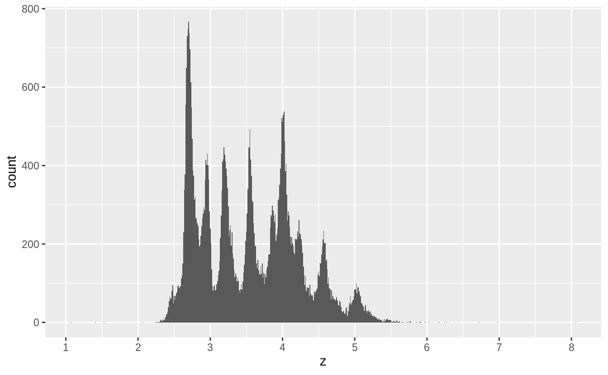

According to the documentation for `diamonds`, `x` is length, `y` is width, and `z` is depth.
If documentation were unavailable, I would compare the values of the variables to match them to the length, width, and depth.
I would expect length to always be less than width, otherwise the length would be called the width.
I would also search for the definitions of length, width, and depth with respect to diamond cuts.
[Depth](https://en.wikipedia.org/wiki/Diamond_cut) can be expressed as a percentage of the length/width of the diamond, which means it should be less than both the length and the width.


```r
summarise(diamonds, mean(x > y), mean(x > z), mean(y > z))
#> # A tibble: 1 x 3
#>   `mean(x > y)` `mean(x > z)` `mean(y > z)`
#>           <dbl>         <dbl>         <dbl>
#> 1         0.434          1.00          1.00
```

It appears that depth (`z`) is always smaller than length (`x`) or width (`y`), perhaps because a shallower depth helps when setting diamonds in jewelry and due to how it affect the reflection of light.
Length is more than width in less than half the observations, the opposite of my expectations.

</div>

### Exercise 7.3.2 {.unnumbered .exercise data-number="7.3.2"}

<div class="question">
Explore the distribution of price. Do you discover anything unusual or surprising? (Hint: Carefully think about the `binwidth` and make sure you try a wide range of values.)
</div> 

<div class="answer">

-   The price data has many spikes, but I can't tell what each spike corresponds to. The following plots don't show much difference in the distributions in the last one or two digits.
-   There are no diamonds with a price of \$1,500 (between \$1,455 and \$1,545, including).
-   There's a bulge in the distribution around $750.


```r
ggplot(filter(diamonds, price < 2500), aes(x = price)) +
  geom_histogram(binwidth = 10, center = 0)
```

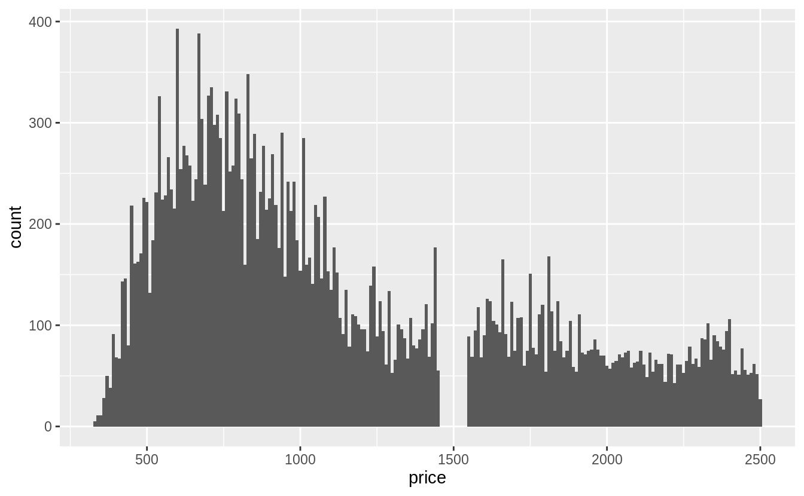


```r
ggplot(filter(diamonds), aes(x = price)) +
  geom_histogram(binwidth = 100, center = 0)
```

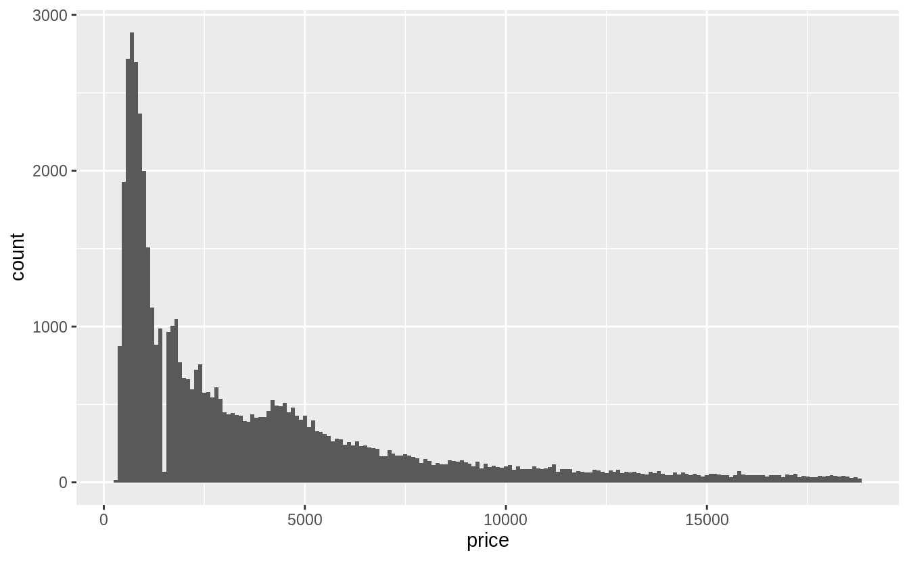

The last digits of prices are often not uniformly distributed. 
They are often round, ending in 0 or 5 (for one-half).
Another common pattern is ending in 99, as in $1999. 
If we plot the distribution of the last one and two digits of prices do we observe patterns like that?


```r
diamonds %>%
  mutate(ending = price %% 10) %>%
  ggplot(aes(x = ending)) +
  geom_histogram(binwidth = 1, center = 0)
```

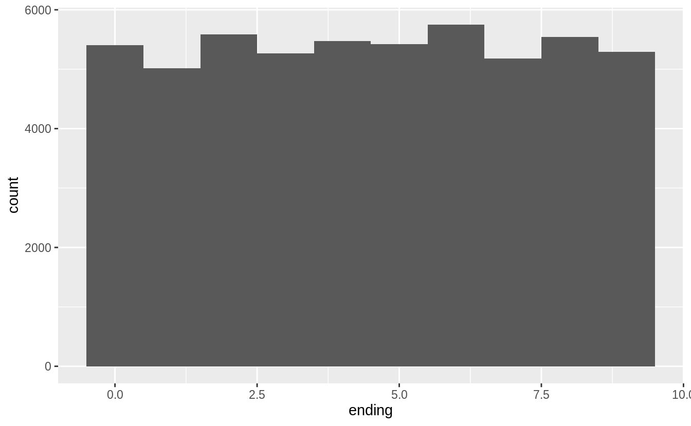


```r
diamonds %>%
  mutate(ending = price %% 100) %>%
  ggplot(aes(x = ending)) +
  geom_histogram(binwidth = 1)
```

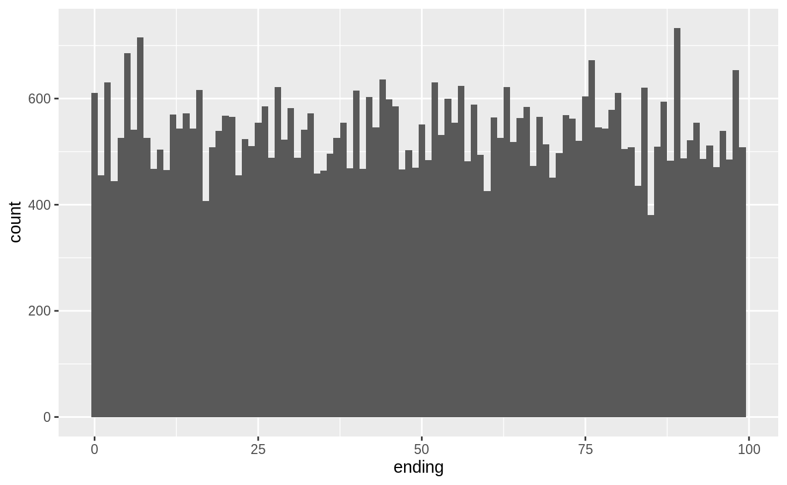


```r
diamonds %>%
  mutate(ending = price %% 1000) %>%
  filter(ending >= 500, ending <= 800) %>%
  ggplot(aes(x = ending)) +
  geom_histogram(binwidth = 1)
```

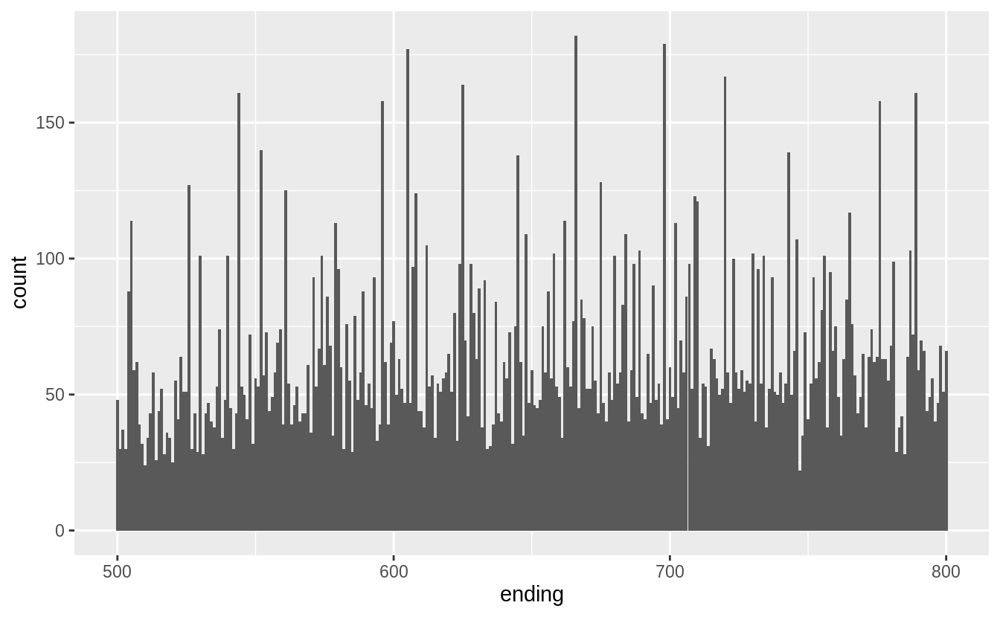

</div>

### Exercise 7.3.3 {.unnumbered .exercise data-number="7.3.3"}

<div class="question">
How many diamonds are 0.99 carat?
How many are 1 carat?
What do you think is the cause of the difference?
</div>

<div class="answer">

There are more than 70 times as many 1 carat diamonds as 0.99 carat diamond.

```r
diamonds %>%
  filter(carat >= 0.99, carat <= 1) %>%
  count(carat)
#> # A tibble: 2 x 2
#>   carat     n
#>   <dbl> <int>
#> 1  0.99    23
#> 2  1     1558
```

I don't know exactly the process behind how carats are measured, but some way or another some diamonds carat values are being "rounded up"
Presumably there is a premium for a 1 carat diamond vs. a 0.99 carat diamond beyond the expected increase in price due to a 0.01 carat increase.[^diamonds-prices]

To check this intuition, we would want to look at the number of diamonds in each carat range to see if there is an unusually low number of 0.99 carat diamonds, and an abnormally large number of 1 carat diamonds.


```r
diamonds %>%
  filter(carat >= 0.9, carat <= 1.1) %>%
  count(carat) %>%
  print(n = Inf)
#> # A tibble: 21 x 2
#>    carat     n
#>    <dbl> <int>
#>  1  0.9   1485
#>  2  0.91   570
#>  3  0.92   226
#>  4  0.93   142
#>  5  0.94    59
#>  6  0.95    65
#>  7  0.96   103
#>  8  0.97    59
#>  9  0.98    31
#> 10  0.99    23
#> 11  1     1558
#> 12  1.01  2242
#> 13  1.02   883
#> 14  1.03   523
#> 15  1.04   475
#> 16  1.05   361
#> 17  1.06   373
#> 18  1.07   342
#> 19  1.08   246
#> 20  1.09   287
#> 21  1.1    278
```

</div>

### Exercise 7.3.4 {.unnumbered .exercise data-number="7.3.4"}

<div class="question">
Compare and contrast `coord_cartesian()` vs `xlim()` or `ylim()` when zooming in on a histogram. What happens if you leave `binwidth` unset? What happens if you try and zoom so only half a bar shows?
</div>

<div class="answer">

The `coord_cartesian()` function zooms in on the area specified by the limits,
after having calculated and drawn the geoms.
Since the histogram bins have already been calculated, it is unaffected.


```r
ggplot(diamonds) +
  geom_histogram(mapping = aes(x = price)) +
  coord_cartesian(xlim = c(100, 5000), ylim = c(0, 3000))
#> `stat_bin()` using `bins = 30`. Pick better value with `binwidth`.
```

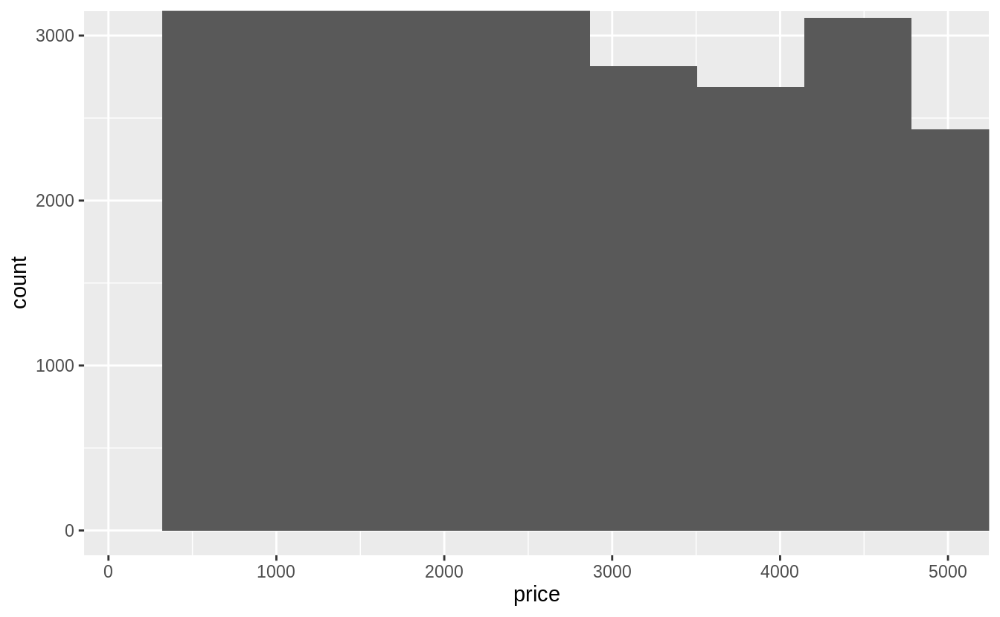

However, the `xlim()` and `ylim()` functions influence actions before the calculation
of the stats related to the histogram. Thus, any values outside the x- and y-limits
are dropped before calculating bin widths and counts. This can influence how
the histogram looks.


```r
ggplot(diamonds) +
  geom_histogram(mapping = aes(x = price)) +
  xlim(100, 5000) +
  ylim(0, 3000)
#> `stat_bin()` using `bins = 30`. Pick better value with `binwidth`.
#> Warning: Removed 14714 rows containing non-finite values (stat_bin).
#> Warning: Removed 6 rows containing missing values (geom_bar).
```


</div>

## Missing values {#missing-values-2 .r4ds-section}

### Exercise 7.4.1 {.unnumbered .exercise data-number="7.4.1"}

<div class="question">
What happens to missing values in a histogram?
What happens to missing values in a bar chart?
Why is there a difference?
</div>

<div class="answer">

Missing values are removed when the number of observations in each bin are calculated. See the warning message: `Removed 9 rows containing non-finite values (stat_bin)`

```r
diamonds2 <- diamonds %>%
  mutate(y = ifelse(y < 3 | y > 20, NA, y))

ggplot(diamonds2, aes(x = y)) +
  geom_histogram()
#> `stat_bin()` using `bins = 30`. Pick better value with `binwidth`.
#> Warning: Removed 9 rows containing non-finite values (stat_bin).
```

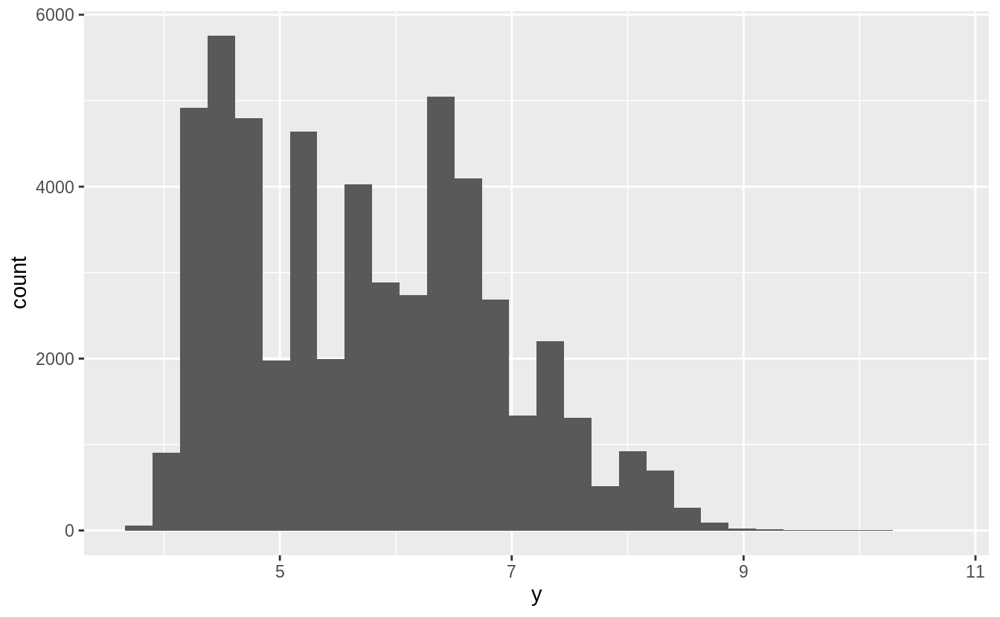

In the `geom_bar()` function, `NA` is treated as another category. The `x` aesthetic in `geom_bar()` requires a discrete (categorical) variable, and missing values act like another category.

```r
diamonds %>%
  mutate(cut = if_else(runif(n()) < 0.1, NA_character_, as.character(cut))) %>%
  ggplot() +
  geom_bar(mapping = aes(x = cut))
```

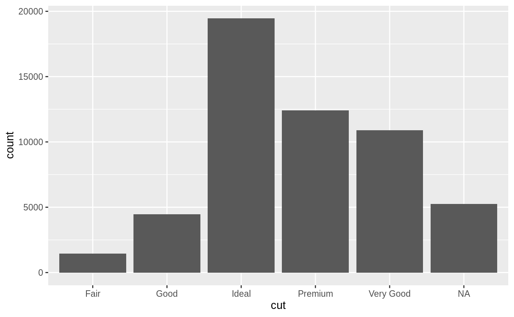

In a histogram, the `x` aesthetic variable needs to be numeric, and `stat_bin()` groups the observations by ranges into bins.
Since the numeric value of the `NA` observations is unknown, they cannot be placed in a particular bin, and are dropped.

</div>

### Exercise 7.4.2 {.unnumbered .exercise data-number="7.4.2"}

<div class="question">
What does `na.rm = TRUE` do in `mean()` and `sum()`?
</div>

<div class="answer">

This option removes `NA` values from the vector prior to calculating the mean and sum.


```r
mean(c(0, 1, 2, NA), na.rm = TRUE)
#> [1] 1
sum(c(0, 1, 2, NA), na.rm = TRUE)
#> [1] 3
```

</div>

## Covariation {#covariation .r4ds-section}

### A categorical and continuous variable

#### Exercise 7.5.1.1 {.unnumbered .exercise data-number="7.5.1.1"}

<div class="question">

Use what you've learned to improve the visualization of the departure times of cancelled vs. non-cancelled flights.

</div>

<div class="answer">

Instead of a `freqplot` use a box-plot

```r
nycflights13::flights %>%
  mutate(
    cancelled = is.na(dep_time),
    sched_hour = sched_dep_time %/% 100,
    sched_min = sched_dep_time %% 100,
    sched_dep_time = sched_hour + sched_min / 60
  ) %>%
  ggplot() +
  geom_boxplot(mapping = aes(y = sched_dep_time, x = cancelled))
```

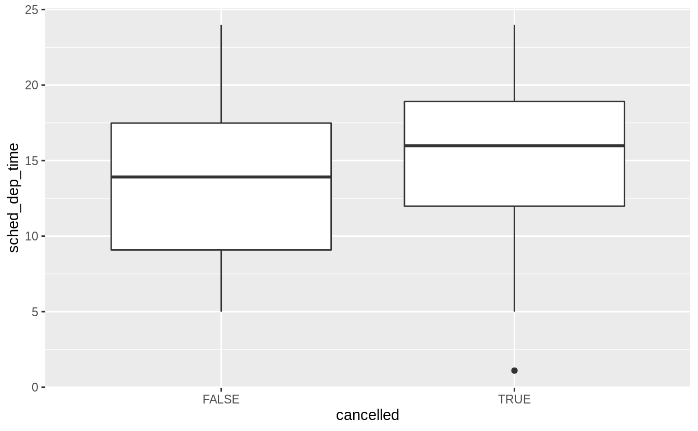

</div>

#### Exercise 7.5.1.2 {.unnumbered .exercise data-number="7.5.1.2"}

<div class="question">
What variable in the diamonds dataset is most important for predicting the price of a diamond?
How is that variable correlated with cut?
Why does the combination of those two relationships lead to lower quality diamonds being more expensive?
</div>

<div class="answer">

<!--
  Cannot use regression, geom smooth because not introduced yet.
  Cannot plot all variables with facet_wrap since that requires functions in the tidy chapter.s
-->

What are the general relationships of each variable with the price of the diamonds?
I will consider the variables: `carat`, `clarity`, `color`, and `cut`.
I ignore the dimensions of the diamond since `carat` measures size, and thus incorporates most of the information contained in these variables.

Since both `price` and `carat` are continuous variables, I use a scatter plot to visualize their relationship.

```r
ggplot(diamonds, aes(x = carat, y = price)) +
  geom_point()
```

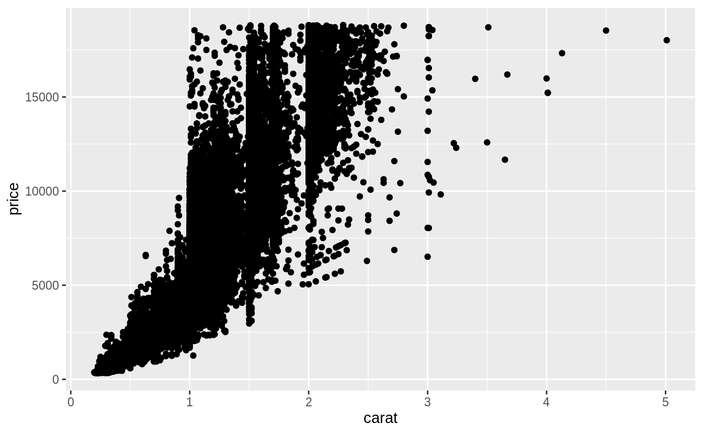
However, since there is a large number of points in the data, I will use a boxplot by binning `carat`, as suggested in the chapter:

```r
ggplot(data = diamonds, mapping = aes(x = carat, y = price)) +
  geom_boxplot(mapping = aes(group = cut_width(carat, 0.1)), orientation = "x")
```

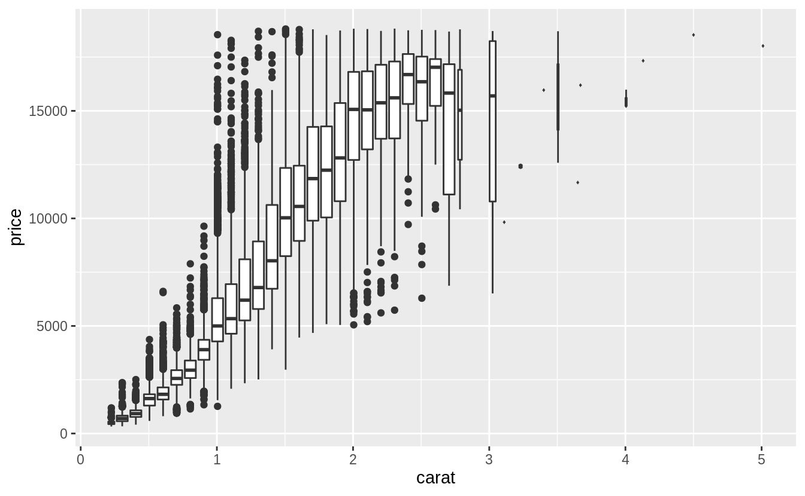
Note that the choice of the binning width is important, as if it were too large it would obscure any relationship, and if it were too small, the values in the bins could be too variable to reveal underlying trends.

<div>
Version 3.3.0 of ggplot2 introduced changes to boxplots that may affect the orientation. 

> This geom treats each axis differently and, thus, can thus have two orientations. 
> Often the orientation is easy to deduce from a combination of the given mappings and the types of positional scales in use. 
> Thus, ggplot2 will by default try to guess which orientation the layer should have. Under rare circumstances, the orientation is ambiguous and guessing may fail

If you are getting something different with your code check the version of ggplot2. 
Use  `orientation = "x"` (vertical boxplots) or `orientation = "y"` (horizontal boxplots) to explicitly specify how the geom should treat these axes.
</div>

<!--
cut_width(carat, 0.1) is categoriecal
ggplot(data = diamonds, mapping = aes(x = cut_width(carat, 0.1), y = price)) +
  geom_boxplot() 
-->   

The variables `color` and `clarity` are ordered categorical variables.
The chapter suggests visualizing a categorical and continuous variable using frequency polygons or boxplots.
In this case, I will use a box plot since it will better show a relationship between the variables.

There is a weak negative relationship between `color` and `price`.
The scale of diamond color goes from D (best) to J (worst).
Currently, the levels of `diamonds$color` are in the wrong order.
Before plotting, I will reverse the order of the `color` levels so they will be in increasing order of quality on the x-axis.
The `color` column is an example of a factor variable, which is covered in the
"[Factors](https://r4ds.had.co.nz/factors.html)" chapter of *R4DS*.


```r
diamonds %>%
  mutate(color = fct_rev(color)) %>%
  ggplot(aes(x = color, y = price)) +
  geom_boxplot()
```

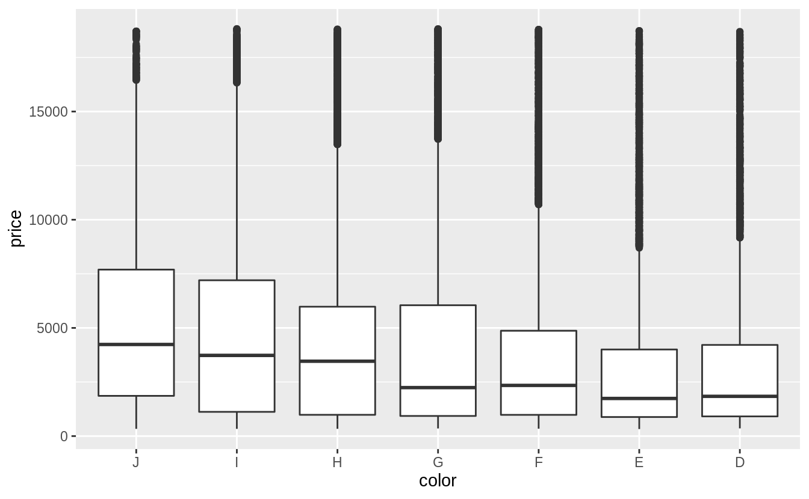

There is also weak negative relationship between `clarity` and `price`.
The scale of clarity goes from I1 (worst) to IF (best).


```r
ggplot(data = diamonds) +
  geom_boxplot(mapping = aes(x = clarity, y = price))
```

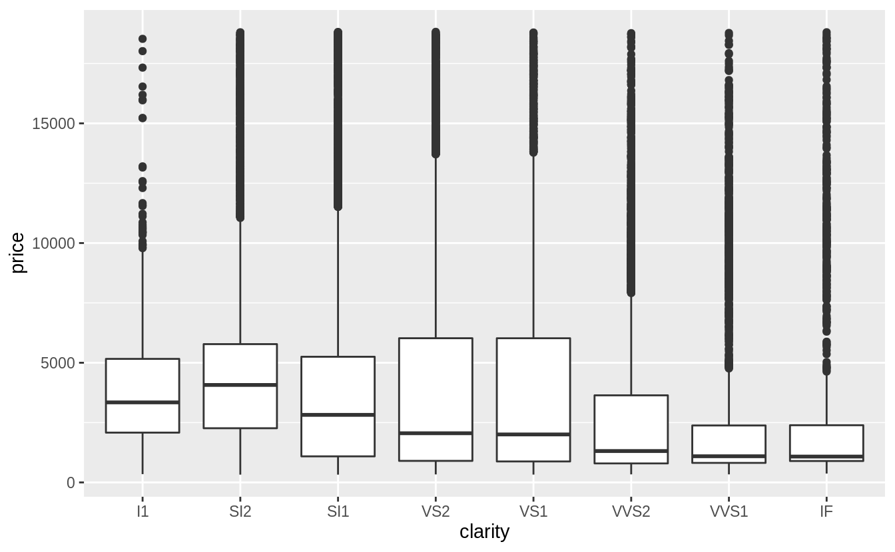

For both `clarity` and `color`, there is a much larger amount of variation within each category than between categories.
Carat is clearly the single best predictor of diamond prices.

Now that we have established that carat appears to be the best predictor of price, what is the relationship between it and cut?
Since this is an example of a continuous (carat) and categorical (cut) variable, it can be visualized with a box plot.


```r
ggplot(diamonds, aes(x = cut, y = carat)) +
  geom_boxplot()
```

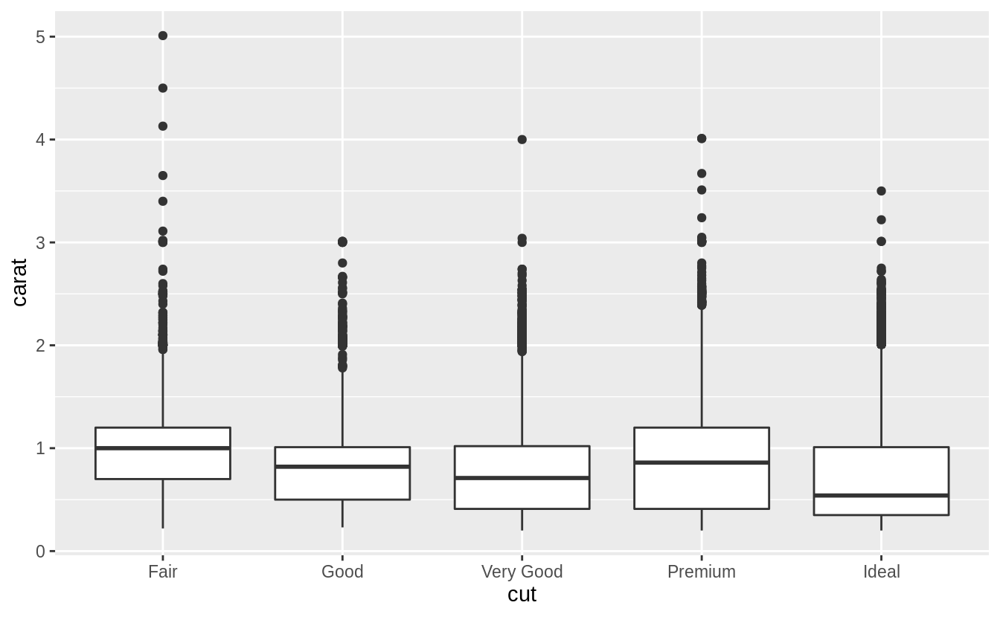

There is a lot of variability in the distribution of carat sizes within each cut category.
There is a slight negative relationship between carat and cut.
Noticeably, the largest carat diamonds have a cut of "Fair" (the lowest).

This negative relationship can be due to the way in which diamonds are selected for sale.
A larger diamond can be profitably sold with a lower quality cut, while a smaller diamond requires a better cut.

</div>

#### Exercise 7.5.1.3 {.unnumbered .exercise data-number="7.5.1.3"}

<div class="question">
Install the ggstance package, and create a horizontal box plot.
How does this compare to using `coord_flip()`?
</div>

<div class="answer">

Earlier, we created this horizontal box plot of the distribution `hwy` by `class`, using `geom_boxplot()` and `coord_flip()`:   

```r
ggplot(data = mpg) +
  geom_boxplot(mapping = aes(x = reorder(class, hwy, FUN = median), y = hwy)) +
  coord_flip()
```

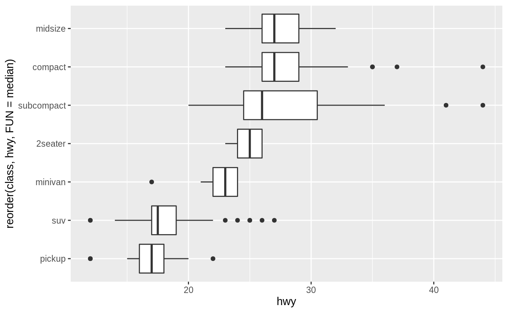

In this case the output looks the same, but `x` and `y` aesthetics are flipped.

```r
library("ggstance")

ggplot(data = mpg) +
  geom_boxploth(mapping = aes(y = reorder(class, hwy, FUN = median), x = hwy))
```


Current versions of ggplot2 (since [version 3.3.0](https://ggplot2.tidyverse.org/news/index.html#new-features)) do not require `coord_flip()`.
All geoms can choose the direction.
The direction is be inferred from the aesthetic mapping.
In this case, switching `x` and `y` produces a horizontal boxplot.

```r
ggplot(data = mpg) +
  geom_boxplot(mapping = aes(y = reorder(class, hwy, FUN = median), x = hwy))
```


The `orientation` argument is used to explicitly specify the axis orientation of the plot.

```r
ggplot(data = mpg) +
  geom_boxplot(mapping = aes(y = reorder(class, hwy, FUN = median), x = hwy), orientation = "y")
```


</div>

#### Exercise 7.5.1.4 {.unnumbered .exercise data-number="7.5.1.4"}

<div class="question">

One problem with box plots is that they were developed in an era of much smaller datasets and tend to display a prohibitively large number of "outlying values".
One approach to remedy this problem is the letter value plot.
Install the lvplot package, and try using `geom_lv()` to display the distribution of price vs cut.
What do you learn?

How do you interpret the plots?
</div>

<div class="answer">

Like box-plots, the boxes of the letter-value plot correspond to quantiles. However, they incorporate
far more quantiles than box-plots. They are useful for larger datasets because,

1.  larger datasets can give precise estimates of quantiles beyond the quartiles, and
1.  in expectation, larger datasets should have more outliers (in absolute numbers).


```r
ggplot(diamonds, aes(x = cut, y = price)) +
  geom_lv()
```

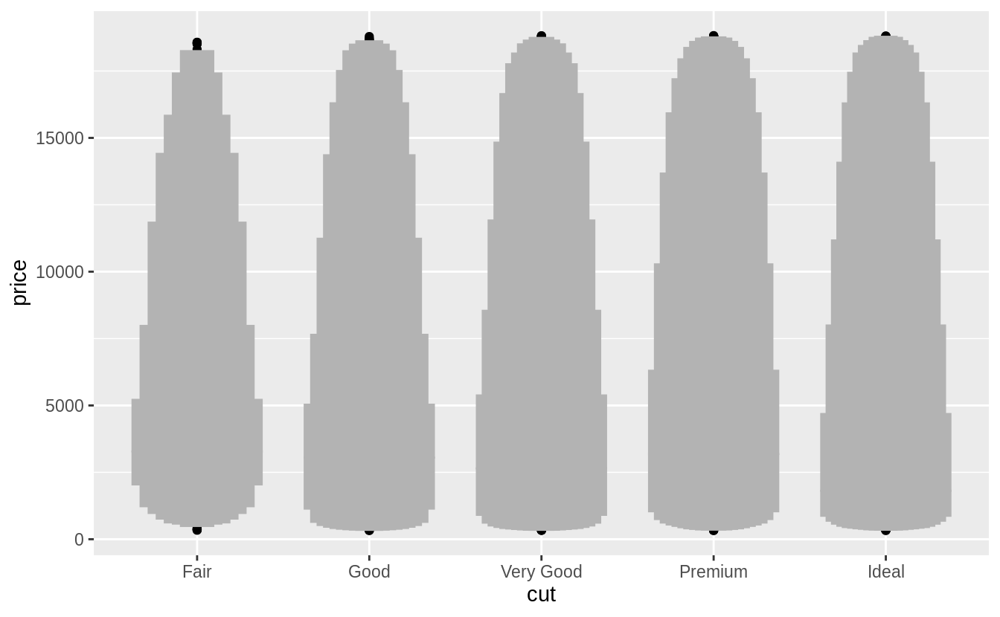

The letter-value plot is described in @HofmannWickhamKafadar2017.

</div>

#### Exercise 7.5.1.5 {.unnumbered .exercise data-number="7.5.1.5"}

<div class="question">
Compare and contrast `geom_violin()` with a faceted `geom_histogram()`, or a colored `geom_freqpoly()`.
What are the pros and cons of each method?
</div>

<div class="answer">

I produce plots for these three methods below. The `geom_freqpoly()` is better
for look-up: meaning that given a price, it is easy to tell which `cut` has the
highest density. However, the overlapping lines makes it difficult to distinguish how the overall distributions relate to each other.
The `geom_violin()` and faceted `geom_histogram()` have similar strengths and
 weaknesses.
It is easy to visually distinguish differences in the overall shape of the
 distributions (skewness, central values, variance, etc).
However, since we can't easily compare the vertical values of the distribution,
it is difficult to look up which category has the highest density for a given price.
All of these methods depend on tuning parameters to determine the level of
smoothness of the distribution.


```r
ggplot(data = diamonds, mapping = aes(x = price, y = ..density..)) +
  geom_freqpoly(mapping = aes(color = cut), binwidth = 500)
```

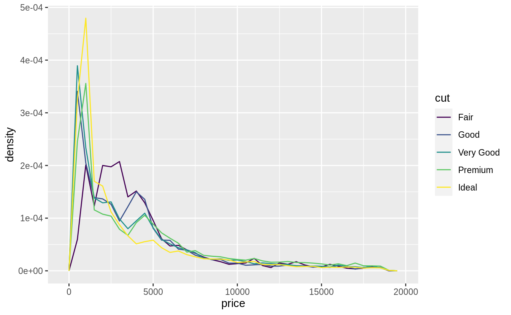


```r
ggplot(data = diamonds, mapping = aes(x = price)) +
  geom_histogram() +
  facet_wrap(~cut, ncol = 1, scales = "free_y")
#> `stat_bin()` using `bins = 30`. Pick better value with `binwidth`.
```

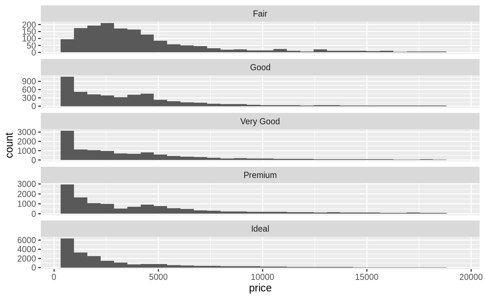


```r
ggplot(data = diamonds, mapping = aes(x = cut, y = price)) +
  geom_violin() +
  coord_flip()
```

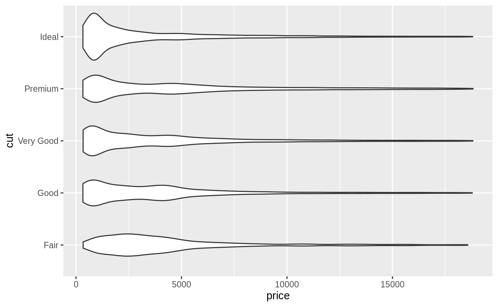

The violin plot was first described in @HintzeNelson1998.

</div>

#### Exercise 7.5.1.6 {.unnumbered .exercise data-number="7.5.1.6"}

<div class="question">
If you have a small dataset, it's sometimes useful to use `geom_jitter()` to see the relationship between a continuous and categorical variable.
The ggbeeswarm package provides a number of methods similar to `geom_jitter()`.
List them and briefly describe what each one does.
</div>

<div class="answer">

There are two methods:

-   `geom_quasirandom()` produces plots that are a mix of jitter and violin plots. There are several different methods that determine exactly how the random location of the points is generated.
-   `geom_beeswarm()` produces a plot similar to a violin plot, but by offsetting the points.

I'll use the `mpg`  box plot example since these methods display individual points, they are better suited for smaller datasets.


```r
ggplot(data = mpg) +
  geom_quasirandom(mapping = aes(
    x = reorder(class, hwy, FUN = median),
    y = hwy
  ))
```

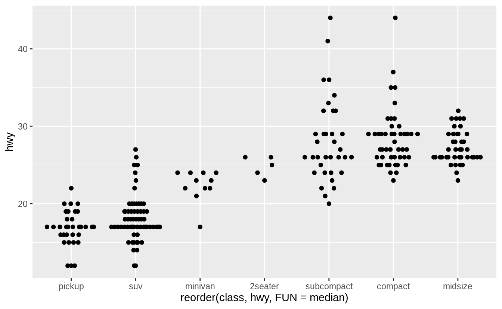


```r
ggplot(data = mpg) +
  geom_quasirandom(
    mapping = aes(
      x = reorder(class, hwy, FUN = median),
      y = hwy
    ),
    method = "tukey"
  )
```


```r
ggplot(data = mpg) +
  geom_quasirandom(
    mapping = aes(
      x = reorder(class, hwy, FUN = median),
      y = hwy
    ),
    method = "tukeyDense"
  )
```


```r
ggplot(data = mpg) +
  geom_quasirandom(
    mapping = aes(
      x = reorder(class, hwy, FUN = median),
      y = hwy
    ),
    method = "frowney"
  )
```

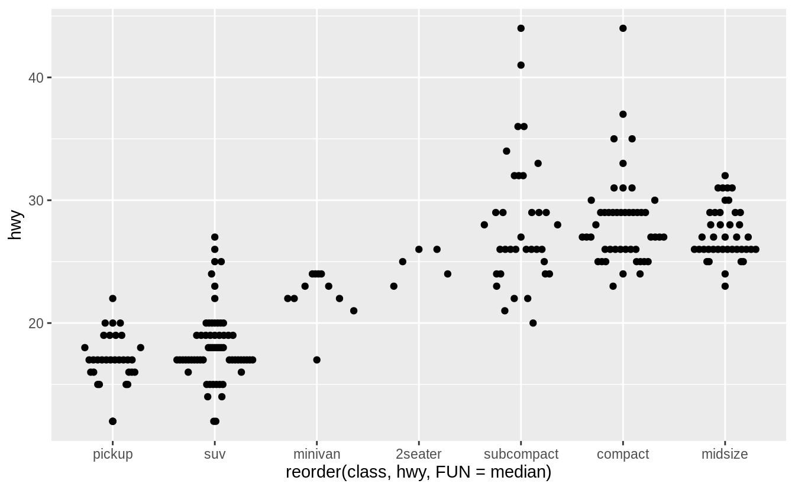


```r
ggplot(data = mpg) +
  geom_quasirandom(
    mapping = aes(
      x = reorder(class, hwy, FUN = median),
      y = hwy
    ),
    method = "smiley"
  )
```

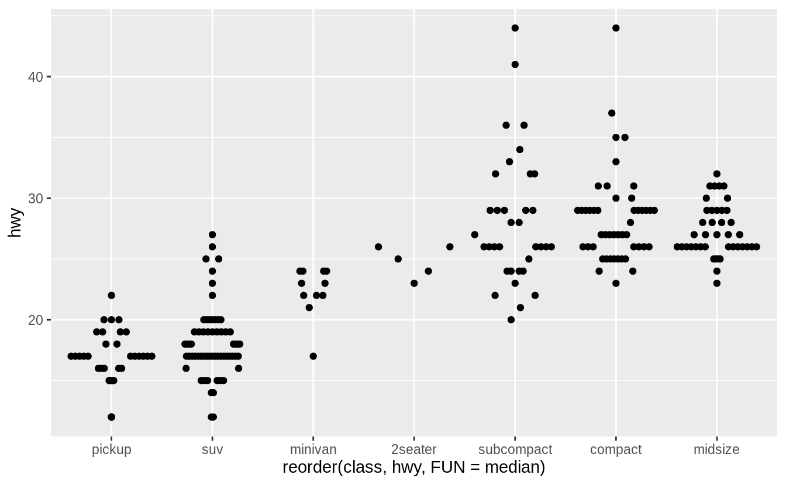


```r
ggplot(data = mpg) +
  geom_beeswarm(mapping = aes(
    x = reorder(class, hwy, FUN = median),
    y = hwy
  ))
```

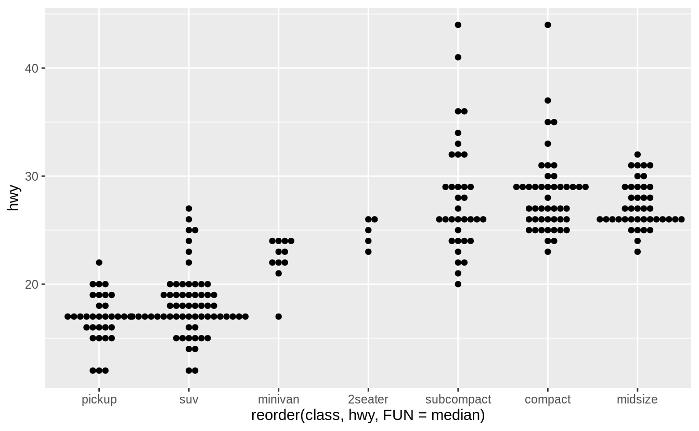

</div>

### Two categorical variables

#### Exercise 7.5.2.1 {.unnumbered .exercise data-number="7.5.2.1"}

<div class="question">
How could you rescale the count dataset above to more clearly show the distribution of cut within color, or color within cut?
</div>

<div class="answer">

To clearly show the distribution of `cut` within `color`, calculate a new variable `prop` which is the proportion of each cut within a `color`.
This is done using a grouped mutate.

```r

diamonds %>%
  count(color, cut) %>%
  group_by(color) %>%
  mutate(prop = n / sum(n)) %>%
  ggplot(mapping = aes(x = color, y = cut)) +
  geom_tile(mapping = aes(fill = prop))
```

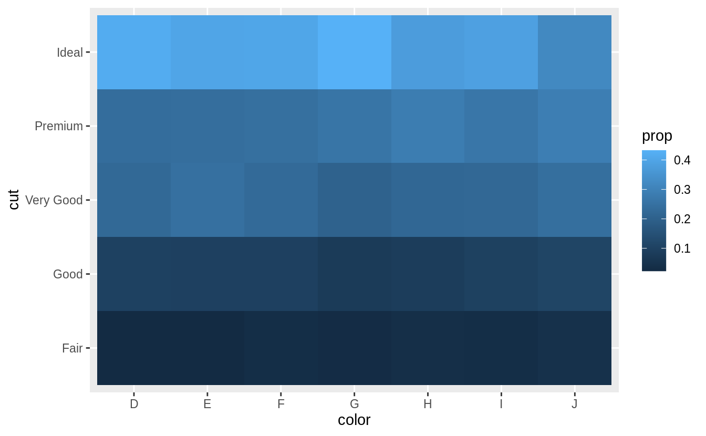

Similarly, to scale by the distribution of `color` within `cut`,

```r
diamonds %>%
  count(color, cut) %>%
  group_by(cut) %>%
  mutate(prop = n / sum(n)) %>%
  ggplot(mapping = aes(x = color, y = cut)) +
  geom_tile(mapping = aes(fill = prop))
```

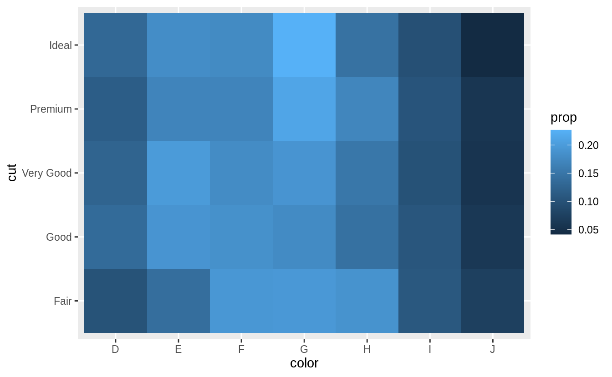

I add `limit = c(0, 1)` to put the color scale between (0, 1).
These are the logical boundaries of proportions.
This makes it possible to compare each cell to its actual value, and would improve comparisons across multiple plots.
However, it ends up limiting the colors and makes it harder to compare within the dataset.
However, using the default limits of the minimum and maximum values makes it easier to compare within the dataset the emphasizing relative differences, but harder to compare across datasets.

</div>

#### Exercise 7.5.2.2 {.unnumbered .exercise data-number="7.5.2.2"}

<div class="question">
Use `geom_tile()` together with dplyr to explore how average flight delays vary by destination and month of year.
What makes the plot difficult to read?
How could you improve it?
</div>

<div class="answer">


```r
flights %>%
  group_by(month, dest) %>%
  summarise(dep_delay = mean(dep_delay, na.rm = TRUE)) %>%
  ggplot(aes(x = factor(month), y = dest, fill = dep_delay)) +
  geom_tile() +
  labs(x = "Month", y = "Destination", fill = "Departure Delay")
#> `summarise()` regrouping output by 'month' (override with `.groups` argument)
```

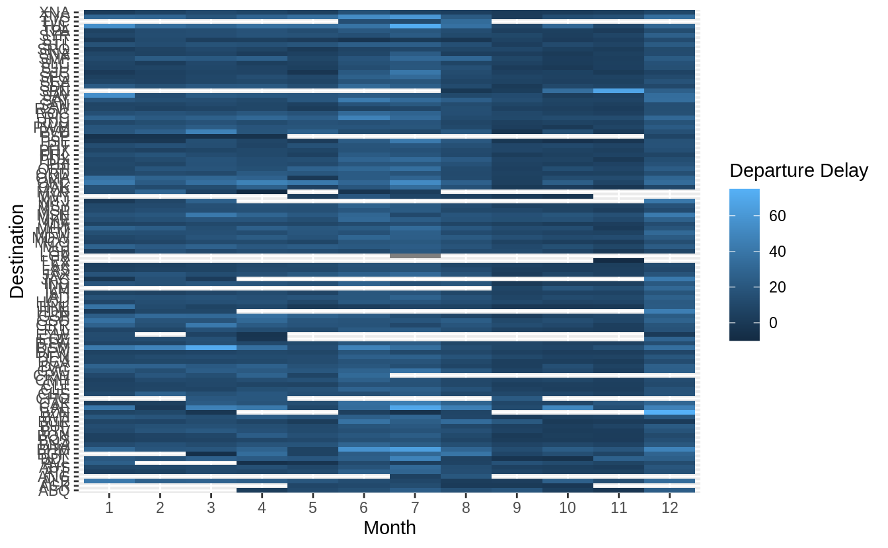

There are several things that could be done to improve it,

-   sort destinations by a meaningful quantity (distance, number of flights, average delay)
-   remove missing values

How to treat missing values is difficult.
In this case, missing values correspond to airports which don't have regular flights (at least one flight each month) from NYC.
These are likely smaller airports (with higher variance in their average due to fewer observations). 
When we group all pairs of (`month`, `dest`) again by dest, we should have a total count of 12 (one for each month) per group (`dest`). 
This makes it easy to filter.


```r
flights %>%
  group_by(month, dest) %>%                                 # This gives us (month, dest) pairs
  summarise(dep_delay = mean(dep_delay, na.rm = TRUE)) %>%
  group_by(dest) %>%                                        # group all (month, dest) pairs by dest ..
  filter(n() == 12) %>%                                     # and only select those that have one entry per month 
  ungroup() %>%
  mutate(dest = reorder(dest, dep_delay)) %>%
  ggplot(aes(x = factor(month), y = dest, fill = dep_delay)) +
  geom_tile() +
  labs(x = "Month", y = "Destination", fill = "Departure Delay")
#> `summarise()` regrouping output by 'month' (override with `.groups` argument)
```

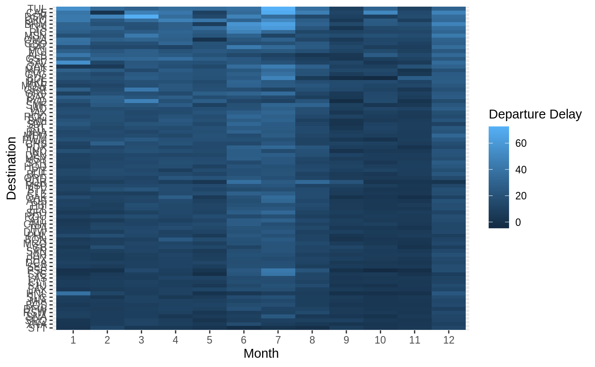

</div>

#### Exercise 7.5.2.3 {.unnumbered .exercise data-number="7.5.2.3"}

<div class="question">
Why is it slightly better to use `aes(x = color, y = cut)` rather than `aes(x = cut, y = color)` in the example above?
</div>

<div class="answer">

It's usually better to use the categorical variable with a larger number of categories or the longer labels on the y axis.
If at all possible, labels should be horizontal because that is easier to read.

However, switching the order doesn't result in overlapping labels.

```r
diamonds %>%
  count(color, cut) %>%
  ggplot(mapping = aes(y = color, x = cut)) +
  geom_tile(mapping = aes(fill = n))
```

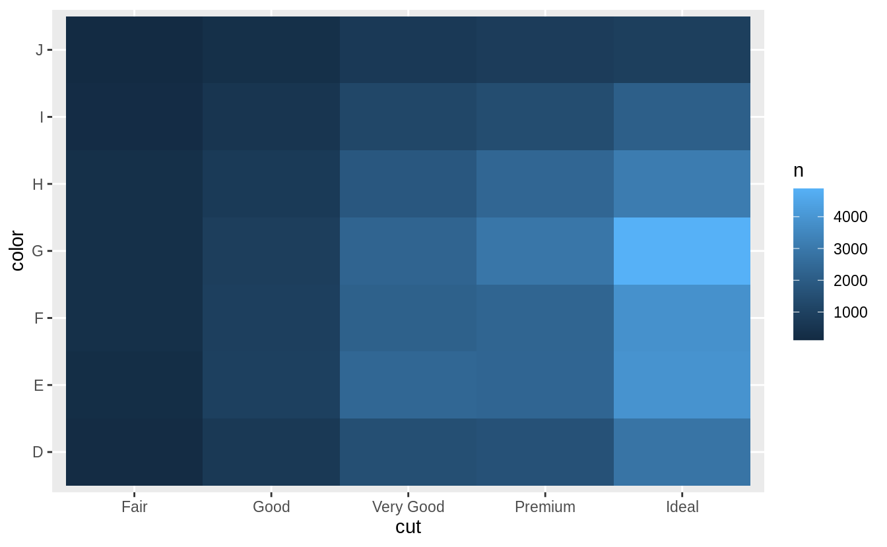

Another justification, for switching the order is that the larger numbers are at the top when `x = color` and `y = cut`, and that lowers the cognitive burden of interpreting the plot.

</div>

### Two continuous variables

#### Exercise 7.5.3.1 {.unnumbered .exercise data-number="7.5.3.1"}

<div class="question">
Instead of summarizing the conditional distribution with a box plot, you could use a frequency polygon.
What do you need to consider when using `cut_width()` vs `cut_number()`?
How does that impact a visualization of the 2d distribution of `carat` and `price`?
</div>

<div class="answer">

Both `cut_width()` and `cut_number()` split a variable into groups.
When using `cut_width()`, we need to choose the width, and the number of
bins will be calculated automatically.
When using `cut_number()`, we need to specify the number of bins, and
the widths will be calculated automatically.

In either case, we want to choose the bin widths and number to be large enough
to aggregate observations to remove noise, but not so large as to remove all the signal.

If categorical colors are used, no more than eight colors should be used
in order to keep them distinct. Using `cut_number`, I will split carats into
quantiles (five groups).


```r
ggplot(
  data = diamonds,
  mapping = aes(color = cut_number(carat, 5), x = price)
) +
  geom_freqpoly() +
  labs(x = "Price", y = "Count", color = "Carat")
```

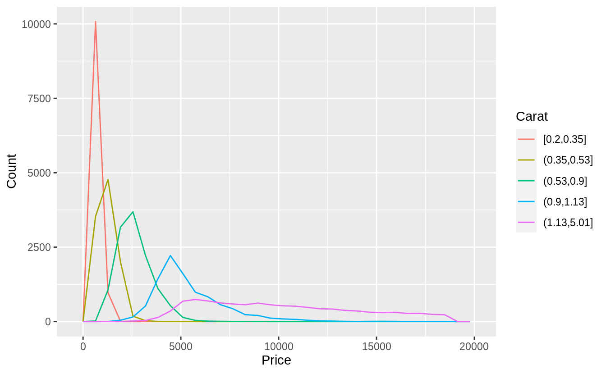

Alternatively, I could use `cut_width` to specify widths at which to cut.
I will choose 1-carat widths. Since there are very few diamonds larger than
2-carats, this is not as informative. However, using a width of 0.5 carats
creates too many groups, and splitting at non-whole numbers is unappealing.


```r
ggplot(
  data = diamonds,
  mapping = aes(color = cut_width(carat, 1, boundary = 0), x = price)
) +
  geom_freqpoly() +
  labs(x = "Price", y = "Count", color = "Carat")
```

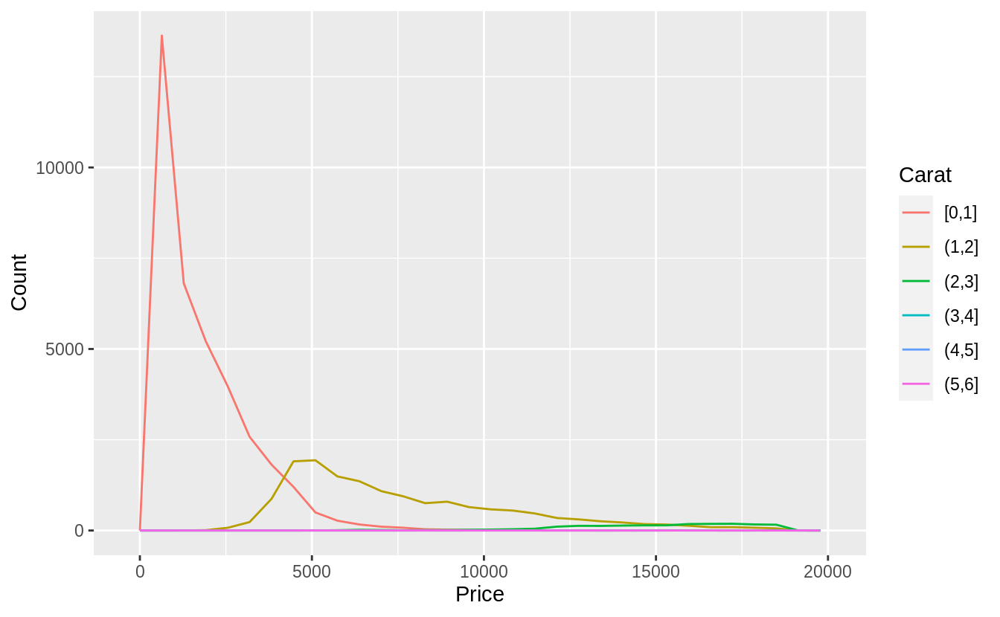

</div>

#### Exercise 7.5.3.2 {.unnumbered .exercise data-number="7.5.3.2"}

<div class="question">
Visualize the distribution of `carat`, partitioned by `price`.
</div>

<div class="answer">

Plotted with a box plot with 10 bins with an equal number of observations, and the width determined by the number of observations.

```r
ggplot(diamonds, aes(x = cut_number(price, 10), y = carat)) +
  geom_boxplot() +
  coord_flip() +
  xlab("Price")
```

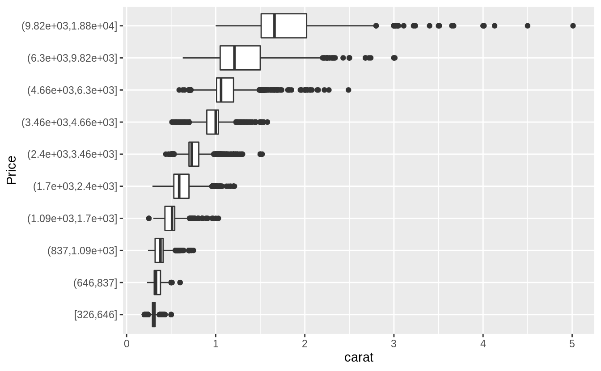
Plotted with a box plot with 10 equal-width bins of \$2,000. The argument `boundary = 0` ensures that first bin is \$0--\$2,000.

```r
ggplot(diamonds, aes(x = cut_width(price, 2000, boundary = 0), y = carat)) +
  geom_boxplot(varwidth = TRUE) +
  coord_flip() +
  xlab("Price")
```

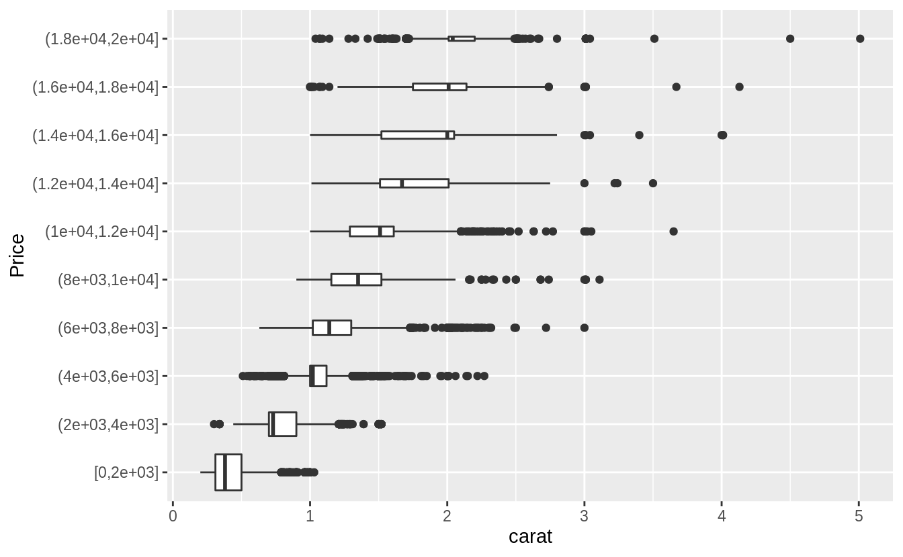

</div>

#### Exercise 7.5.3.3 {.unnumbered .exercise data-number="7.5.3.3"}

<div class="question">
How does the price distribution of very large diamonds compare to small diamonds.
Is it as you expect, or does it surprise you?
</div>

<div class="answer">

The distribution of very large diamonds is more variable.
I am not surprised, since I knew little about diamond prices.
After the fact, it does not seem surprising (as many thing do).
I would guess that this is due to the way in which diamonds are selected for retail sales.
Suppose that someone selling a diamond only finds it profitable to sell it if some combination size, cut, clarity, and color are above a certain threshold.
The smallest diamonds are only profitable to sell if they are exceptional in all the other factors (cut, clarity, and color), so the small diamonds sold have similar characteristics.
However, larger diamonds may be profitable regardless of the values of the other factors.
Thus we will observe large diamonds with a wider variety of cut, clarity, and color and thus more variability in prices.

</div>

#### Exercise 7.5.3.4 {.unnumbered .exercise data-number="7.5.3.4"}

<div class="question">
Combine two of the techniques you've learned to visualize the combined distribution of cut, carat, and price.
</div>

<div class="answer">

There are many options to try, so your solutions may vary from mine.
Here are a few options that I tried.


```r
ggplot(diamonds, aes(x = carat, y = price)) +
  geom_hex() +
  facet_wrap(~cut, ncol = 1)
```

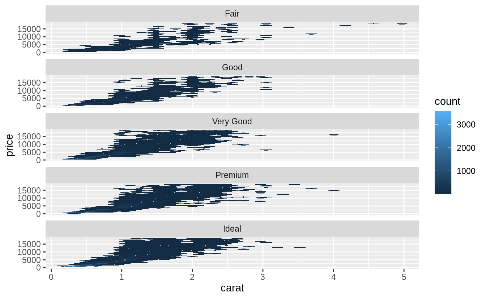


```r
ggplot(diamonds, aes(x = cut_number(carat, 5), y = price, colour = cut)) +
  geom_boxplot()
```


```r
ggplot(diamonds, aes(colour = cut_number(carat, 5), y = price, x = cut)) +
  geom_boxplot()
```

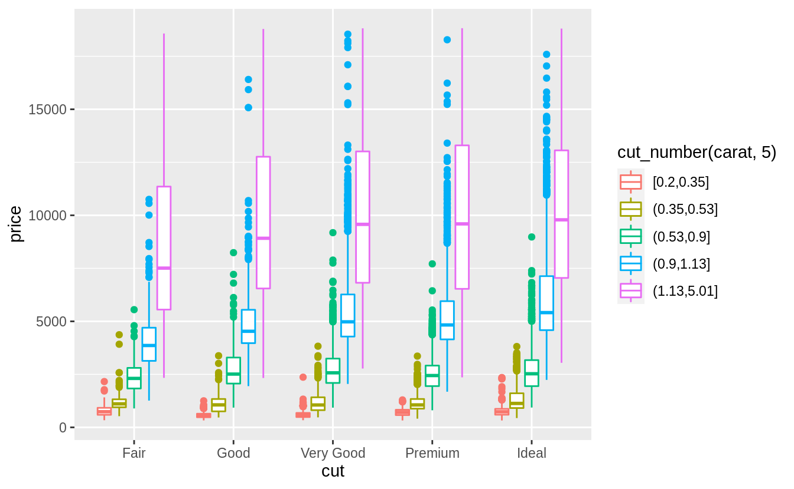

</div>

#### Exercise 7.5.3.5 {.unnumbered .exercise data-number="7.5.3.5"}

<div class="question">
Two dimensional plots reveal outliers that are not visible in one dimensional plots.
For example, some points in the plot below have an unusual combination of `x` and `y` values, which makes the points outliers even though their `x` and `y` values appear normal when examined separately.
</div>

<div class="answer">


```r
ggplot(data = diamonds) +
  geom_point(mapping = aes(x = x, y = y)) +
  coord_cartesian(xlim = c(4, 11), ylim = c(4, 11))
```

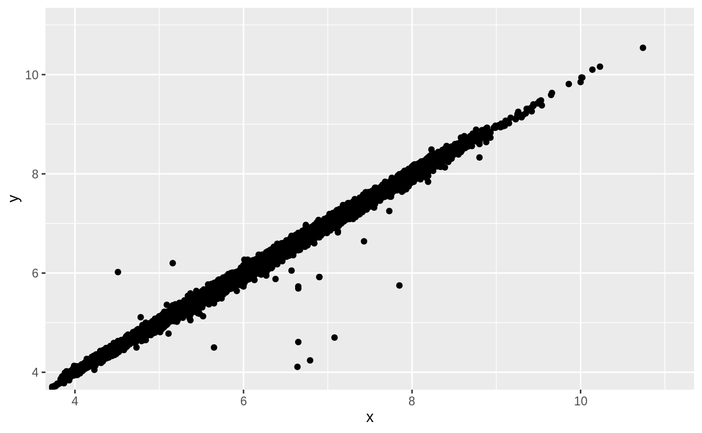

Why is a scatterplot a better display than a binned plot for this case?

In this case, there is a strong relationship between $x$ and $y$. The outliers in this case are not extreme in either $x$ or $y$.
A binned plot would not reveal these outliers, and may lead us to conclude that the largest value of $x$ was an outlier even though it appears to fit the bivariate pattern well.

The later chapter [Model Basics](#model-basics) discusses fitting models to bivariate data and plotting residuals, which would reveal this outliers.

</div>

## Patterns and models {#patterns-and-models .r4ds-section}

<!--html_preserve--><div class="alert alert-warning hints-alert">
<div class="hints-icon">
<i class="fa fa-exclamation-circle"></i>
</div>
<div class="hints-container">No exercises</div>
</div><!--/html_preserve-->

## ggplot2 calls {#ggplot2-calls .r4ds-section}

<!--html_preserve--><div class="alert alert-warning hints-alert">
<div class="hints-icon">
<i class="fa fa-exclamation-circle"></i>
</div>
<div class="hints-container">No exercises</div>
</div><!--/html_preserve-->

## Learning more {#learning-more .r4ds-section}

<!--html_preserve--><div class="alert alert-warning hints-alert">
<div class="hints-icon">
<i class="fa fa-exclamation-circle"></i>
</div>
<div class="hints-container">No exercises</div>
</div><!--/html_preserve-->

[^diamonds-prices]: Prices for diamonds rise at key weights, such as 0.8, 0.9, and 1 carat. 
    See <https://www.hpdiamonds.com/en-us/extra/136/education-undercarat.htm>.
