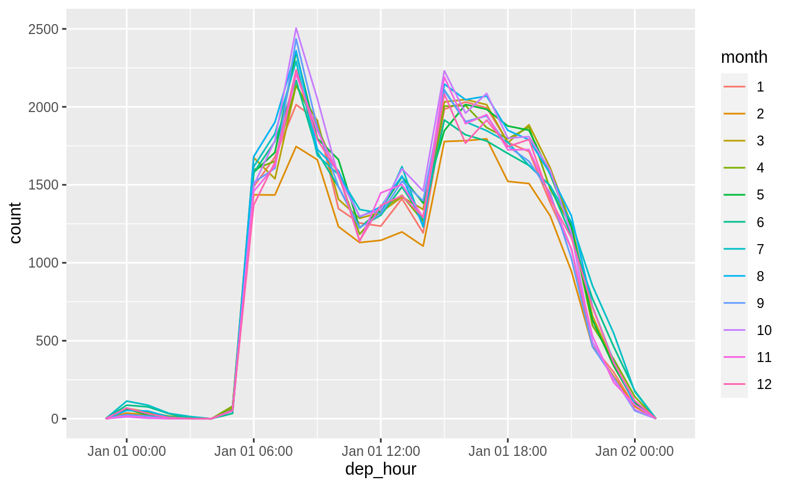
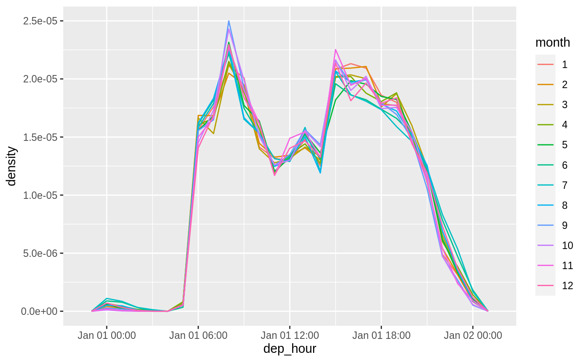
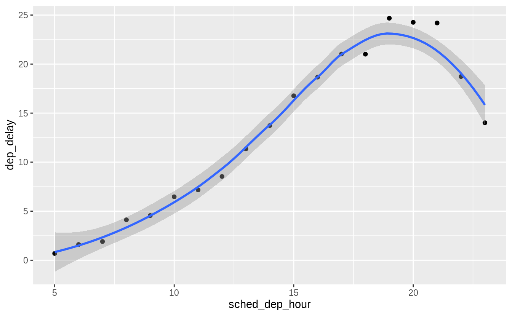
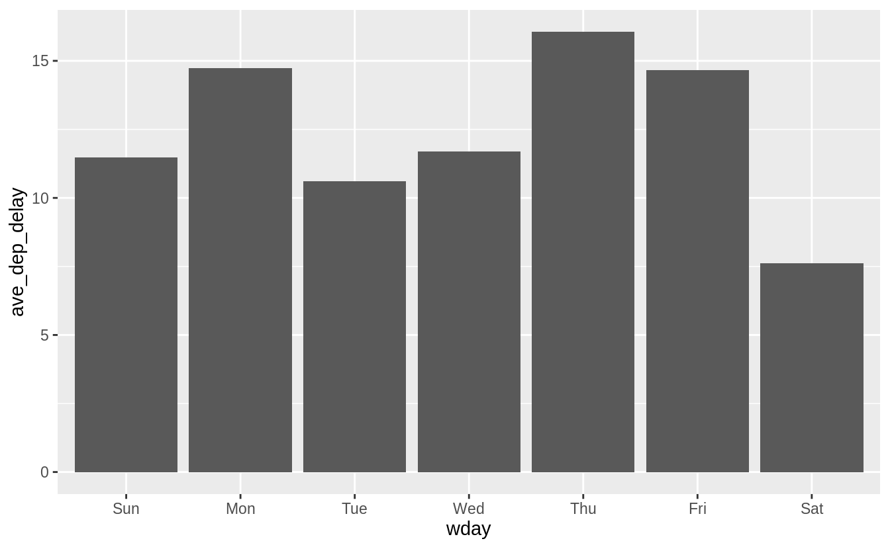
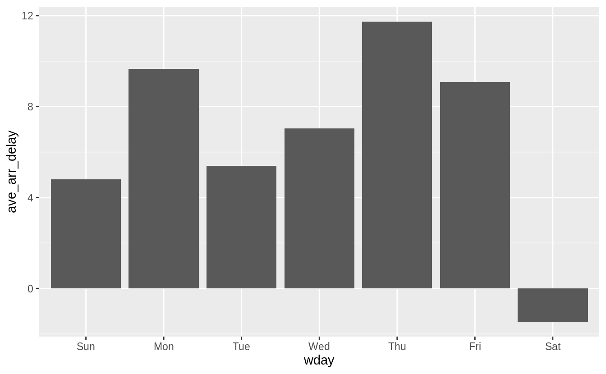
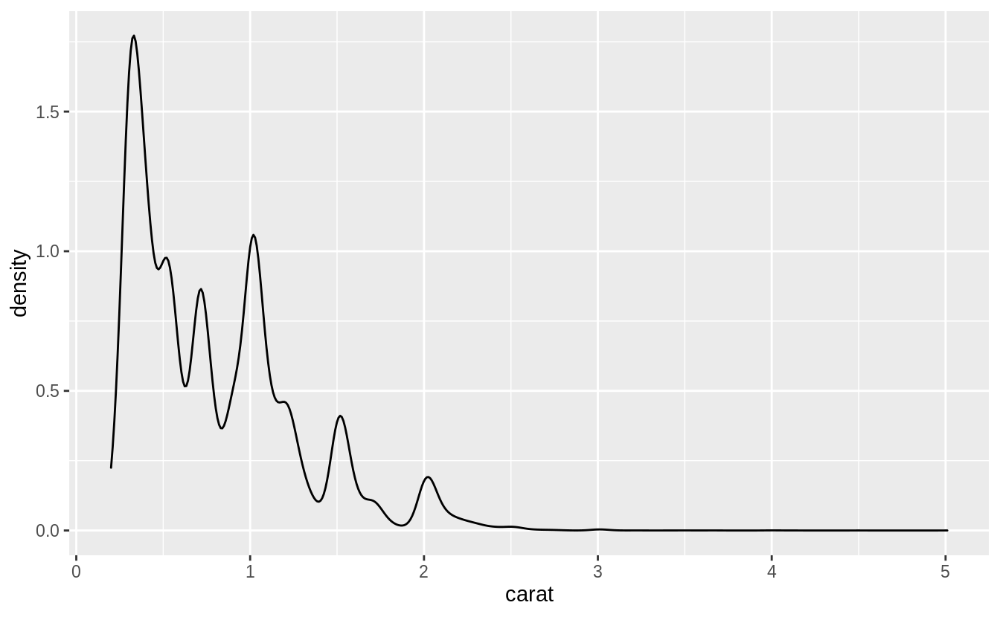
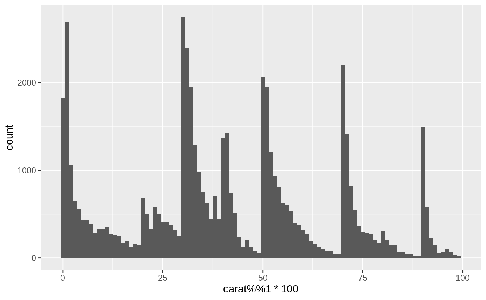
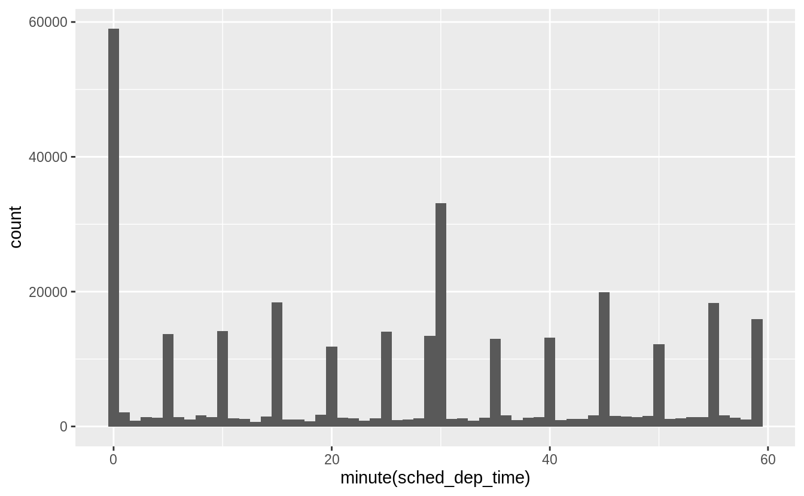
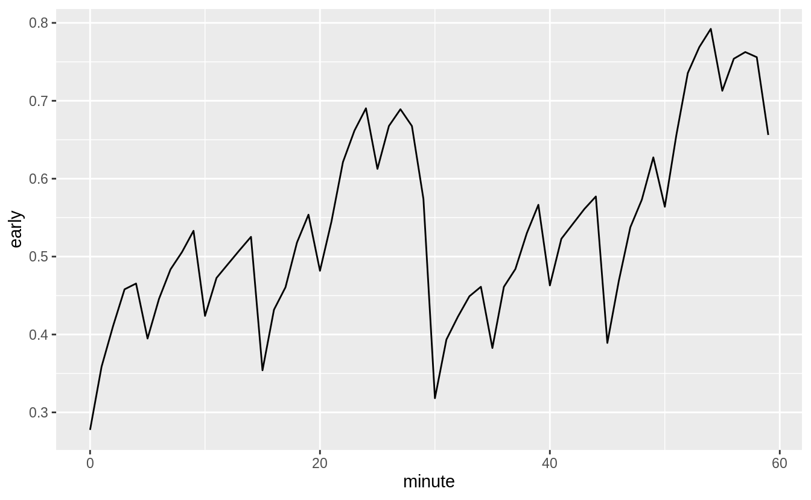

# Dates and times {#dates-and-times .r4ds-section}

## Introduction {#introduction-10 .r4ds-section}


```r
library("tidyverse")
library("lubridate")
library("nycflights13")
```

## Creating date/times {#creating-datetimes .r4ds-section}

This code is needed by exercises.

```r
make_datetime_100 <- function(year, month, day, time) {
  make_datetime(year, month, day, time %/% 100, time %% 100)
}

flights_dt <- flights %>%
  filter(!is.na(dep_time), !is.na(arr_time)) %>%
  mutate(
    dep_time = make_datetime_100(year, month, day, dep_time),
    arr_time = make_datetime_100(year, month, day, arr_time),
    sched_dep_time = make_datetime_100(year, month, day, sched_dep_time),
    sched_arr_time = make_datetime_100(year, month, day, sched_arr_time)
  ) %>%
  select(origin, dest, ends_with("delay"), ends_with("time"))
```

### Exercise 16.2.1 {.unnumbered .exercise data-number="16.2.1"}

<div class="question">

What happens if you parse a string that
contains invalid dates?

</div>

<div class="answer">


```r
ret <- ymd(c("2010-10-10", "bananas"))
#> Warning: 1 failed to parse.
print(class(ret))
#> [1] "Date"
ret
#> [1] "2010-10-10" NA
```

It produces an `NA` and a warning message.

</div>

### Exercise 16.2.2 {.unnumbered .exercise data-number="16.2.2"}

<div class="question">

What does the `tzone` argument to `today()` do? 
Why is it important?

</div>

<div class="answer">

It determines the time-zone of the date. 
Since different time-zones can have different dates, the value of `today()` can vary depending on the time-zone specified.

</div>

### Exercise 16.2.3 {.unnumbered .exercise data-number="16.2.3"}

<div class="question">

Use the appropriate lubridate function to parse each of the following dates:


```r
d1 <- "January 1, 2010"
d2 <- "2015-Mar-07"
d3 <- "06-Jun-2017"
d4 <- c("August 19 (2015)", "July 1 (2015)")
d5 <- "12/30/14"
```

</div>

<div class="answer">


```r
mdy(d1)
#> [1] "2010-01-01"
ymd(d2)
#> [1] "2015-03-07"
dmy(d3)
#> [1] "2017-06-06"
mdy(d4)
#> [1] "2015-08-19" "2015-07-01"
mdy(d5)
#> [1] "2014-12-30"
```

</div>

## Date-time components {#date-time-components .r4ds-section}

The following code from the chapter is used


```r
sched_dep <- flights_dt %>%
  mutate(minute = minute(sched_dep_time)) %>%
  group_by(minute) %>%
  summarise(
    avg_delay = mean(arr_delay, na.rm = TRUE),
    n = n()
  )
#> `summarise()` ungrouping output (override with `.groups` argument)
```
In the previous code, the difference between rounded and un-rounded dates provides the within-period time.

### Exercise 16.3.1 {.unnumbered .exercise data-number="16.3.1"}

<div class="question">

How does the distribution of flight times
within a day change over the course of the year?

</div>

<div class="answer">

Let's try plotting this by month:

```r
flights_dt %>%
  filter(!is.na(dep_time)) %>%
  mutate(dep_hour = update(dep_time, yday = 1)) %>%
  mutate(month = factor(month(dep_time))) %>%
  ggplot(aes(dep_hour, color = month)) +
  geom_freqpoly(binwidth = 60 * 60)
```



This will look better if everything is normalized within groups. The reason
that February is lower is that there are fewer days and thus fewer flights.

```r
flights_dt %>%
  filter(!is.na(dep_time)) %>%
  mutate(dep_hour = update(dep_time, yday = 1)) %>%
  mutate(month = factor(month(dep_time))) %>%
  ggplot(aes(dep_hour, color = month)) +
  geom_freqpoly(aes(y = ..density..), binwidth = 60 * 60)
```



At least to me there doesn't appear to much difference in within-day distribution over the year, but I maybe thinking about it incorrectly.

</div>

### Exercise 16.3.2 {.unnumbered .exercise data-number="16.3.2"}

<div class="question">

Compare `dep_time`, `sched_dep_time` and `dep_delay`. Are they consistent? Explain your findings.

</div>

<div class="answer">

If they are consistent, then `dep_time = sched_dep_time + dep_delay`.


```r
flights_dt %>%
  mutate(dep_time_ = sched_dep_time + dep_delay * 60) %>%
  filter(dep_time_ != dep_time) %>%
  select(dep_time_, dep_time, sched_dep_time, dep_delay)
#> # A tibble: 1,205 x 4
#>   dep_time_           dep_time            sched_dep_time      dep_delay
#>   <dttm>              <dttm>              <dttm>                  <dbl>
#> 1 2013-01-02 08:48:00 2013-01-01 08:48:00 2013-01-01 18:35:00       853
#> 2 2013-01-03 00:42:00 2013-01-02 00:42:00 2013-01-02 23:59:00        43
#> 3 2013-01-03 01:26:00 2013-01-02 01:26:00 2013-01-02 22:50:00       156
#> 4 2013-01-04 00:32:00 2013-01-03 00:32:00 2013-01-03 23:59:00        33
#> 5 2013-01-04 00:50:00 2013-01-03 00:50:00 2013-01-03 21:45:00       185
#> 6 2013-01-04 02:35:00 2013-01-03 02:35:00 2013-01-03 23:59:00       156
#> # … with 1,199 more rows
```

There exist discrepancies. It looks like there are mistakes in the dates. These
are flights in which the actual departure time is on the *next* day relative to
the scheduled departure time. We forgot to account for this when creating the
date-times using `make_datetime_100()` function in [16.2.2 From individual components](https://r4ds.had.co.nz/dates-and-times.html#from-individual-components). The code would have had to check if the departure time is less than
the scheduled departure time plus departure delay (in minutes). Alternatively, simply adding the departure delay to the scheduled departure time is a more robust way to construct the departure time because it will automatically account for crossing into the next day.

</div>

### Exercise 16.3.3 {.unnumbered .exercise data-number="16.3.3"}

<div class="question">

Compare `air_time` with the duration between the departure and arrival. 
Explain your findings.

</div>

<div class="answer">


```r
flights_dt %>%
  mutate(
    flight_duration = as.numeric(arr_time - dep_time),
    air_time_mins = air_time,
    diff = flight_duration - air_time_mins
  ) %>%
  select(origin, dest, flight_duration, air_time_mins, diff)
#> # A tibble: 328,063 x 5
#>   origin dest  flight_duration air_time_mins  diff
#>   <chr>  <chr>           <dbl>         <dbl> <dbl>
#> 1 EWR    IAH               193           227   -34
#> 2 LGA    IAH               197           227   -30
#> 3 JFK    MIA               221           160    61
#> 4 JFK    BQN               260           183    77
#> 5 LGA    ATL               138           116    22
#> 6 EWR    ORD               106           150   -44
#> # … with 328,057 more rows
```

</div>

### Exercise 16.3.4 {.unnumbered .exercise data-number="16.3.4"}

<div class="question">

How does the average delay time change over the course of a day? Should you use `dep_time` or `sched_dep_time`? Why?

</div>

<div class="answer">

Use `sched_dep_time` because that is the relevant metric for someone scheduling a flight. Also, using `dep_time` will always bias delays to later in the day since delays will push flights later.


```r
flights_dt %>%
  mutate(sched_dep_hour = hour(sched_dep_time)) %>%
  group_by(sched_dep_hour) %>%
  summarise(dep_delay = mean(dep_delay)) %>%
  ggplot(aes(y = dep_delay, x = sched_dep_hour)) +
  geom_point() +
  geom_smooth()
#> `summarise()` ungrouping output (override with `.groups` argument)
#> `geom_smooth()` using method = 'loess' and formula 'y ~ x'
```



</div>

### Exercise 16.3.5 {.unnumbered .exercise data-number="16.3.5"}

<div class="question">

On what day of the week should you leave if you want to minimize the chance of a delay?

</div>

<div class="answer">

Saturday has the lowest average departure delay time and the lowest average arrival delay time.


```r
flights_dt %>%
  mutate(dow = wday(sched_dep_time)) %>%
  group_by(dow) %>%
  summarise(
    dep_delay = mean(dep_delay),
    arr_delay = mean(arr_delay, na.rm = TRUE)
  ) %>%
  print(n = Inf)
#> `summarise()` ungrouping output (override with `.groups` argument)
#> # A tibble: 7 x 3
#>     dow dep_delay arr_delay
#>   <dbl>     <dbl>     <dbl>
#> 1     1     11.5       4.82
#> 2     2     14.7       9.65
#> 3     3     10.6       5.39
#> 4     4     11.7       7.05
#> 5     5     16.1      11.7 
#> 6     6     14.7       9.07
#> 7     7      7.62     -1.45
```


```r
flights_dt %>%
  mutate(wday = wday(dep_time, label = TRUE)) %>% 
  group_by(wday) %>% 
  summarize(ave_dep_delay = mean(dep_delay, na.rm = TRUE)) %>% 
  ggplot(aes(x = wday, y = ave_dep_delay)) + 
  geom_bar(stat = "identity")
#> `summarise()` ungrouping output (override with `.groups` argument)
```




```r
flights_dt %>% 
  mutate(wday = wday(dep_time, label = TRUE)) %>% 
  group_by(wday) %>% 
  summarize(ave_arr_delay = mean(arr_delay, na.rm = TRUE)) %>% 
  ggplot(aes(x = wday, y = ave_arr_delay)) + 
  geom_bar(stat = "identity")
#> `summarise()` ungrouping output (override with `.groups` argument)
```



</div>

### Exercise 16.3.6 {.unnumbered .exercise data-number="16.3.6"}

<div class="question">

What makes the distribution of `diamonds$carat` and `flights$sched_dep_time` similar?

</div>

<div class="answer">


```r
ggplot(diamonds, aes(x = carat)) +
  geom_density()
```



In both `carat` and `sched_dep_time` there are abnormally large numbers of values are at nice "human" numbers. In `sched_dep_time` it is at 00 and 30 minutes. In carats, it is at 0, 1/3, 1/2, 2/3,


```r
ggplot(diamonds, aes(x = carat %% 1 * 100)) +
  geom_histogram(binwidth = 1)
```



In scheduled departure times it is 00 and 30 minutes, and minutes
ending in 0 and 5.


```r
ggplot(flights_dt, aes(x = minute(sched_dep_time))) +
  geom_histogram(binwidth = 1)
```



</div>

### Exercise 16.3.7 {.unnumbered .exercise data-number="16.3.7"}

<div class="question">

Confirm my hypothesis that the early departures of flights in minutes 20-30 and 50-60 are caused by scheduled flights that leave early. 
Hint: create a binary variable that tells you whether or not a flight was delayed.

</div>

<div class="answer">

First, I create a binary variable `early` that is equal to 1 if a flight leaves early, and 0 if it does not.
Then, I group flights by the minute of departure.
This shows that the proportion of flights that are early departures is highest between minutes 20--30 and 50--60.

```r
flights_dt %>% 
  mutate(minute = minute(dep_time),
         early = dep_delay < 0) %>% 
  group_by(minute) %>% 
  summarise(
    early = mean(early, na.rm = TRUE),
    n = n()) %>% 
  ggplot(aes(minute, early)) +
    geom_line()
#> `summarise()` ungrouping output (override with `.groups` argument)
```



</div>

## Time spans {#time-spans .r4ds-section}

### Exercise 16.4.1 {.unnumbered .exercise data-number="16.4.1"}

<div class="question">

Why is there `months()` but no `dmonths()`?

</div>

<div class="answer">

There is no unambiguous value of months in terms of seconds since months have differing numbers of days.

-   31 days: January, March, May, July, August, October, December
-   30 days: April, June, September, November
-   28 or 29 days: February

The month is not a duration of time defined independently of when it occurs, but a special interval between two dates.

</div>

### Exercise 16.4.2 {.unnumbered .exercise data-number="16.4.2"}

<div class="question">

Explain `days(overnight * 1)` to someone who has just started learning R. 
How does it work?

</div>

<div class="answer">

The variable `overnight` is equal to `TRUE` or `FALSE`.
If it is an overnight flight, this becomes 1 day, and if not, then overnight = 0, and no days are added to the date.

</div>

### Exercise 16.4.3 {.unnumbered .exercise data-number="16.4.3"}

<div class="question">

Create a vector of dates giving the first day of every month in 2015. 
Create a vector of dates giving the first day of every month in the current year.

</div>

<div class="answer">

A vector of the first day of the month for every month in 2015:

```r
ymd("2015-01-01") + months(0:11)
#>  [1] "2015-01-01" "2015-02-01" "2015-03-01" "2015-04-01" "2015-05-01"
#>  [6] "2015-06-01" "2015-07-01" "2015-08-01" "2015-09-01" "2015-10-01"
#> [11] "2015-11-01" "2015-12-01"
```

To get the vector of the first day of the month for *this* year, we first need to figure out what this year is, and get January 1st of it.
I can do that by taking `today()` and truncating it to the year using `floor_date()`:

```r
floor_date(today(), unit = "year") + months(0:11)
#>  [1] "2020-01-01" "2020-02-01" "2020-03-01" "2020-04-01" "2020-05-01"
#>  [6] "2020-06-01" "2020-07-01" "2020-08-01" "2020-09-01" "2020-10-01"
#> [11] "2020-11-01" "2020-12-01"
```

</div>

### Exercise 16.4.4 {.unnumbered .exercise data-number="16.4.4"}

<div class="question">

Write a function that given your birthday (as a date), returns how old you are in years.

</div>

<div class="answer">


```r
age <- function(bday) {
  (bday %--% today()) %/% years(1)
}
age(ymd("1990-10-12"))
#> [1] 29
```

</div>

### Exercise 16.4.5 {.unnumbered .exercise data-number="16.4.5"}

<div class="question">

Why can’t `(today() %--% (today() + years(1)) / months(1)` work?

</div>

<div class="answer">

The code in the question is missing a parentheses.
So, I will assume that that the correct code is,

```r
(today() %--% (today() + years(1))) / months(1)
#> [1] 12
```

While this code will not display a warning or message, it does not work exactly as
expected. The problem is discussed in the [Intervals](https://r4ds.had.co.nz/dates-and-times.html#intervals) section.

The numerator of the expression, `(today() %--% (today() + years(1))`, is an *interval*, which includes both a duration of time and a starting point. The interval has an exact number of seconds.
The denominator of the expression, `months(1)`, is a period, which is meaningful to humans but not defined in terms of an exact number of seconds.
Months can be 28, 29, 30, or 31 days, so it is not clear what `months(1)` divide by?
The code does not produce a warning message, but it will not always produce the correct result.

To find the number of months within an interval use `%/%` instead of `/`,

```r
(today() %--% (today() + years(1))) %/% months(1)
#> [1] 12
```

Alternatively, we could define a "month" as 30 days, and run

```r
(today() %--% (today() + years(1))) / days(30)
#> [1] 12.2
```

This approach will not work with `today() + years(1)`, which is not defined for February 29th on leap years:

```r
as.Date("2016-02-29") + years(1)
#> [1] NA
```

</div>

## Time zones {#time-zones .r4ds-section}

<!--html_preserve--><div class="alert alert-warning hints-alert">
<div class="hints-icon">
<i class="fa fa-exclamation-circle"></i>
</div>
<div class="hints-container">No exercises</div>
</div><!--/html_preserve-->
