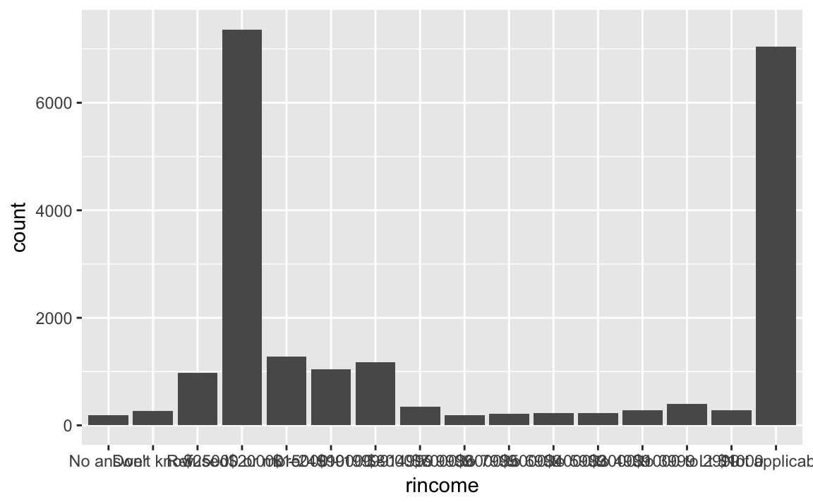
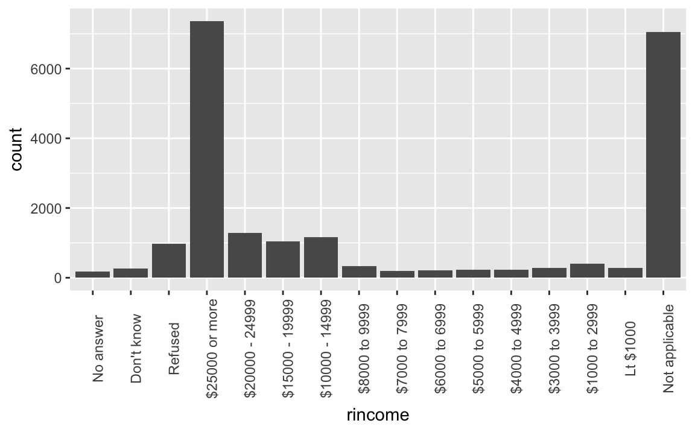
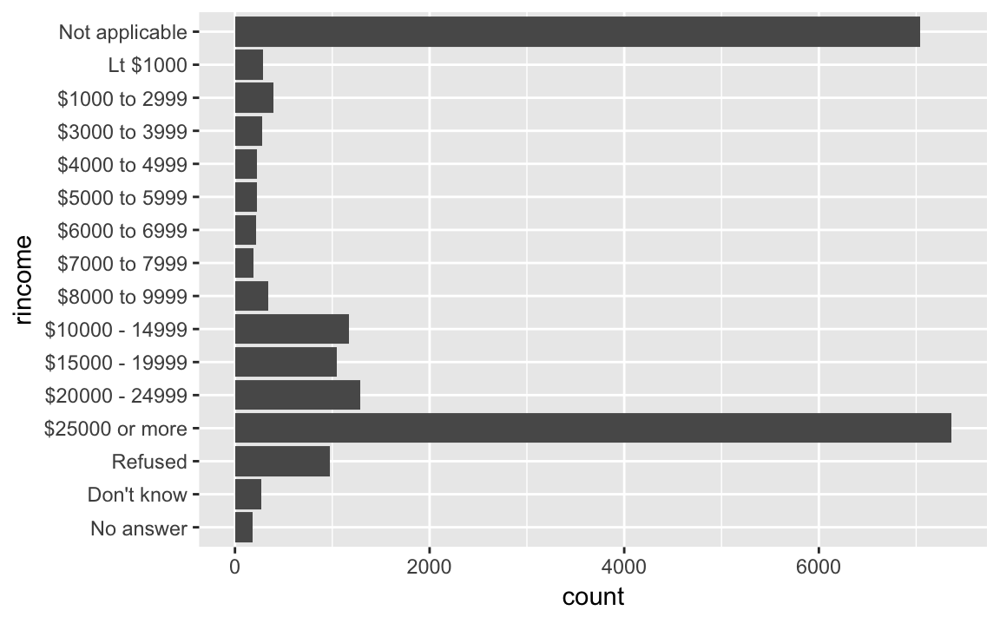
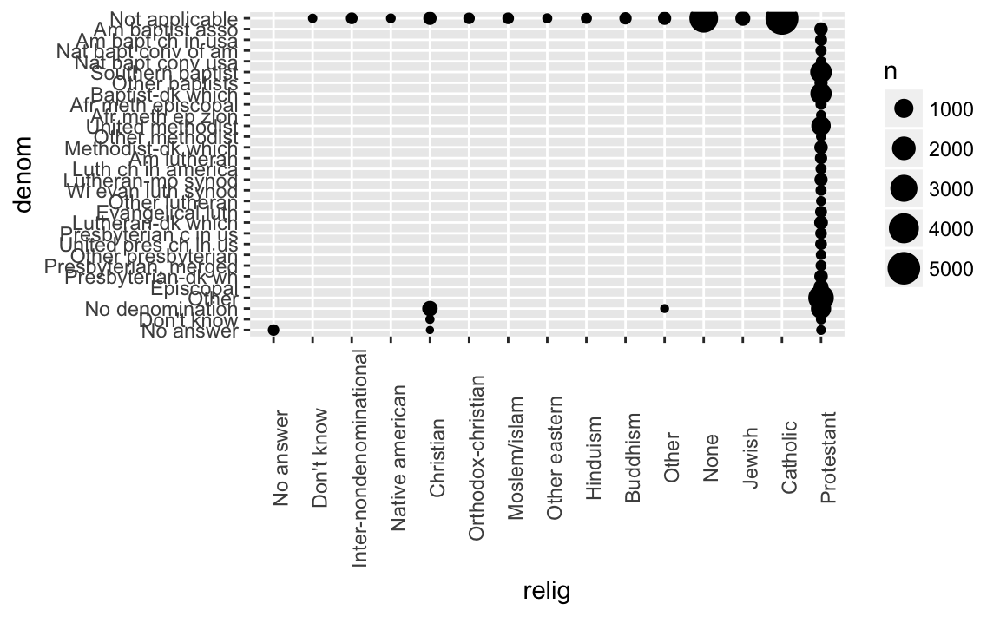
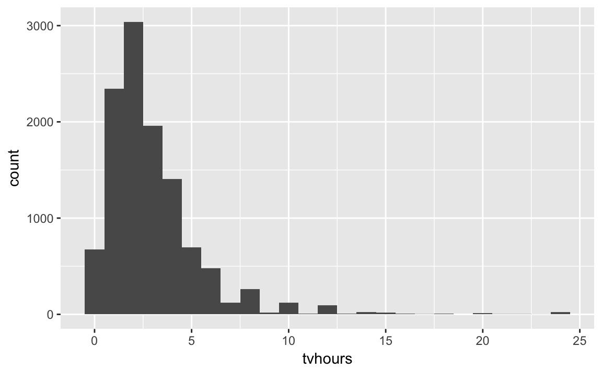
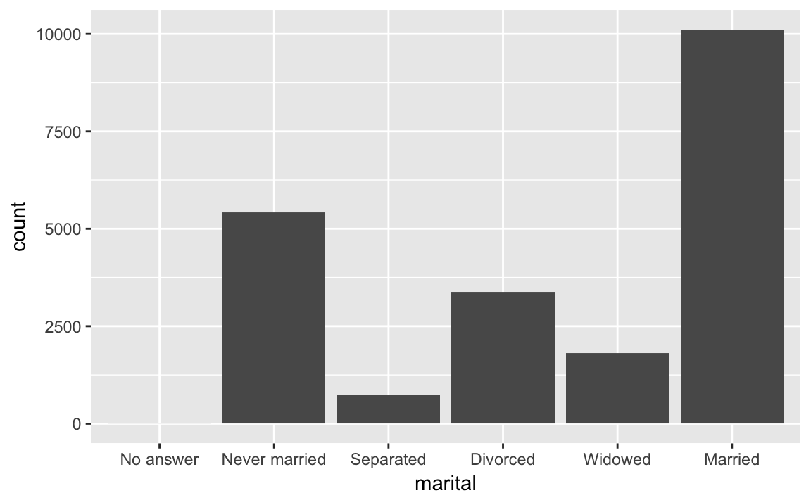
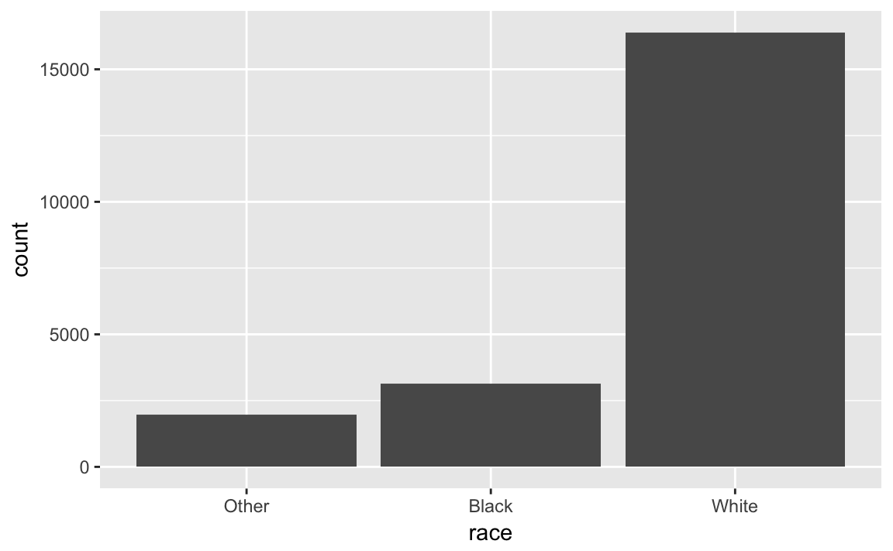
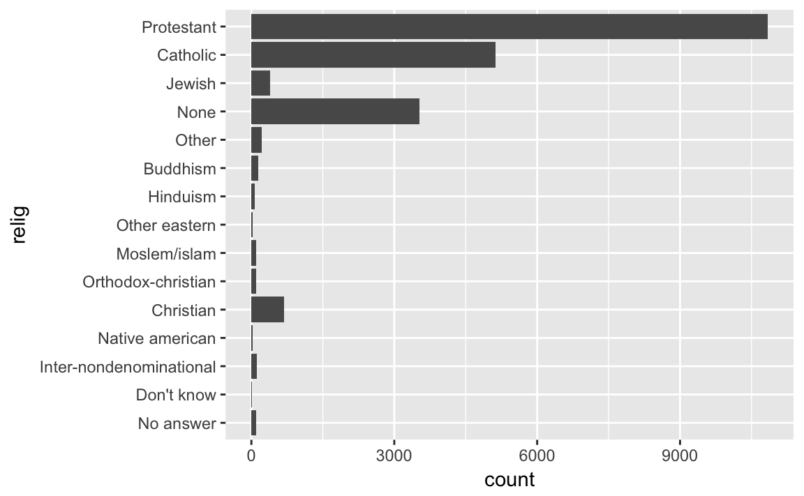
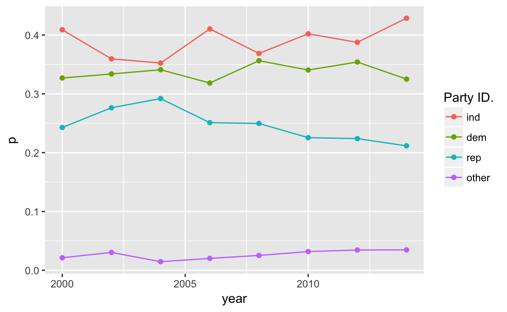
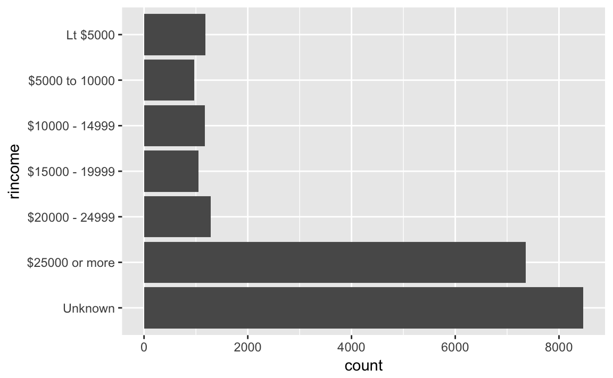

---
output: html_document
editor_options:
  chunk_output_type: console
---
# Factors

## Introduction

Functions and packages:


```r
library("tidyverse")
library("forcats")
```


## Creating Factors

No exercises

## General Social Survey


### Exercise 1 {.exercise}

> Explore the distribution of `rincome` (reported income). 
> What makes the default bar chart hard to understand? 
> How could you improve the plot?


```r
rincome_plot <-
  gss_cat %>%
  ggplot(aes(rincome)) +
  geom_bar()
rincome_plot
```



The default bar chart labels are too squished to read.
One solution is to change the angle of the labels,

```r
rincome_plot +
  theme(axis.text.x = element_text(angle = 90))
```



But that's not natural either, because text is vertical, and we read horizontally.
So with long labels, it is better to flip it.

```r
rincome_plot +
  coord_flip()
```



This is better, but it unintuitively goes from low to high. It would help if the
scale is reversed. Also, if all the missing factors were differentiated.


### Exercise 2 {.exercise}

> What is the most common `relig` in this survey? 
> What’s the most common `partyid`?

The most common `relig` is "Protestant"

```r
gss_cat %>%
  count(relig) %>%
  arrange(-n) %>%
  head(1)
#> # A tibble: 1 x 2
#>   relig          n
#>   <fct>      <int>
#> 1 Protestant 10846
```

The most common `partyid` is "Independent"

```r
gss_cat %>%
  count(partyid) %>%
  arrange(-n) %>%
  head(1)
#> # A tibble: 1 x 2
#>   partyid         n
#>   <fct>       <int>
#> 1 Independent  4119
```


### Exercise 4 {.exercise}

> Which `relig` does `denom` (denomination) apply to? 
> How can you find out with a table? 
> How can you find out with a visualization?


```r
levels(gss_cat$denom)
#>  [1] "No answer"            "Don't know"           "No denomination"     
#>  [4] "Other"                "Episcopal"            "Presbyterian-dk wh"  
#>  [7] "Presbyterian, merged" "Other presbyterian"   "United pres ch in us"
#> [10] "Presbyterian c in us" "Lutheran-dk which"    "Evangelical luth"    
#> [13] "Other lutheran"       "Wi evan luth synod"   "Lutheran-mo synod"   
#> [16] "Luth ch in america"   "Am lutheran"          "Methodist-dk which"  
#> [19] "Other methodist"      "United methodist"     "Afr meth ep zion"    
#> [22] "Afr meth episcopal"   "Baptist-dk which"     "Other baptists"      
#> [25] "Southern baptist"     "Nat bapt conv usa"    "Nat bapt conv of am" 
#> [28] "Am bapt ch in usa"    "Am baptist asso"      "Not applicable"
```

From the context it is clear that `denom` refers to "Protestant" (and unsurprising given that it is the largest category in `freq`).
Let's filter out the non-responses, no answers, others, not-applicable, or
no denomination, to leave only answers to denominations.
After doing that, the only remaining responses are "Protestant".

```r
gss_cat %>%
  filter(!denom %in% c("No answer", "Other", "Don't know", "Not applicable",
                       "No denomination")) %>%
  count(relig)
#> # A tibble: 1 x 2
#>   relig          n
#>   <fct>      <int>
#> 1 Protestant  7025
```

This is also clear in a scatter plot of `relig` vs. `denom` where the points are
proportional to the size of the number of answers (since otherwise there would be overplotting).

```r
gss_cat %>%
  count(relig, denom) %>%
  ggplot(aes(x = relig, y = denom, size = n)) +
  geom_point() +
  theme(axis.text.x = element_text(angle = 90))
```




## Modifying factor order

### Exercise 1 {.exercise}

> There are some suspiciously high numbers in `tvhours`. 
> Is the `mean` a good summary?


```r
summary(gss_cat[["tvhours"]])
#>    Min. 1st Qu.  Median    Mean 3rd Qu.    Max.    NA's 
#>       0       1       2       3       4      24   10146
```


```r
gss_cat %>%
  filter(!is.na(tvhours)) %>%
  ggplot(aes(x = tvhours)) +
  geom_histogram(binwidth = 1)
```



Whether the mean is the best summary depends on what you are using it for :-), i.e. your objective.
But probably the median would be what most people prefer.
And the hours of TV doesn't look that surprising to me.

### Exercise 2 {.exercise}

> For each factor in `gss_cat` identify whether the order of the levels is arbitrary or principled.

The following piece of code uses functions introduced in Ch 21, to print out the names of only the factors.

```r
keep(gss_cat, is.factor) %>% names()
#> [1] "marital" "race"    "rincome" "partyid" "relig"   "denom"
```

There are five six categorical variables: `marital`, `race`, `rincome`, `partyid`, `relig`, `denom`.

The ordering of marital is "somewhat principled". There is some sort of logic in that the levels are grouped "never married", married at some point (separated, divorced, widowed), and "married"; though it would seem that "Never Married", "Divorced", "Widowed", "Separated", "Married" might be more natural.
I find that the question of ordering can be determined by the level of aggregation in a categorical variable, and there can be more "partially ordered" factors than one would expect.


```r
levels(gss_cat[["marital"]])
#> [1] "No answer"     "Never married" "Separated"     "Divorced"     
#> [5] "Widowed"       "Married"
```

```r
gss_cat %>%
  ggplot(aes(x = marital)) +
  geom_bar()
```



The ordering of race is principled in that the categories are ordered by count of observations in the data.

```r
levels(gss_cat$race)
#> [1] "Other"          "Black"          "White"          "Not applicable"
```

```r
gss_cat %>%
  ggplot(aes(race)) +
  geom_bar(drop = FALSE)
#> Warning: Ignoring unknown parameters: drop
```



The levels of `rincome` are ordered in decreasing order of the income; however the placement of "No answer", "Don't know", and "Refused" before, and "Not applicable" after the income levels is arbitrary. It would be better to place all the missing income level categories either before or after all the known values.

```r
levels(gss_cat$rincome)
#>  [1] "No answer"      "Don't know"     "Refused"        "$25000 or more"
#>  [5] "$20000 - 24999" "$15000 - 19999" "$10000 - 14999" "$8000 to 9999" 
#>  [9] "$7000 to 7999"  "$6000 to 6999"  "$5000 to 5999"  "$4000 to 4999" 
#> [13] "$3000 to 3999"  "$1000 to 2999"  "Lt $1000"       "Not applicable"
```

The levels of `relig` is arbitrary: there is no natural ordering, and they don't appear to be ordered by stats within the dataset.

```r
levels(gss_cat$relig)
#>  [1] "No answer"               "Don't know"             
#>  [3] "Inter-nondenominational" "Native american"        
#>  [5] "Christian"               "Orthodox-christian"     
#>  [7] "Moslem/islam"            "Other eastern"          
#>  [9] "Hinduism"                "Buddhism"               
#> [11] "Other"                   "None"                   
#> [13] "Jewish"                  "Catholic"               
#> [15] "Protestant"              "Not applicable"
```


```r
gss_cat %>%
  ggplot(aes(relig)) +
  geom_bar() +
  coord_flip()
```



The same goes for `denom`.

```r
levels(gss_cat$denom)
#>  [1] "No answer"            "Don't know"           "No denomination"     
#>  [4] "Other"                "Episcopal"            "Presbyterian-dk wh"  
#>  [7] "Presbyterian, merged" "Other presbyterian"   "United pres ch in us"
#> [10] "Presbyterian c in us" "Lutheran-dk which"    "Evangelical luth"    
#> [13] "Other lutheran"       "Wi evan luth synod"   "Lutheran-mo synod"   
#> [16] "Luth ch in america"   "Am lutheran"          "Methodist-dk which"  
#> [19] "Other methodist"      "United methodist"     "Afr meth ep zion"    
#> [22] "Afr meth episcopal"   "Baptist-dk which"     "Other baptists"      
#> [25] "Southern baptist"     "Nat bapt conv usa"    "Nat bapt conv of am" 
#> [28] "Am bapt ch in usa"    "Am baptist asso"      "Not applicable"
```


Ignoring "No answer", "Don't know", and "Other party", the levels of `partyid` are ordered from "Strong Republican"" to "Strong Democrat".

```r
levels(gss_cat$partyid)
#>  [1] "No answer"          "Don't know"         "Other party"       
#>  [4] "Strong republican"  "Not str republican" "Ind,near rep"      
#>  [7] "Independent"        "Ind,near dem"       "Not str democrat"  
#> [10] "Strong democrat"
```


### Exercise 3 {.exercise}

>  Why did moving “Not applicable” to the front of the levels move it to the bottom of the plot?

Because that gives the level "Not applicable" an integer value of 1.


## Modifying factor levels


### Exercise 1 {.exercise}

>  How have the proportions of people identifying as Democrat, Republican, and Independent changed over time?

To answer that, we need to combine the multiple levels into Democrat, Republican, and Independent

```r
levels(gss_cat$partyid)
#>  [1] "No answer"          "Don't know"         "Other party"       
#>  [4] "Strong republican"  "Not str republican" "Ind,near rep"      
#>  [7] "Independent"        "Ind,near dem"       "Not str democrat"  
#> [10] "Strong democrat"
```


```r
gss_cat %>%
  mutate(partyid =
           fct_collapse(partyid,
                        other = c("No answer", "Don't know", "Other party"),
                        rep = c("Strong republican", "Not str republican"),
                        ind = c("Ind,near rep", "Independent", "Ind,near dem"),
                        dem = c("Not str democrat", "Strong democrat"))) %>%
  count(year, partyid)  %>%
  group_by(year) %>%
  mutate(p = n / sum(n)) %>%
  ggplot(aes(x = year, y = p,
             colour = fct_reorder2(partyid, year, p))) +
  geom_point() +
  geom_line() +
  labs(colour = "Party ID.")

```




### Exercise 2 {.exercise}

> How could you collapse `rincome` into a small set of categories?

Group all the non-responses into one category, and then group other categories into a smaller number. Since there is a clear ordering, we wouldn't want to use something like `fct_lump`.

```r
levels(gss_cat$rincome)
#>  [1] "No answer"      "Don't know"     "Refused"        "$25000 or more"
#>  [5] "$20000 - 24999" "$15000 - 19999" "$10000 - 14999" "$8000 to 9999" 
#>  [9] "$7000 to 7999"  "$6000 to 6999"  "$5000 to 5999"  "$4000 to 4999" 
#> [13] "$3000 to 3999"  "$1000 to 2999"  "Lt $1000"       "Not applicable"
```


```r
library("stringr")
gss_cat %>%
  mutate(rincome =
           fct_collapse(
             rincome,
             `Unknown` = c("No answer", "Don't know", "Refused", "Not applicable"),
             `Lt $5000` = c("Lt $1000", str_c("$", c("1000", "3000", "4000"),
                                              " to ", c("2999", "3999", "4999"))),
             `$5000 to 10000` = str_c("$", c("5000", "6000", "7000", "8000"),
                                      " to ", c("5999", "6999", "7999", "9999"))
           )) %>%
  ggplot(aes(x = rincome)) +
  geom_bar() +
  coord_flip()
```


