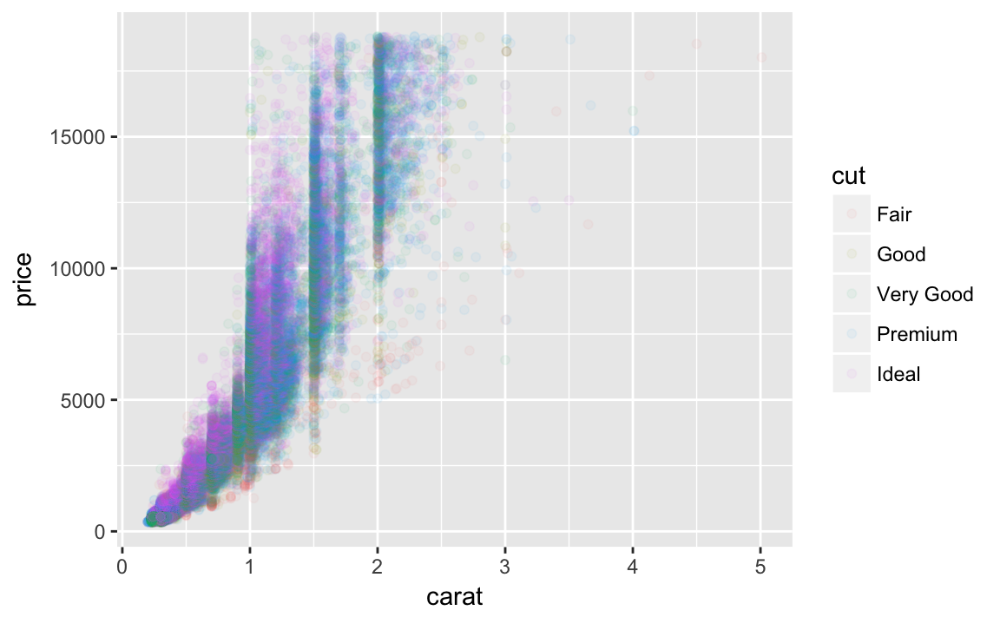
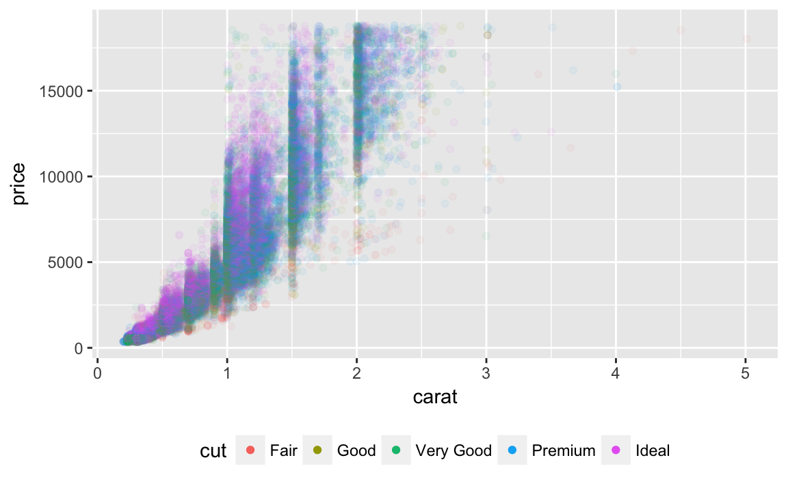

# Graphics for communication


## Introduction


```r
library("tidyverse")
library("modelr")
library("lubridate")
#> 
#> Attaching package: 'lubridate'
#> The following object is masked from 'package:base':
#> 
#>     date
```

## Label


```r
ggplot(mpg, aes(displ, hwy)) +
  geom_point(aes(color = class)) +
  geom_smooth(se = FALSE) +
  labs(title = "Fuel efficiency generally decreases with engine size")
#> `geom_smooth()` using method = 'loess'
```


```r
ggplot(mpg, aes(displ, hwy)) +
  geom_point(aes(color = class)) +
  geom_smooth(se = FALSE) +
  labs(
    title = "Fuel efficiency generally decreases with engine size",
    subtitle = "Two seaters (sports cars) are an exception because of their light weight",
    caption = "Data from fueleconomy.gov"
  )
#> `geom_smooth()` using method = 'loess'
```


### Exercises

**Ex 28.2.1**  Create one plot on the fuel economy data with customised `title`,
`subtitle`, `caption`, `x`, `y`, and `colour` labels.


```r
ggplot(data = mpg,
       mapping = aes(x = reorder(class, hwy, median), y = hwy)) + 
  geom_boxplot() +
  coord_flip() +
  labs(
    title = "Compact Cars have > 10 Hwy MPG than Pickup Trucks",
    subtitle = "Comparing the median highway mpg in each class",
    caption = "Data from fueleconomy.gov",
    x = "Car Class",
    y = "Highway Miles per Gallon"
  )
```


**Ex 28.2.3** The `geom_smooth()` is somewhat misleading because the `hwy` for
large engines is skewed upwards due to the inclusion of lightweight
sports cars with big engines. Use your modelling tools to fit and display
a better model.


```r
ggplot(mpg, aes(displ, hwy, colour = class)) +
  geom_point(aes(colour = class)) +
  geom_smooth(method = "lm", se = FALSE) +
  labs(
    title = "Fuel efficiency generally decreases with engine size",
    subtitle = "Subcompact cars show the greatest sensitivity to engine size",
    caption = "Data from fueleconomy.gov"
  )
```


```r
mod <- lm(hwy ~ class, data = mpg)
mpg %>%
  add_residuals(mod) %>%
  ggplot(aes(displ, resid)) +
  geom_point() +
  geom_smooth(method = "lm", se = FALSE) +
  labs(
    title = "Fuel efficiency decreases with engine size",
    subtitle = "Highway MPG for Cars After Subtracing Mean MPG of their Class",
    caption = "Data from fueleconomy.gov",
    x = "Highway MPG Relative to Class",
    y = "Engine Displacement"
  )
```


**Ex 28.2.3.**  Take an exploratory graphic that you've created in the last month, and add informative titles to make it easier for others to understand.

*Ignoring*

## Annotations


This section covers annotating (adding labels to data) in a plot.
The primary problem that makes this non-trivial is ensuring that the labels do not overlap each other (or other data).
When labeling points the package **ggrepel** dodges labels; but several other annotation methods are also discussed.

### Exercise

**Ex 28.3.1** Use `geom_text()` with infinite positions to place text at the four corners of the plot.

I can use similar code as the example in the text.
However, I need to use `vjust` and `hjust` in order for the text to appear in the plot, and these need to be different for each corner.
But, `geom_text` takes `hjust` and `vjust` as aesthetics, I can add them to the data and mappings, and use a single `geom_text` call instead of four different `geom_text` calls with four different data arguments, and four different values of `hjust` and `vjust` arguments.

```r
label <- tribble(
  ~displ, ~hwy, ~label, ~vjust, ~hjust,
     Inf,  Inf,    "Top right", "top", "right",
     Inf, -Inf,    "Bottom right", "bottom", "right",
    -Inf,  Inf,    "Top left", "top", "left",
    -Inf, -Inf,    "Bottom left", "bottom", "left"
)

ggplot(mpg, aes(displ, hwy)) +
  geom_point() +
  geom_text(aes(label = label, vjust = vjust, hjust = hjust), data = label)
```


**Ex 28.3.1.2** Read the documentation for `annotate()`. How can you use it to add a text label to a plot without having to create a tibble?

With annotate you use what would be aesthetic mappings directly as arguments:

```r
ggplot(mpg, aes(displ, hwy)) +
  geom_point() +
  annotate("text", x = Inf, y = Inf, 
           label = "Increasing engine size is \nrelated to decreasing fuel economy.", vjust = "top", hjust = "right")
```


**Ex 28.3.1.3** How do labels with `geom_text()` interact with faceting? How can you add a label to a single facet? How can you put a different label in each facet? (Hint: think about the underlying data.)

If the facet variable is not specified, the text is drawn in all facets.

```r
label <- tibble(
  displ = Inf,
  hwy = Inf,
  label = "Increasing engine size is \nrelated to decreasing fuel economy."
)

ggplot(mpg, aes(displ, hwy)) +
  geom_point() +
  geom_text(aes(label = label), data = label, vjust = "top", hjust = "right",
            size = 2) +
  facet_wrap(~ class)
```


To draw the label in only one facet, add a column to the label data frame with the value of the faceting variable(s) in which to draw it.

```r
label <- tibble(
  displ = Inf,
  hwy = Inf,
  class = "2seater",
  label = "Increasing engine size is \nrelated to decreasing fuel economy."
)

ggplot(mpg, aes(displ, hwy)) +
  geom_point() +
  geom_text(aes(label = label), data = label, vjust = "top", hjust = "right",
            size = 2) +
  facet_wrap(~ class)
```


To draw labels in different plots, simply have the facetting variable(s):

```r
label <- tibble(
  displ = Inf,
  hwy = Inf,
  class = unique(mpg$class),
  label = stringr::str_c("Label for ", class)
)

ggplot(mpg, aes(displ, hwy)) +
  geom_point() +
  geom_text(aes(label = label), data = label, vjust = "top", hjust = "right",
            size = 3) +
  facet_wrap(~ class)
```


**Ex 28.3.1.4** What arguments to `geom_label()` control the appearance of the background box?

- `label.padding`: padding around label
- `label.r`: amount of rounding in the corners
- `label.size`: size of label border


**Ex 28.3.1.5** What are the four arguments to `arrow()`? How do they work? Create a series of plots that demonstrate the most important options.

The four arguments are: (from the help for [arrow](https://www.rdocumentation.org/packages/grid/versions/3.3.2/topics/arrow))
- `angle` : angle of arrow head
- `length` : length of the arrow head
- `ends`: ends of the line to draw arrow head
- `type`: `"open"` or `"close"`: whether the arrow head is a closed or open triangle

*TODO*

## Scales

### Exercises

**Ex 28.4.4.1** Why doesn’t the following code override the default scale?


```r
df <- tibble(
  x = rnorm(10000),
  y = rnorm(10000)
)
ggplot(df, aes(x, y)) +
  geom_hex() +
  scale_colour_gradient(low = "white", high = "red") +
  coord_fixed()
#> Loading required package: methods
```


It does not override the default scale because the colors in `geom_hex` are set by the `fill` aesthetic, not the `color` aesthetic.


```r
ggplot(df, aes(x, y)) +
  geom_hex() +
  scale_fill_gradient(low = "white", high = "red") +
  coord_fixed()
```


**Ex 28.4.2.2** 

The first argument to every scale is the label for the scale.
It is equivalent to using the `labs` function.


```r
ggplot(mpg, aes(displ, hwy)) +
  geom_point(aes(colour = class)) +
  geom_smooth(se = FALSE) +
  labs(
    x = "Engine displacement (L)",
    y = "Highway fuel economy (mpg)",
    colour = "Car type"
  )
#> `geom_smooth()` using method = 'loess'
```


```r
ggplot(mpg, aes(displ, hwy)) +
  geom_point(aes(colour = class)) +
  geom_smooth(se = FALSE) +
  scale_x_continuous("Engine displacement (L)") + 
  scale_y_continuous("Highway fuel economy (mpg)") +
  scale_colour_discrete("Car type")
#> `geom_smooth()` using method = 'loess'
```


**Ex 28.4.4.3** Change the display of the presidential terms by:

    1. Combining the two variants shown above.
    2. Improving the display of the y axis.
    3. Labelling each term with the name of the president.
    4. Adding informative plot labels.
    5. Placing breaks every 4 years (this is trickier than it seems!).


```r
years <- lubridate::make_date(seq(year(min(presidential$start)),
             year(max(presidential$end)),
             by = 4), 1, 1)

presidential %>%
  mutate(id = 33 + row_number(),
         name_id = stringr::str_c(name, " (", id, ")"),
         name_id = factor(name_id, levels = name_id)) %>%
  ggplot(aes(start, name_id, colour = party)) +
    geom_point() +
    geom_segment(aes(xend = end, yend = name_id)) +
    scale_colour_manual(values = c(Republican = "red", Democratic = "blue")) +
    scale_y_discrete(NULL) +
    scale_x_date(NULL, breaks = years, date_labels = "'%y") +
    theme(panel.grid.minor = element_blank())
```


**Ex 28.4.4.4** Use `override.aes` to make the legend on the following plot easier to see.


```r
ggplot(diamonds, aes(carat, price)) +
  geom_point(aes(colour = cut), alpha = 1/20)
```



The problem with the legend is that the `alpha` value make the colors hard to see. So I'll override the alpha value to make the points solid in the legend.

```r
ggplot(diamonds, aes(carat, price)) +
  geom_point(aes(colour = cut), alpha = 1/20)  +
  theme(legend.position = "bottom") +
  guides(colour = guide_legend(nrow = 1, override.aes = list(alpha = 1)))  
```



