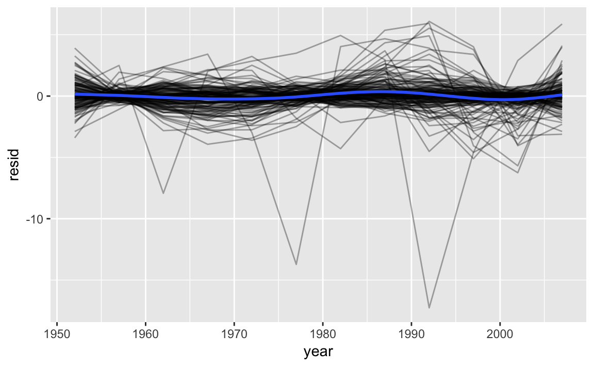
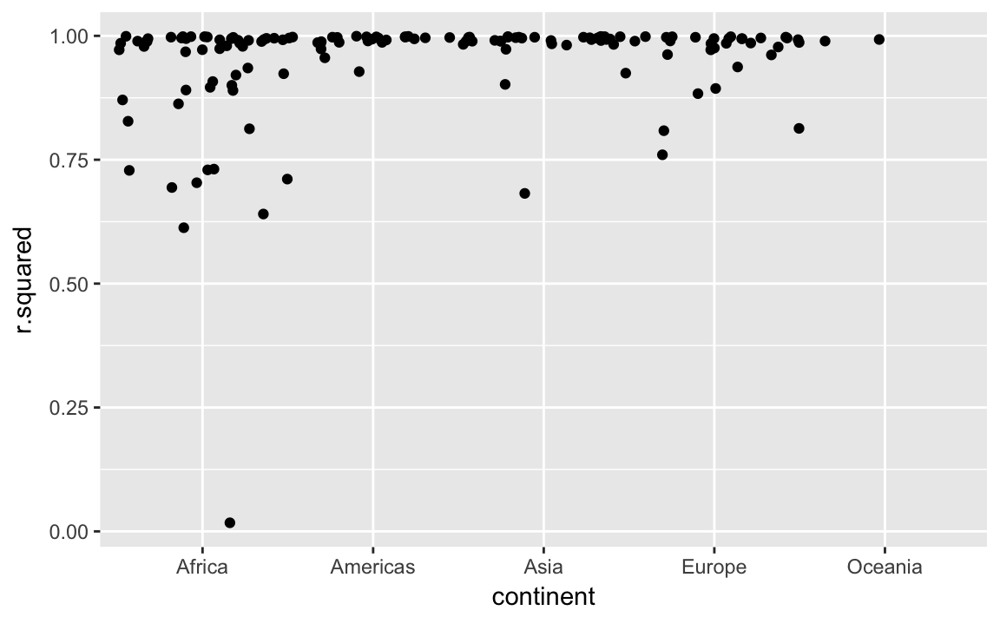
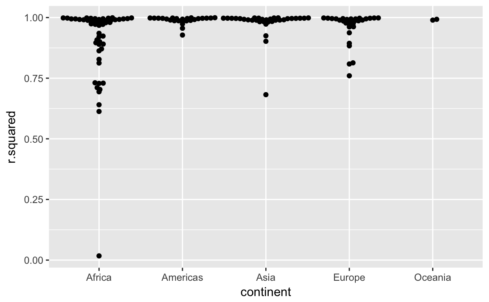

# Many Models


## Introduction


```r
library(modelr)
library(tidyverse)
#> Loading tidyverse: ggplot2
#> Loading tidyverse: tibble
#> Loading tidyverse: tidyr
#> Loading tidyverse: readr
#> Loading tidyverse: purrr
#> Loading tidyverse: dplyr
#> Conflicts with tidy packages ----------------------------------------------
#> filter(): dplyr, stats
#> lag():    dplyr, stats
library(gapminder)
```

Functions

- `nest`
- `unnest`
- `glance`

## Gapminder

### Exercises

**25.2.5** A linear trend seems to be slightly too simple for the overall trend. Can you do better with a quadratic polynomial? How can you interpret the coefficients of the quadratic? (Hint you might want to transform year so that it has mean zero.)

The following code replicates the analysis in the chapter but the function `country_model` is replaced with a regression that includes the year squared.

```r
lifeExp ~ poly(year, 2)
```


```r
country_model <- function(df) {
  lm(lifeExp ~ poly(year - median(year), 2), data = df)
}

by_country <- gapminder %>% 
  group_by(country, continent) %>% 
  nest()

by_country <- by_country %>%
  mutate(model = map(data, country_model))
```


```r
by_country <- by_country %>% 
  mutate(
    resids = map2(data, model, add_residuals)
  )
by_country
#> # A tibble: 142 × 5
#>       country continent              data    model            resids
#>        <fctr>    <fctr>            <list>   <list>            <list>
#> 1 Afghanistan      Asia <tibble [12 × 4]> <S3: lm> <tibble [12 × 5]>
#> 2     Albania    Europe <tibble [12 × 4]> <S3: lm> <tibble [12 × 5]>
#> 3     Algeria    Africa <tibble [12 × 4]> <S3: lm> <tibble [12 × 5]>
#> 4      Angola    Africa <tibble [12 × 4]> <S3: lm> <tibble [12 × 5]>
#> 5   Argentina  Americas <tibble [12 × 4]> <S3: lm> <tibble [12 × 5]>
#> 6   Australia   Oceania <tibble [12 × 4]> <S3: lm> <tibble [12 × 5]>
#> # ... with 136 more rows
```


```r
unnest(by_country, resids) %>%
ggplot(aes(year, resid)) +
  geom_line(aes(group = country), alpha = 1 / 3) + 
  geom_smooth(se = FALSE)
#> `geom_smooth()` using method = 'gam' and formula 'y ~ s(x, bs = "cs")'
```




```r
by_country %>% 
  mutate(glance = map(model, broom::glance)) %>%
  unnest(glance, .drop = TRUE) %>%
  ggplot(aes(continent, r.squared)) +
  geom_jitter(width = 0.5)
```



**Ex 25.2.5** Explore other methods for visualising the distribution of $R^2$ per continent. You might want to try the ggbeeswarm package, which provides similar methods for avoiding overlaps as jitter, but uses deterministic methods.

See exercise 7.5.1.1.6 for more on **ggbeeswarm**


```r
library("ggbeeswarm")
by_country %>% 
  mutate(glance = map(model, broom::glance)) %>%
  unnest(glance, .drop = TRUE) %>%
  ggplot(aes(continent, r.squared)) +
  geom_beeswarm()
```



## Creating list-columns

### Exercises

**Ex. 25.4.5.1** List all the functions that you can think of that take a atomic vector and return a list.

E.g. Many of the **stringr** functions.

**Ex. 25.4.5.2** Brainstorm useful summary functions that, like `quantile()`, return multiple values.

E.g. `range`, `fivenum`.


**Ex. 25.4.5.3** What’s missing in the following data frame? How does `quantile()` return that missing piece? Why isn’t that helpful here?


```r
mtcars %>% 
  group_by(cyl) %>% 
  summarise(q = list(quantile(mpg))) %>% 
  unnest()
#> # A tibble: 15 × 2
#>     cyl     q
#>   <dbl> <dbl>
#> 1     4  21.4
#> 2     4  22.8
#> 3     4  26.0
#> 4     4  30.4
#> 5     4  33.9
#> 6     6  17.8
#> # ... with 9 more rows
```

The particular quantiles of the values are missing, e.g. `0%`, `25%`, `50%`, `75%`, `100%`. `quantile()` returns these in the names of the vector.

```r
quantile(mtcars$mpg)
#>   0%  25%  50%  75% 100% 
#> 10.4 15.4 19.2 22.8 33.9
```

Since the `unnest` function drops the names of the vector, they aren't useful here.

**Ex 25.4.5.4**  What does this code do? Why might might it be useful?


```r
mtcars %>% 
  group_by(cyl) %>% 
  summarise_each(funs(list))
#> # A tibble: 3 × 11
#>     cyl        mpg       disp         hp       drat         wt       qsec
#>   <dbl>     <list>     <list>     <list>     <list>     <list>     <list>
#> 1     4 <dbl [11]> <dbl [11]> <dbl [11]> <dbl [11]> <dbl [11]> <dbl [11]>
#> 2     6  <dbl [7]>  <dbl [7]>  <dbl [7]>  <dbl [7]>  <dbl [7]>  <dbl [7]>
#> 3     8 <dbl [14]> <dbl [14]> <dbl [14]> <dbl [14]> <dbl [14]> <dbl [14]>
#> # ... with 4 more variables: vs <list>, am <list>, gear <list>,
#> #   carb <list>
```

It creates a data frame in which each row corresponds to a value of `cyl`, 
and each observation for each column (other than `cyl`) is a vector of all the values of that column for that value of `cyl`. 
It seems like it should be useful to have all the observations of each variable for each group, but off the top of my head, I can't think of a specific use for this.
But, it seems that it may do many things that `dplyr::do` does.

## Simplifying list-columns


### Exercises

**Ex 25.5.3.1** Why might the `lengths()` function be useful for creating atomic vector columns from list-columns?

The `lengths()` function gets the lengths of each element in a list.
It could be useful for testing whether all elements in a list-column are the same length.
You could get the maximum length to determine how many atomic vector columns to create.
It is also a replacement for something like `map_int(x, length)` or `sapply(x, length)`.

**Ex 25.5.3.2** List the most common types of vector found in a data frame. What makes lists different?

The common types of vectors in data frames are:

- `logical`
- `numeric`
- `integer`
- `character`
- `factor`

All of the common types of vectors in data frames are atomic. Lists are not atomic (they can contain other lists and other vectors).
