# Model Basics

Distinction between *family of models* and *fitted model* is a useful way to think about models. 
Especially as we can abstract some families of models to be themselves a fitted model of a more flexible family of models.
For example, linear regression is a special case of GLM or Gaussian Processes etc.


## Prerequisites


```r
library(tidyverse)
library(modelr)
options(na.action = na.warn)
```

The option `na.action` determines how missing values are handled.
It is a function.
`na.warn` sets it so that there is a warning if there are any missing values (by default, R will just silently drop them).

## A simple model


```r
ggplot(sim1, aes(x, y)) +
  geom_point()
```

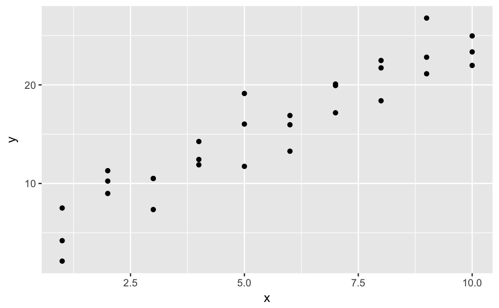


```r
models <- tibble(
  a1 = runif(250, -20, 40),
  a2 = runif(250, -5, 5)
)

ggplot(sim1, aes(x, y)) +
  geom_abline(aes(intercept = a1, slope = a2), data = models, alpha = 1/4) +
  geom_point()
```


```r
model1 <- function(a, data) {
  a[1] + data$x * a[2]
}
model1(c(7, 1.5), sim1)
#>  [1]  8.5  8.5  8.5 10.0 10.0 10.0 11.5 11.5 11.5 13.0 13.0 13.0 14.5 14.5
#> [15] 14.5 16.0 16.0 16.0 17.5 17.5 17.5 19.0 19.0 19.0 20.5 20.5 20.5 22.0
#> [29] 22.0 22.0
```


```r
measure_distance <- function(mod, data) {
  diff <- data$y - model1(mod, data)
  sqrt(mean(diff ^ 2))
}
measure_distance(c(7, 1.5), sim1)
#> [1] 2.67
```


```r
sim1_dist <- function(a1, a2) {
  measure_distance(c(a1, a2), sim1)
}

models <- models %>% 
  mutate(dist = purrr::map2_dbl(a1, a2, sim1_dist))
models
#> # A tibble: 250 × 3
#>       a1      a2  dist
#>    <dbl>   <dbl> <dbl>
#> 1 -15.15  0.0889  30.8
#> 2  30.06 -0.8274  13.2
#> 3  16.05  2.2695  13.2
#> 4 -10.57  1.3769  18.7
#> 5 -19.56 -1.0359  41.8
#> 6   7.98  4.5948  19.3
#> # ... with 244 more rows
```


```r
ggplot(sim1, aes(x, y)) + 
  geom_point(size = 2, colour = "grey30") + 
  geom_abline(
    aes(intercept = a1, slope = a2, colour = -dist), 
    data = filter(models, rank(dist) <= 10)
  )
```

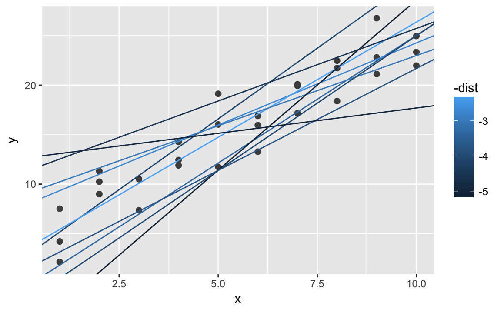


```r
grid <- expand.grid(
  a1 = seq(-5, 20, length = 25),
  a2 = seq(1, 3, length = 25)
  ) %>% 
  mutate(dist = purrr::map2_dbl(a1, a2, sim1_dist))

grid %>% 
  ggplot(aes(a1, a2)) +
  geom_point(data = filter(grid, rank(dist) <= 10), size = 4, colour = "red") +
  geom_point(aes(colour = -dist)) 
```

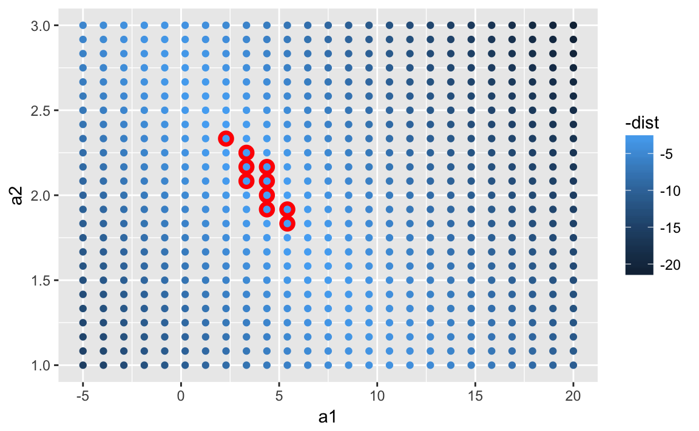


```r
ggplot(sim1, aes(x, y)) + 
  geom_point(size = 2, colour = "grey30") + 
  geom_abline(
    aes(intercept = a1, slope = a2, colour = -dist), 
    data = filter(grid, rank(dist) <= 10)
  )
```

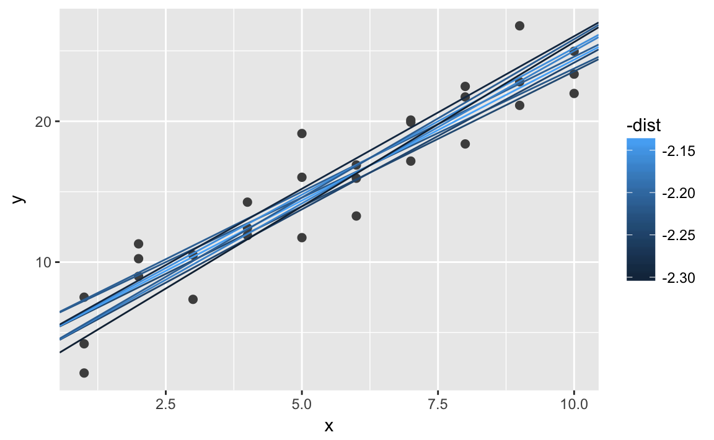


```r
best <- optim(c(0, 0), measure_distance, data = sim1)
best$par
#> [1] 4.22 2.05

ggplot(sim1, aes(x, y)) + 
  geom_point(size = 2, colour = "grey30") + 
  geom_abline(intercept = best$par[1], slope = best$par[2])
```

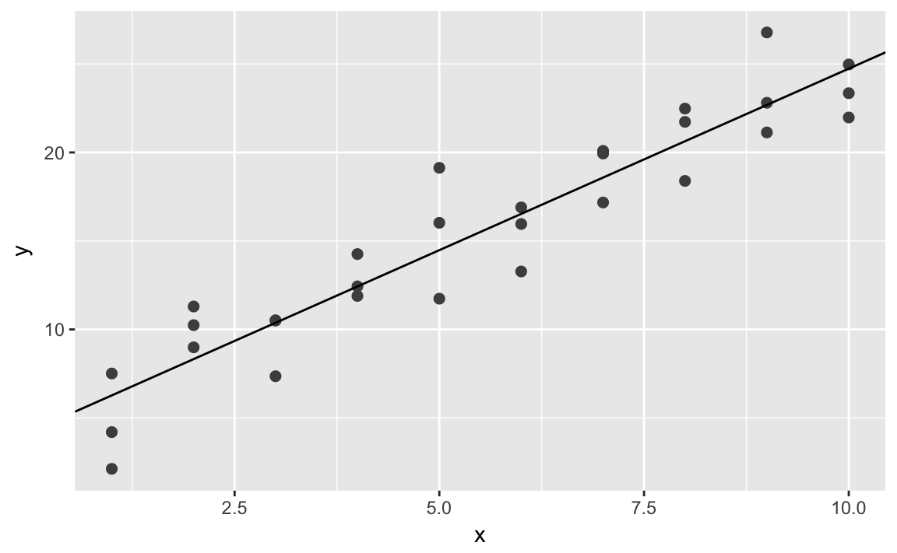


```r
sim1_mod <- lm(y ~ x, data = sim1)
coef(sim1_mod)
#> (Intercept)           x 
#>        4.22        2.05
```

### Exercises


```r
sim1a <- tibble(
  x = rep(1:10, each = 3),
  y = x * 1.5 + 6 + rt(length(x), df = 2)
)
```


```r
lm(y ~ x, data = sim1a)
#> 
#> Call:
#> lm(formula = y ~ x, data = sim1a)
#> 
#> Coefficients:
#> (Intercept)            x  
#>        6.05         1.53
```


```r
ggplot(sim1a, aes(x = x, y = y)) +
  geom_point() +
  geom_smooth(method = "lm", se = FALSE)
```

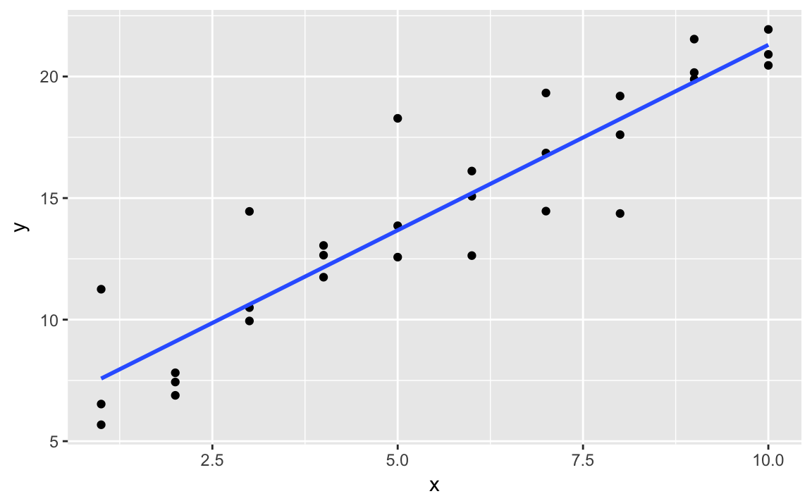

To re-run this a few times using `purrr`

```r
simt <- function(i) {
  tibble(
    x = rep(1:10, each = 3),
    y = x * 1.5 + 6 + rt(length(x), df = 2),
    .id = i
  )
}

lm_df <- function(.data) {
  mod <- lm(y ~ x, data = .data)
  beta <- coef(mod)
  tibble(intercept = beta[1], slope = beta[2])
}

sims <- map(1:100, simt) %>%
  map_df(lm_df)

ggplot(sims, aes(x = intercept, y = slope)) +
  geom_point()
```

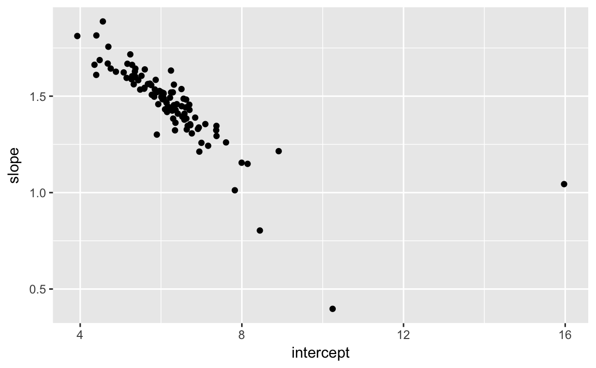

**NOTE** It's not entirely clear what is meant by "visualize the results". 

The data are generated from a low-degrees of freedmo t-distribution, so there will be outliers.r4ds
Linear regression is 

2. One way to make linear models more robust is to use a different distance measure. For example, instead of root-mean-squared distance, you could use mean-absolute distance:


```r
measure_distance <- function(mod, data) {
  diff <- data$y - make_prediction(mod, data)
  mean(abs(diff))
}
```

To re-run this a few times use purrr

```r
simt <- function(i) {
  tibble(
    x = rep(1:10, each = 3),
    y = x * 1.5 + 6 + rt(length(x), df = 2),
    .id = i
  )
}

lm_df <- function(.data) {
  mod <- lm(y ~ x, data = .data)
  beta <- coef(mod)
  tibble(intercept = beta[1], slope = beta[2])
}

sims <- map(1:100, simt) %>%
  map_df(lm_df)

ggplot(sims, aes(x = intercept, y = slope)) +
  geom_point()
```

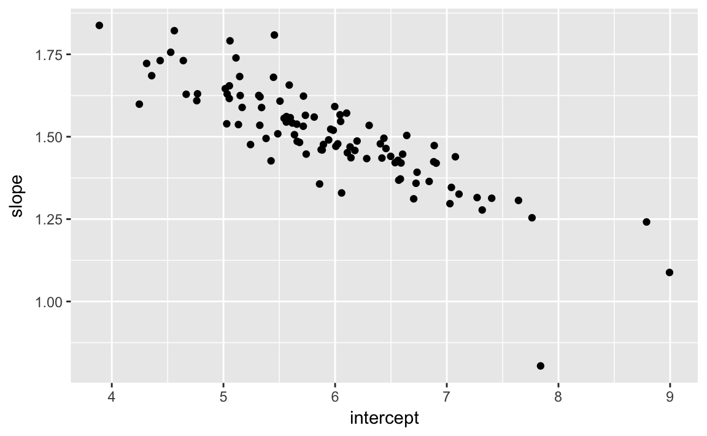


3. One challenge with performing numerical optimisation is that it’s only guaranteed to find one local optima. What’s the problem with optimising a three parameter model like this?


```r
model1 <- function(a, data) {
  a[1] + data$x * a[2] + a[3]
}
```

The problem is that you for any values `a[1] = a1` and `a[3] = a3`, any other values of `a[1]` and `a[3]` where `a[1] + a[3] == (a1 + a3)` will have the same fit.

## Visualizing Models

More complicated models can be visualized with

1. predictions
2. residuals

Notes

- look at `tidyr::complete`, `tidyr::expand`, and `modelr::data_grid` functions
- `modelr::add_residuals` and `modelr::add_predictions` functions add residuals or predictions to the original data
- `geom_ref_line`


```r
grid <- sim1 %>% data_grid(x)
grid
#> # A tibble: 10 × 1
#>       x
#>   <int>
#> 1     1
#> 2     2
#> 3     3
#> 4     4
#> 5     5
#> 6     6
#> # ... with 4 more rows
```


```r
grid <- grid %>%
  add_predictions(sim1_mod)
grid
#> # A tibble: 10 × 2
#>       x  pred
#>   <int> <dbl>
#> 1     1  6.27
#> 2     2  8.32
#> 3     3 10.38
#> 4     4 12.43
#> 5     5 14.48
#> 6     6 16.53
#> # ... with 4 more rows
```


```r
ggplot(sim1, aes(x)) +
  geom_point(aes(y = y)) +
  geom_line(aes(y = pred), data = grid, colour = "red", size = 1)
```


```r
sim1 <- sim1 %>%
  add_residuals(sim1_mod)
sim1
#> # A tibble: 30 × 3
#>       x     y  resid
#>   <int> <dbl>  <dbl>
#> 1     1  4.20 -2.072
#> 2     1  7.51  1.238
#> 3     1  2.13 -4.147
#> 4     2  8.99  0.665
#> 5     2 10.24  1.919
#> 6     2 11.30  2.973
#> # ... with 24 more rows
ggplot(sim1, aes(resid)) +
  geom_freqpoly(binwidth = 0.5)
```

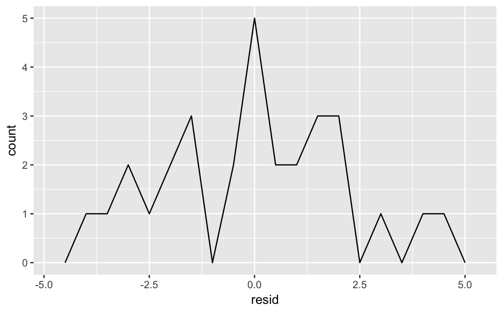


```r
ggplot(sim1, aes(x, resid)) + 
  geom_ref_line(h = 0) +
  geom_point()
```

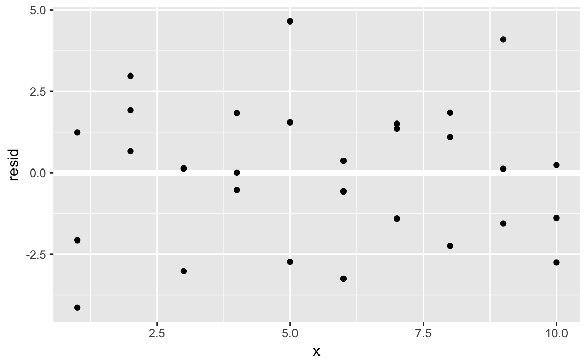

### Exercises

1. nstead of using `lm()` to fit a straight line, you can use `loess()` to fit a smooth curve. Repeat the process of model fitting, grid generation, predictions, and visualisation on sim1 using `loess()` instead of `lm()`. How does the result compare to `geom_smooth()`?

I'll use `add_predictions` and `add_residuals` to add the predictions and residuals from a loess regression to the `sim1` data. 

```r
sim1_loess <- loess(y ~ x, data = sim1)
grid_loess <- sim1 %>%
  add_predictions(sim1_loess)

sim1 <- sim1 %>%
  add_residuals(sim1_loess, var = "resid_loess") %>%
  add_predictions(sim1_loess, var = "pred_loess")
  
```

This plots the loess predictions. The loess produces a nonlinear, but smooth line through the data.

```r
plot_sim1_loess <- 
  ggplot(sim1, aes(x = x, y = y)) +
  geom_point() +
  geom_line(aes(x = x, y = pred), data = grid_loess, colour = "red")
plot_sim1_loess
```

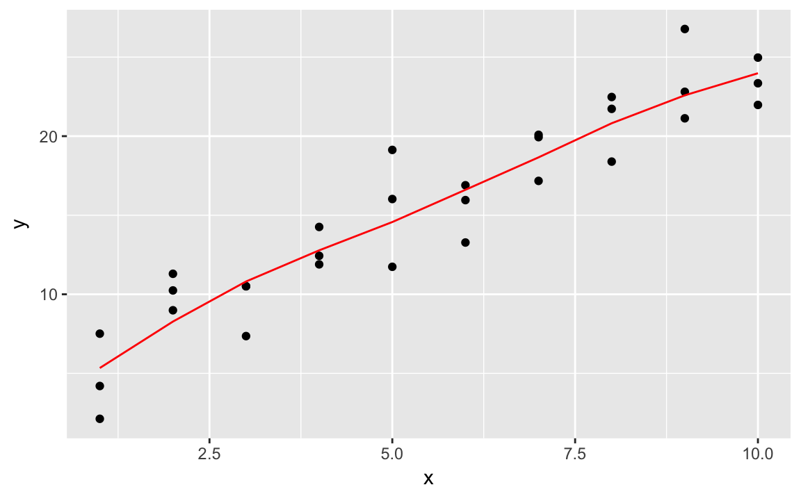

The predictions of loess are the same as the default method for `geom_smooth` because `geom_smooth()` uses `loess()` by default; the message even tells us that.

```r
plot_sim1_loess +
  geom_smooth(colour = "blue", se = FALSE, alpha = 0.20)
#> `geom_smooth()` using method = 'loess'
```

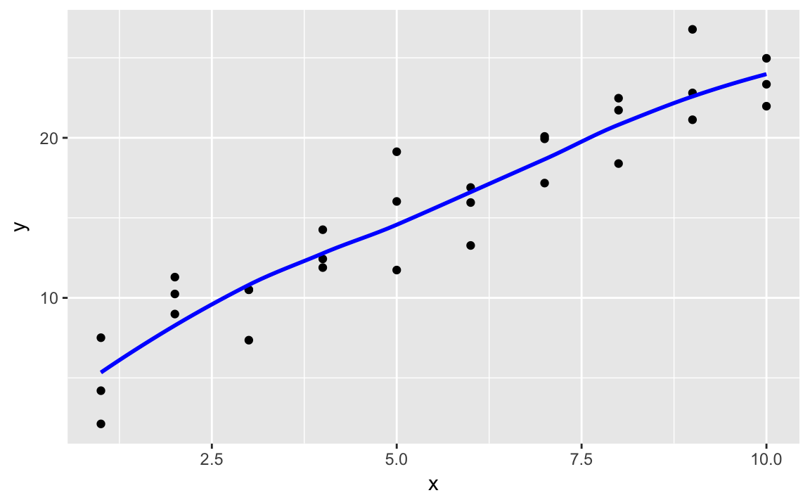

We can plot the residuals (red), and compare them to the residuals from lm (black). 
In general, the loess model has smaller residuals within the sample (out of sample is a different issue, and we haven't considered the uncertainty of these estimates).


```r
ggplot(sim1, aes(x = x)) +
  geom_ref_line(h = 0) +
  geom_point(aes(y = resid)) +
  geom_point(aes(y = resid_loess), colour = "red")
```


2. `add_predictions()` is paired with `gather_predictions()` and `spread_predictions()`. How do these three functions differ?

The functions `gather_predictions` and `spread_predictions` allow for adding predictions from multiple models at once.

3. What does `geom_ref_line()` do? What package does it come from? Why is displaying a reference line in plots showing residuals useful and important?

The geom `geom_ref_line()` adds as reference line to a plot.
Even though it alters a **ggplot2** plot, it is in the **modelr** package.
Putting a reference line at zero for residuals is important because good models (generally) should have residuals centered at zero, with approximately the same variance (or distribution) over the support of x, and no correlation.
A zero reference line makes it easier to judge these characteristics visually.

4. Why might you want to look at a frequency polygon of absolute residuals? What are the pros and cons compared to looking at the raw residuals?

The frequency polygon makes it easier to judge whether the variance and/or absolute size of the residuals varies with respect to x.
This is called heteroskedasticity, and results in incorrect standard errors in inference.
In prediction, this provides insight into where the model is working well and where it is not.
What is lost, is that since the absolute values are shown, whether the model is over-predicting or underpredicting, or on average correctly predicting in different regions of x cannot be determined.

## Formulas and Model Families


```r
df <- tribble(
  ~y, ~x1, ~x2,
  4, 2, 5,
  5, 1, 6
)
```


```r
model_matrix(df, y ~ x1)
#> # A tibble: 2 × 2
#>   `(Intercept)`    x1
#>           <dbl> <dbl>
#> 1             1     2
#> 2             1     1
```


```r
model_matrix(df, y ~ x1 - 1)
#> # A tibble: 2 × 1
#>      x1
#>   <dbl>
#> 1     2
#> 2     1
```

### Categorical Variables


```r
df <- tribble(
  ~ sex, ~ response,
  "male", 1,
  "female", 2,
  "male", 1
)
model_matrix(df, response ~ sex)
#> # A tibble: 3 × 2
#>   `(Intercept)` sexmale
#>           <dbl>   <dbl>
#> 1             1       1
#> 2             1       0
#> 3             1       1
```


```r
ggplot(sim2) +
  geom_point(aes(x, y))
```

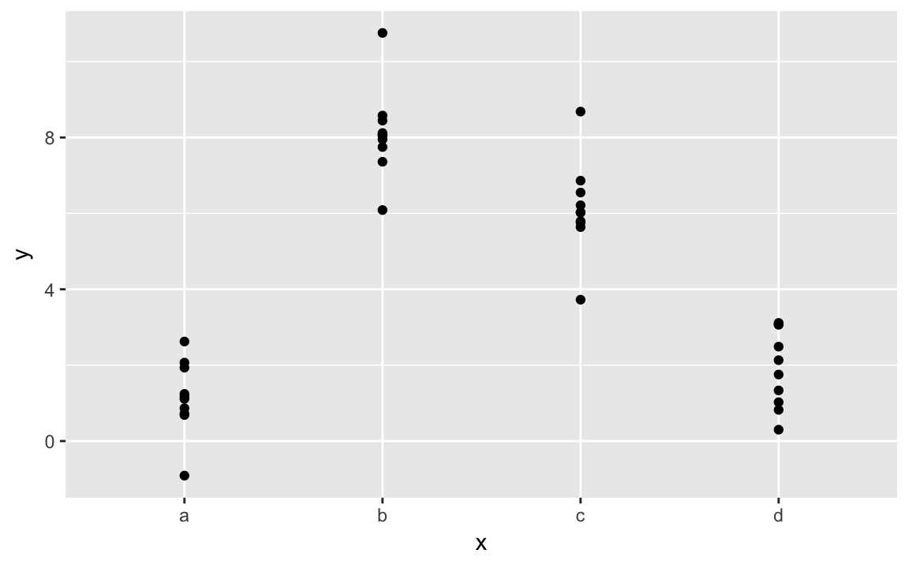


```r
mod2 <- lm(y ~ x, data = sim2)
grid <- sim2 %>%
  data_grid(x) %>%
  add_predictions(mod2)
grid
#> # A tibble: 4 × 2
#>       x  pred
#>   <chr> <dbl>
#> 1     a  1.15
#> 2     b  8.12
#> 3     c  6.13
#> 4     d  1.91
```


```r
ggplot(sim3, aes(x1, y)) + 
  geom_point(aes(colour = x2))
```


```r
mod1 <- lm(y ~ x1 + x2, data = sim3)
mod2 <- lm(y ~ x1 * x2, data = sim3)
```


```r
grid <- sim3 %>% 
  data_grid(x1, x2) %>% 
  gather_predictions(mod1, mod2)
grid
#> # A tibble: 80 × 4
#>   model    x1     x2  pred
#>   <chr> <int> <fctr> <dbl>
#> 1  mod1     1      a  1.67
#> 2  mod1     1      b  4.56
#> 3  mod1     1      c  6.48
#> 4  mod1     1      d  4.03
#> 5  mod1     2      a  1.48
#> 6  mod1     2      b  4.37
#> # ... with 74 more rows
```


```r
ggplot(sim3, aes(x1, y, colour = x2)) + 
  geom_point() + 
  geom_line(data = grid, aes(y = pred)) + 
  facet_wrap(~ model)
```


```r
sim3 <- sim3 %>% 
  gather_residuals(mod1, mod2)

ggplot(sim3, aes(x1, resid, colour = x2)) + 
  geom_point() + 
  facet_grid(model ~ x2)
```

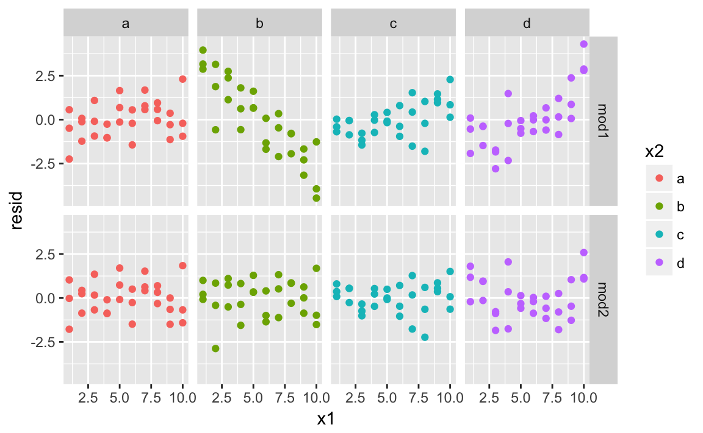


```r
mod1 <- lm(y ~ x1 + x2, data = sim4)
mod2 <- lm(y ~ x1 * x2, data = sim4)

grid <- sim4 %>% 
  data_grid(
    x1 = seq_range(x1, 5), 
    x2 = seq_range(x2, 5) 
  ) %>% 
  gather_predictions(mod1, mod2)
grid
#> # A tibble: 50 × 4
#>   model    x1    x2   pred
#>   <chr> <dbl> <dbl>  <dbl>
#> 1  mod1  -1.0  -1.0  0.996
#> 2  mod1  -1.0  -0.5 -0.395
#> 3  mod1  -1.0   0.0 -1.786
#> 4  mod1  -1.0   0.5 -3.177
#> 5  mod1  -1.0   1.0 -4.569
#> 6  mod1  -0.5  -1.0  1.907
#> # ... with 44 more rows
```

Function `seq_range` is useful.


```r
ggplot(grid, aes(x1, x2)) +
  geom_tile(aes(fill = pred)) +
  facet_wrap(~ model)
```

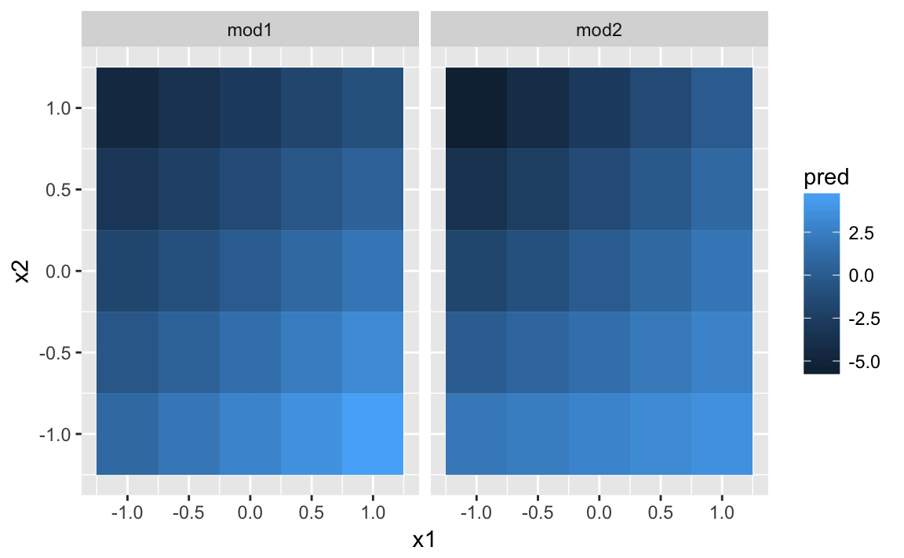


```r
ggplot(grid, aes(x1, pred, colour = x2, group = x2)) +
  geom_line() +
  facet_wrap(~ model)

ggplot(grid, aes(x2, pred, colour = x1, group = x1)) + 
  geom_line() +
  facet_wrap(~ model)
```

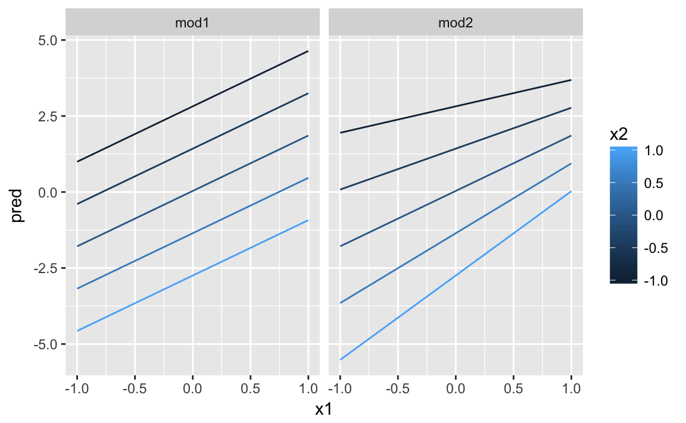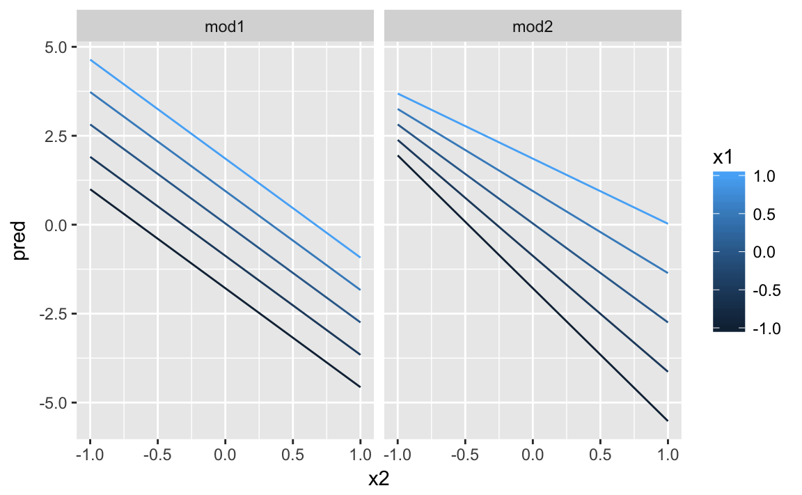

**TODO** We should visualize interactions with plotly


### Exercises


## Missing values

**TODO** Need to write a tidyverse compliant na.omit function.

## Other model families

**NOTE** It's worth mentioning these as more general models. Though they don't appear as much in social science work. I should try to explain that. I can think of several reasons

- preference for easy to explain models (though I think that's wrong--most people can't visualize high-dimensional space well, and interpret results marginally even though they are conditional)
- status-quo bias and path dependence combined with lack of knowledge of work outside the field and median lack of technical ability to understand or use these models.
- the most principled reason is that those modre complicated models really excel in prediction. If we take an agnostic approach to regression, as in the Angrist and Pischke books, then regression isn't being used to fit $f(y | x)$, its being used to fit $E(f(y | x))$, and more specifically to get some sort of average effect for a change in a specific variable.
