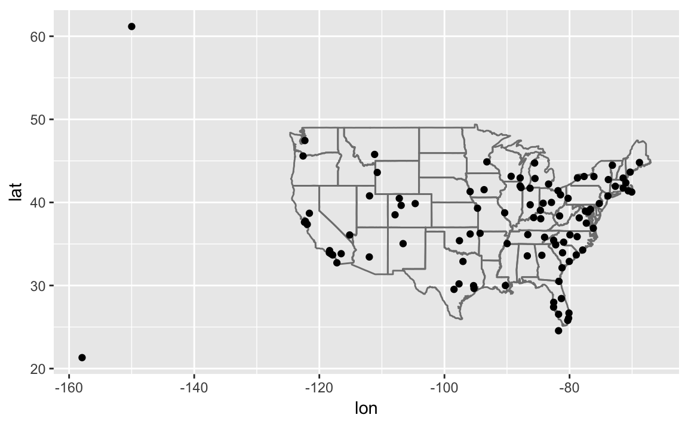

# Relational Data

## Prerequisites


```r
library("tidyverse")
library("nycflights13")
```


## nycflights13


### Exercises

1. Imagine you wanted to draw (approximately) the route each plane flies from its origin to its destination. What variables would you need? What tables would you need to combine?

- `flights` table: `origin` and `dest`
- `airports` table: longitude and latitude variables
- We would merge the `flights` with airports twice: once to get the location of the `origin` airport, and once to get the location of the `dest` airport.

2. I forgot to draw the relationship between weather and airports. What is the relationship and how should it appear in the diagram?

The variable `origin` in `weather` is matched with `faa` in `airports`.

3. weather only contains information for the origin (NYC) airports. If it contained weather records for all airports in the USA, what additional relation would it define with `flights`?

`year`, `month`, `day`, `hour`, `origin` in `weather` would be matched to `year`, `month`, `day`, `hour`, `dest` in `flight` (though it should use the arrival date-time values for `dest` if possible).

4. We know that some days of the year are “special”, and fewer people than usual fly on them. How might you represent that data as a data frame? What would be the primary keys of that table? How would it connect to the existing tables?

I would add a table of special dates.
The primary key would be date.
It would match to the `year`, `month`, `day` columns of `flights.

## Keys

1. Add a surrogate key to flights.

I add the column `flight_id` as a surrogate key. 
I sort the data prior to making the key, even though it is not strictly necessary, so the order of the rows has some meaning.

```r
flights %>% 
  arrange(year, month, day, sched_dep_time, carrier, flight) %>%
  mutate(flight_id = row_number()) %>%
  glimpse()
#> Observations: 336,776
#> Variables: 20
#> $ year           <int> 2013, 2013, 2013, 2013, 2013, 2013, 2013, 2013,...
#> $ month          <int> 1, 1, 1, 1, 1, 1, 1, 1, 1, 1, 1, 1, 1, 1, 1, 1,...
#> $ day            <int> 1, 1, 1, 1, 1, 1, 1, 1, 1, 1, 1, 1, 1, 1, 1, 1,...
#> $ dep_time       <int> 517, 533, 542, 544, 554, 559, 558, 559, 558, 55...
#> $ sched_dep_time <int> 515, 529, 540, 545, 558, 559, 600, 600, 600, 60...
#> $ dep_delay      <dbl> 2, 4, 2, -1, -4, 0, -2, -1, -2, -2, -3, NA, 1, ...
#> $ arr_time       <int> 830, 850, 923, 1004, 740, 702, 753, 941, 849, 8...
#> $ sched_arr_time <int> 819, 830, 850, 1022, 728, 706, 745, 910, 851, 8...
#> $ arr_delay      <dbl> 11, 20, 33, -18, 12, -4, 8, 31, -2, -3, -8, NA,...
#> $ carrier        <chr> "UA", "UA", "AA", "B6", "UA", "B6", "AA", "AA",...
#> $ flight         <int> 1545, 1714, 1141, 725, 1696, 1806, 301, 707, 49...
#> $ tailnum        <chr> "N14228", "N24211", "N619AA", "N804JB", "N39463...
#> $ origin         <chr> "EWR", "LGA", "JFK", "JFK", "EWR", "JFK", "LGA"...
#> $ dest           <chr> "IAH", "IAH", "MIA", "BQN", "ORD", "BOS", "ORD"...
#> $ air_time       <dbl> 227, 227, 160, 183, 150, 44, 138, 257, 149, 158...
#> $ distance       <dbl> 1400, 1416, 1089, 1576, 719, 187, 733, 1389, 10...
#> $ hour           <dbl> 5, 5, 5, 5, 5, 5, 6, 6, 6, 6, 6, 6, 6, 6, 6, 6,...
#> $ minute         <dbl> 15, 29, 40, 45, 58, 59, 0, 0, 0, 0, 0, 0, 0, 0,...
#> $ time_hour      <dttm> 2013-01-01 05:00:00, 2013-01-01 05:00:00, 2013...
#> $ flight_id      <int> 1, 2, 3, 4, 5, 6, 7, 8, 9, 10, 11, 12, 13, 14, ...
```


Identify the keys in the following datasets

1. `Lahman::Batting`
2. `babynames::babynames`
3. `nasaweather::atmos`
4. `fueleconomy::vehicles`
5. `ggplot2::diamonds`

(You might need to install some packages and read some documentation.)

The primary key for `Lahman::Batting` is `playerID`, `yearID`, `stint`. It is not simply `playerID`, `yearID` because players can have different stints in different leagues within the same year.

```r
Lahman::Batting %>%
  group_by(playerID, yearID, stint) %>%
  filter(n() > 1) %>%
  nrow()
#> [1] 0
```

The primary key for `babynames::babynames` is `year`, `sex`, `name`. It is no simply `year`, `name` since names can appear for both sexes with different counts.

```r
babynames::babynames %>%
  group_by(year, sex, name) %>%
  filter(n() > 1) %>%
  nrow()
#> [1] 0
```

The primary key for `nasaweather::atmos` is the location and time of the measurement: `lat`, `long`, `year`, `month`.

```r
nasaweather::atmos %>%
  group_by(lat, long, year, month) %>%
  filter(n() > 1) %>%
  nrow()
#> [1] 0
```

The column `id` (unique EPA identifier) is the primary key for `fueleconomy::vehicles`:

```r
fueleconomy::vehicles %>%
  group_by(id) %>%
  filter(n() > 1) %>%
  nrow()
#> [1] 0
```

There is no primary key for `ggplot2::diamonds`. Using all variables in the data frame, the number of distinct rows is less than the total number of rows, meaning no combination of variables uniquely identifies the observations.

```r
ggplot2::diamonds %>%
  distinct() %>% 
  nrow()
#> [1] 53794
nrow(ggplot2::diamonds)
#> [1] 53940
```


4. Draw a diagram illustrating the connections between the `Batting`, `Master`, and `Salaries` tables in the **Lahman** package. Draw another diagram that shows the relationship between `Master`, `Managers`, `AwardsManagers`.

- `Batting`
  - primary key: `playerID`, `yearID`, `stint`
  - foreign keys:
    - `playerID` -> `Master.playerID`
- `Master`
  - primary key: `playerID`
- `Salaries`
  - primary key: `yearID`, `teamID`, `playerID`
  - foreign keys:
    - `playerID` -> `Master.playerID`
- `Managers`:
  - primary key: `yearID`, `playerID`, `teamID`, `inseason`
  - foreign keys:
    - `playerID` -> `Master.teamID`
- `Managers`:
  - primary key: `awardID`, `yearID`
- `AwardsManagers`:
  - primary key: `playerID`, `awardID`, `yearID` (since there are ties and while `tie` distinguishes those awards it has `NA` values)
  - foreign keys:
    - `playerID` -> `Master.playerID`
    - `playerID`, `yearID`, `lgID` -> `Managers.playerID`, `yearID`, `lgID`

`lgID` and `teamID` appear in multiple tables, but should be primary keys for league and team tables.


3. How would you characterize the relationship between the Batting, Pitching, and Fielding tables?

## Mutating Joins


```r
flights2 <- flights %>%
  select(year:day, hour, origin, dest, tailnum, carrier)
flights2 %>%
  select(-origin, -dest) %>%
  left_join(airlines, by = "carrier")
#> # A tibble: 336,776 x 7
#>    year month   day  hour tailnum carrier name                  
#>   <int> <int> <int> <dbl> <chr>   <chr>   <chr>                 
#> 1  2013     1     1  5.00 N14228  UA      United Air Lines Inc. 
#> 2  2013     1     1  5.00 N24211  UA      United Air Lines Inc. 
#> 3  2013     1     1  5.00 N619AA  AA      American Airlines Inc.
#> 4  2013     1     1  5.00 N804JB  B6      JetBlue Airways       
#> 5  2013     1     1  6.00 N668DN  DL      Delta Air Lines Inc.  
#> 6  2013     1     1  5.00 N39463  UA      United Air Lines Inc. 
#> # ... with 3.368e+05 more rows
```

### Exercises

1. Compute the average delay by destination, then join on the `airports` data frame so you can show the spatial distribution of delays. Here’s an easy way to draw a map of the United States:


```r
airports %>%
  semi_join(flights, c("faa" = "dest")) %>%
  ggplot(aes(lon, lat)) +
    borders("state") +
    geom_point() +
    coord_quickmap()
```



(Don’t worry if you don’t understand what `semi_join()` does — you’ll learn about it next.)


```r
avg_dest_delays <-
  flights %>%
  group_by(dest) %>%
  # arrival delay NA's are cancelled flights
  summarise(delay = mean(arr_delay, na.rm = TRUE)) %>%
  inner_join(airports, by = c(dest = "faa"))

avg_dest_delays %>%
  ggplot(aes(lon, lat, colour = delay)) +
    borders("state") +
    geom_point() +
    coord_quickmap()
```


You might want to use the size or color of the points to display the average delay for each airport.

2. Add the location of the origin and destination (i.e. the `lat` and `lon`) to `flights`.


```r
flights %>%
  left_join(airports, by = c(dest = "faa")) %>%
  left_join(airports, by = c(origin = "faa")) %>%
  head()
#> # A tibble: 6 x 33
#>    year month   day dep_t… sche… dep_… arr_… sche… arr_… carr… flig… tail…
#>   <int> <int> <int>  <int> <int> <dbl> <int> <int> <dbl> <chr> <int> <chr>
#> 1  2013     1     1    517   515  2.00   830   819  11.0 UA     1545 N142…
#> 2  2013     1     1    533   529  4.00   850   830  20.0 UA     1714 N242…
#> 3  2013     1     1    542   540  2.00   923   850  33.0 AA     1141 N619…
#> 4  2013     1     1    544   545 -1.00  1004  1022 -18.0 B6      725 N804…
#> 5  2013     1     1    554   600 -6.00   812   837 -25.0 DL      461 N668…
#> 6  2013     1     1    554   558 -4.00   740   728  12.0 UA     1696 N394…
#> # ... with 21 more variables: origin <chr>, dest <chr>, air_time <dbl>,
#> #   distance <dbl>, hour <dbl>, minute <dbl>, time_hour <dttm>, name.x
#> #   <chr>, lat.x <dbl>, lon.x <dbl>, alt.x <int>, tz.x <dbl>, dst.x <chr>,
#> #   tzone.x <chr>, name.y <chr>, lat.y <dbl>, lon.y <dbl>, alt.y <int>,
#> #   tz.y <dbl>, dst.y <chr>, tzone.y <chr>
```


3. Is there a relationship between the age of a plane and its delays?

Surprisingly not. If anything (departure) delay seems to decrease slightly with age (perhaps because of selection):

```r
plane_ages <- 
  planes %>%
  mutate(age = 2013 - year) %>%
  select(tailnum, age)

flights %>%
  inner_join(plane_ages, by = "tailnum") %>%
  group_by(age) %>%
  filter(!is.na(dep_delay)) %>%
  summarise(delay = mean(dep_delay)) %>%
  ggplot(aes(x = age, y = delay)) +
  geom_point() +
  geom_line()
#> Warning: Removed 1 rows containing missing values (geom_point).
#> Warning: Removed 1 rows containing missing values (geom_path).
```


4. What weather conditions make it more likely to see a delay?

Almost any amount or precipitation is associated with a delay, though not as strong a trend after 0.02 in as one would expect

```r
flight_weather <-
  flights %>%
  inner_join(weather, by = c("origin" = "origin",
                            "year" = "year",
                            "month" = "month",
                            "day" = "day",
                            "hour" = "hour"))

flight_weather %>%
  group_by(precip) %>%
  summarise(delay = mean(dep_delay, na.rm = TRUE)) %>%
  ggplot(aes(x = precip, y = delay)) +
    geom_line() + geom_point()
```


5. What happened on June 13 2013? Display the spatial pattern of delays, and then use Google to cross-reference with the weather.

There was a large series of storms (derechos) in the southeastern US (see [June 12-13, 2013 derecho series](https://en.wikipedia.org/wiki/June_12%E2%80%9313,_2013_derecho_series))

The largest delays are in Tennessee (Nashville), the Southeast, and the Midwest, which were the locations of the derechos:

```r
library(viridis)
flights %>%
  filter(year == 2013, month == 6, day == 13) %>%
  group_by(dest) %>%
  summarise(delay = mean(arr_delay, na.rm = TRUE)) %>%
  inner_join(airports, by = c("dest" = "faa")) %>%
  ggplot(aes(y = lat, x = lon, size = delay, colour = delay)) +
  borders("state") +
  geom_point() +
  coord_quickmap() + 
  scale_color_viridis()
#> Warning: Removed 3 rows containing missing values (geom_point).
```


## Filtering Joins


- `semi_join`: keep all obs in `x` with match in `y`
- `anti_join`: drop all obs in `x` with a match in `y`

### Exercises

1. What does it mean for a flight to have a missing `tailnum`? What do the tail numbers that don’t have a matching record in planes have in common? (Hint: one variable explains ~90% of the problems.)

American Airlines (AA) and Envoy Airlines (MQ) don't report tail numbers.

```r
flights %>%
  anti_join(planes, by = "tailnum") %>%
  count(carrier, sort = TRUE)
#> # A tibble: 10 x 2
#>   carrier     n
#>   <chr>   <int>
#> 1 MQ      25397
#> 2 AA      22558
#> 3 UA       1693
#> 4 9E       1044
#> 5 B6        830
#> 6 US        699
#> # ... with 4 more rows
```

2. Filter flights to only show flights with planes that have flown at least 100 flights.


```r
planes_gt100 <- 
  filter(flights) %>%
  group_by(tailnum) %>%
  count() %>%
  filter(n > 100)

flights %>%
  semi_join(planes_gt100, by = "tailnum")
#> # A tibble: 229,202 x 19
#>    year month   day dep_t… sche… dep_… arr_… sche… arr_… carr… flig… tail…
#>   <int> <int> <int>  <int> <int> <dbl> <int> <int> <dbl> <chr> <int> <chr>
#> 1  2013     1     1    517   515  2.00   830   819  11.0 UA     1545 N142…
#> 2  2013     1     1    533   529  4.00   850   830  20.0 UA     1714 N242…
#> 3  2013     1     1    544   545 -1.00  1004  1022 -18.0 B6      725 N804…
#> 4  2013     1     1    554   558 -4.00   740   728  12.0 UA     1696 N394…
#> 5  2013     1     1    555   600 -5.00   913   854  19.0 B6      507 N516…
#> 6  2013     1     1    557   600 -3.00   709   723 -14.0 EV     5708 N829…
#> # ... with 2.292e+05 more rows, and 7 more variables: origin <chr>, dest
#> #   <chr>, air_time <dbl>, distance <dbl>, hour <dbl>, minute <dbl>,
#> #   time_hour <dttm>
```


3. Combine `fueleconomy::vehicles` and `fueleconomy::common` to find only the records for the most common models.

The table `fueleconomy::common` identifies vehicles by `make` and `model`:

```r
glimpse(fueleconomy::vehicles)
#> Observations: 33,442
#> Variables: 12
#> $ id    <int> 27550, 28426, 27549, 28425, 1032, 1033, 3347, 13309, 133...
#> $ make  <chr> "AM General", "AM General", "AM General", "AM General", ...
#> $ model <chr> "DJ Po Vehicle 2WD", "DJ Po Vehicle 2WD", "FJ8c Post Off...
#> $ year  <int> 1984, 1984, 1984, 1984, 1985, 1985, 1987, 1997, 1997, 19...
#> $ class <chr> "Special Purpose Vehicle 2WD", "Special Purpose Vehicle ...
#> $ trans <chr> "Automatic 3-spd", "Automatic 3-spd", "Automatic 3-spd",...
#> $ drive <chr> "2-Wheel Drive", "2-Wheel Drive", "2-Wheel Drive", "2-Wh...
#> $ cyl   <int> 4, 4, 6, 6, 4, 6, 6, 4, 4, 6, 4, 4, 6, 4, 4, 6, 5, 5, 6,...
#> $ displ <dbl> 2.5, 2.5, 4.2, 4.2, 2.5, 4.2, 3.8, 2.2, 2.2, 3.0, 2.3, 2...
#> $ fuel  <chr> "Regular", "Regular", "Regular", "Regular", "Regular", "...
#> $ hwy   <int> 17, 17, 13, 13, 17, 13, 21, 26, 28, 26, 27, 29, 26, 27, ...
#> $ cty   <int> 18, 18, 13, 13, 16, 13, 14, 20, 22, 18, 19, 21, 17, 20, ...
glimpse(fueleconomy::common)
#> Observations: 347
#> Variables: 4
#> $ make  <chr> "Acura", "Acura", "Acura", "Acura", "Acura", "Audi", "Au...
#> $ model <chr> "Integra", "Legend", "MDX 4WD", "NSX", "TSX", "A4", "A4 ...
#> $ n     <int> 42, 28, 12, 28, 27, 49, 49, 66, 20, 12, 46, 20, 30, 29, ...
#> $ years <int> 16, 10, 12, 14, 11, 19, 15, 19, 19, 12, 20, 15, 16, 16, ...
```


```r
fueleconomy::vehicles %>%
  semi_join(fueleconomy::common, by = c("make", "model"))
#> # A tibble: 14,531 x 12
#>      id make  model   year class trans drive   cyl displ fuel    hwy   cty
#>   <int> <chr> <chr>  <int> <chr> <chr> <chr> <int> <dbl> <chr> <int> <int>
#> 1  1833 Acura Integ…  1986 Subc… Auto… Fron…     4  1.60 Regu…    28    22
#> 2  1834 Acura Integ…  1986 Subc… Manu… Fron…     4  1.60 Regu…    28    23
#> 3  3037 Acura Integ…  1987 Subc… Auto… Fron…     4  1.60 Regu…    28    22
#> 4  3038 Acura Integ…  1987 Subc… Manu… Fron…     4  1.60 Regu…    28    23
#> 5  4183 Acura Integ…  1988 Subc… Auto… Fron…     4  1.60 Regu…    27    22
#> 6  4184 Acura Integ…  1988 Subc… Manu… Fron…     4  1.60 Regu…    28    23
#> # ... with 1.452e+04 more rows
```


3. Find the 48 hours (over the course of the whole year) that have the worst delays. Cross-reference it with the weather data. Can you see any patterns?


```r
flights %>%
  group_by(year, month, day) %>%
  summarise(total_24 = sum(dep_delay, na.rm = TRUE)+ sum(arr_delay, na.rm = TRUE)) %>%
  mutate(total_48 = total_24 + lag(total_24)) %>%
  arrange(desc(total_48))
#> # A tibble: 365 x 5
#> # Groups: year, month [12]
#>    year month   day total_24 total_48
#>   <int> <int> <int>    <dbl>    <dbl>
#> 1  2013     7    23    80641   175419
#> 2  2013     3     8   135264   167530
#> 3  2013     6    25    80434   166649
#> 4  2013     8     9    72866   165287
#> 5  2013     6    28    81389   157910
#> 6  2013     7    10    97120   157396
#> # ... with 359 more rows
```

4. What does `anti_join(flights, airports, by = c("dest" = "faa"))` tell you? What does `anti_join(airports, flights, by = c("faa" = "dest"))` tell you?

`anti_join(flights, airports, by = c("dest" = "faa"))` are flights that go to an airport that is not in FAA list of destinations, likely foreign airports.

`anti_join(airports, flights, by = c("faa" = "dest"))` are US airports that don't have a flight in the data, meaning that there were no flights to that airport **from** New York in 2013.


5. You might expect that there’s an implicit relationship between plane and airline, because each plane is flown by a single airline. Confirm or reject this hypothesis using the tools you’ve learned above.

There isn't such a relationship, since planes can be sold or airlines can merge.
However, that doesn't necessarily mean that such a plane will appear in this data. 
There are eight planes which 

```r
flights %>%
  group_by(tailnum, carrier) %>%
  count() %>%
  filter(n() > 1) %>%
  select(tailnum) %>%
  distinct()
#> Adding missing grouping variables: `carrier`
#> # A tibble: 0 x 2
#> # Groups: tailnum, carrier [0]
#> # ... with 2 variables: carrier <chr>, tailnum <chr>
```


## Set operations

No exercises
