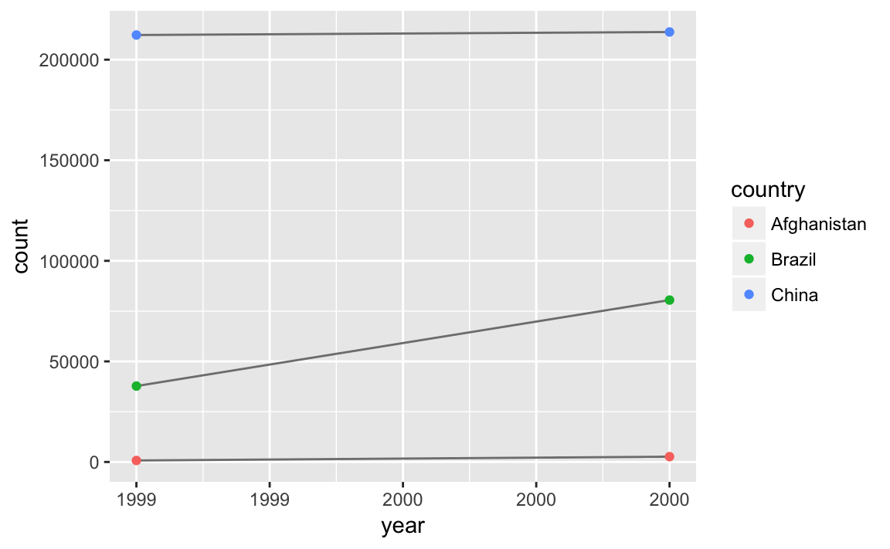
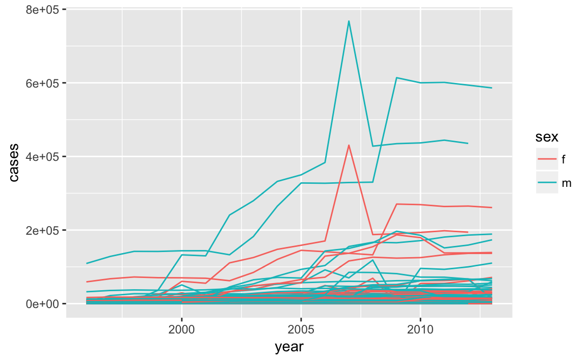

# Tidy Data


## Introduction

Functions used in this chapter

- `spread`
- `gather`
- `separate`
- `unite`
- `complete`
- `fill`


```r
library(tidyverse)
```

## Tidy Data

**NOTES**

- Add [Tidy Data](http://www.jstatsoft.org/v59/i10/paper) to reading
- Use COW war dataset as an example of non-tidy data
- Also WDI data for non-tidy data
- Replication datatsets are often non-tidy. Why?
- See this post by [Jeff Leek](http://simplystatistics.org/2016/02/17/non-tidy-data/)

The Rules

1. Each **variable** has its own **column**
2. Each **observation** muust have its own **row**
3. Each **value** must have its own **cell**

or even

1. Put each **dataset** in a **tibble**
2. Put each **variable** in a **column**

These seem obvious at first, so we need to see examples of not-following tidy data and what happens.

Some nuances:

The definitions of **variable**, **observation**, and **value** are not always clear. And how you store and arrange the data can depend on how you aim to use it. Generally, aim for storing the data in a tidy format that ensures minimal errors. When you model it, you can transform the data later.
See non-tidy data.

It is easier to work with variables in columns because of `mutate` and `summary` functions.
It will also work better with `tidyverse` functions: e.g. using `group_by` to group and summarize, or `facet_*` and aesthetics in **ggplot2**.

The tidy data ideas are adapted from the [database normalization](https://en.wikipedia.org/wiki/Database_normalization), but simplified and adapted to the general uses of practicing data scientists.


### Exercises

1. Using prose, describe how the variables and observations are organised in each of the sample tables.

In `table1` each row is a (country, year) with variables `cases` and `population`.

```r
table1
#> # A tibble: 6 × 4
#>       country  year  cases population
#>         <chr> <int>  <int>      <int>
#> 1 Afghanistan  1999    745   19987071
#> 2 Afghanistan  2000   2666   20595360
#> 3      Brazil  1999  37737  172006362
#> 4      Brazil  2000  80488  174504898
#> 5       China  1999 212258 1272915272
#> 6       China  2000 213766 1280428583
```

In `table2`, each row is country, year , variable ("cases", "population") combination, and there is a `count` variable with the numeric value of the variable.

```r
table2
#> # A tibble: 12 × 4
#>       country  year       type     count
#>         <chr> <int>      <chr>     <int>
#> 1 Afghanistan  1999      cases       745
#> 2 Afghanistan  1999 population  19987071
#> 3 Afghanistan  2000      cases      2666
#> 4 Afghanistan  2000 population  20595360
#> 5      Brazil  1999      cases     37737
#> 6      Brazil  1999 population 172006362
#> # ... with 6 more rows
```

In `table3`, each row is a (country, year) combination with the column `rate` having the rate of cases to population as a character string in the format `"cases/rate"`.

```r
table3
#> # A tibble: 6 × 3
#>       country  year              rate
#> *       <chr> <int>             <chr>
#> 1 Afghanistan  1999      745/19987071
#> 2 Afghanistan  2000     2666/20595360
#> 3      Brazil  1999   37737/172006362
#> 4      Brazil  2000   80488/174504898
#> 5       China  1999 212258/1272915272
#> 6       China  2000 213766/1280428583
```

Table 4 is split into two tables, one table for each variable: `table4a` is the table for cases, while `table4b` is the table for population. Within each table, each row is a country, each column is a year, and the cells are the value of the variable for the table.

```r
table4a
#> # A tibble: 3 × 3
#>       country `1999` `2000`
#> *       <chr>  <int>  <int>
#> 1 Afghanistan    745   2666
#> 2      Brazil  37737  80488
#> 3       China 212258 213766
```

```r
table4b
#> # A tibble: 3 × 3
#>       country     `1999`     `2000`
#> *       <chr>      <int>      <int>
#> 1 Afghanistan   19987071   20595360
#> 2      Brazil  172006362  174504898
#> 3       China 1272915272 1280428583
```

2. Compute the `rate` for `table2`, and `table4a` + `table4b`. You will need to perform four operations:

  1. Extract the number of TB cases per country per year.
  2. Extract the matching population per country per year.
  3. Divide cases by population, and multiply by 10000.
  4. Store back in the appropriate place.
  
Which representation is easiest to work with? Which is hardest? Why?

Without using the joins covered in Ch 12:

```r
tb2_cases <- filter(table2, type == "cases")[["count"]]
tb2_country <- filter(table2, type == "cases")[["country"]]
tb2_year <- filter(table2, type == "cases")[["year"]]
tb2_population <- filter(table2, type == "population")[["count"]]
table2_clean <- tibble(country = tb2_country,
       year = tb2_year,
       rate = tb2_cases / tb2_population)
table2_clean
#> # A tibble: 6 × 3
#>       country  year     rate
#>         <chr> <int>    <dbl>
#> 1 Afghanistan  1999 3.73e-05
#> 2 Afghanistan  2000 1.29e-04
#> 3      Brazil  1999 2.19e-04
#> 4      Brazil  2000 4.61e-04
#> 5       China  1999 1.67e-04
#> 6       China  2000 1.67e-04
```
Note, that this assumes that all observations are sorted so that each country, year will have the observation for cases followed by population.


```r
tibble(country = table4a[["country"]],
       `1999` = table4a[["1999"]] / table4b[["1999"]],
       `2000` = table4b[["2000"]] / table4b[["2000"]])
#> # A tibble: 3 × 3
#>       country   `1999` `2000`
#>         <chr>    <dbl>  <dbl>
#> 1 Afghanistan 3.73e-05      1
#> 2      Brazil 2.19e-04      1
#> 3       China 1.67e-04      1
```
or 

```r
tibble(country = rep(table4a[["country"]], 2),
       year = rep(c(1999, 2000), each = nrow(table4a)),
       `rate` = c(table4a[["1999"]] / table4b[["1999"]],
                  table4b[["2000"]] / table4b[["2000"]]))
#> # A tibble: 6 × 3
#>       country  year     rate
#>         <chr> <dbl>    <dbl>
#> 1 Afghanistan  1999 3.73e-05
#> 2      Brazil  1999 2.19e-04
#> 3       China  1999 1.67e-04
#> 4 Afghanistan  2000 1.00e+00
#> 5      Brazil  2000 1.00e+00
#> 6       China  2000 1.00e+00
```


3. Recreate the plot showing change in cases over time using `table2` instead of `table1`. What do you need to do first?

First, I needed to filter the tibble to only include those rows that represented the "cases" variable.

```r
table2 %>% 
  filter(type == "cases") %>%
  ggplot(aes(year, count)) + 
  geom_line(aes(group = country), colour = "grey50") + 
  geom_point(aes(colour = country))
```




## Spreading and Gathering


```r
tidy4a <- table4a %>%
  gather(`1999`, `2000`, key = "year", value = "cases")
tidy4b <- table4b %>%
  gather(`1999`, `2000`, key = "year", value = "cases")
left_join(tidy4a, tidy4b)
#> Joining, by = c("country", "year", "cases")
#> # A tibble: 6 × 3
#>       country  year  cases
#>         <chr> <chr>  <int>
#> 1 Afghanistan  1999    745
#> 2      Brazil  1999  37737
#> 3       China  1999 212258
#> 4 Afghanistan  2000   2666
#> 5      Brazil  2000  80488
#> 6       China  2000 213766
```


```r
spread(table2, key = type, value = count)
#> # A tibble: 6 × 4
#>       country  year  cases population
#> *       <chr> <int>  <int>      <int>
#> 1 Afghanistan  1999    745   19987071
#> 2 Afghanistan  2000   2666   20595360
#> 3      Brazil  1999  37737  172006362
#> 4      Brazil  2000  80488  174504898
#> 5       China  1999 212258 1272915272
#> 6       China  2000 213766 1280428583
```


### Exercises

1. Why are gather() and spread() not perfectly symmetrical?
   Carefully consider the following example:


```r
stocks <- tibble(
  year   = c(2015, 2015, 2016, 2016),
  half  = c(   1,    2,     1,    2),
  return = c(1.88, 0.59, 0.92, 0.17)
)
stocks %>% 
  spread(year, return) %>% 
  gather("year", "return", `2015`:`2016`)
#> # A tibble: 4 × 3
#>    half  year return
#>   <dbl> <chr>  <dbl>
#> 1     1  2015   1.88
#> 2     2  2015   0.59
#> 3     1  2016   0.92
#> 4     2  2016   0.17
```

The functions `spread` and `gather` are not perfectly symmetrical because column type information is not transferred between them. 
In the original table the column `year` was numeric, but after the spread-gather cyle it is character, because with `gather`, variable names are always converted to a character vector.

The `convert` argument tries to convert character vectors to the appropriate type. 
In the background this uses the `type.convert` function.

```r
stocks %>% 
  spread(year, return) %>% 
  gather("year", "return", `2015`:`2016`, convert = TRUE)
#> # A tibble: 4 × 3
#>    half  year return
#>   <dbl> <int>  <dbl>
#> 1     1  2015   1.88
#> 2     2  2015   0.59
#> 3     1  2016   0.92
#> 4     2  2016   0.17
```

2. Why does this code fail?


```r
table4a %>% 
  gather(1999, 2000, key = "year", value = "cases")
#> Error in eval(expr, envir, enclos): Position must be between 0 and n
```

The code fails because the column names `1999` and `2000` are not standard and thus needs to be quoted.
The tidyverse functions will interpret `1999` and `2000` without quotes as looking for the 1999th and 2000th column of the data frame.
This will work:

```r
table4a %>% 
  gather(`1999`, `2000`, key = "year", value = "cases")
#> # A tibble: 6 × 3
#>       country  year  cases
#>         <chr> <chr>  <int>
#> 1 Afghanistan  1999    745
#> 2      Brazil  1999  37737
#> 3       China  1999 212258
#> 4 Afghanistan  2000   2666
#> 5      Brazil  2000  80488
#> 6       China  2000 213766
```

3. Why does spreading this tibble fail? How could you add a new column to fix the problem?


```r
people <- tribble(
  ~name,             ~key,    ~value,
  #-----------------|--------|------
  "Phillip Woods",   "age",       45,
  "Phillip Woods",   "height",   186,
  "Phillip Woods",   "age",       50,
  "Jessica Cordero", "age",       37,
  "Jessica Cordero", "height",   156
)
glimpse(people)
#> Observations: 5
#> Variables: 3
#> $ name  <chr> "Phillip Woods", "Phillip Woods", "Phillip Woods", "Jess...
#> $ key   <chr> "age", "height", "age", "age", "height"
#> $ value <dbl> 45, 186, 50, 37, 156
```


```r
spread(people, key, value)
#> Error: Duplicate identifiers for rows (1, 3)
```

Spreading the data frame fails because there are two rows with "age" for "Phillip Woods".
We would need to add another column with an indicator for the number observation it is,


```r
people <- tribble(
  ~name,             ~key,    ~value, ~obs,
  #-----------------|--------|------|------
  "Phillip Woods",   "age",       45, 1,
  "Phillip Woods",   "height",   186, 1,
  "Phillip Woods",   "age",       50, 2,
  "Jessica Cordero", "age",       37, 1,
  "Jessica Cordero", "height",   156, 1
)
spread(people, key, value)
#> # A tibble: 3 × 4
#>              name   obs   age height
#> *           <chr> <dbl> <dbl>  <dbl>
#> 1 Jessica Cordero     1    37    156
#> 2   Phillip Woods     1    45    186
#> 3   Phillip Woods     2    50     NA
```


4. Tidy the simple tibble below. Do you need to spread or gather it? What are the variables?


```r
preg <- tribble(
  ~pregnant, ~male, ~female,
  "yes",     NA,    10,
  "no",      20,    12
)
```

You need to gather it. The variables are:

- pregnant: logical ("yes", "no")
- female: logical
- count: integer


```r
gather(preg, sex, count, male, female) %>%
  mutate(pregnant = pregnant == "yes",
         female = sex == "female") %>%
  select(-sex)
#> # A tibble: 4 × 3
#>   pregnant count female
#>      <lgl> <dbl>  <lgl>
#> 1     TRUE    NA  FALSE
#> 2    FALSE    20  FALSE
#> 3     TRUE    10   TRUE
#> 4    FALSE    12   TRUE
```
Converting `pregnant` and `female` from character vectors to logical was not necessary to tidy it, but it makes it easier to work with.

## Separating and Uniting


```r
table3 %>%
  separate(rate, into = c("cases", "population"), sep = "/", convert = TRUE) %>%
  separate(year, into = c("century", "year"), sep = 2)
#> # A tibble: 6 × 5
#>       country century  year  cases population
#> *       <chr>   <chr> <chr>  <int>      <int>
#> 1 Afghanistan      19    99    745   19987071
#> 2 Afghanistan      20    00   2666   20595360
#> 3      Brazil      19    99  37737  172006362
#> 4      Brazil      20    00  80488  174504898
#> 5       China      19    99 212258 1272915272
#> 6       China      20    00 213766 1280428583
```


```r
table5 %>%
  unite(new, century, year, sep = "")
#> # A tibble: 6 × 3
#>       country   new              rate
#> *       <chr> <chr>             <chr>
#> 1 Afghanistan  1999      745/19987071
#> 2 Afghanistan  2000     2666/20595360
#> 3      Brazil  1999   37737/172006362
#> 4      Brazil  2000   80488/174504898
#> 5       China  1999 212258/1272915272
#> 6       China  2000 213766/1280428583
```


### Exercises

1. What do the extra and fill arguments do in separate()? Experiment with the various 
options for the following two toy datasets.


```r
tibble(x = c("a,b,c", "d,e,f,g", "h,i,j")) %>% 
  separate(x, c("one", "two", "three"))
#> Warning: Too many values at 1 locations: 2
#> # A tibble: 3 × 3
#>     one   two three
#> * <chr> <chr> <chr>
#> 1     a     b     c
#> 2     d     e     f
#> 3     h     i     j

tibble(x = c("a,b,c", "d,e", "f,g,i")) %>% 
  separate(x, c("one", "two", "three"))
#> Warning: Too few values at 1 locations: 2
#> # A tibble: 3 × 3
#>     one   two three
#> * <chr> <chr> <chr>
#> 1     a     b     c
#> 2     d     e  <NA>
#> 3     f     g     i
```


```r
?separate
```

The `extra` argument tells `separate` what to do if there are too many pieces,
and the `fill` argument if there aren't enough.


```r
tibble(x = c("a,b,c", "d,e,f,g", "h,i,j")) %>% 
  separate(x, c("one", "two", "three"))
#> Warning: Too many values at 1 locations: 2
#> # A tibble: 3 × 3
#>     one   two three
#> * <chr> <chr> <chr>
#> 1     a     b     c
#> 2     d     e     f
#> 3     h     i     j
```
By default `separate` drops the extra values with a warning.

```r
tibble(x = c("a,b,c", "d,e,f,g", "h,i,j")) %>% 
  separate(x, c("one", "two", "three"), extra = "drop")
#> # A tibble: 3 × 3
#>     one   two three
#> * <chr> <chr> <chr>
#> 1     a     b     c
#> 2     d     e     f
#> 3     h     i     j
```
This produces the same result as above, dropping extra values, but without the warning.

```r
tibble(x = c("a,b,c", "d,e,f,g", "h,i,j")) %>% 
  separate(x, c("one", "two", "three"), extra = "merge")
#> # A tibble: 3 × 3
#>     one   two three
#> * <chr> <chr> <chr>
#> 1     a     b     c
#> 2     d     e   f,g
#> 3     h     i     j
```
In this, the extra values are not split, so "f,g" appears in column three.

In this, one of the entries for column, "d,e", has too few elements.
The default for `fill` is similar to `separate`; it fills with missing values but emits a warning. In this, row 2 of column "three", is `NA`.

```r
tibble(x = c("a,b,c", "d,e", "f,g,i")) %>% 
  separate(x, c("one", "two", "three"))
#> Warning: Too few values at 1 locations: 2
#> # A tibble: 3 × 3
#>     one   two three
#> * <chr> <chr> <chr>
#> 1     a     b     c
#> 2     d     e  <NA>
#> 3     f     g     i
```

Alternative options for `fill` are `"right"`, to fill with missing values from the right, but without a warning

```r
tibble(x = c("a,b,c", "d,e", "f,g,i")) %>% 
  separate(x, c("one", "two", "three"), fill = "right")
#> # A tibble: 3 × 3
#>     one   two three
#> * <chr> <chr> <chr>
#> 1     a     b     c
#> 2     d     e  <NA>
#> 3     f     g     i
```
The option `fill = "left"` also fills with missing values without a warning, but this time from the left side.
Now, column "one" of row 2 will be missing, and the other values in that row are shifted over.

```r
tibble(x = c("a,b,c", "d,e", "f,g,i")) %>% 
  separate(x, c("one", "two", "three"), fill = "left")
#> # A tibble: 3 × 3
#>     one   two three
#> * <chr> <chr> <chr>
#> 1     a     b     c
#> 2  <NA>     d     e
#> 3     f     g     i
```

2. Both `unite()` and `separate()` have a remove argument. What does it do? Why would you set it to `FALSE`?

You would set it to `FALSE` if you want to create a new variable, but keep the old one.

3. Compare and contrast `separate()` and `extract()`, Why are there three variations of separation (by position, by separator, and with groups), but only one unite?

The function `extract` uses a regular expression to find groups and split into columns.
In `unite` it is unambigous since it is many columns to one, and once the columns are specified, there is only one way to do it, the only choice is the `sep`.
In `separate`, it is one to many, and there are multiple ways to split the character string.


## Missing Values


### Exercises


1. Compare and contrast the `fill` arguments to `spread()` and `complete()`.


```r
?spread
```

```r
?complete
```

In `spread`, the fill argument explicitly sets the value to replace `NA`s.
In `complete`, the fill argument also sets a value to replace `NA`s but it is named list, allowing for different values for different variables.
Also, both cases replace both implicit and explicit missing values.

2. What does the direction argument to `fill()` do?

With `fill`, it determines whether `NA` values should be replaced by the previous non-missing value (`"down"`) or the next non-missing value (`"up"`).


## Case Study


```r
who1 <- who %>%
  gather(new_sp_m014:newrel_f65, key = "key", value = "cases", na.rm = TRUE)
glimpse(who1)
#> Observations: 76,046
#> Variables: 6
#> $ country <chr> "Afghanistan", "Afghanistan", "Afghanistan", "Afghanis...
#> $ iso2    <chr> "AF", "AF", "AF", "AF", "AF", "AF", "AF", "AF", "AF", ...
#> $ iso3    <chr> "AFG", "AFG", "AFG", "AFG", "AFG", "AFG", "AFG", "AFG"...
#> $ year    <int> 1997, 1998, 1999, 2000, 2001, 2002, 2003, 2004, 2005, ...
#> $ key     <chr> "new_sp_m014", "new_sp_m014", "new_sp_m014", "new_sp_m...
#> $ cases   <int> 0, 30, 8, 52, 129, 90, 127, 139, 151, 193, 186, 187, 2...
```


```r
who2 <- who1 %>%
 mutate(key = stringr::str_replace(key, "newrel", "new_rel"))
```


```r
who3 <- who2 %>%
  separate(key, c("new", "type", "sexage"), sep = "_")
who3
#> # A tibble: 76,046 × 8
#>       country  iso2  iso3  year   new  type sexage cases
#> *       <chr> <chr> <chr> <int> <chr> <chr>  <chr> <int>
#> 1 Afghanistan    AF   AFG  1997   new    sp   m014     0
#> 2 Afghanistan    AF   AFG  1998   new    sp   m014    30
#> 3 Afghanistan    AF   AFG  1999   new    sp   m014     8
#> 4 Afghanistan    AF   AFG  2000   new    sp   m014    52
#> 5 Afghanistan    AF   AFG  2001   new    sp   m014   129
#> 6 Afghanistan    AF   AFG  2002   new    sp   m014    90
#> # ... with 7.604e+04 more rows
```


```r
who3 %>%
  count(new)
#> # A tibble: 1 × 2
#>     new     n
#>   <chr> <int>
#> 1   new 76046
```


```r
who4 <- who3 %>%
  select(-new, -iso2, -iso3)
```


```r
who5 <- who4 %>%
  separate(sexage, c("sex", "age"), sep = 1)
who5
#> # A tibble: 76,046 × 6
#>       country  year  type   sex   age cases
#> *       <chr> <int> <chr> <chr> <chr> <int>
#> 1 Afghanistan  1997    sp     m   014     0
#> 2 Afghanistan  1998    sp     m   014    30
#> 3 Afghanistan  1999    sp     m   014     8
#> 4 Afghanistan  2000    sp     m   014    52
#> 5 Afghanistan  2001    sp     m   014   129
#> 6 Afghanistan  2002    sp     m   014    90
#> # ... with 7.604e+04 more rows
```


### Exercises

1. In this case study I set `na.rm = TRUE` just to make it easier to check that we had the correct values. Is this reasonable? Think about how missing values are represented in this dataset. Are there implicit missing values? What’s the difference between an `NA` and zero?

Perhaps? I would need to know more about the data generation process. 
There are zero's in the data, which means they may explicitly be indicating no cases.

```r
who1 %>%
  filter(cases == 0) %>%
  nrow()
#> [1] 11080
```

So it appears that either a country has all its values in a year as non-missing if the WHO collected data for that country, or all its values are non-missing. 
So it is okay to treat explicitly and implicitly missing values the same, and we don't lose any information by dropping them.

```r
gather(who, new_sp_m014:newrel_f65, key = "key", value = "cases") %>%
  group_by(country, year)  %>%
  mutate(missing = is.na(cases)) %>%
  select(country, year, missing) %>%
  distinct() %>%
  group_by(country, year) %>%
  filter(n() > 1)
#> Source: local data frame [0 x 2]
#> Groups: country, year [0]
#> 
#> # ... with 2 variables: country <chr>, year <int>
```


2. What happens if you neglect the `mutate()` step? (`mutate(key = stringr::str_replace(key, "newrel", "new_rel")`)

`separate` emits the warning "too few values", and if we check the 
rows for keys beginning with `"newrel_"`, we see that `sexage` is messing, 
and `type = m014`.


```r
who3a <- who1 %>%
  separate(key, c("new", "type", "sexage"), sep = "_")
#> Warning: Too few values at 2580 locations: 73467, 73468, 73469, 73470,
#> 73471, 73472, 73473, 73474, 73475, 73476, 73477, 73478, 73479, 73480,
#> 73481, 73482, 73483, 73484, 73485, 73486, ...

filter(who3a, new == "newrel") %>% head()
#> # A tibble: 6 × 8
#>       country  iso2  iso3  year    new  type sexage cases
#>         <chr> <chr> <chr> <int>  <chr> <chr>  <chr> <int>
#> 1 Afghanistan    AF   AFG  2013 newrel  m014   <NA>  1705
#> 2     Albania    AL   ALB  2013 newrel  m014   <NA>    14
#> 3     Algeria    DZ   DZA  2013 newrel  m014   <NA>    25
#> 4     Andorra    AD   AND  2013 newrel  m014   <NA>     0
#> 5      Angola    AO   AGO  2013 newrel  m014   <NA>   486
#> 6    Anguilla    AI   AIA  2013 newrel  m014   <NA>     0
```


3. I claimed that `iso2` and `iso3` were redundant with country. Confirm this claim.


```r
select(who3, country, iso2, iso3) %>%
  distinct() %>%
  group_by(country) %>%
  filter(n() > 1)
#> Source: local data frame [0 x 3]
#> Groups: country [0]
#> 
#> # ... with 3 variables: country <chr>, iso2 <chr>, iso3 <chr>
```


4. For each country, year, and sex compute the total number of cases of TB. Make an informative visualisation of the data.


```r
who5 %>%
  group_by(country, year, sex) %>%
  filter(year > 1995) %>%
  summarise(cases = sum(cases)) %>%
  unite(country_sex, country, sex, remove = FALSE) %>%
  ggplot(aes(x = year, y = cases, group = country_sex, colour = sex)) +
  geom_line()

  
```



A small multiples plot faceting by country is difficult given the number of countries.
Focusing on those countries with the largest changes or absolute magnitudes after providing the context above is another option.


## Non-Tidy Data

- Corpus and text data is often stored in sparse Matrices https://cran.r-project.org/web/packages/tm/tm.pdf
- Graphical data has its own format: http://igraph.org/r/doc/
