---
output: html_document
editor_options: 
  chunk_output_type: console
---
# Visualize

## Introduction 


```r
library("tidyverse")
```

No exercises.

## First Steps

### Exercise 1. {.exercise}

> Run `ggplot(data = mpg)` what do you see?


```r
ggplot(data = mpg)
```


An empty plot. The background of the plot is created by `ggplot()`, but nothing else is displayed.

### Exercise 2. {.exercise}

> How many rows are in `mtcars`? How many columns?

There are 32 rows and 11 columns in the the `mtcars` data frame.

```r
nrow(mtcars)
#> [1] 32
ncol(mtcars)
#> [1] 11
```
The number of rows and columns is also displayed by `glimpse()`:

```r
glimpse(mtcars)
#> Observations: 32
#> Variables: 11
#> $ mpg  <dbl> 21.0, 21.0, 22.8, 21.4, 18.7, 18.1, 14.3, 24.4, 22.8, 19....
#> $ cyl  <dbl> 6, 6, 4, 6, 8, 6, 8, 4, 4, 6, 6, 8, 8, 8, 8, 8, 8, 4, 4, ...
#> $ disp <dbl> 160.0, 160.0, 108.0, 258.0, 360.0, 225.0, 360.0, 146.7, 1...
#> $ hp   <dbl> 110, 110, 93, 110, 175, 105, 245, 62, 95, 123, 123, 180, ...
#> $ drat <dbl> 3.90, 3.90, 3.85, 3.08, 3.15, 2.76, 3.21, 3.69, 3.92, 3.9...
#> $ wt   <dbl> 2.62, 2.88, 2.32, 3.21, 3.44, 3.46, 3.57, 3.19, 3.15, 3.4...
#> $ qsec <dbl> 16.5, 17.0, 18.6, 19.4, 17.0, 20.2, 15.8, 20.0, 22.9, 18....
#> $ vs   <dbl> 0, 0, 1, 1, 0, 1, 0, 1, 1, 1, 1, 0, 0, 0, 0, 0, 0, 1, 1, ...
#> $ am   <dbl> 1, 1, 1, 0, 0, 0, 0, 0, 0, 0, 0, 0, 0, 0, 0, 0, 0, 1, 1, ...
#> $ gear <dbl> 4, 4, 4, 3, 3, 3, 3, 4, 4, 4, 4, 3, 3, 3, 3, 3, 3, 4, 4, ...
#> $ carb <dbl> 4, 4, 1, 1, 2, 1, 4, 2, 2, 4, 4, 3, 3, 3, 4, 4, 4, 1, 2, ...
```


### Exercise 3. {.exercise}

> What does the `drv` variable describe? Read the help for `?mpg` to find out.


```r
?mpg
```

The `drv` variable takes the following values

-------- ------------------
- `"f"`  front-wheel drive
- `"r"`  rear-wheel drive
- `"4"`  four-wheel drive
-------- ------------------

### Exercise 4. {.exercise}

> Make a scatter plot of `hwy` vs `cyl`


```r
ggplot(mpg, aes(x = hwy, y = cyl)) +
  geom_point()
```

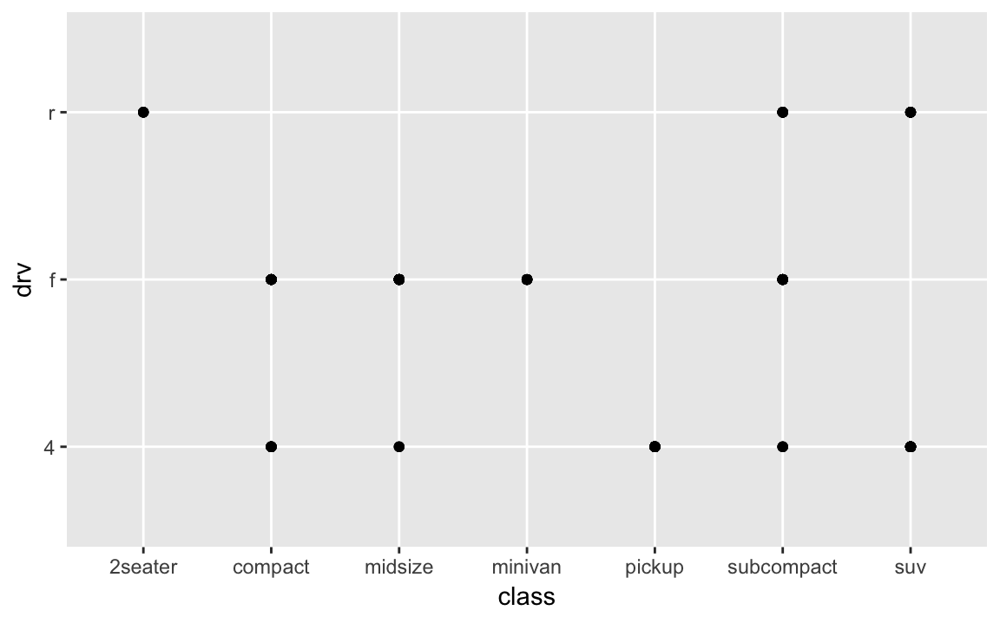

### Exercise 5. {.exercise}

<div class='question'>
What happens if you make a scatter plot of `class` vs `drv`. Why is the plot not useful?
</div>


```r
ggplot(mpg, aes(x = class, y = drv)) +
  geom_point()
```


A scatter plot is not a useful way to plot these variables, since both `drv` and `class` are factor variables taking a limited number of values.

```r
count(mpg, drv, class)
#> # A tibble: 12 x 3
#>   drv   class          n
#>   <chr> <chr>      <int>
#> 1 4     compact       12
#> 2 4     midsize        3
#> 3 4     pickup        33
#> 4 4     subcompact     4
#> 5 4     suv           51
#> 6 f     compact       35
#> # ... with 6 more rows
```
The scatter plot cannot show which are overlapping or not. 
Later chapters discuss means to deal with this, including alternative plots and jittering the points so they don't overlap.

## Aesthetic mappings

### Exercise 1. {.exercise}

::::question
What’s gone wrong with this code? Why are the points not blue?


```r
ggplot(data = mpg) + 
  geom_point(mapping = aes(x = displ, y = hwy, color = "blue"))
```

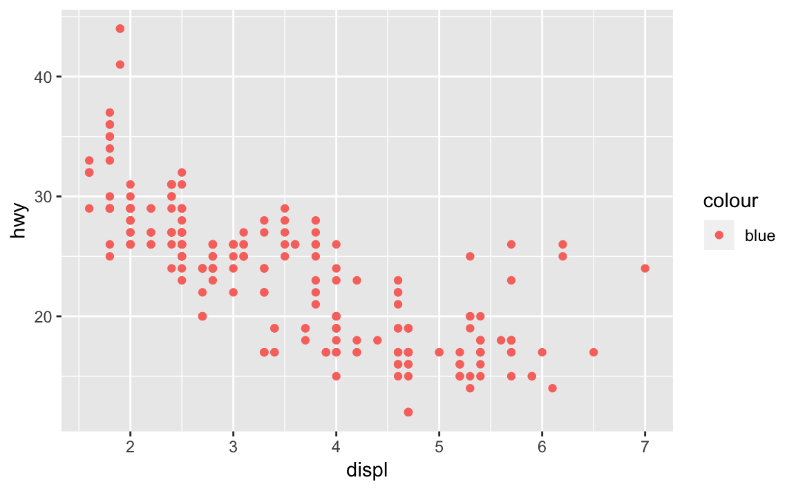
</div>

Since `color = "blue"` was included within the `mapping` argument, it was treated as an aesthetic (a mapping between a variable and a value).
The expression, `color="blue"`, treats `"blue"` as a variable with only one value: `"blue"`. If this is confusing, consider how `color = 1:234` or `color = 1` would be interpreted by `aes()`.

### Exercise 2. {.exercise}

<div class='question'>
Which variables in `mpg` are categorical? 
Which variables are continuous?
(Hint: type `?mpg` to read the documentation for the dataset).
How can you see this information when you run `mpg`?

</div>


```r
?mpg
```

When printing the data frame, this information is given at the top of each column within angled brackets. Categorical variables have a class of "character" (`<chr>`).

```r
mpg
#> # A tibble: 234 x 11
#>   manufacturer model displ  year   cyl trans drv     cty   hwy fl    class
#>   <chr>        <chr> <dbl> <int> <int> <chr> <chr> <int> <int> <chr> <chr>
#> 1 audi         a4     1.80  1999     4 auto… f        18    29 p     comp…
#> 2 audi         a4     1.80  1999     4 manu… f        21    29 p     comp…
#> 3 audi         a4     2.00  2008     4 manu… f        20    31 p     comp…
#> 4 audi         a4     2.00  2008     4 auto… f        21    30 p     comp…
#> 5 audi         a4     2.80  1999     6 auto… f        16    26 p     comp…
#> 6 audi         a4     2.80  1999     6 manu… f        18    26 p     comp…
#> # ... with 228 more rows
```
Alternatively, the `glimpse` function displays the type of each column:

```r
glimpse(mpg)
#> Observations: 234
#> Variables: 11
#> $ manufacturer <chr> "audi", "audi", "audi", "audi", "audi", "audi", "...
#> $ model        <chr> "a4", "a4", "a4", "a4", "a4", "a4", "a4", "a4 qua...
#> $ displ        <dbl> 1.8, 1.8, 2.0, 2.0, 2.8, 2.8, 3.1, 1.8, 1.8, 2.0,...
#> $ year         <int> 1999, 1999, 2008, 2008, 1999, 1999, 2008, 1999, 1...
#> $ cyl          <int> 4, 4, 4, 4, 6, 6, 6, 4, 4, 4, 4, 6, 6, 6, 6, 6, 6...
#> $ trans        <chr> "auto(l5)", "manual(m5)", "manual(m6)", "auto(av)...
#> $ drv          <chr> "f", "f", "f", "f", "f", "f", "f", "4", "4", "4",...
#> $ cty          <int> 18, 21, 20, 21, 16, 18, 18, 18, 16, 20, 19, 15, 1...
#> $ hwy          <int> 29, 29, 31, 30, 26, 26, 27, 26, 25, 28, 27, 25, 2...
#> $ fl           <chr> "p", "p", "p", "p", "p", "p", "p", "p", "p", "p",...
#> $ class        <chr> "compact", "compact", "compact", "compact", "comp...
```


### Exercise 3. {.exercise}

> Map a continuous variable to color, size, and shape. 
> How do these aesthetics behave differently for categorical vs. continuous variables?

The variable `cty`, city highway miles per gallon, is a continuous variable:

```r
ggplot(mpg, aes(x = displ, y = hwy, color = cty)) +
  geom_point()
```

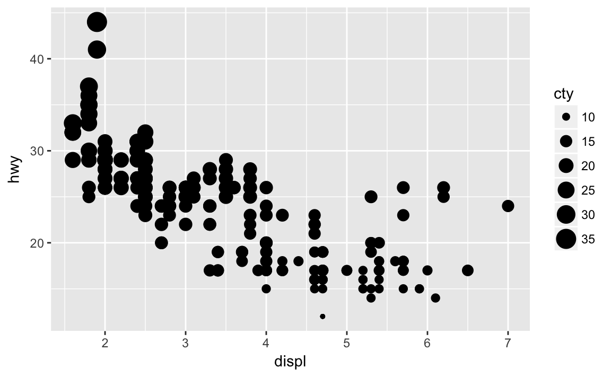

Instead of using discrete colors, the continuous variable uses a scale that varies from a light to dark blue color.


```r
ggplot(mpg, aes(x = displ, y = hwy, size = cty)) +
  geom_point()
```

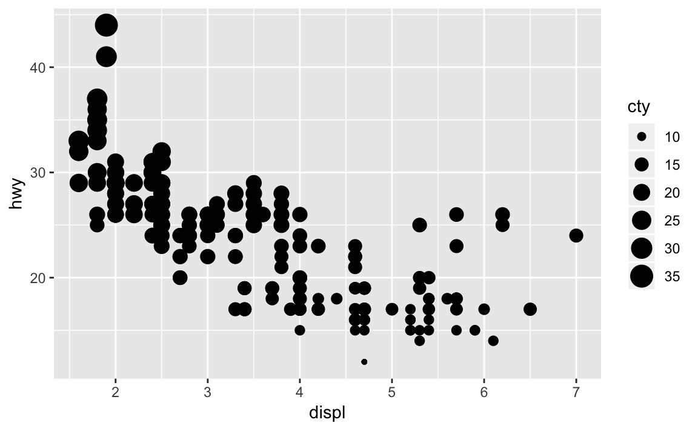

When mapped to size, the sizes of the points vary continuously with respect to the size (although the legend shows a few representative values)


```r
ggplot(mpg, aes(x = displ, y = hwy, shape = cty)) +
  geom_point()
#> Error: A continuous variable can not be mapped to shape
```

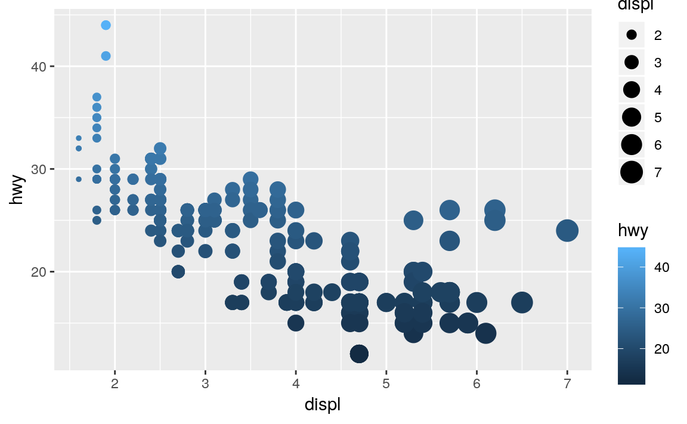

When a continuous value is mapped to shape, it gives an error.
Though we could split a continuous variable into discrete categories and use a shape aesthetic, this would conceptually not make sense.
A continuous numeric variable is ordered, but shapes have no natural order.
It is clear that smaller points correspond to smaller values, or once the color scale is given, which colors correspond to larger or smaller values. But it is not clear whether a square is greater or less than a circle.


### Exercise 4. {.exercise}

> What happens if you map the same variable to multiple aesthetics?


```r
ggplot(mpg, aes(x = displ, y = hwy, color = hwy, size = displ)) +
  geom_point()
```

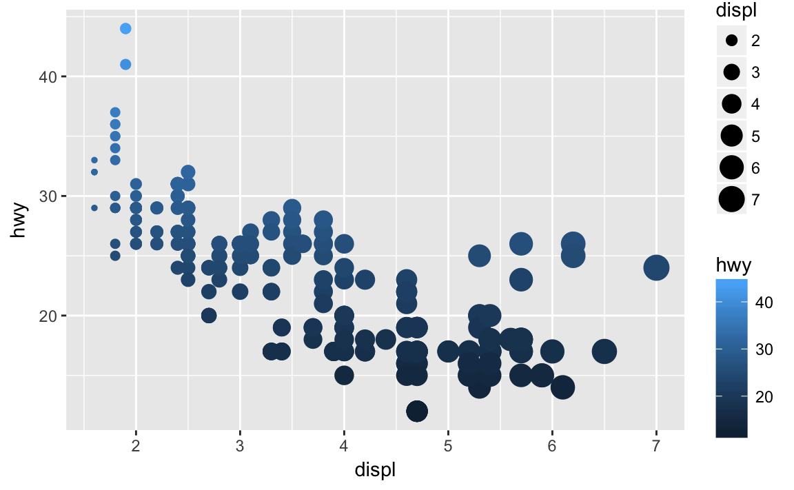

In the above plot, `hwy` is mapped to both location on the y-axis and color, and `displ` is mapped to both location on the x-axis and size.
The code works and produces a plot, even if it is a bad one. 
Mapping a single variable to multiple aesthetics is redundant. 
Because it is redundant information, in most cases avoid mapping a single variable to multiple aesthetics.

### Exercise 5. {.exercise}

> What does the stroke aesthetic do? What shapes does it work with? (Hint: use `?geom_point`)

The following example is given in `?geom_point`:

```r
ggplot(mtcars, aes(wt, mpg)) +
  geom_point(shape = 21, colour = "black", fill = "white", size = 5, stroke = 5)
```

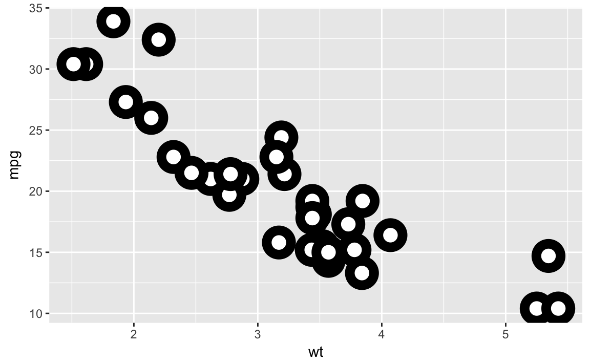

Stroke changes the color of the border for shapes (22-24).

### Exercise 6. {.exercise}

> What happens if you map an aesthetic to something other than a variable name, like `aes(colour = displ < 5)`?


```r
ggplot(mpg, aes(x = displ, y = hwy, colour = displ < 5)) + 
  geom_point()
```

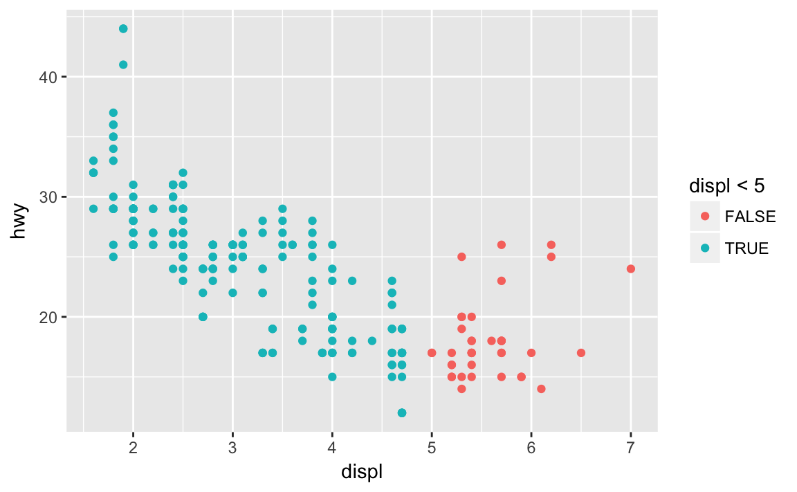

Aesthetics can also be mapped to expressions (code like `displ < 5`). 
It will create a temporary variable which takes values from  the result of the expression.
In this case, it is logical variable which is `TRUE` or `FALSE`.
This also explains exercise 1, `color = "blue"` created a categorical variable that only had one category: "blue".

## Common problems

No exercises

## Facets

### Exercise 1. {.exercise}

> What happens if you facet on a continuous variable?

Let's see.

```r
ggplot(mpg, aes(x = displ, y = hwy)) +
  geom_point() + 
  facet_grid(. ~ cty)
```

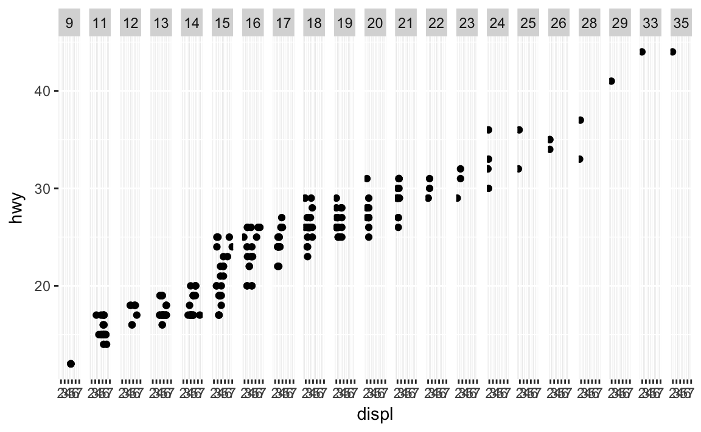

It converts the continuous variable to a factor and creates facets for **all** unique values of it.

### Exercise 2. {.exercise}

> What do the empty cells in plot with `facet_grid(drv ~ cyl)` mean? How do they relate to this plot?

They are cells in which there are no values of the combination of `drv` and `cyl`. 


```r
ggplot(data = mpg) + 
  geom_point(mapping = aes(x = drv, y = cyl))
```

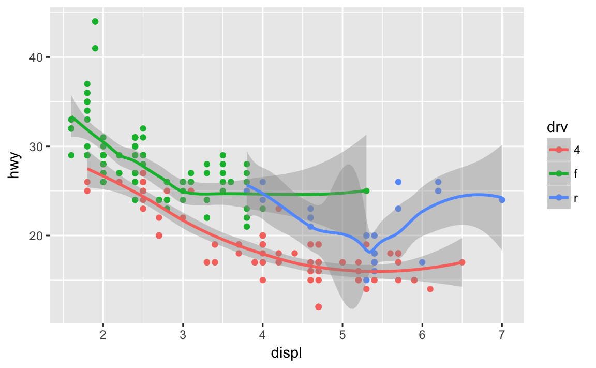

The locations in the above plot without points are the same cells in `facet_grid(drv ~ cyl)` that have no points.

### Exercise 3. {.exercise}

> What plots does the following code make? What does `.` do?

The symbol `.` ignores that dimension for faceting.

This plot facets by values of `drv` on the y-axis:

```r
ggplot(data = mpg) + 
  geom_point(mapping = aes(x = displ, y = hwy)) +
  facet_grid(drv ~ .)
```

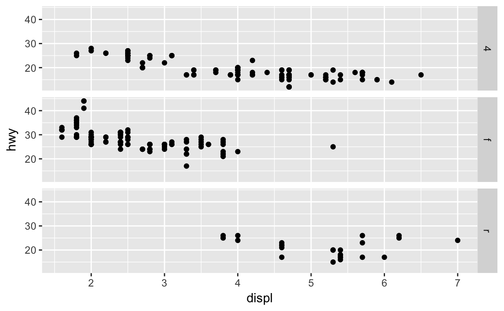
This plot facets by values of `cyl` on the x-axis:

```r
ggplot(data = mpg) + 
  geom_point(mapping = aes(x = displ, y = hwy)) +
  facet_grid(. ~ cyl)
```

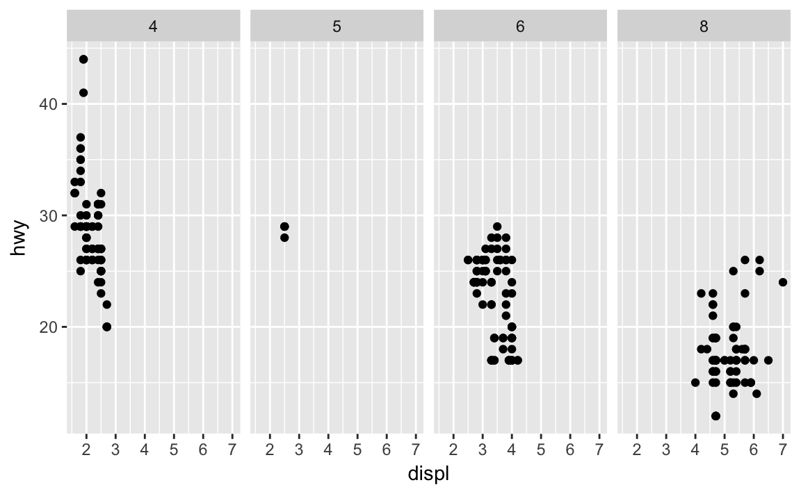

### Exercise 5. {.exercise}

> Read `?facet_wrap`. What does `nrow` do? What does `ncol` do? What other options control the layout of the individual panels? Why doesn’t `facet_grid()` have `nrow` and `ncol` variables?

The arguments `nrow` (`ncol`) determines the number of rows (columns) to use when laying out the facets. 
It is necessary since `facet_wrap` only facets on one variable. 
These arguments are unnecessary for `facet_grid` since the number of rows and columns are determined by the number of unique values of the variables specified.

### Exercise 6. {.exercise}

> When using `facet_grid()` you should usually put the variable with more unique levels in the columns. Why?

You should put the variable with more unique levels in the columns if the plot is laid out landscape. 
It is easier to compare relative levels of y by scanning horizontally, so it may be easier to visually compare these levels. *I'm actually not sure about the correct answer to this*.

## Geometric Objects

### Exercise 1. {.exercise}

> What geom would you use to draw a line chart? A boxplot? A histogram? An area chart?

- line chart: `geom_line`
- boxplot: `geom_boxplot`
- histogram: `geom_hist`

### Exercise 2. {.exercise}

> Run this code in your head and predict what the output will look like. Then, run the code in R and check your predictions.


```r
ggplot(data = mpg, mapping = aes(x = displ, y = hwy, color = drv)) + 
  geom_point() + 
  geom_smooth(se = FALSE)
```

This will produce a scatter plot with `displ` on the x-axis, `hwy` on the y-axis.
The points will be colored by `drv`.
There will be a smooth line, without standard errors, fit through each `drv` group.


```r
ggplot(data = mpg, mapping = aes(x = displ, y = hwy, color = drv)) + 
  geom_point() + 
  geom_smooth(se = FALSE)
#> `geom_smooth()` using method = 'loess'
```


### Exercise 3. {.exercise}

> What does `show.legend = FALSE` do? What happens if you remove it?
> Why do you think I used it earlier in the chapter?

Show legend hides the legend box. In this code, without show legend, there is a legend.

```r
ggplot(data = mpg) +
  geom_smooth(
    mapping = aes(x = displ, y = hwy, color = drv),
  )
#> `geom_smooth()` using method = 'loess'
```

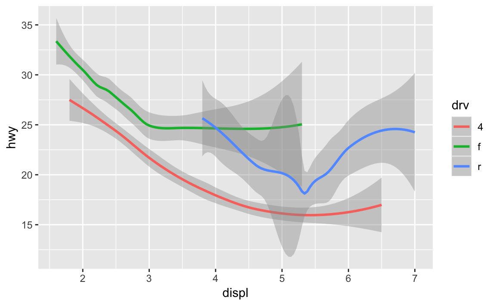
But there is no legend in this code:

```r
ggplot(data = mpg) +
  geom_smooth(
    mapping = aes(x = displ, y = hwy, color = drv),
    show.legend = FALSE
  )
#> `geom_smooth()` using method = 'loess'
```


In the example earlier in the chapter,

```r
ggplot(data = mpg) +
  geom_smooth(mapping = aes(x = displ, y = hwy))
#> `geom_smooth()` using method = 'loess'
              
ggplot(data = mpg) +
  geom_smooth(mapping = aes(x = displ, y = hwy, group = drv))
#> `geom_smooth()` using method = 'loess'
    
ggplot(data = mpg) +
  geom_smooth(
    mapping = aes(x = displ, y = hwy, color = drv),
    show.legend = FALSE
  )
#> `geom_smooth()` using method = 'loess'
```

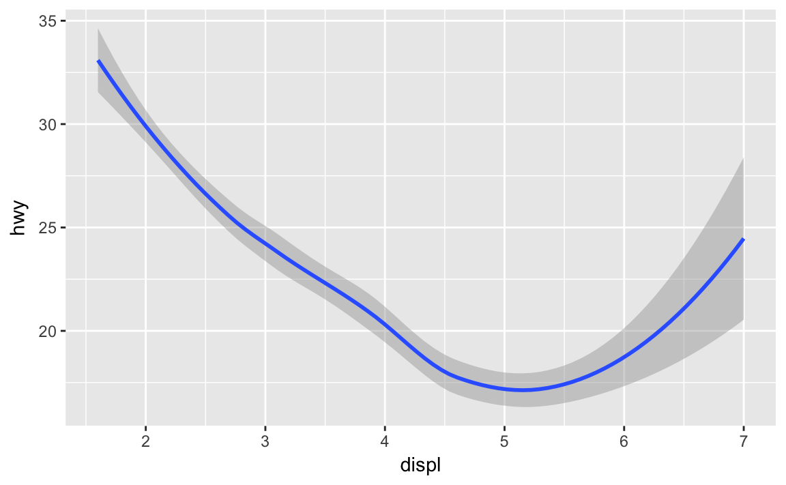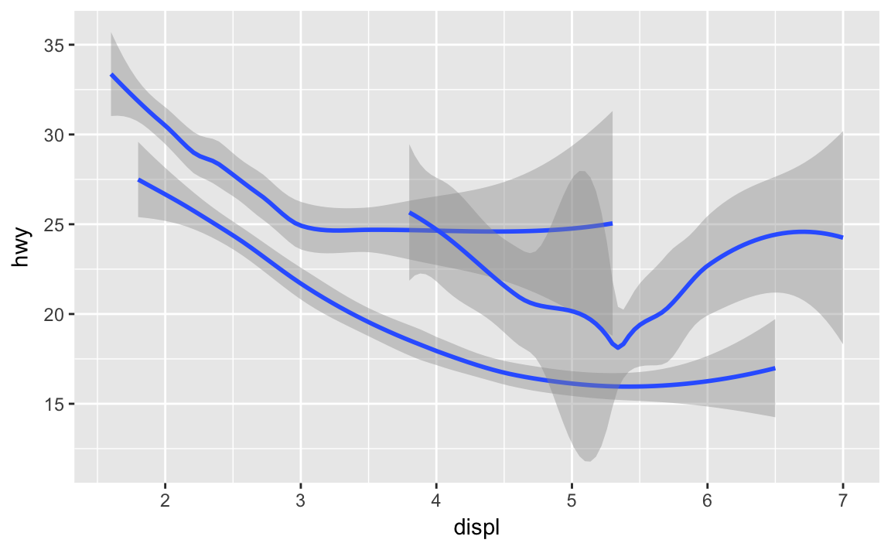
the legend is suppressed because there are three plots, and adding a legend that only appears in the last one would make the presentation asymmetric.
Additionally, the purpose of this plot is to illustrate the difference between not grouping, using a `group` aesthetic, and using a `color` aesthetic (with implicit grouping). 
In that example, the legend isn't necessary since looking up the values associated with each color isn't necessary to make that point.


### Exercise 4. {.exercise}

> What does the `se` argument to `geom_smooth()` do?

It adds standard error bands to the lines.


```r
ggplot(data = mpg, mapping = aes(x = displ, y = hwy, color = drv)) + 
  geom_point() + 
  geom_smooth(se = TRUE)
#> `geom_smooth()` using method = 'loess'
```

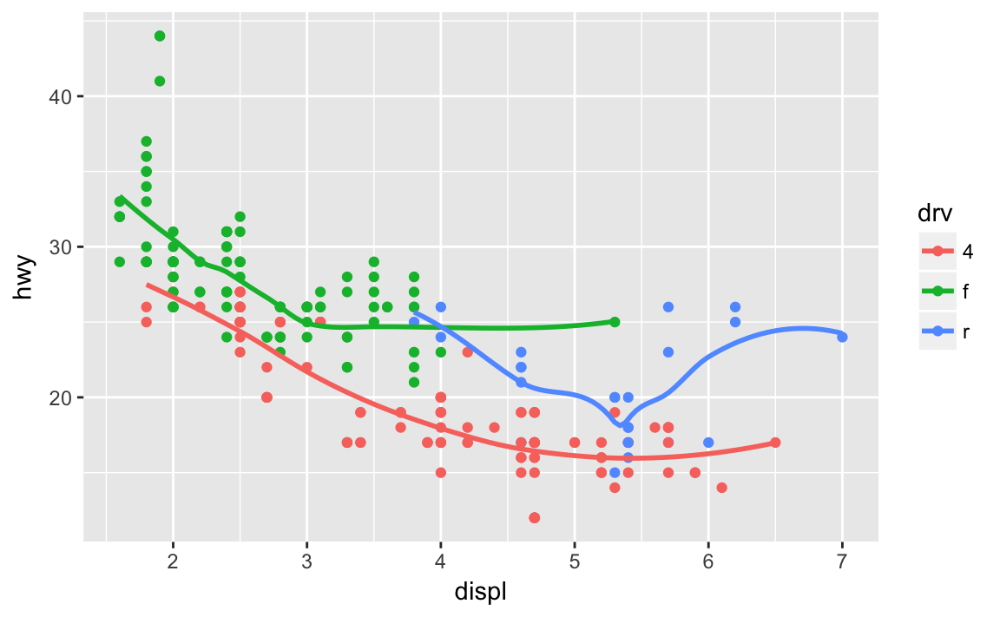

By default `se = TRUE`:


```r
ggplot(data = mpg, mapping = aes(x = displ, y = hwy, color = drv)) + 
  geom_point() + 
  geom_smooth()
#> `geom_smooth()` using method = 'loess'
```


### Exercise 5. {.exercise}

> Will these two graphs look different? Why/why not?

No. Because both `geom_point` and `geom_smooth` use the same data and mappings. They will inherit those options from the `ggplot` object, and thus don't need to specified again (or twice).


```r
ggplot(data = mpg, mapping = aes(x = displ, y = hwy)) + 
  geom_point() + 
  geom_smooth()
#> `geom_smooth()` using method = 'loess'
```

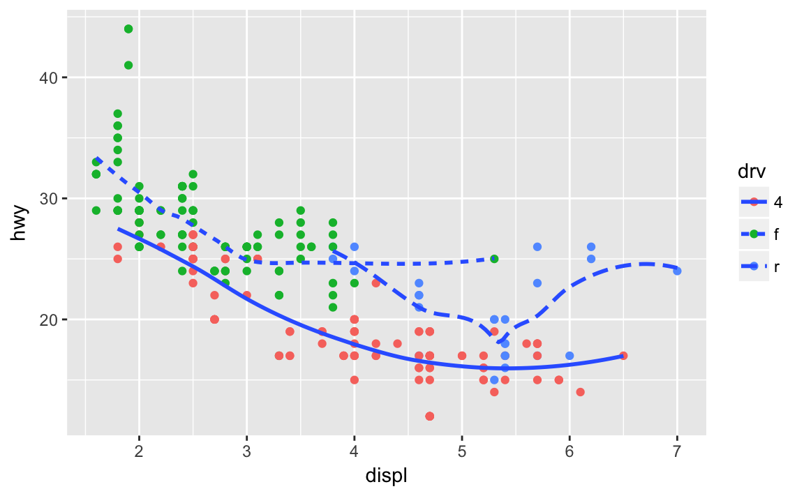


```r
ggplot() + 
  geom_point(data = mpg, mapping = aes(x = displ, y = hwy)) + 
  geom_smooth(data = mpg, mapping = aes(x = displ, y = hwy))
#> `geom_smooth()` using method = 'loess'
```


### Exercise 6. {.exercise}

> Recreate the R code necessary to generate the following graphs.


```r
ggplot(mpg, aes(x = displ, y = hwy)) +
  geom_point() +
  geom_smooth(se = FALSE)
#> `geom_smooth()` using method = 'loess'
```

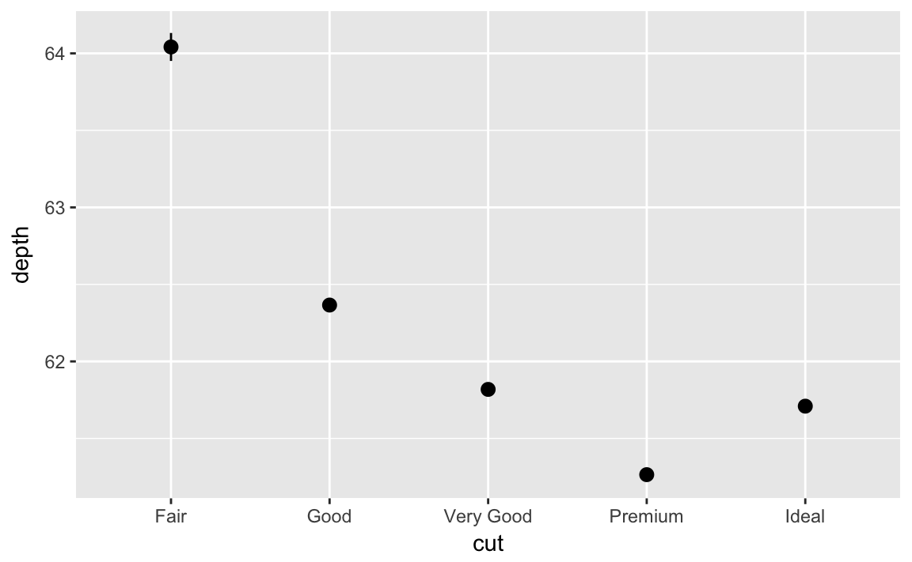


```r
ggplot(mpg, aes(x = displ, y = hwy)) +
  geom_point() +
  geom_smooth(mapping = aes(group = drv), se = FALSE)
#> `geom_smooth()` using method = 'loess'
```

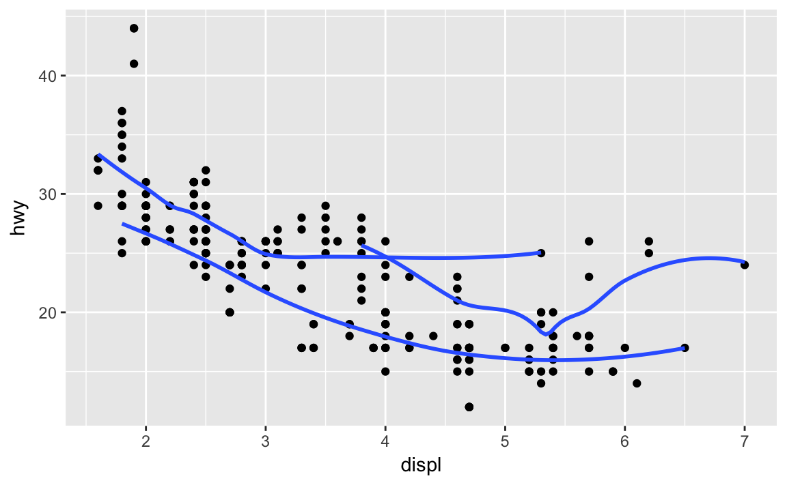


```r
ggplot(mpg, aes(x = displ, y = hwy, colour = drv)) +
  geom_point() +
  geom_smooth(se = FALSE)
#> `geom_smooth()` using method = 'loess'
```


```r
ggplot(mpg, aes(x = displ, y = hwy)) +
  geom_point(mapping = aes(colour = drv)) +
  geom_smooth(se = FALSE)
#> `geom_smooth()` using method = 'loess'
```

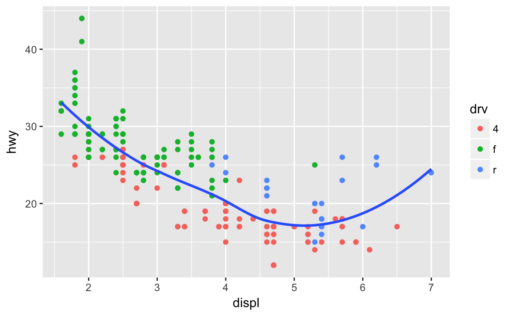


```r
ggplot(mpg, aes(x = displ, y = hwy)) +
  geom_point(aes(colour = drv)) +
  geom_smooth(aes(linetype = drv), se = FALSE)
#> `geom_smooth()` using method = 'loess'
```


```r
ggplot(mpg, aes(x = displ, y = hwy, fill = drv)) +
  geom_point(color = "white", shape = 21)
```

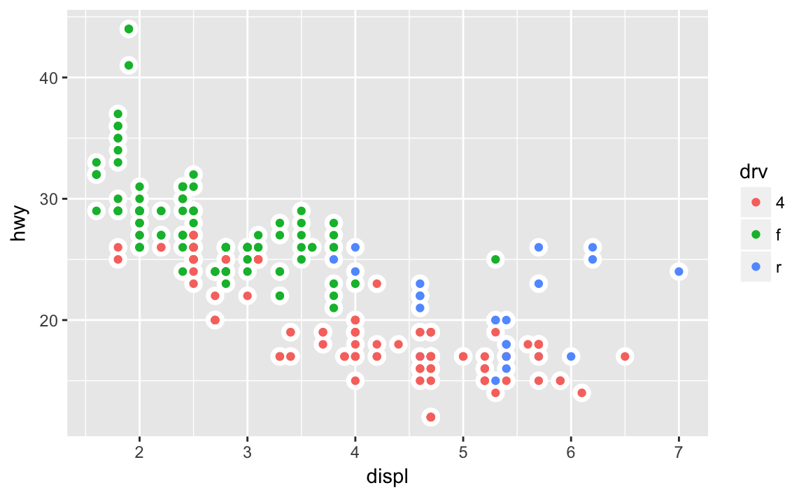


## Statistical Transformations

### Exercise 1. {.exercise}

> What is the default geom associated with `stat_summary()`? How could you rewrite the previous plot to use that geom function instead of the stat function?

The default geom for [`stat_summary`](http://docs.ggplot2.org/current/stat_summary.html) is `geom_pointrange` (see the `stat`) argument.

But, the default `stat` for [`geom_pointrange`](http://docs.ggplot2.org/current/geom_linerange.html) is `identity`, so use `geom_pointrange(stat = "summary")`. 

```r
ggplot(data = diamonds) + 
  geom_pointrange(
    mapping = aes(x = cut, y = depth),
    stat = "summary",
  )
#> No summary function supplied, defaulting to `mean_se()
```


The default message says that `stat_summary` uses the `mean` and `sd` to calculate the point, and range of the line. So lets use the previous values of `fun.ymin`, `fun.ymax`, and `fun.y`:

```r
ggplot(data = diamonds) + 
  geom_pointrange(
    mapping = aes(x = cut, y = depth),
    stat = "summary",
    fun.ymin = min,
    fun.ymax = max,
    fun.y = median
  )
```


### Exercise 2. {.exercise}

> What does `geom_col()` do? How is it different to `geom_bar()`?

`geom_col` differs from `geom_bar` in its default stat. `geom_col` has uses the `identity` stat. So it expects that a variable already exists for the height of the bars. 
`geom_bar` uses the `count` stat, and so will count observations in groups in order to generate the variable to use for the height of the bars.


### Exercise 3. {.exercise}

> Most geoms and stats come in pairs that are almost always used in concert. 
> Read through the documentation and make a list of all the pairs. 
> What do they have in common?

See the [ggplot2 documentation](http://docs.ggplot2.org/current/)

### Exercise 4. {.exercise}

> What variables does `stat_smooth()` compute? What parameters control its behavior?

`stat_smooth` calculates

- `y`: predicted value
- `ymin`: lower value of the confidence interval
- `ymax`: upper value of the confidence interval
- `se`: standard error

There's parameters such as `method` which determines which method is used to calculate the predictions and confidence interval, and some other arguments that are passed to that.

### Exercise 5. {.exercise}

> In our proportion bar chart, we need to set `group = 1` Why? 
> In other words what is the problem with these two graphs?

If `group` is not set to 1, then all the bars have `prop == 1`. 
The function `geom_bar` assumes that the groups are equal to the `x` values, since the stat computes the counts within the group. 


```r
ggplot(data = diamonds) + 
  geom_bar(mapping = aes(x = cut, y = ..prop..))
```

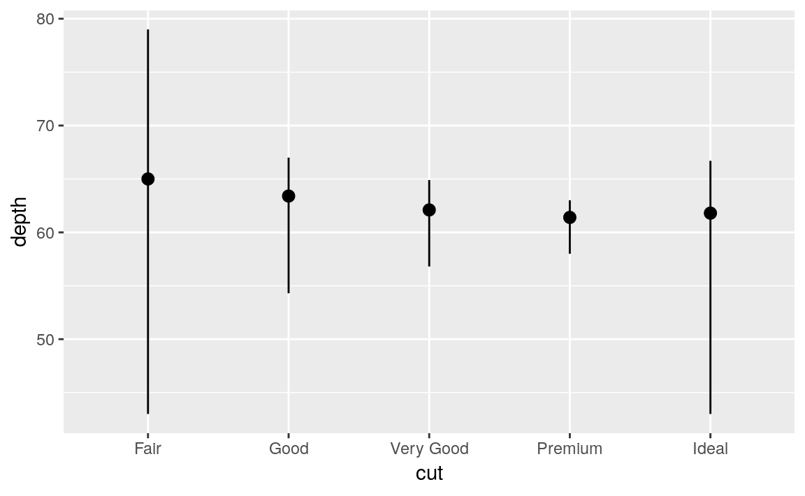

The problem with these two plots is that the proportions are calculated within the groups.

```r
ggplot(data = diamonds) + 
  geom_bar(mapping = aes(x = cut, y = ..prop..))

ggplot(data = diamonds) + 
  geom_bar(mapping = aes(x = cut, fill = color, y = ..prop..))
```

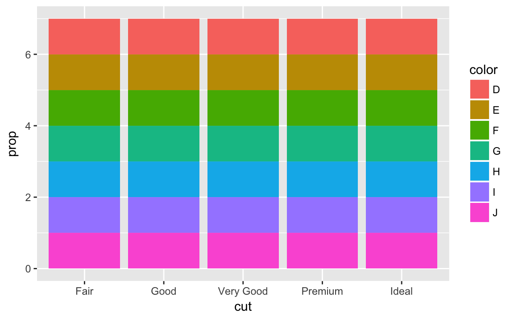

This is more likely what was intended:

```r
ggplot(data = diamonds) + 
  geom_bar(mapping = aes(x = cut, y = ..prop.., group = 1))

ggplot(data = diamonds) + 
  geom_bar(mapping = aes(x = cut, fill = color, y = ..prop.., group = color))
```

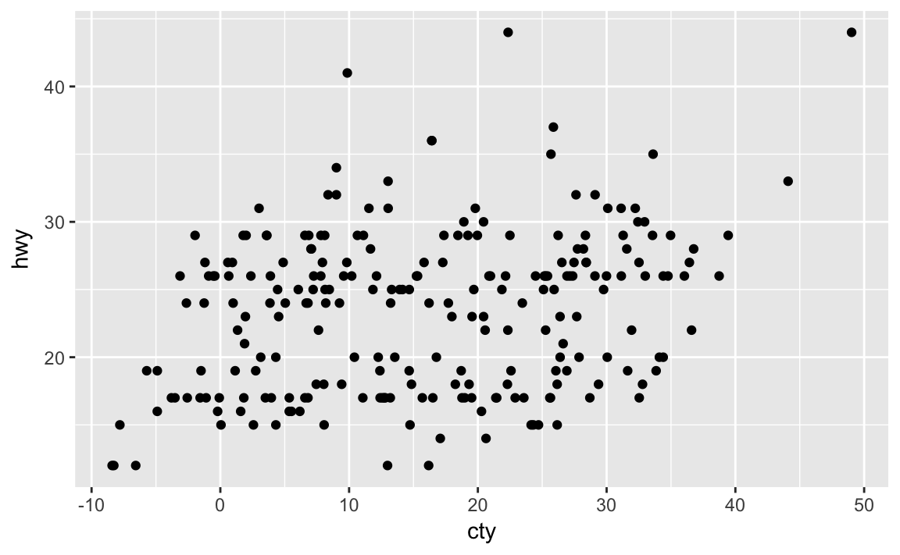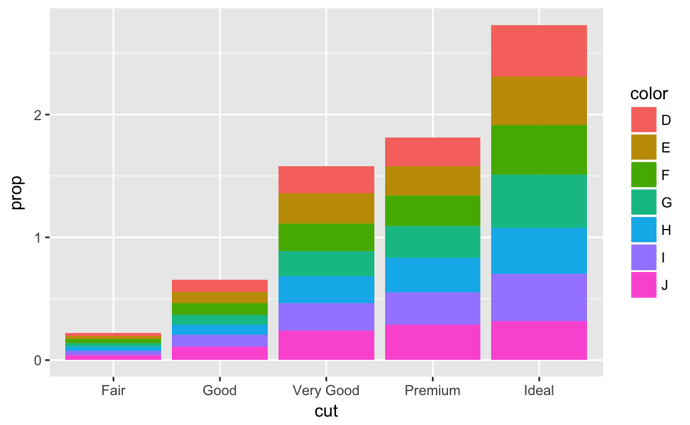

## Position Adjustments

### Exercise 1. {.exercise}

> What is the problem with this plot? 
> How could you improve it?

There is overplotting because there are multiple observations for each combination of `cty` and `hwy`.

```r
ggplot(data = mpg, mapping = aes(x = cty, y = hwy)) + 
  geom_point()
```

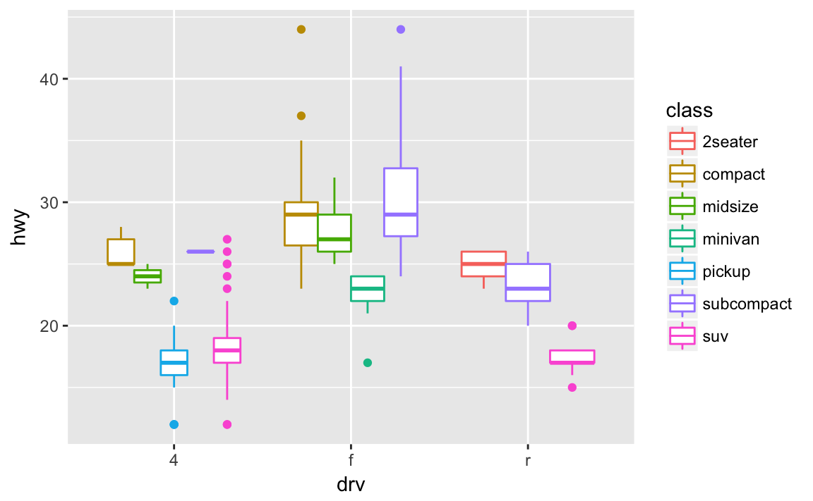
I'd fix it by using a jitter position adjustment.

```r
ggplot(data = mpg, mapping = aes(x = cty, y = hwy)) + 
  geom_point(position = "jitter")
```


### Exercise 2. {.exercise}

> What parameters to `geom_jitter()` control the amount of jittering?

From the [position_jitter](http://docs.ggplot2.org/current/position_jitter.html) documentation, there are two arguments to jitter: `width` and `height`, which control the amount of vertical and horizontal jitter. 

No horizontal jitter

```r
ggplot(data = mpg, mapping = aes(x = cty, y = hwy)) + 
  geom_point(position = position_jitter(width = 0))
```

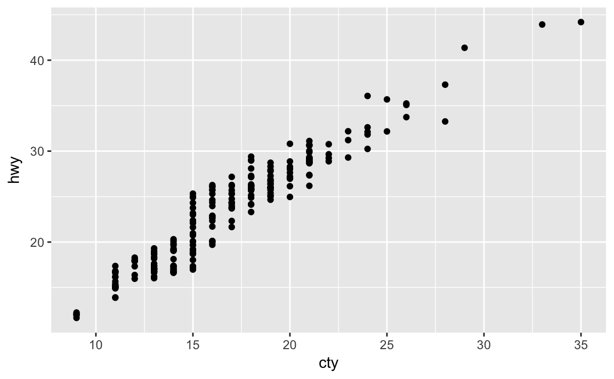

Way too much vertical jitter

```r
ggplot(data = mpg, mapping = aes(x = cty, y = hwy)) + 
  geom_point(position = position_jitter(width = 0, height = 15))
```

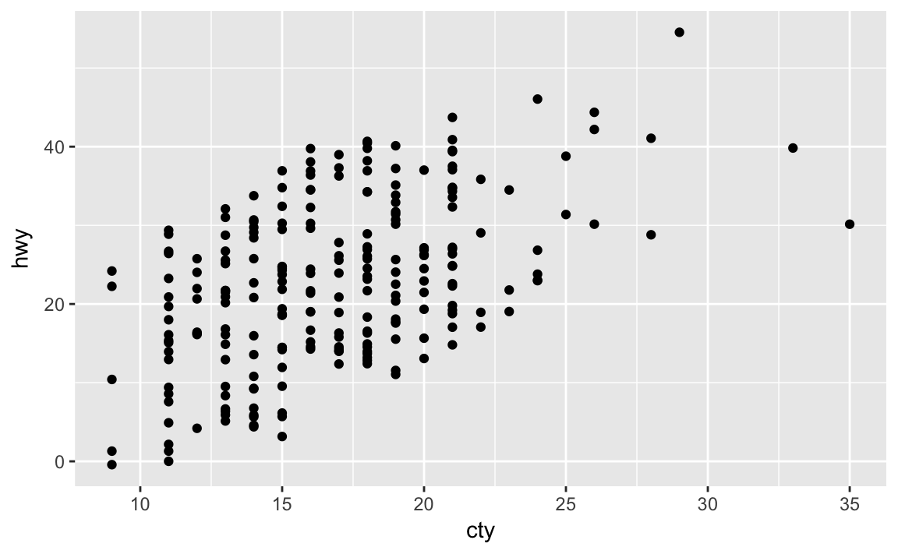

Only horizontal jitter:

```r
ggplot(data = mpg, mapping = aes(x = cty, y = hwy)) + 
  geom_point(position = position_jitter(height = 0))
```

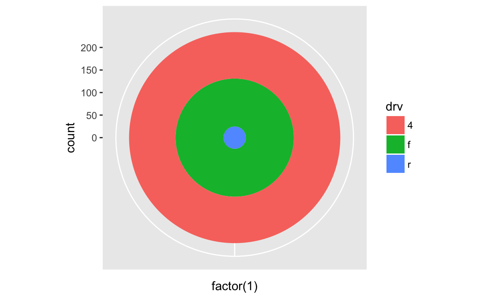

Way too much horizontal jitter:

```r
ggplot(data = mpg, mapping = aes(x = cty, y = hwy)) + 
  geom_point(position = position_jitter(height = 0, width = 20))
```

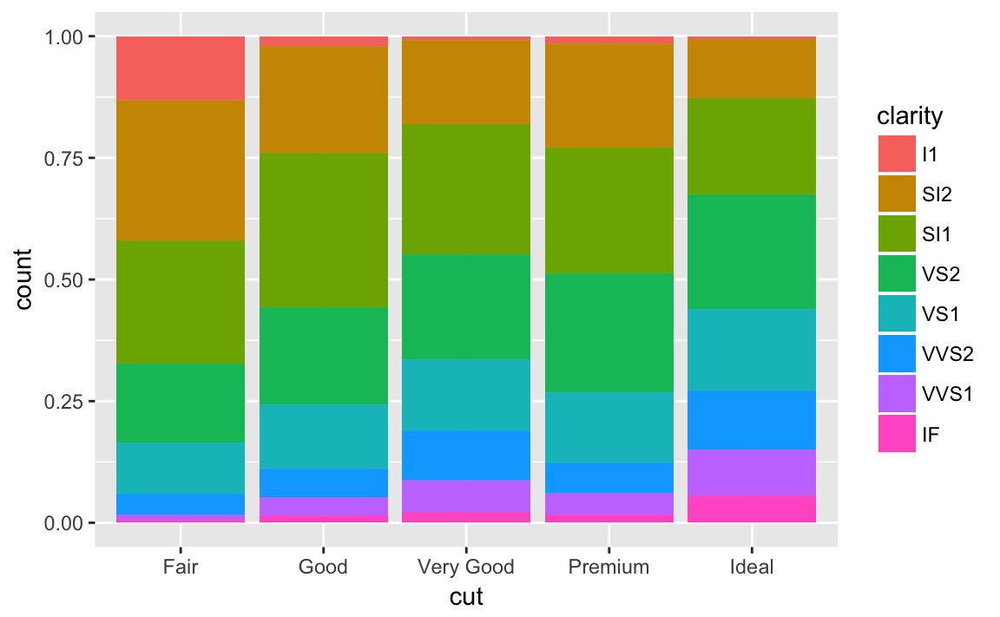

### Exercise 3. {.exercise}

> Compare and contrast `geom_jitter()` with `geom_count()`.

**TODO**

### Exercise 4. {.exercise}

> What’s the default position adjustment for `geom_boxplot()`? Create a visualization of the mpg dataset that demonstrates it.

The default position for `geom_boxplot` is `position_dodge` (see its [docs](http://docs.ggplot2.org/current/geom_boxplot.html)).

When we add `color = class` to the box plot, the different classes within `drv` are placed side by side, i.e. dodged. If it was `position_identity`, they would be overlapping.

```r
ggplot(data = mpg, aes(x = drv, y = hwy, color = class)) +
  geom_boxplot()
```

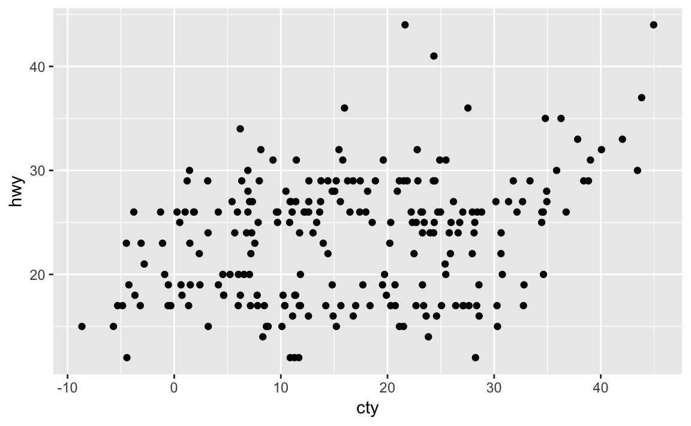


```r
ggplot(data = mpg, aes(x = drv, y = hwy, color = class)) +
  geom_boxplot(position = "identity")
```

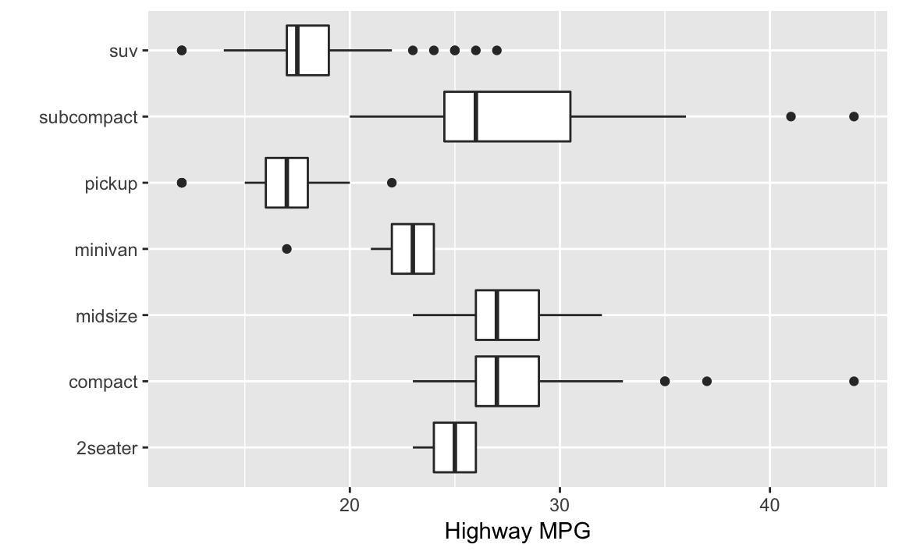

## Coordinate Systems


### Exercise 1. {.exercise}

>Turn a stacked bar chart into a pie chart using `coord_polar()`.

This is a stacked bar chart with a single category

```r
ggplot(mpg, aes(x = factor(1), fill = drv)) +
  geom_bar()
```

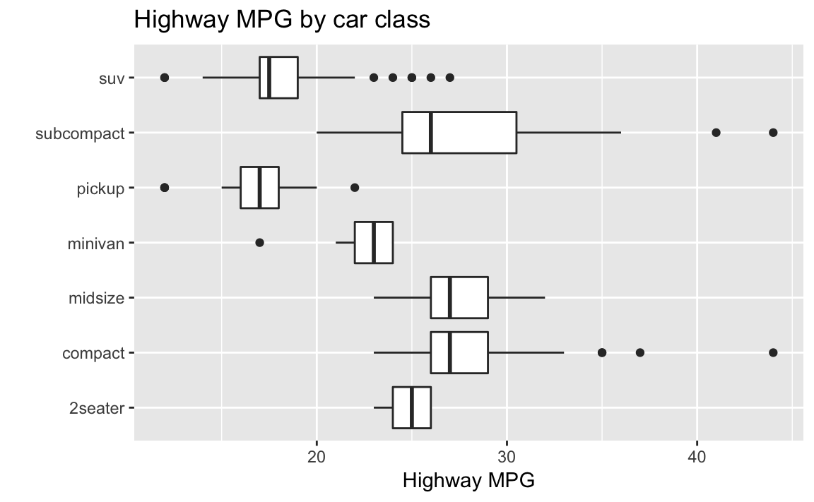

See the documentation for [coord_polar](http://docs.ggplot2.org/current/coord_polar.html) for an example of making a pie chart. In particular, `theta = "y"`, meaning that the angle of the chart is the `y` variable has to be specified.


```r
ggplot(mpg, aes(x = factor(1), fill = drv)) +
  geom_bar(width = 1) +
  coord_polar(theta = "y")
```

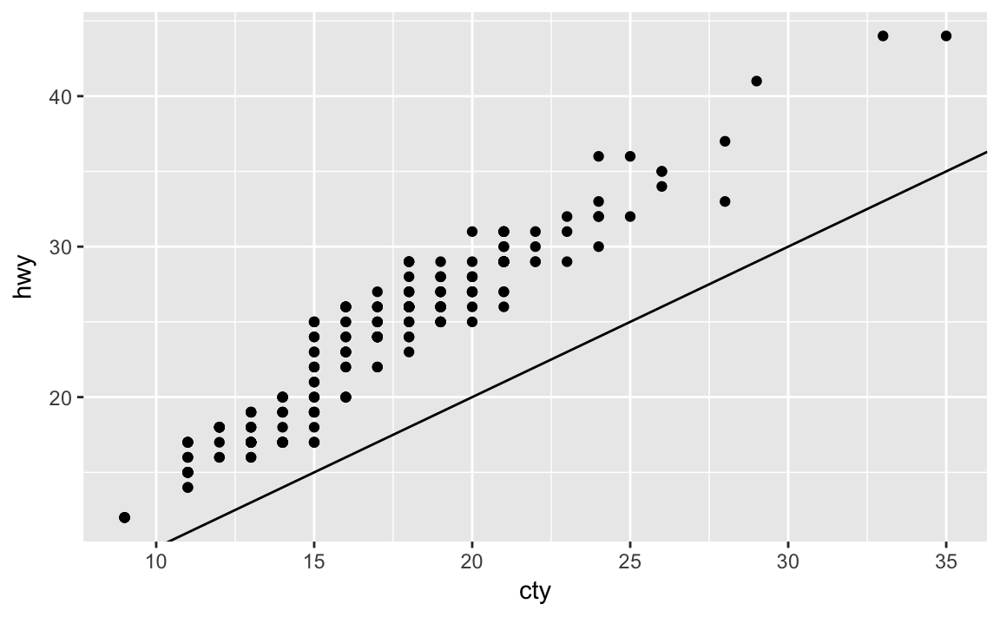

If `theta = "y"` is not specified, then you get a bull’s-eye chart

```r
ggplot(mpg, aes(x = factor(1), fill = drv)) +
  geom_bar(width = 1) +
  coord_polar()
```


If you had a multiple stacked bar chart, like,

```r
ggplot(data = diamonds) + 
  geom_bar(mapping = aes(x = cut, fill = clarity), position = "fill")
```

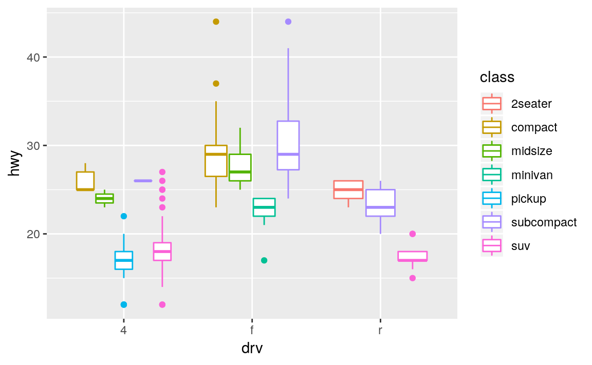

you end up with a multi-doughnut chart

```r
ggplot(data = diamonds) + 
  geom_bar(mapping = aes(x = cut, fill = clarity), position = "fill") +
  coord_polar(theta = "y")
```

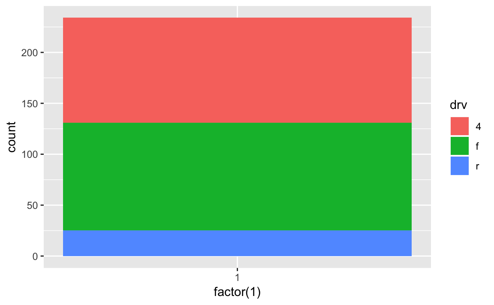


### Exercise 2. {.exercise}

> What does `labs()` do? Read the documentation.

The `labs` function adds labels for different scales and the title of the plot.


```r
ggplot(data = mpg, mapping = aes(x = class, y = hwy)) + 
  geom_boxplot() +
  coord_flip() +
  labs(y = "Highway MPG", x = "", title = "Highway MPG by car class")
```


### Exercise 3. {.exercise}

> What’s the difference between `coord_quickmap()` and `coord_map()`?

See the [docs](http://docs.ggplot2.org/current/coord_quickmap.html):

- `coord_map` uses a 2D projection: by default the Mercator project of the sphere to the plot. But this requires transforming all geoms.
- `coord_quickmap` uses a approximate, but faster, map projection using the lat/long ratio as an approximation. This is "quick" because the shapes don't need to be transformed.

### Exercise 4. {.exercise}

> What does the plot below tell you about the relationship between city and highway mpg? Why is `coord_fixed()` important? 
> What does `geom_abline()` do?

The coordinates `coord_fixed` ensures that the `abline` is at a 45 degree angle, which makes it easy to compare the highway and city mileage against what it would be if they were exactly the same.


```r
ggplot(data = mpg, mapping = aes(x = cty, y = hwy)) +
  geom_point() + 
  geom_abline() +
  coord_fixed()
```

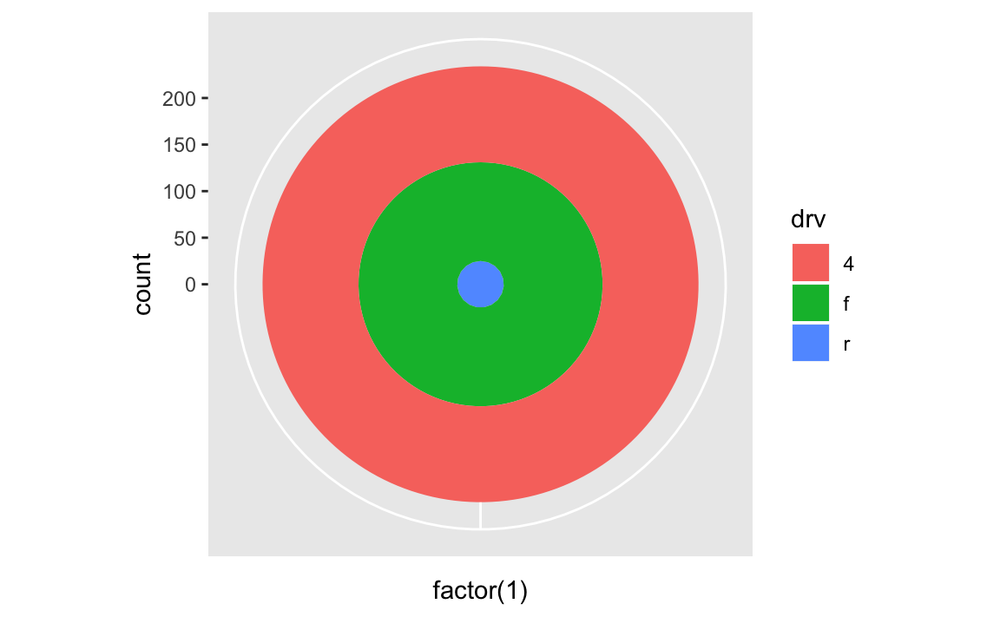

If we didn't include geom_point, then the line is no longer at 45 degrees:

```r
ggplot(data = mpg, mapping = aes(x = cty, y = hwy)) +
  geom_point() + 
  geom_abline()
```


## The Layered Grammar of Graphics

No exercises
