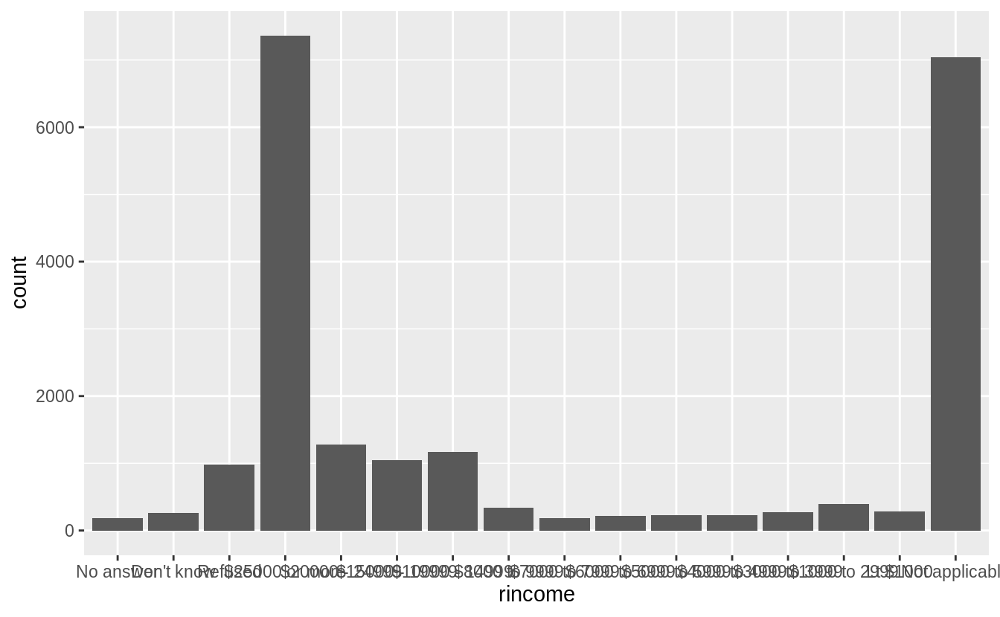
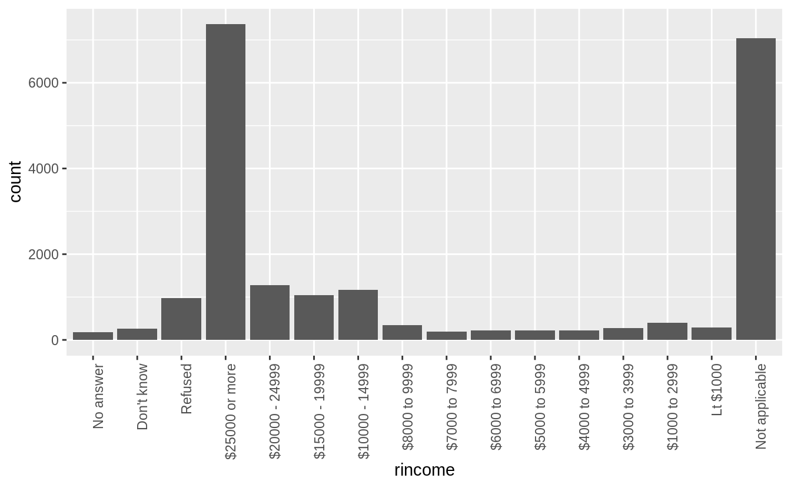
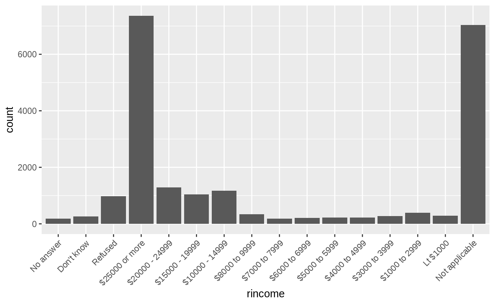
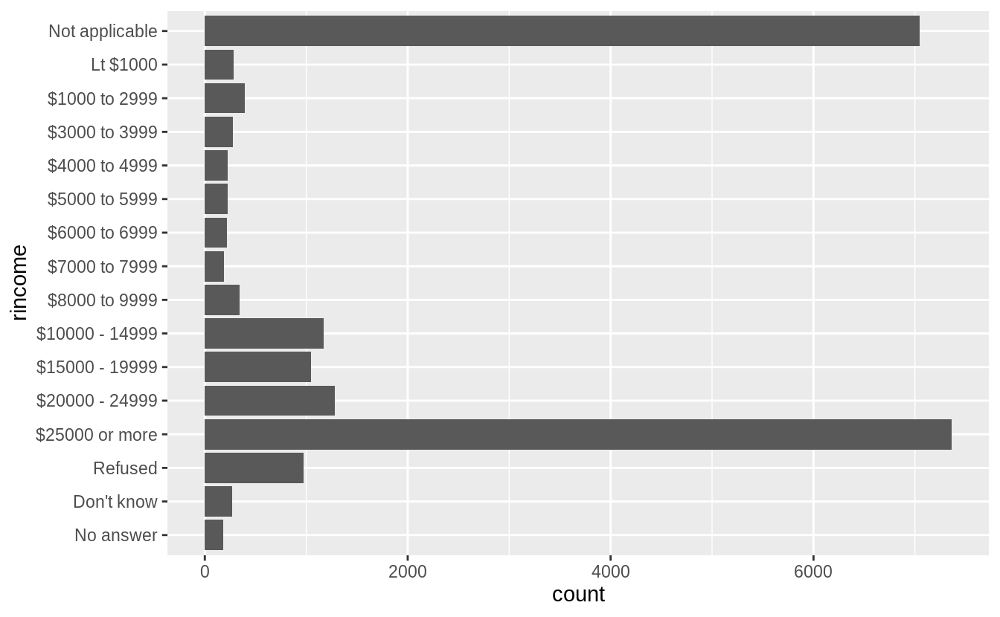
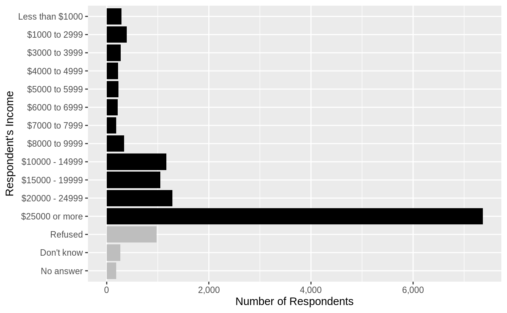
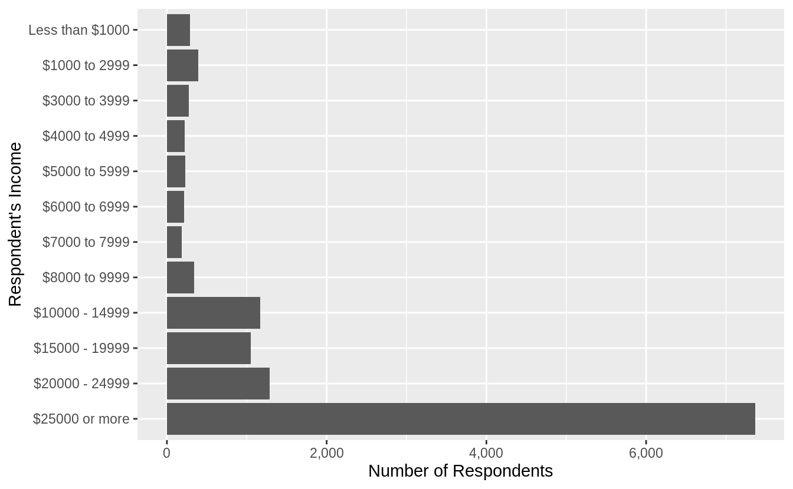
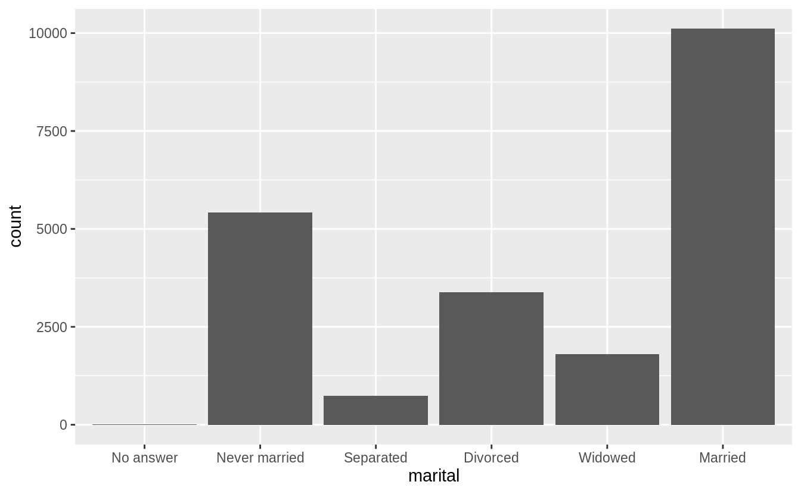
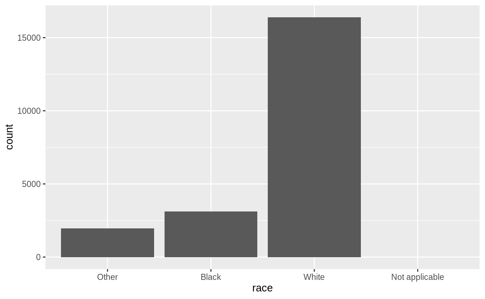
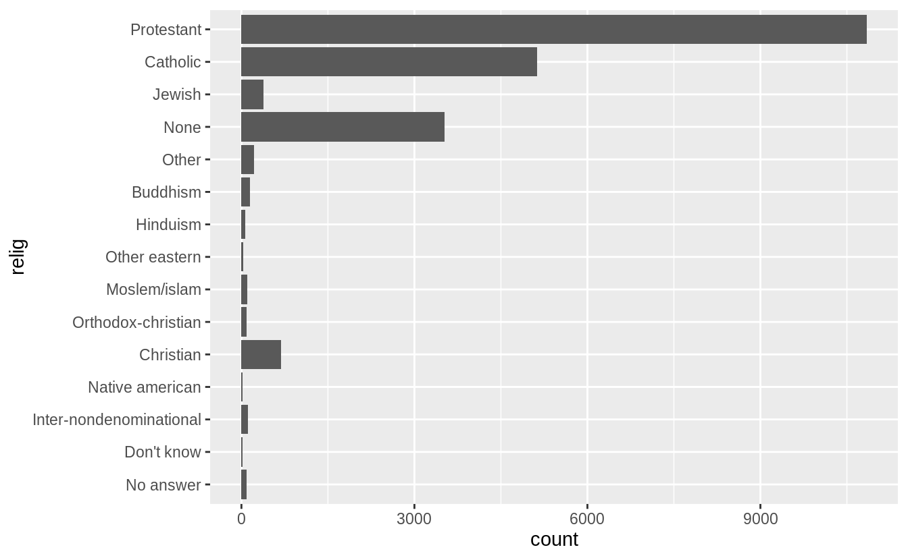
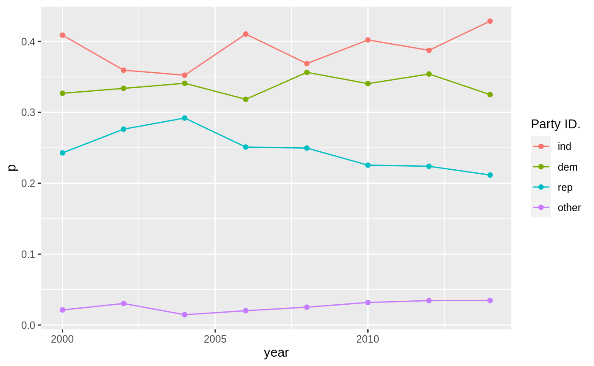

# Factors {#factors .r4ds-section}

## Introduction {#introduction-9 .r4ds-section}

Functions and packages:


```r
library("tidyverse")
```
The forcats package does not need to be explicitly loaded, since the recent versions of the tidyverse package now attach it.

## Creating factors {#creating-factors .r4ds-section}

<!--html_preserve--><div class="alert alert-warning hints-alert">
<div class="hints-icon">
<i class="fa fa-exclamation-circle"></i>
</div>
<div class="hints-container">No exercises</div>
</div><!--/html_preserve-->

## General Social Survey {#general-social-survey .r4ds-section}

### Exercise 15.3.1 {.unnumbered .exercise data-number="15.3.1"}

<div class="question">

Explore the distribution of `rincome` (reported income).
What makes the default bar chart hard to understand?
How could you improve the plot?

</div>

<div class="answer">

My first attempt is to use `geom_bar()` with the default settings.

```r
rincome_plot <-
  gss_cat %>%
  ggplot(aes(x = rincome)) +
  geom_bar()
rincome_plot
```



The problem with default bar chart settings, are that the labels overlapping and impossible to read.
I'll try changing the angle of the x-axis labels to vertical so that they will not overlap.

```r
rincome_plot +
  theme(axis.text.x = element_text(angle = 90, hjust = 1))
```



This is better because the labels are not overlapping, but also difficult to read because the labels are vertical.
I could try angling the labels so that they are easier to read, but not overlapping.

```r
rincome_plot +
  theme(axis.text.x = element_text(angle = 45, hjust = 1))
```



But the solution I prefer for bar charts with long labels is to flip the axes, so that the bars are horizontal. 
Then the category labels are also horizontal, and easy to read.

```r
rincome_plot +
  coord_flip()
```



Though more than asked for in this question, I could further improve this plot by 

1.  removing the "Not applicable" responses, 
1.  renaming "Lt \$1000" to "Less than \$1000",
1.  using color to distinguish non-response categories ("Refused", "Don't know", and "No answer") from income levels ("Lt $1000", ...), 
1.  adding meaningful y- and x-axis titles, and
1.  formatting the counts axis labels to use commas.


```r
gss_cat %>%
  filter(!rincome %in% c("Not applicable")) %>%
  mutate(rincome = fct_recode(rincome,
    "Less than $1000" = "Lt $1000"
  )) %>%
  mutate(rincome_na = rincome %in% c("Refused", "Don't know", "No answer")) %>%
  ggplot(aes(x = rincome, fill = rincome_na)) +
  geom_bar() +
  coord_flip() +
  scale_y_continuous("Number of Respondents", labels = scales::comma) +
  scale_x_discrete("Respondent's Income") +
  scale_fill_manual(values = c("FALSE" = "black", "TRUE" = "gray")) +
  theme(legend.position = "None")
```



If I were only interested in non-missing responses, then I could drop all respondents who answered "Not applicable", "Refused", "Don't know", or "No answer".

```r
gss_cat %>%
  filter(!rincome %in% c("Not applicable", "Don't know", "No answer", "Refused")) %>%
  mutate(rincome = fct_recode(rincome,
    "Less than $1000" = "Lt $1000"
  )) %>%
  ggplot(aes(x = rincome)) +
  geom_bar() +
  coord_flip() +
  scale_y_continuous("Number of Respondents", labels = scales::comma) +
  scale_x_discrete("Respondent's Income")
```



A side-effect of `coord_flip()` is that the label ordering on the x-axis, from lowest (top) to highest (bottom) is counterintuitive.
The next section introduces a function `fct_reorder()` which can help with this.

</div>

### Exercise 15.3.2 {.unnumbered .exercise data-number="15.3.2"}

<div class="question">
What is the most common `relig` in this survey?
What’s the most common `partyid`?
</div>

<div class="answer">

The most common `relig` is "Protestant"

```r
gss_cat %>%
  count(relig) %>%
  arrange(desc(n)) %>%
  head(1)
#> # A tibble: 1 x 2
#>   relig          n
#>   <fct>      <int>
#> 1 Protestant 10846
```

The most common `partyid` is "Independent"

```r
gss_cat %>%
  count(partyid) %>%
  arrange(desc(n)) %>%
  head(1)
#> # A tibble: 1 x 2
#>   partyid         n
#>   <fct>       <int>
#> 1 Independent  4119
```

</div>

### Exercise 15.3.3 {.unnumbered .exercise data-number="15.3.3"}

<div class="question">
Which `relig` does `denom` (denomination) apply to?
How can you find out with a table?
How can you find out with a visualization?
</div>

<div class="answer">


```r
levels(gss_cat$denom)
#>  [1] "No answer"            "Don't know"           "No denomination"     
#>  [4] "Other"                "Episcopal"            "Presbyterian-dk wh"  
#>  [7] "Presbyterian, merged" "Other presbyterian"   "United pres ch in us"
#> [10] "Presbyterian c in us" "Lutheran-dk which"    "Evangelical luth"    
#> [13] "Other lutheran"       "Wi evan luth synod"   "Lutheran-mo synod"   
#> [16] "Luth ch in america"   "Am lutheran"          "Methodist-dk which"  
#> [19] "Other methodist"      "United methodist"     "Afr meth ep zion"    
#> [22] "Afr meth episcopal"   "Baptist-dk which"     "Other baptists"      
#> [25] "Southern baptist"     "Nat bapt conv usa"    "Nat bapt conv of am" 
#> [28] "Am bapt ch in usa"    "Am baptist asso"      "Not applicable"
```

From the context it is clear that `denom` refers to "Protestant" (and unsurprising given that it is the largest category in `freq`).
Let's filter out the non-responses, no answers, others, not-applicable, or
no denomination, to leave only answers to denominations.
After doing that, the only remaining responses are "Protestant".

```r
gss_cat %>%
  filter(!denom %in% c(
    "No answer", "Other", "Don't know", "Not applicable",
    "No denomination"
  )) %>%
  count(relig)
#> # A tibble: 1 x 2
#>   relig          n
#>   <fct>      <int>
#> 1 Protestant  7025
```

This is also clear in a scatter plot of `relig` vs. `denom` where the points are
proportional to the size of the number of answers (since otherwise there would be overplotting).

```r
gss_cat %>%
  count(relig, denom) %>%
  ggplot(aes(x = relig, y = denom, size = n)) +
  geom_point() +
  theme(axis.text.x = element_text(angle = 90))
```


</div>

## Modifying factor order {#modifying-factor-order .r4ds-section}

### Exercise 15.4.1 {.unnumbered .exercise data-number="15.4.1"}

<div class="question">
There are some suspiciously high numbers in `tvhours`.
Is the `mean` a good summary?
</div>

<div class="answer">


```r
summary(gss_cat[["tvhours"]])
#>    Min. 1st Qu.  Median    Mean 3rd Qu.    Max.    NA's 
#>       0       1       2       3       4      24   10146
```


```r
gss_cat %>%
  filter(!is.na(tvhours)) %>%
  ggplot(aes(x = tvhours)) +
  geom_histogram(binwidth = 1)
```


Whether the mean is the best summary depends on what you are using it for :-), i.e. your objective.
But probably the median would be what most people prefer.
And the hours of TV doesn't look that surprising to me.

</div>

### Exercise 15.4.2 {.unnumbered .exercise data-number="15.4.2"}

<div class="question">
For each factor in `gss_cat` identify whether the order of the levels is arbitrary or principled.
</div>

<div class="answer">

The following piece of code uses functions introduced in Ch 21, to print out the names of only the factors.

```r
keep(gss_cat, is.factor) %>% names()
#> [1] "marital" "race"    "rincome" "partyid" "relig"   "denom"
```

There are six categorical variables: `marital`, `race`, `rincome`, `partyid`, `relig`, and `denom`.

The ordering of marital is "somewhat principled". There is some sort of logic
in that the levels are grouped "never married", married at some point
(separated, divorced, widowed), and "married"; though it would seem that "Never
Married", "Divorced", "Widowed", "Separated", "Married" might be more natural.
I find that the question of ordering can be determined by the level of
aggregation in a categorical variable, and there can be more "partially
ordered" factors than one would expect.


```r
levels(gss_cat[["marital"]])
#> [1] "No answer"     "Never married" "Separated"     "Divorced"     
#> [5] "Widowed"       "Married"
```

```r
gss_cat %>%
  ggplot(aes(x = marital)) +
  geom_bar()
```



The ordering of race is principled in that the categories are ordered by count of observations in the data.

```r
levels(gss_cat$race)
#> [1] "Other"          "Black"          "White"          "Not applicable"
```

```r
gss_cat %>%
  ggplot(aes(race)) +
  geom_bar() +
  scale_x_discrete(drop = FALSE)
```



The levels of `rincome` are ordered in decreasing order of the income; however
the placement of "No answer", "Don't know", and "Refused" before, and "Not
applicable" after the income levels is arbitrary. It would be better to place
all the missing income level categories either before or after all the known
values.


```r
levels(gss_cat$rincome)
#>  [1] "No answer"      "Don't know"     "Refused"        "$25000 or more"
#>  [5] "$20000 - 24999" "$15000 - 19999" "$10000 - 14999" "$8000 to 9999" 
#>  [9] "$7000 to 7999"  "$6000 to 6999"  "$5000 to 5999"  "$4000 to 4999" 
#> [13] "$3000 to 3999"  "$1000 to 2999"  "Lt $1000"       "Not applicable"
```

The levels of `relig` is arbitrary: there is no natural ordering, and they don't appear to be ordered by stats within the dataset.

```r
levels(gss_cat$relig)
#>  [1] "No answer"               "Don't know"             
#>  [3] "Inter-nondenominational" "Native american"        
#>  [5] "Christian"               "Orthodox-christian"     
#>  [7] "Moslem/islam"            "Other eastern"          
#>  [9] "Hinduism"                "Buddhism"               
#> [11] "Other"                   "None"                   
#> [13] "Jewish"                  "Catholic"               
#> [15] "Protestant"              "Not applicable"
```


```r
gss_cat %>%
  ggplot(aes(relig)) +
  geom_bar() +
  coord_flip()
```



The same goes for `denom`.

```r
levels(gss_cat$denom)
#>  [1] "No answer"            "Don't know"           "No denomination"     
#>  [4] "Other"                "Episcopal"            "Presbyterian-dk wh"  
#>  [7] "Presbyterian, merged" "Other presbyterian"   "United pres ch in us"
#> [10] "Presbyterian c in us" "Lutheran-dk which"    "Evangelical luth"    
#> [13] "Other lutheran"       "Wi evan luth synod"   "Lutheran-mo synod"   
#> [16] "Luth ch in america"   "Am lutheran"          "Methodist-dk which"  
#> [19] "Other methodist"      "United methodist"     "Afr meth ep zion"    
#> [22] "Afr meth episcopal"   "Baptist-dk which"     "Other baptists"      
#> [25] "Southern baptist"     "Nat bapt conv usa"    "Nat bapt conv of am" 
#> [28] "Am bapt ch in usa"    "Am baptist asso"      "Not applicable"
```

Ignoring "No answer", "Don't know", and "Other party", the levels of `partyid` are ordered from "Strong Republican"" to "Strong Democrat".

```r
levels(gss_cat$partyid)
#>  [1] "No answer"          "Don't know"         "Other party"       
#>  [4] "Strong republican"  "Not str republican" "Ind,near rep"      
#>  [7] "Independent"        "Ind,near dem"       "Not str democrat"  
#> [10] "Strong democrat"
```

</div>

### Exercise 15.4.3 {.unnumbered .exercise data-number="15.4.3"}

<div class="question">
Why did moving “Not applicable” to the front of the levels move it to the bottom of the plot?
</div>

<div class="answer">

Because that gives the level "Not applicable" an integer value of 1.

</div>

## Modifying factor levels {#modifying-factor-levels .r4ds-section}

### Exercise 15.5.1 {.unnumbered .exercise data-number="15.5.1"}

<div class="question">
How have the proportions of people identifying as Democrat, Republican, and Independent changed over time?
</div>

<div class="answer">

To answer that, we need to combine the multiple levels into Democrat, Republican, and Independent

```r
levels(gss_cat$partyid)
#>  [1] "No answer"          "Don't know"         "Other party"       
#>  [4] "Strong republican"  "Not str republican" "Ind,near rep"      
#>  [7] "Independent"        "Ind,near dem"       "Not str democrat"  
#> [10] "Strong democrat"
```


```r
gss_cat %>%
  mutate(
    partyid =
      fct_collapse(partyid,
        other = c("No answer", "Don't know", "Other party"),
        rep = c("Strong republican", "Not str republican"),
        ind = c("Ind,near rep", "Independent", "Ind,near dem"),
        dem = c("Not str democrat", "Strong democrat")
      )
  ) %>%
  count(year, partyid) %>%
  group_by(year) %>%
  mutate(p = n / sum(n)) %>%
  ggplot(aes(
    x = year, y = p,
    colour = fct_reorder2(partyid, year, p)
  )) +
  geom_point() +
  geom_line() +
  labs(colour = "Party ID.")
```



</div>

### Exercise 15.5.2 {.unnumbered .exercise data-number="15.5.2"}

<div class="question">
How could you collapse `rincome` into a small set of categories?
</div>

<div class="answer">

Group all the non-responses into one category, and then group other categories into a smaller number. Since there is a clear ordering, we would not use `fct_lump()`.`

```r
levels(gss_cat$rincome)
#>  [1] "No answer"      "Don't know"     "Refused"        "$25000 or more"
#>  [5] "$20000 - 24999" "$15000 - 19999" "$10000 - 14999" "$8000 to 9999" 
#>  [9] "$7000 to 7999"  "$6000 to 6999"  "$5000 to 5999"  "$4000 to 4999" 
#> [13] "$3000 to 3999"  "$1000 to 2999"  "Lt $1000"       "Not applicable"
```


```r
library("stringr")
gss_cat %>%
  mutate(
    rincome =
      fct_collapse(
        rincome,
        `Unknown` = c("No answer", "Don't know", "Refused", "Not applicable"),
        `Lt $5000` = c("Lt $1000", str_c(
          "$", c("1000", "3000", "4000"),
          " to ", c("2999", "3999", "4999")
        )),
        `$5000 to 10000` = str_c(
          "$", c("5000", "6000", "7000", "8000"),
          " to ", c("5999", "6999", "7999", "9999")
        )
      )
  ) %>%
  ggplot(aes(x = rincome)) +
  geom_bar() +
  coord_flip()
```


</div>
