# Graphics for communication {#graphics-for-communication .r4ds-section}

## Introduction {#introduction-19 .r4ds-section}


```r
library("tidyverse")
library("modelr")
library("lubridate")
```

## Label {#label .r4ds-section}

### Exercise 28.2.1 {.unnumbered .exercise data-number="28.2.1"}

<div class="question">
Create one plot on the fuel economy data with customized `title`,
`subtitle`, `caption`, `x`, `y`, and `colour` labels.
</div>

<div class="answer">


```r
ggplot(
  data = mpg,
  mapping = aes(x = fct_reorder(class, hwy), y = hwy)
) +
  geom_boxplot() +
  coord_flip() +
  labs(
    title = "Compact Cars have > 10 Hwy MPG than Pickup Trucks",
    subtitle = "Comparing the median highway mpg in each class",
    caption = "Data from fueleconomy.gov",
    x = "Car Class",
    y = "Highway Miles per Gallon"
  )
```

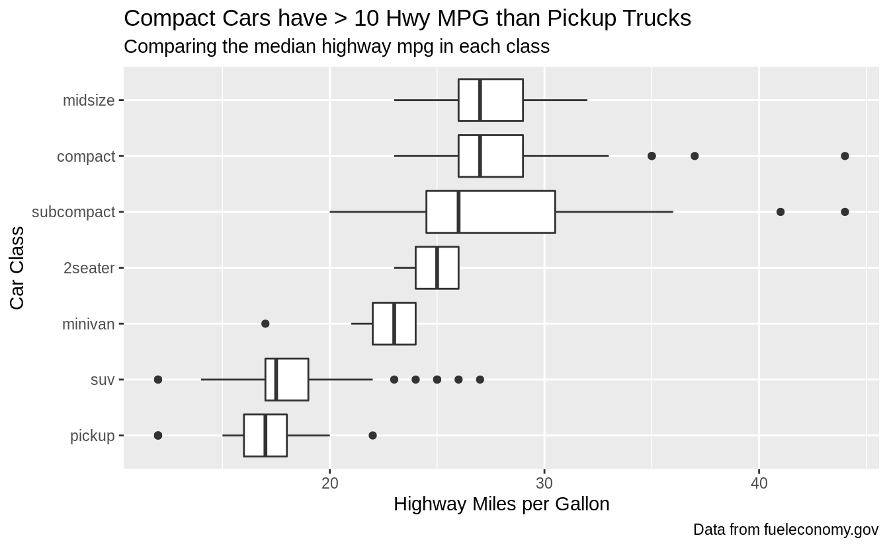

</div>

### Exercise 28.2.2 {.unnumbered .exercise data-number="28.2.2"}

<div class="question">
The `geom_smooth()` is somewhat misleading because the `hwy` for large engines is skewed upwards due to the inclusion of lightweight sports cars with big engines.
Use your modeling tools to fit and display a better model.
</div>

<div class="answer">

First, I'll plot the relationship between fuel efficiency and engine size (displacement) using all cars.
The plot shows a strong negative relationship.

```r
ggplot(mpg, aes(displ, hwy)) +
  geom_point() +
  geom_smooth(method = "lm", se = FALSE) +
  labs(
    title = "Fuel Efficiency Decreases with Engine Size",
    caption = "Data from fueleconomy.gov",
    y = "Highway Miles per Gallon",
    x = "Engine Displacement"
  )
#> `geom_smooth()` using formula 'y ~ x'
```

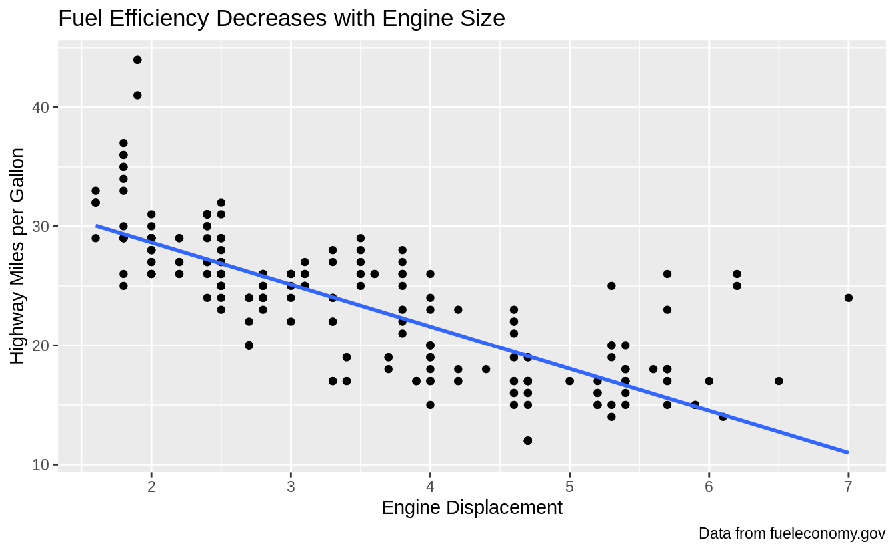

However, if I disaggregate by car class, and plot the relationship between 
fuel efficiency and engine displacement within each class, I see a different
relationship.

1.  For all car class except subcompact cars, there is no relationship or only
    a small negative relationship between fuel efficiency and engine size.

1.  For subcompact cars, there is a strong negative relationship between fuel
    efficiency and engine size. As the question noted, this is because the 
    subcompact car class includes both small cheap cars, and sports cars with
    large engines.


```r
ggplot(mpg, aes(displ, hwy, colour = class)) +
  geom_point() +
  geom_smooth(method = "lm", se = FALSE) +
  labs(
    title = "Fuel Efficiency Mostly Varies by Car Class",
    subtitle = "Subcompact caries fuel efficiency varies by engine size",
    caption = "Data from fueleconomy.gov",
    y = "Highway Miles per Gallon",
    x = "Engine Displacement"
  )
#> `geom_smooth()` using formula 'y ~ x'
```

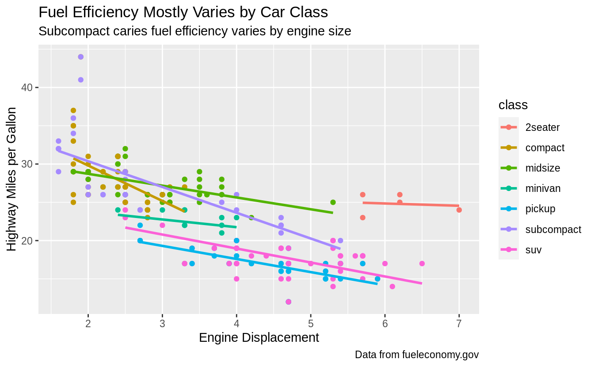

Another way to model and visualize the relationship between fuel efficiency
and engine displacement after accounting for car class is to regress 
fuel efficiency on car class, and plot the residuals of that regression against
engine displacement.
The residuals of the first regression are the variation in fuel efficiency
not explained by engine displacement.
The relationship between fuel efficiency and engine displacement is attenuated
after accounting for car class.


```r
mod <- lm(hwy ~ class, data = mpg)
mpg %>%
  add_residuals(mod) %>%
  ggplot(aes(x = displ, y = resid)) +
  geom_point() +
  geom_smooth(method = "lm", se = FALSE) +
  labs(
    title = "Engine size has little effect on fuel efficiency",
    subtitle = "After accounting for car class",
    caption = "Data from fueleconomy.gov",
    y = "Highway MPG Relative to Class Average",
    x = "Engine Displacement"
  )
#> `geom_smooth()` using formula 'y ~ x'
```

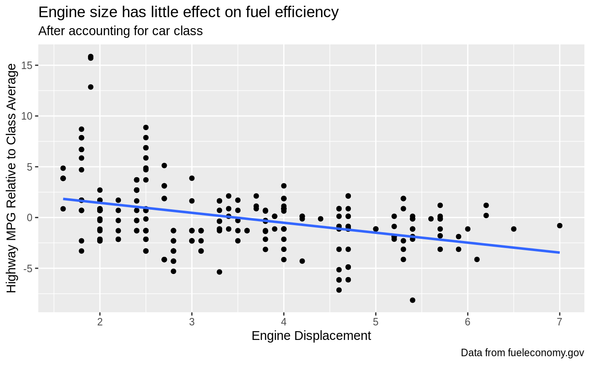

</div>

### Exercise 28.2.3 {.unnumbered .exercise data-number="28.2.3"}

<div class="question">
Take an exploratory graphic that you've created in the last month, and add informative titles to make it easier for others to understand.
</div>

<div class="answer">

By its very nature, this exercise is left to readers.

</div>

## Annotations {#annotations .r4ds-section}

### Exercise 28.3.1 {.unnumbered .exercise data-number="28.3.1"}

<div class="question">
Use `geom_text()` with infinite positions to place text at the four corners of the plot.
</div>

<div class="answer">

I can use similar code as the example in the text.
However, I need to use `vjust` and `hjust` in order for the text to appear in the plot, and these need to be different for each corner.
But, `geom_text()` takes `hjust` and `vjust` as aesthetics, I can add them to the data and mappings, and use a single `geom_text()` call instead of four different `geom_text()` calls with four different data arguments, and four different values of `hjust` and `vjust` arguments.

```r
label <- tribble(
  ~displ, ~hwy, ~label, ~vjust, ~hjust,
  Inf, Inf, "Top right", "top", "right",
  Inf, -Inf, "Bottom right", "bottom", "right",
  -Inf, Inf, "Top left", "top", "left",
  -Inf, -Inf, "Bottom left", "bottom", "left"
)

ggplot(mpg, aes(displ, hwy)) +
  geom_point() +
  geom_text(aes(label = label, vjust = vjust, hjust = hjust), data = label)
```

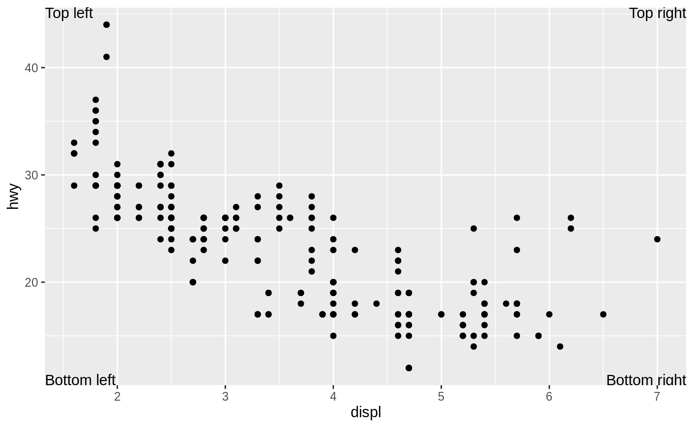

</div>

### Exercise 28.3.2 {.unnumbered .exercise data-number="28.3.2"}

<div class="question">
Read the documentation for `annotate()`. How can you use it to add a text label to a plot without having to create a tibble?
</div>

<div class="answer">

With annotate you use what would be aesthetic mappings directly as arguments:

```r
ggplot(mpg, aes(displ, hwy)) +
  geom_point() +
  annotate("text",
    x = Inf, y = Inf,
    label = "Increasing engine size is \nrelated to decreasing fuel economy.", vjust = "top", hjust = "right"
  )
```

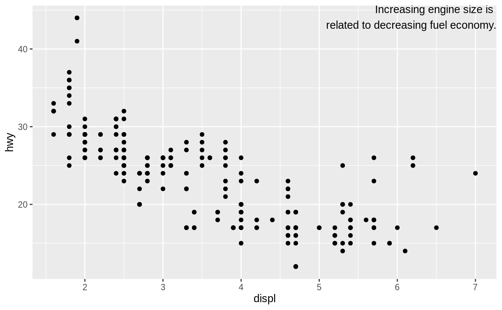

</div>

### Exercise 28.3.3 {.unnumbered .exercise data-number="28.3.3"}

<div class="question">
How do labels with `geom_text()` interact with faceting?
How can you add a label to a single facet?
How can you put a different label in each facet?
(Hint: think about the underlying data.)
</div>

<div class="answer">

If the facet variable is not specified, the text is drawn in all facets.

```r
label <- tibble(
  displ = Inf,
  hwy = Inf,
  label = "Increasing engine size is \nrelated to decreasing fuel economy."
)

ggplot(mpg, aes(displ, hwy)) +
  geom_point() +
  geom_text(aes(label = label),
    data = label, vjust = "top", hjust = "right",
    size = 2
  ) +
  facet_wrap(~class)
```

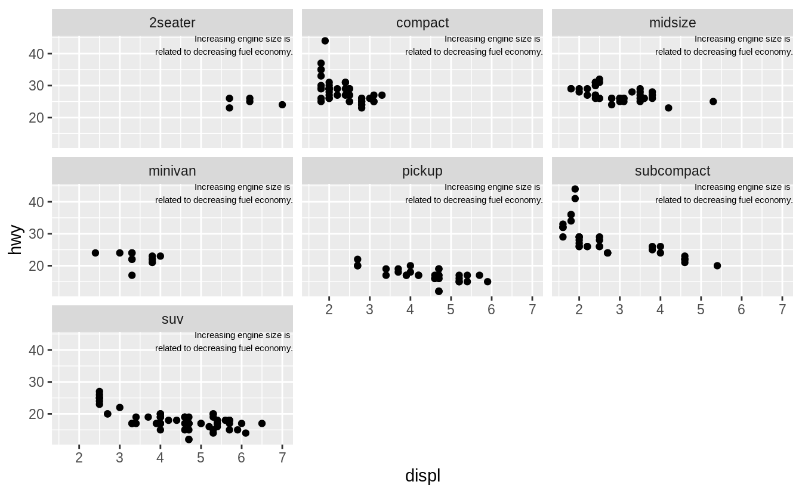

To draw the label in only one facet, add a column to the label data frame with the value of the faceting variable(s) in which to draw it.

```r
label <- tibble(
  displ = Inf,
  hwy = Inf,
  class = "2seater",
  label = "Increasing engine size is \nrelated to decreasing fuel economy."
)

ggplot(mpg, aes(displ, hwy)) +
  geom_point() +
  geom_text(aes(label = label),
    data = label, vjust = "top", hjust = "right",
    size = 2
  ) +
  facet_wrap(~class)
```

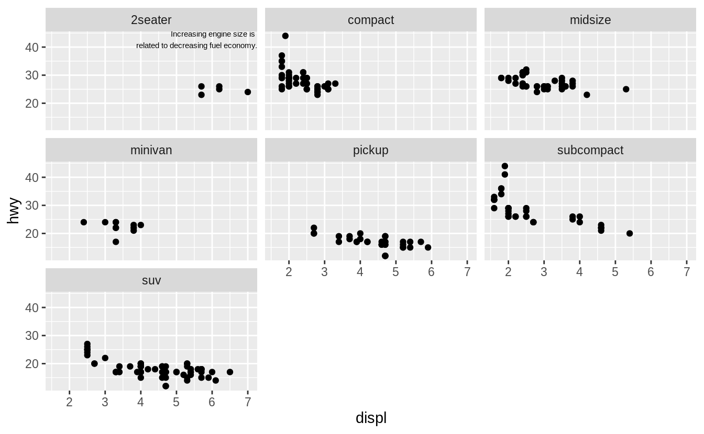

To draw labels in different plots, simply have the facetting variable(s):

```r
label <- tibble(
  displ = Inf,
  hwy = Inf,
  class = unique(mpg$class),
  label = str_c("Label for ", class)
)

ggplot(mpg, aes(displ, hwy)) +
  geom_point() +
  geom_text(aes(label = label),
    data = label, vjust = "top", hjust = "right",
    size = 3
  ) +
  facet_wrap(~class)
```

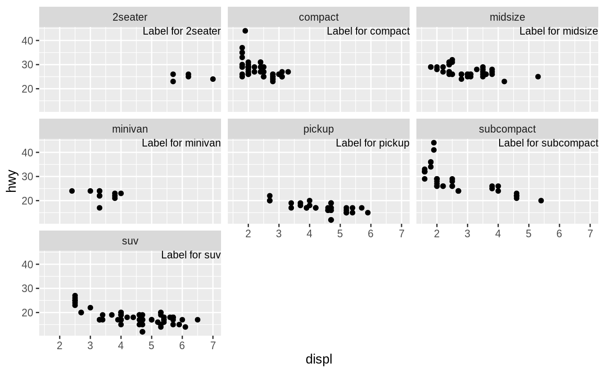

</div>

### Exercise 28.3.4 {.unnumbered .exercise data-number="28.3.4"}

<div class="question">
What arguments to `geom_label()` control the appearance of the background box?
</div>

<div class="answer">

-   `label.padding`: padding around label
-   `label.r`: amount of rounding in the corners
-   `label.size`: size of label border

</div>

### Exercise 28.3.5 {.unnumbered .exercise data-number="28.3.5"}

<div class="question">
What are the four arguments to `arrow()`? How do they work?
Create a series of plots that demonstrate the most important options.
</div>

<div class="answer">

The four arguments are (from the help for `arrow()`):

-   `angle` : angle of arrow head
-   `length` : length of the arrow head
-   `ends`: ends of the line to draw arrow head
-   `type`: `"open"` or `"close"`: whether the arrow head is a closed or open triangle

</div>

## Scales {#scales .r4ds-section}

### Exercise 28.4.1 {.unnumbered .exercise data-number="28.4.1"}

<div class="question">
Why doesn’t the following code override the default scale?
</div>

<div class="answer">


```r
df <- tibble(
  x = rnorm(10000),
  y = rnorm(10000)
)
ggplot(df, aes(x, y)) +
  geom_hex() +
  scale_colour_gradient(low = "white", high = "red") +
  coord_fixed()
```

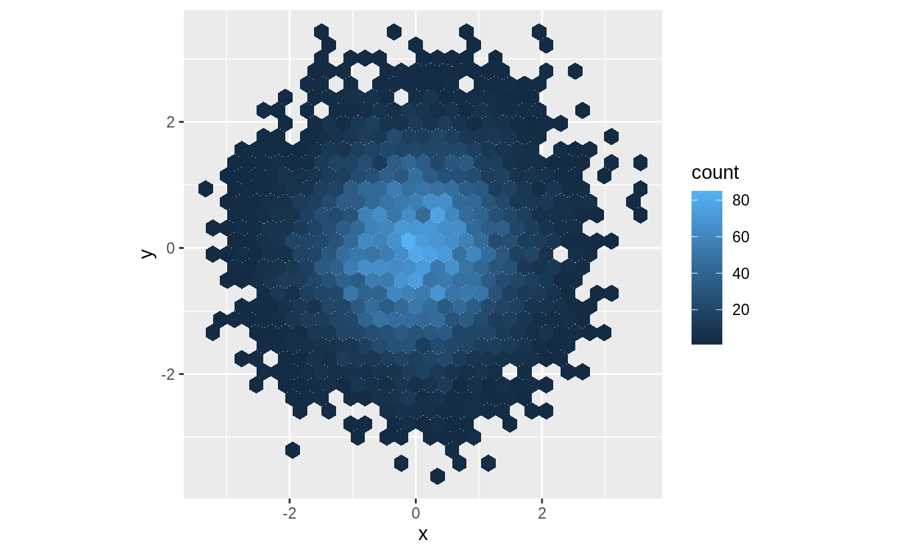

It does not override the default scale because the colors in `geom_hex()` are set by the `fill` aesthetic, not the `color` aesthetic.


```r
ggplot(df, aes(x, y)) +
  geom_hex() +
  scale_fill_gradient(low = "white", high = "red") +
  coord_fixed()
```

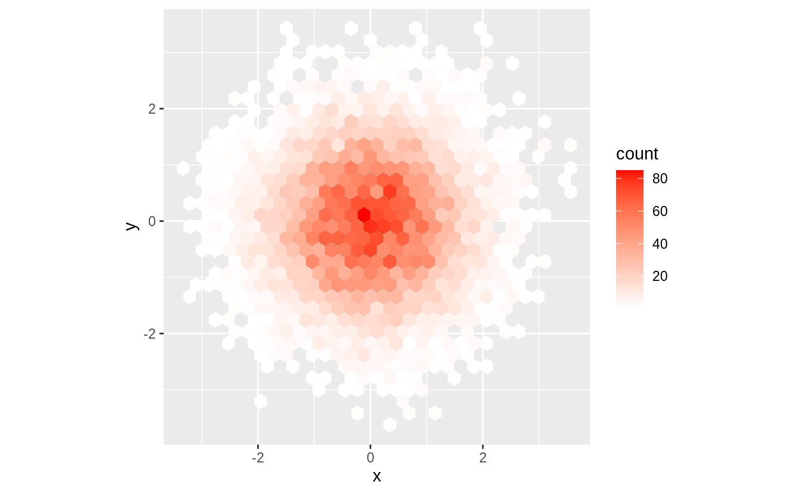

</div>

### Exercise 28.4.2 {.unnumbered .exercise data-number="28.4.2"}

<div class="question">
The first argument to every scale is the label for the scale.
It is equivalent to using the `labs` function.
</div>

<div class="answer">


```r
ggplot(mpg, aes(displ, hwy)) +
  geom_point(aes(colour = class)) +
  geom_smooth(se = FALSE) +
  labs(
    x = "Engine displacement (L)",
    y = "Highway fuel economy (mpg)",
    colour = "Car type"
  )
#> `geom_smooth()` using method = 'loess' and formula 'y ~ x'
```

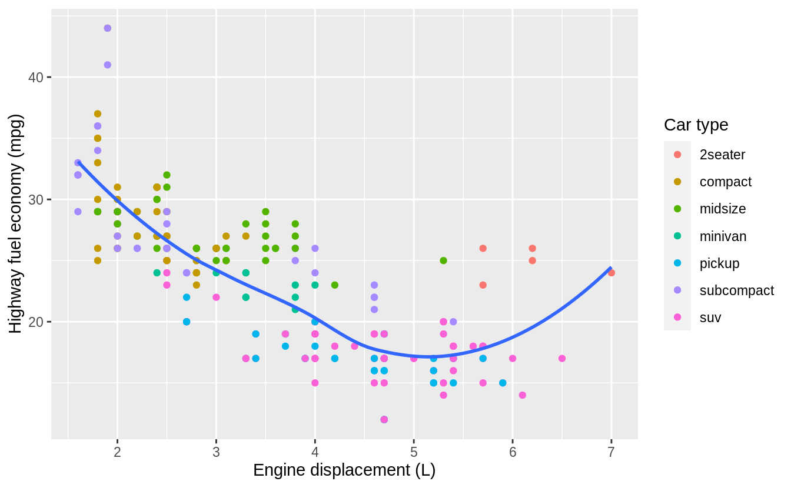


```r
ggplot(mpg, aes(displ, hwy)) +
  geom_point(aes(colour = class)) +
  geom_smooth(se = FALSE) +
  scale_x_continuous("Engine displacement (L)") +
  scale_y_continuous("Highway fuel economy (mpg)") +
  scale_colour_discrete("Car type")
#> `geom_smooth()` using method = 'loess' and formula 'y ~ x'
```


</div>

### Exercise 28.4.3 {.unnumbered .exercise data-number="28.4.3"}

<div class="question">
Change the display of the presidential terms by:

1.  Combining the two variants shown above.
1.  Improving the display of the y axis.
1.  Labeling each term with the name of the president.
1.  Adding informative plot labels.
1.  Placing breaks every 4 years (this is trickier than it seems!).

</div>

<div class="answer">


```r
fouryears <- lubridate::make_date(seq(year(min(presidential$start)),
  year(max(presidential$end)),
  by = 4
), 1, 1)

presidential %>%
  mutate(
    id = 33 + row_number(),
    name_id = fct_inorder(str_c(name, " (", id, ")"))
  ) %>%
  ggplot(aes(start, name_id, colour = party)) +
  geom_point() +
  geom_segment(aes(xend = end, yend = name_id)) +
  scale_colour_manual("Party", values = c(Republican = "red", Democratic = "blue")) +
  scale_y_discrete(NULL) +
  scale_x_date(NULL,
    breaks = presidential$start, date_labels = "'%y",
    minor_breaks = fouryears
  ) +
  ggtitle("Terms of US Presdients",
    subtitle = "Roosevelth (34th) to Obama (44th)"
  ) +
  theme(
    panel.grid.minor = element_blank(),
    axis.ticks.y = element_blank()
  )
```

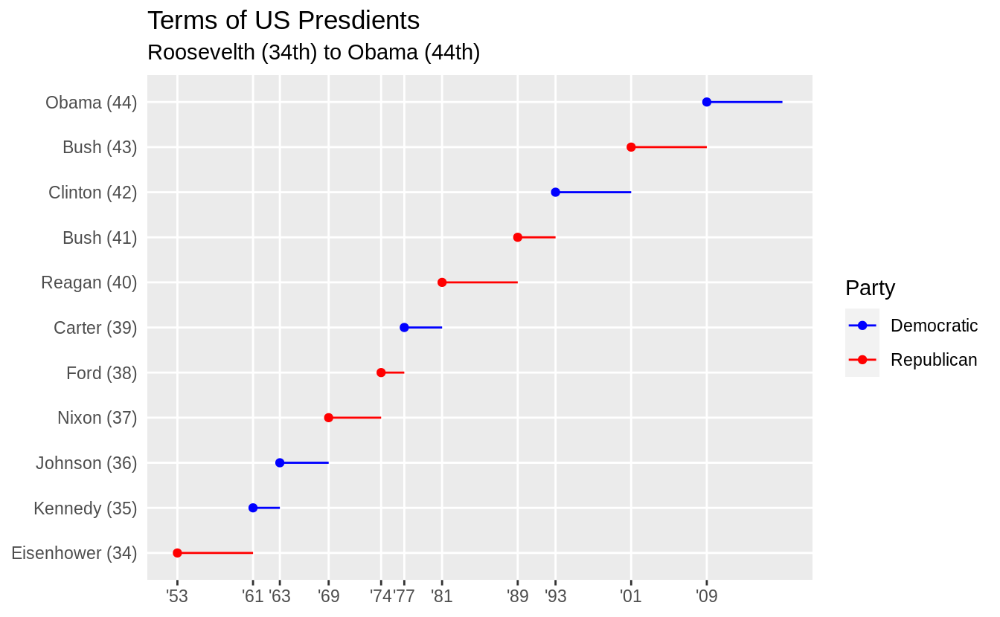

To include both the start dates of presidential terms and every
four years, I use different levels of emphasis. 
The presidential term start years are used as major breaks with thicker lines and x-axis labels.
Lines for every four years is indicated with minor breaks that use thinner lines to distinguish them from presidential term start years and to avoid cluttering the plot.

</div>

### Exercise 28.4.4 {.unnumbered .exercise data-number="28.4.4"}

<div class="question">
Use `override.aes` to make the legend on the following plot easier to see.
</div>

<div class="answer">


```r
ggplot(diamonds, aes(carat, price)) +
  geom_point(aes(colour = cut), alpha = 1 / 20)
```

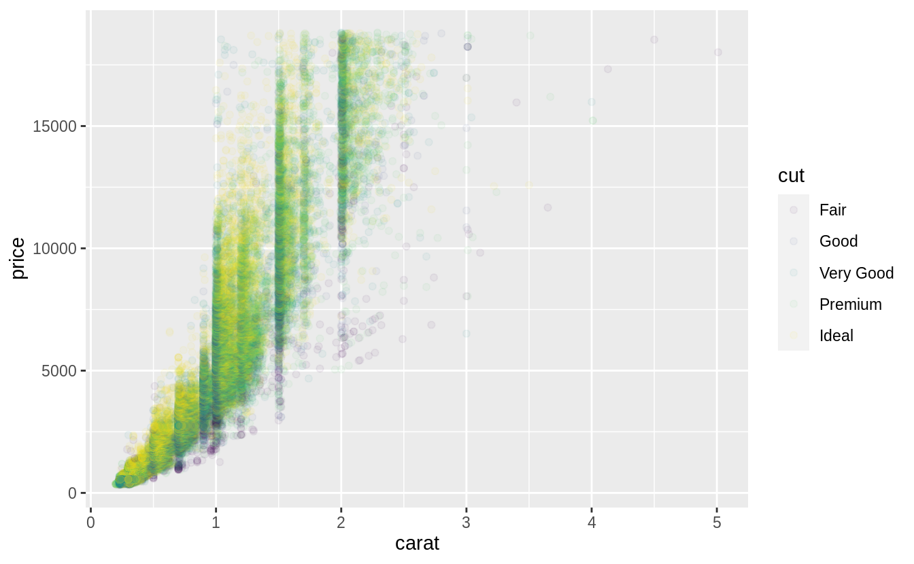

The problem with the legend is that the `alpha` value make the colors hard to see. So I'll override the alpha value to make the points solid in the legend.

```r
ggplot(diamonds, aes(carat, price)) +
  geom_point(aes(colour = cut), alpha = 1 / 20) +
  theme(legend.position = "bottom") +
  guides(colour = guide_legend(nrow = 1, override.aes = list(alpha = 1)))
```

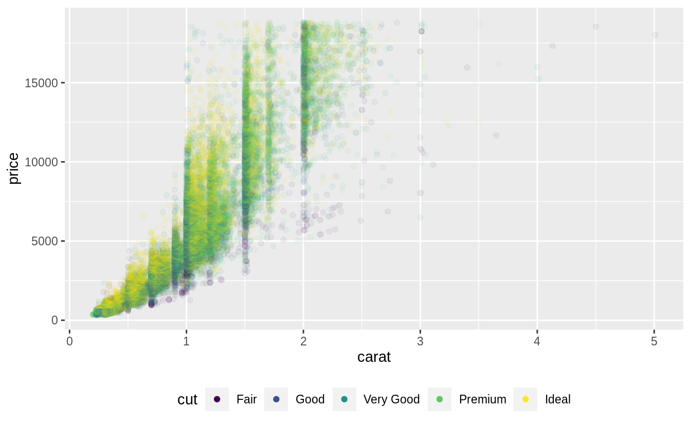

</div>

## Zooming {#zooming .r4ds-section}

<!--html_preserve--><div class="alert alert-warning hints-alert">
<div class="hints-icon">
<i class="fa fa-exclamation-circle"></i>
</div>
<div class="hints-container">No exercises</div>
</div><!--/html_preserve-->

## Themes {#themes .r4ds-section}

<!--html_preserve--><div class="alert alert-warning hints-alert">
<div class="hints-icon">
<i class="fa fa-exclamation-circle"></i>
</div>
<div class="hints-container">No exercises</div>
</div><!--/html_preserve-->

## Saving your plots {#saving-your-plots .r4ds-section}

<!--html_preserve--><div class="alert alert-warning hints-alert">
<div class="hints-icon">
<i class="fa fa-exclamation-circle"></i>
</div>
<div class="hints-container">No exercises</div>
</div><!--/html_preserve-->

## Learning more {#learning-more-4 .r4ds-section}

<!--html_preserve--><div class="alert alert-warning hints-alert">
<div class="hints-icon">
<i class="fa fa-exclamation-circle"></i>
</div>
<div class="hints-container">No exercises</div>
</div><!--/html_preserve-->
