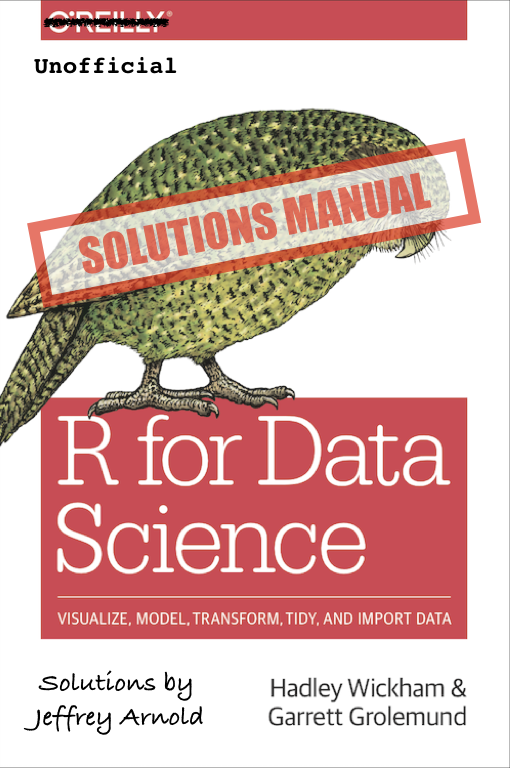

# Welcome {-}

This book contains the **exercise solutions** for the book [*R for Data Science*](http://amzn.to/2aHLAQ1), by Hadley Wickham and Garret Grolemund [@WickhamGrolemund2017].

*R for Data Science* itself is available online at [r4ds.had.co.nz](http://r4ds.had.co.nz/), and physical copy is published by O'Reilly Media and available from [amazon](http://amzn.to/2aHLAQ1).

This work is licensed under a <a rel="license" href="http://creativecommons.org/licenses/by/4.0/">Creative Commons Attribution 4.0 International License</a>
