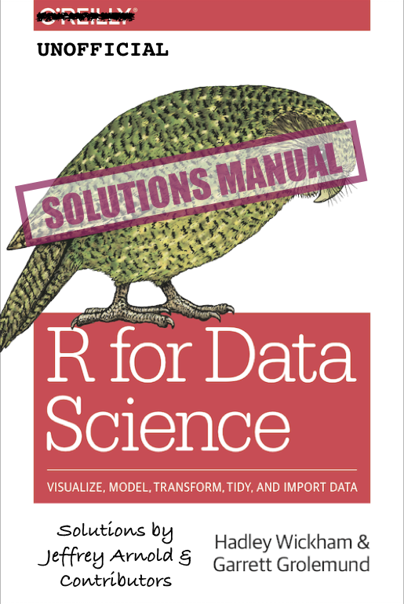

```{r include=FALSE,cache=FALSE,purl=FALSE}
# don't cache anything on this page
knitr::opts_chunk$set(cache = FALSE)
```

# Welcome {-}



This book contains the **exercise solutions** for the book [*R for Data Science*](https://amzn.to/2aHLAQ1), by Hadley Wickham and Garret Grolemund [@WickhamGrolemund2017].

*R for Data Science* itself is available online at [r4ds.had.co.nz](https://r4ds.had.co.nz/), and physical copy is published by O'Reilly Media and available from [amazon](https://amzn.to/2aHLAQ1).

## Acknowledgments {-}

```{r include=FALSE,purl=FALSE,cache=FALSE}
library("magrittr")
# adapted from usethis:::github_repo_spec
github_repo_spec <- function(path = here::here()) {
  stringr::str_c(gh::gh_tree_remote(path), collapse = "/")
}

# copied from usethis:::parse_repo_spec
parse_repo_spec <- function(repo_spec) {
  repo_split <- stringr::str_split(repo_spec, "/")[[1]]
  if (length(repo_split) != 2) {
    stop("`repo_spec` must be of the form 'owner/repo'")
  }
  list(owner = repo_split[[1]], repo = repo_split[[2]])
}

# copied from usethis:::spec_owner
spec_owner <- function(repo_spec) {
  parse_repo_spec(repo_spec)$owner
}

# copied from usethis:::spec_repo
spec_repo <- function(repo_spec) {
  parse_repo_spec(repo_spec)$repo
}

# Need to use the github API because this info isn't included in the
# commits for GitHub pulls: Github <noreply@github.com>

# adapted from from usethis:::use_tidy_thanks
github_contribs <- function(repo_spec = github_repo_spec(),
                          excluded = NULL) {
  if (is.null(excluded)) {
    excluded <- spec_owner(repo_spec)
  }
  res <- gh::gh("/repos/:owner/:repo/issues",
    owner = spec_owner(repo_spec),
    repo = spec_repo(repo_spec), state = "all",
    filter = "all", .limit = Inf
  )
  if (identical(res[[1]], "")) {
    message("No matching issues/PRs found.")
    return(invisible())
  }
  contributors <- purrr:::map_chr(res, c("user", "login")) %>%
    purrr::discard(~.x %in% excluded) %>%
    unique() %>%
    sort()
  glue::glue("[\\@{contributors}](https://github.com/{contributors})") %>%
    glue::glue_collapse(sep = ", ", width = Inf, last = ", and")
}

hypothesis_contribs <- function() {
  hypothesis_user_url <- function(x) {
    username <- stringr::str_match(x, "acct:(.*)@")[1, 2]
    url <- stringr::str_c("https://hypothes.is/users/", username)
    stringr::str_c("[\\@", username, "](", url, ")")
  }

  hypothesis_url <- "https://hypothes.is/api/search"
  url_pattern <- "https://jrnold.github.io/r4ds-exercise-solutions/*"
  annotations <- httr::GET(hypothesis_url,
                           query = list(wildcard_uri = url_pattern)) %>%
    httr::content()

  annotations %>%
    purrr::pluck("rows") %>%
    purrr::keep(~ !.x$flagged) %>%
    purrr::map_chr("user") %>%
    unique() %>%
    purrr::discard(~ .x == "acct:jrnold@hypothes.is") %>%
    purrr::map_chr(hypothesis_user_url) %>%
    sort() %>%
    glue::glue_collapse(sep = ", ", width = Inf, last = ", and ")
}
```

These solutions have benefited from many contributors.
A special thanks to:

-   Garrett Grolemund and Hadley Wickham for writing the truly fantastic *R for Data Science*, without whom these solutions would not exist---literally.
-   [\@dongzhuoer](https://github.com/dongzhuoer) and [\@cfgauss](https://hypothes.is/users/cfgauss) for careful readings of the book and noticing numerous issues and proposing fixes.

Thank you to all of those who contributed issues or pull-requests on
[GitHub](https://github.com/jrnold/r4ds-exercise-solutions/graphs/contributors)
(in alphabetical order): `r github_contribs()`
Thank you to all of you who contributed annotations on [hypothes.is](https://hypothes.is/search?q=url%3Ajrnold.github.io%2Fr4ds-exercise-solutions%2F*) (in alphabetical order): `r hypothesis_contribs()`.

For another set of solutions for and notes on *R for Data Science* see [Yet Another 'R for Data Science' Study Guide](https://brshallo.github.io/r4ds_solutions/) by [Bryan Shalloway](https://github.com/brshallo).

## License {-}

This work is licensed under a <a rel="license" href="https://creativecommons.org/licenses/by/4.0/">Creative Commons Attribution 4.0 International License</a>.
