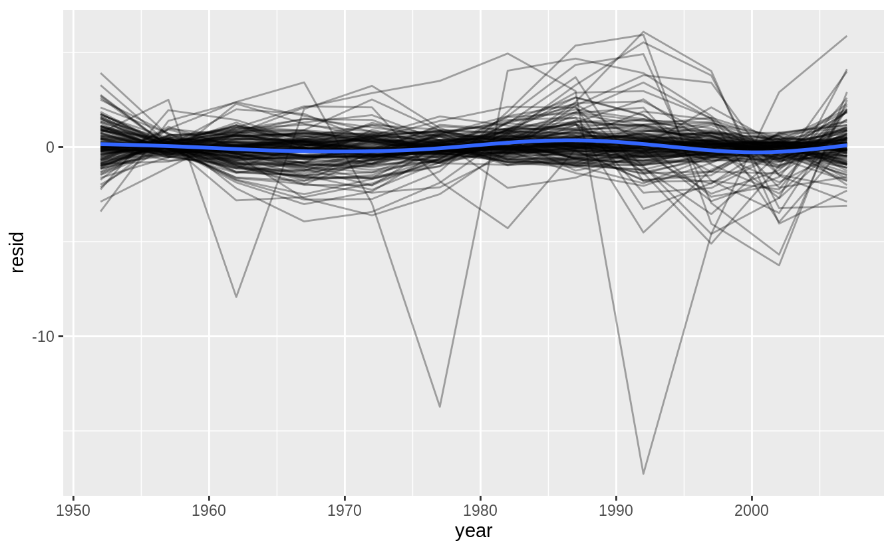
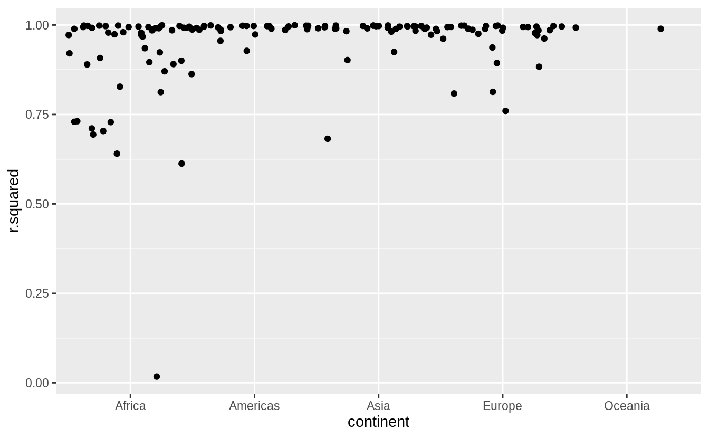
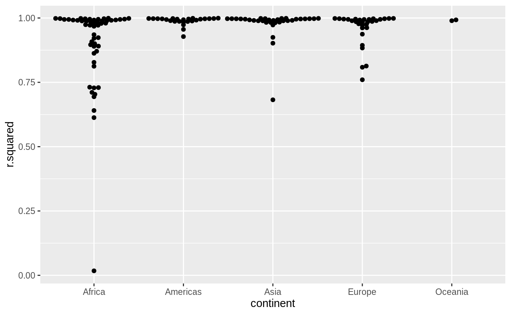

# Many models {#many-models .r4ds-section}

## Introduction {#introduction-17 .r4ds-section}


```r
library("modelr")
library("tidyverse")
library("gapminder")
```

## gapminder {#gapminder .r4ds-section}

### Exercise 25.2.1 {.unnumbered .exercise data-number="25.2.1"}

<div class="question">

A linear trend seems to be slightly too simple for the overall trend. 
Can you do better with a quadratic polynomial? 
How can you interpret the coefficients of the quadratic? 
Hint you might want to transform year so that it has mean zero.)

</div>

<div class="answer">

The following code replicates the analysis in the chapter but replaces the function `country_model()` with a regression that includes the year squared.

```r
lifeExp ~ poly(year, 2)
```


```r
country_model <- function(df) {
  lm(lifeExp ~ poly(year - median(year), 2), data = df)
}

by_country <- gapminder %>%
  group_by(country, continent) %>%
  nest()

by_country <- by_country %>%
  mutate(model = map(data, country_model))
```


```r
by_country <- by_country %>%
  mutate(
    resids = map2(data, model, add_residuals)
  )
by_country
#> # A tibble: 142 x 5
#> # Groups:   country, continent [142]
#>   country     continent data              model  resids           
#>   <fct>       <fct>     <list>            <list> <list>           
#> 1 Afghanistan Asia      <tibble [12 × 4]> <lm>   <tibble [12 × 5]>
#> 2 Albania     Europe    <tibble [12 × 4]> <lm>   <tibble [12 × 5]>
#> 3 Algeria     Africa    <tibble [12 × 4]> <lm>   <tibble [12 × 5]>
#> 4 Angola      Africa    <tibble [12 × 4]> <lm>   <tibble [12 × 5]>
#> 5 Argentina   Americas  <tibble [12 × 4]> <lm>   <tibble [12 × 5]>
#> 6 Australia   Oceania   <tibble [12 × 4]> <lm>   <tibble [12 × 5]>
#> # … with 136 more rows
```


```r
unnest(by_country, resids) %>%
  ggplot(aes(year, resid)) +
  geom_line(aes(group = country), alpha = 1 / 3) +
  geom_smooth(se = FALSE)
#> `geom_smooth()` using method = 'gam' and formula 'y ~ s(x, bs = "cs")'
```




```r
by_country %>%
  mutate(glance = map(model, broom::glance)) %>%
  unnest(glance, .drop = TRUE) %>%
  ggplot(aes(continent, r.squared)) +
  geom_jitter(width = 0.5)
#> Warning: The `.drop` argument of `unnest()` is deprecated as of tidyr 1.0.0.
#> All list-columns are now preserved.
#> This warning is displayed once every 8 hours.
#> Call `lifecycle::last_warnings()` to see where this warning was generated.
```



</div>

### Exercise 25.2.2 {.unnumbered .exercise data-number="25.2.2"}

<div class="question">
Explore other methods for visualizing the distribution of $R^2$ per continent. 
You might want to try the ggbeeswarm package, which provides similar methods for avoiding overlaps as jitter, but uses deterministic methods.

</div>

<div class="answer">

See exercise 7.5.1.1.6 for more on ggbeeswarm


```r
library("ggbeeswarm")
by_country %>%
  mutate(glance = map(model, broom::glance)) %>%
  unnest(glance, .drop = TRUE) %>%
  ggplot(aes(continent, r.squared)) +
  geom_beeswarm()
```



</div>

### Exercise 25.2.3 {.unnumbered .exercise data-number="25.2.3"}

<div class="question">

To create the last plot (showing the data for the countries with the worst model fits),
we needed two steps:
we created a data frame with one row per country 
and then semi-joined it to the original dataset. 
It’s possible to avoid this join if we use `unnest()` instead of `unnest(.drop = TRUE)`.
How?

</div>

<div class="answer">


```r
gapminder %>%
  group_by(country, continent) %>%
  nest() %>%
  mutate(model = map(data, ~lm(lifeExp ~ year, .))) %>%
  mutate(glance = map(model, broom::glance)) %>%
  unnest(glance) %>%
  unnest(data) %>%
  filter(r.squared < 0.25) %>%
  ggplot(aes(year, lifeExp)) +
  geom_line(aes(color = country))
```


</div>

## List-columns {#list-columns-1 .r4ds-section}

<!--html_preserve--><div class="alert alert-warning hints-alert">
<div class="hints-icon">
<i class="fa fa-exclamation-circle"></i>
</div>
<div class="hints-container">No exercises</div>
</div><!--/html_preserve-->

## Creating list-columns {#creating-list-columns .r4ds-section}

### Exercise 25.4.1 {.unnumbered .exercise data-number="25.4.1"}

<div class="question">

List all the functions that you can think of that take a atomic vector and return a list.

</div>

<div class="answer">

Many functions in the stringr package take a character vector as input and return a list.

```r
str_split(sentences[1:3], " ")
#> [[1]]
#> [1] "The"     "birch"   "canoe"   "slid"    "on"      "the"     "smooth" 
#> [8] "planks."
#> 
#> [[2]]
#> [1] "Glue"        "the"         "sheet"       "to"          "the"        
#> [6] "dark"        "blue"        "background."
#> 
#> [[3]]
#> [1] "It's"  "easy"  "to"    "tell"  "the"   "depth" "of"    "a"     "well."
str_match_all(c("abc", "aa", "aabaa", "abbbc"), "a+")
#> [[1]]
#>      [,1]
#> [1,] "a" 
#> 
#> [[2]]
#>      [,1]
#> [1,] "aa"
#> 
#> [[3]]
#>      [,1]
#> [1,] "aa"
#> [2,] "aa"
#> 
#> [[4]]
#>      [,1]
#> [1,] "a"
```
The `map()` function takes a vector and always returns a list.

```r
map(1:3, runif)
#> [[1]]
#> [1] 0.601
#> 
#> [[2]]
#> [1] 0.1572 0.0074
#> 
#> [[3]]
#> [1] 0.466 0.498 0.290
```

</div>

### Exercise 25.4.2 {.unnumbered .exercise data-number="25.4.2"}

<div class="question">

Brainstorm useful summary functions that, like `quantile()`, return multiple values.

</div>

<div class="answer">

Some examples of summary functions that return multiple values are the following.

```r
range(mtcars$mpg)
#> [1] 10.4 33.9
fivenum(mtcars$mpg)
#> [1] 10.4 15.3 19.2 22.8 33.9
boxplot.stats(mtcars$mpg)
#> $stats
#> [1] 10.4 15.3 19.2 22.8 33.9
#> 
#> $n
#> [1] 32
#> 
#> $conf
#> [1] 17.1 21.3
#> 
#> $out
#> numeric(0)
```

</div>

### Exercise 25.4.3 {.unnumbered .exercise data-number="25.4.3"}

<div class="question">

What’s missing in the following data frame? 
How does `quantile()` return that missing piece? 
Why isn’t that helpful here?


```r
mtcars %>%
  group_by(cyl) %>%
  summarise(q = list(quantile(mpg))) %>%
  unnest()
#> `summarise()` ungrouping output (override with `.groups` argument)
#> Warning: `cols` is now required when using unnest().
#> Please use `cols = c(q)`
#> # A tibble: 15 x 2
#>     cyl     q
#>   <dbl> <dbl>
#> 1     4  21.4
#> 2     4  22.8
#> 3     4  26  
#> 4     4  30.4
#> 5     4  33.9
#> 6     6  17.8
#> # … with 9 more rows
```

</div>

<div class="answer">

The particular quantiles of the values are missing, e.g. `0%`, `25%`, `50%`, `75%`, `100%`. `quantile()` returns these in the names of the vector.

```r
quantile(mtcars$mpg)
#>   0%  25%  50%  75% 100% 
#> 10.4 15.4 19.2 22.8 33.9
```

Since the `unnest` function drops the names of the vector, they aren't useful here.

</div>

### Exercise 25.4.4 {.unnumbered .exercise data-number="25.4.4"}

<div class="question">

What does this code do?
Why might might it be useful?

```r
mtcars %>%
  group_by(cyl) %>%
  summarise_each(funs(list))
```

</div>

<div class="answer">


```r
mtcars %>%
  group_by(cyl) %>%
  summarise_each(funs(list))
#> Warning: `summarise_each_()` is deprecated as of dplyr 0.7.0.
#> Please use `across()` instead.
#> This warning is displayed once every 8 hours.
#> Call `lifecycle::last_warnings()` to see where this warning was generated.
#> Warning: `funs()` is deprecated as of dplyr 0.8.0.
#> Please use a list of either functions or lambdas: 
#> 
#>   # Simple named list: 
#>   list(mean = mean, median = median)
#> 
#>   # Auto named with `tibble::lst()`: 
#>   tibble::lst(mean, median)
#> 
#>   # Using lambdas
#>   list(~ mean(., trim = .2), ~ median(., na.rm = TRUE))
#> This warning is displayed once every 8 hours.
#> Call `lifecycle::last_warnings()` to see where this warning was generated.
#> # A tibble: 3 x 11
#>     cyl mpg     disp    hp      drat   wt     qsec   vs     am     gear   carb  
#>   <dbl> <list>  <list>  <list>  <list> <list> <list> <list> <list> <list> <list>
#> 1     4 <dbl [… <dbl [… <dbl [… <dbl … <dbl … <dbl … <dbl … <dbl … <dbl … <dbl …
#> 2     6 <dbl [… <dbl [… <dbl [… <dbl … <dbl … <dbl … <dbl … <dbl … <dbl … <dbl …
#> 3     8 <dbl [… <dbl [… <dbl [… <dbl … <dbl … <dbl … <dbl … <dbl … <dbl … <dbl …
```

It creates a data frame in which each row corresponds to a value of `cyl`,
and each observation for each column (other than `cyl`) is a vector of all the values of that column for that value of `cyl`.
It seems like it should be useful to have all the observations of each variable for each group, but off the top of my head, I can't think of a specific use for this.
But, it seems that it may do many things that `dplyr::do` does.

</div>

## Simplifying list-columns {#simplifying-list-columns .r4ds-section}

### Exercise 25.5.1 {.unnumbered .exercise data-number="25.5.1"}

<div class="question">

Why might the `lengths()` function be useful for creating atomic vector columns from list-columns?

</div>

<div class="answer">

The `lengths()` function returns the lengths of each element in a list.
It could be useful for testing whether all elements in a list-column are the same length.
You could get the maximum length to determine how many atomic vector columns to create.
It is also a replacement for something like `map_int(x, length)` or `sapply(x, length)`.

</div>

### Exercise 25.5.2 {.unnumbered .exercise data-number="25.5.2"}

<div class="question">

List the most common types of vector found in a data frame.
What makes lists different?

</div>

<div class="answer">

The common types of vectors in data frames are:

-   `logical`
-   `numeric`
-   `integer`
-   `character`
-   `factor`

All of the common types of vectors in data frames are atomic. 
Lists are not atomic since they can contain other lists and other vectors.

</div>

## Making tidy data with broom {#making-tidy-data-with-broom .r4ds-section}

<!--html_preserve--><div class="alert alert-warning hints-alert">
<div class="hints-icon">
<i class="fa fa-exclamation-circle"></i>
</div>
<div class="hints-container">No exercises</div>
</div><!--/html_preserve-->
