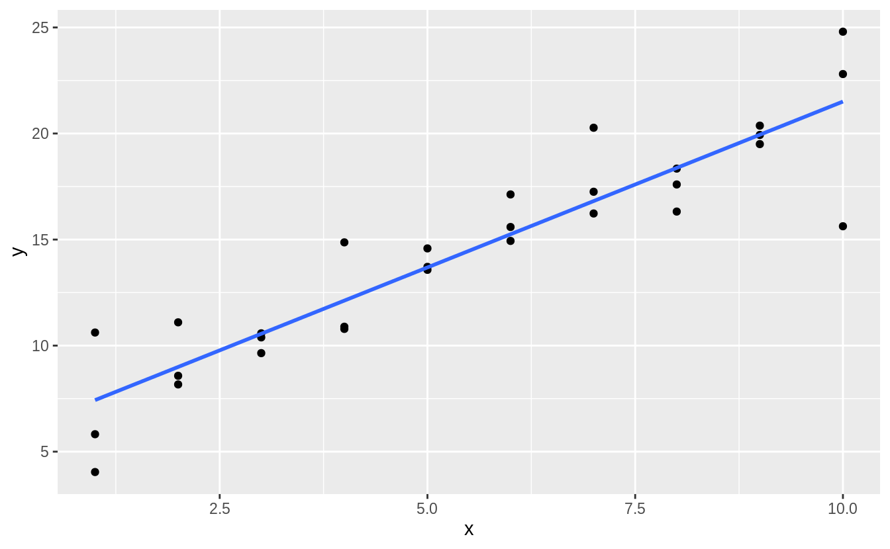
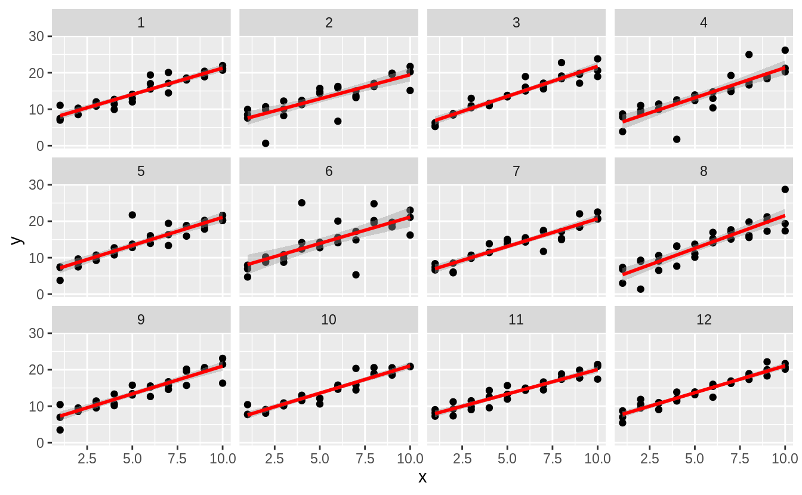
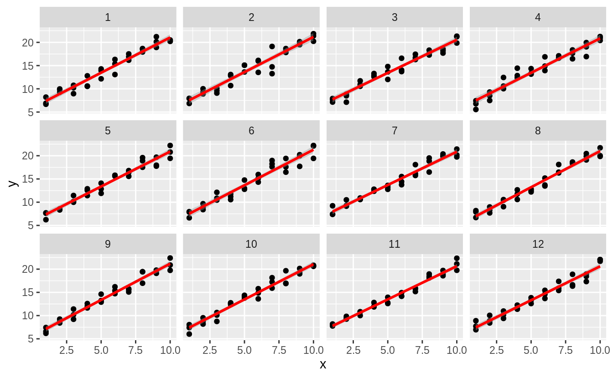
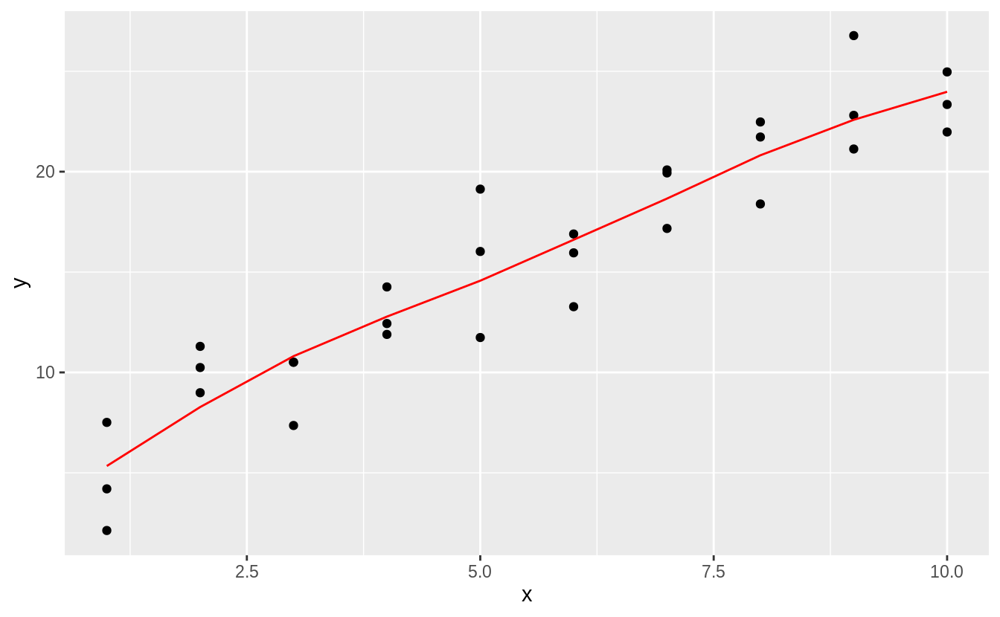
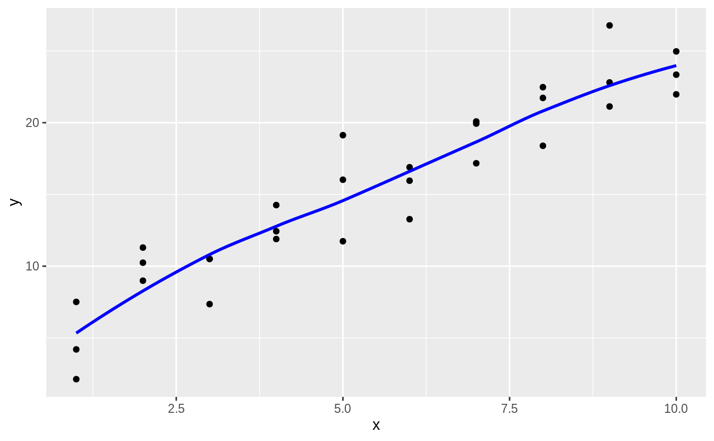
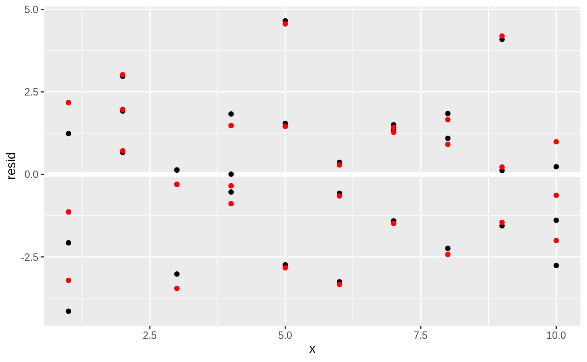
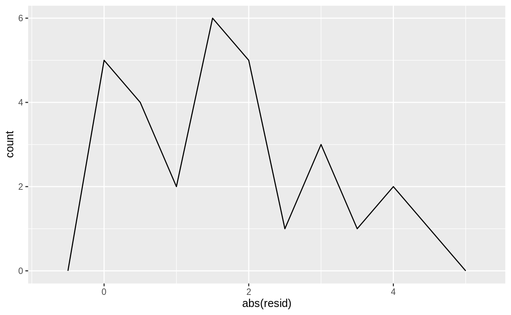
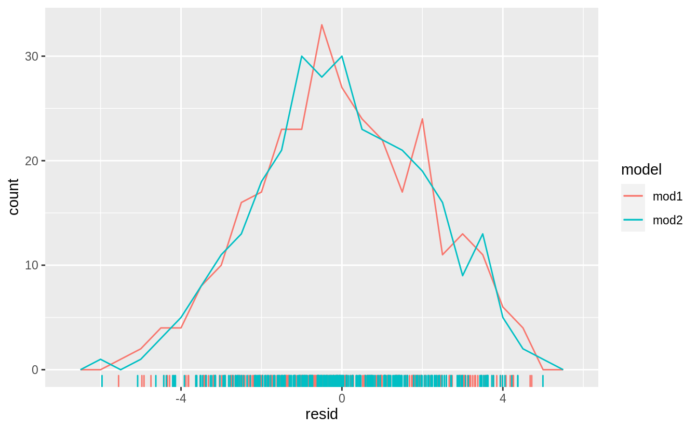
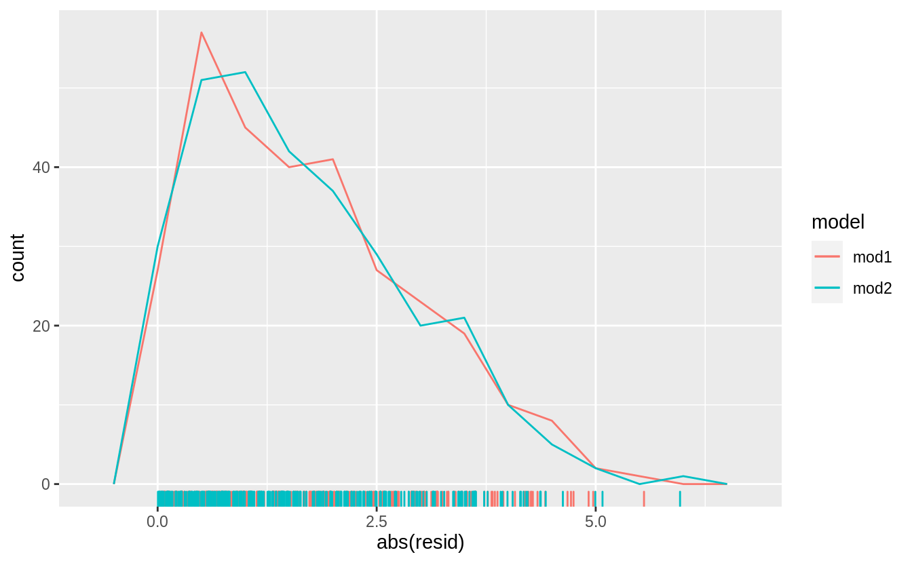

# Model basics {#model-basics .r4ds-section}

## Introduction {#introduction-15 .r4ds-section}


```r
library("tidyverse")
library("modelr")
```

The option `na.action` determines how missing values are handled.
It is a function.
`na.warn` sets it so that there is a warning if there are any missing values.
If it is not set (the default), R will silently drop them.


```r
options(na.action = na.warn)
```

## A simple model {#a-simple-model .r4ds-section}

### Exercise 23.2.1 {.unnumbered .exercise data-number="23.2.1"}

<div class="question">
One downside of the linear model is that it is sensitive to unusual values because the distance incorporates a squared term. Fit a linear model to the simulated data below, and visualize the results. Rerun a few times to generate different simulated datasets. What do you notice about the model?
</div>

<div class="answer">


```r
sim1a <- tibble(
  x = rep(1:10, each = 3),
  y = x * 1.5 + 6 + rt(length(x), df = 2)
)
```

Let's run it once and plot the results:

```r
ggplot(sim1a, aes(x = x, y = y)) +
  geom_point() +
  geom_smooth(method = "lm", se = FALSE)
#> `geom_smooth()` using formula 'y ~ x'
```


We can also do this more systematically, by generating several simulations
and plotting the line.


```r
simt <- function(i) {
  tibble(
    x = rep(1:10, each = 3),
    y = x * 1.5 + 6 + rt(length(x), df = 2),
    .id = i
  )
}

sims <- map_df(1:12, simt)

ggplot(sims, aes(x = x, y = y)) +
  geom_point() +
  geom_smooth(method = "lm", colour = "red") +
  facet_wrap(~.id, ncol = 4)
#> `geom_smooth()` using formula 'y ~ x'
```



What if we did the same things with normal distributions?

```r
sim_norm <- function(i) {
  tibble(
    x = rep(1:10, each = 3),
    y = x * 1.5 + 6 + rnorm(length(x)),
    .id = i
  )
}

simdf_norm <- map_df(1:12, sim_norm)

ggplot(simdf_norm, aes(x = x, y = y)) +
  geom_point() +
  geom_smooth(method = "lm", colour = "red") +
  facet_wrap(~.id, ncol = 4)
#> `geom_smooth()` using formula 'y ~ x'
```


There are not large outliers, and the slopes are more similar.

The reason for this is that the Student's $t$-distribution, from which we sample with `rt()` has heavier tails than the normal distribution (`rnorm()`). This means that the Student's t-distribution
assigns a larger probability to values further from the center of the distribution.

```r
tibble(
  x = seq(-5, 5, length.out = 100),
  normal = dnorm(x),
  student_t = dt(x, df = 2)
) %>%
  pivot_longer(-x, names_to="distribution", values_to="density") %>%
  ggplot(aes(x = x, y = density, colour = distribution)) +
  geom_line()
```


For a normal distribution with mean zero and standard deviation one, the probability of being greater than 2 is,

```r
pnorm(2, lower.tail = FALSE)
#> [1] 0.0228
```
For a Student's $t$ distribution with degrees of freedom = 2, it is more than 3 times higher,

```r
pt(2, df = 2, lower.tail = FALSE)
#> [1] 0.0918
```

</div>

### Exercise 23.2.2 {.unnumbered .exercise data-number="23.2.2"}

<div class="question">
One way to make linear models more robust is to use a different distance measure. For example, instead of root-mean-squared distance, you could use mean-absolute distance:
</div>

<div class="answer">


```r
measure_distance <- function(mod, data) {
  diff <- data$y - make_prediction(mod, data)
  mean(abs(diff))
}
```

For the above function to work, we need to define a function, `make_prediction()`, that
takes a numeric vector of length two (the intercept and slope) and returns the predictions,

```r
make_prediction <- function(mod, data) {
  mod[1] + mod[2] * data$x
}
```

Using the `sim1a` data, the best parameters of the least absolute deviation are:

```r
best <- optim(c(0, 0), measure_distance, data = sim1a)
best$par
#> [1] 5.25 1.66
```
Using the `sim1a` data, while the parameters the minimize the least squares objective function are:

```r
measure_distance_ls <- function(mod, data) {
  diff <- data$y - (mod[1] + mod[2] * data$x)
  sqrt(mean(diff^2))
}

best <- optim(c(0, 0), measure_distance_ls, data = sim1a)
best$par
#> [1] 5.87 1.56
```

In practice, I suggest not using  `optim()` to fit this model, and instead using an existing implementation.
The `rlm()` and `lqs()` functions in the [MASS](https://CRAN.R-project.org/package=MASS) fit robust and resistant linear models.

</div>

### Exercise 23.2.3 {.unnumbered .exercise data-number="23.2.3"}

<div class="question">
One challenge with performing numerical optimization is that it’s only guaranteed to find a local optimum. What’s the problem with optimizing a three parameter model like this?
</div>

<div class="answer">


```r
model3 <- function(a, data) {
  a[1] + data$x * a[2] + a[3]
}
```

The problem is that you for any values `a[1] = a1` and `a[3] = a3`, any other values of `a[1]` and `a[3]` where `a[1] + a[3] == (a1 + a3)` will have the same fit.


```r
measure_distance_3 <- function(a, data) {
  diff <- data$y - model3(a, data)
  sqrt(mean(diff^2))
}
```
Depending on our starting points, we can find different optimal values:

```r
best3a <- optim(c(0, 0, 0), measure_distance_3, data = sim1)
best3a$par
#> [1] 3.367 2.052 0.853
```

```r
best3b <- optim(c(0, 0, 1), measure_distance_3, data = sim1)
best3b$par
#> [1] -3.47  2.05  7.69
```

```r
best3c <- optim(c(0, 0, 5), measure_distance_3, data = sim1)
best3c$par
#> [1] -1.12  2.05  5.35
```
In fact there are an infinite number of optimal values for this model.

<!-- How to discuss this better ?

Problem is that due to finite iterations, numerically these converge:

> sum(best3a$par[c(1, 3)])
[1] 4.220074
> sum(best3b$par[c(1, 3)])
[1] 4.220404
> sum(best3c$par[c(1, 3)])
[1] 4.22117

-->

</div>

## Visualising models {#visualising-models .r4ds-section}

### Exercise 23.3.1 {.unnumbered .exercise data-number="23.3.1"}

<div class="question">
Instead of using `lm()` to fit a straight line, you can use `loess()` to fit a smooth curve. Repeat the process of model fitting, grid generation, predictions, and visualization on `sim1` using `loess()` instead of `lm()`. How does the result compare to `geom_smooth()`?
</div>

<div class="answer">

I'll use `add_predictions()` and `add_residuals()` to add the predictions and residuals from a loess regression to the `sim1` data.


```r
sim1_loess <- loess(y ~ x, data = sim1)
sim1_lm <- lm(y ~ x, data = sim1)

grid_loess <- sim1 %>%
  add_predictions(sim1_loess)

sim1 <- sim1 %>%
  add_residuals(sim1_lm) %>%
  add_predictions(sim1_lm) %>%
  add_residuals(sim1_loess, var = "resid_loess") %>%
  add_predictions(sim1_loess, var = "pred_loess")
```

This plots the loess predictions.
The loess produces a nonlinear, smooth line through the data.

```r
plot_sim1_loess <-
  ggplot(sim1, aes(x = x, y = y)) +
  geom_point() +
  geom_line(aes(x = x, y = pred), data = grid_loess, colour = "red")
plot_sim1_loess
```



The predictions of loess are the same as the default method for `geom_smooth()` because `geom_smooth()` uses `loess()` by default; the message even tells us that.

```r
plot_sim1_loess +
  geom_smooth(method = "loess", colour = "blue", se = FALSE, alpha = 0.20)
#> `geom_smooth()` using formula 'y ~ x'
```



We can plot the residuals (red), and compare them to the residuals from `lm()` (black).
In general, the loess model has smaller residuals within the sample (out of sample is a different issue, and we haven't considered the uncertainty of these estimates).


```r
ggplot(sim1, aes(x = x)) +
  geom_ref_line(h = 0) +
  geom_point(aes(y = resid)) +
  geom_point(aes(y = resid_loess), colour = "red")
```



</div>

### Exercise 23.3.2 {.unnumbered .exercise data-number="23.3.2"}

<div class="question">
`add_predictions()` is paired with `gather_predictions()` and `spread_predictions()`.
How do these three functions differ?
</div>

<div class="answer">

The functions `gather_predictions()` and `spread_predictions()` allow for adding predictions from multiple models at once.

Taking the `sim1_mod` example,

```r
sim1_mod <- lm(y ~ x, data = sim1)
grid <- sim1 %>%
  data_grid(x)
```

The function `add_predictions()` adds only a single model at a time.
To add two models:

```r
grid %>%
  add_predictions(sim1_mod, var = "pred_lm") %>%
  add_predictions(sim1_loess, var = "pred_loess")
#> # A tibble: 10 x 3
#>       x pred_lm pred_loess
#>   <int>   <dbl>      <dbl>
#> 1     1    6.27       5.34
#> 2     2    8.32       8.27
#> 3     3   10.4       10.8 
#> 4     4   12.4       12.8 
#> 5     5   14.5       14.6 
#> 6     6   16.5       16.6 
#> # … with 4 more rows
```
The function `gather_predictions()` adds predictions from multiple models by
stacking the results and adding a column with the model name,

```r
grid %>%
  gather_predictions(sim1_mod, sim1_loess)
#> # A tibble: 20 x 3
#>   model        x  pred
#>   <chr>    <int> <dbl>
#> 1 sim1_mod     1  6.27
#> 2 sim1_mod     2  8.32
#> 3 sim1_mod     3 10.4 
#> 4 sim1_mod     4 12.4 
#> 5 sim1_mod     5 14.5 
#> 6 sim1_mod     6 16.5 
#> # … with 14 more rows
```
The function `spread_predictions()` adds predictions from multiple models by
adding multiple columns (postfixed with the model name) with predictions from each model.

```r
grid %>%
  spread_predictions(sim1_mod, sim1_loess)
#> # A tibble: 10 x 3
#>       x sim1_mod sim1_loess
#>   <int>    <dbl>      <dbl>
#> 1     1     6.27       5.34
#> 2     2     8.32       8.27
#> 3     3    10.4       10.8 
#> 4     4    12.4       12.8 
#> 5     5    14.5       14.6 
#> 6     6    16.5       16.6 
#> # … with 4 more rows
```
The function `spread_predictions()` is similar to the example which runs `add_predictions()` for each model, and is equivalent to running `spread()` after
running `gather_predictions()`:

```r
grid %>%
  gather_predictions(sim1_mod, sim1_loess) %>%
  spread(model, pred)
#> # A tibble: 10 x 3
#>       x sim1_loess sim1_mod
#>   <int>      <dbl>    <dbl>
#> 1     1       5.34     6.27
#> 2     2       8.27     8.32
#> 3     3      10.8     10.4 
#> 4     4      12.8     12.4 
#> 5     5      14.6     14.5 
#> 6     6      16.6     16.5 
#> # … with 4 more rows
```

</div>

### Exercise 23.3.3 {.unnumbered .exercise data-number="23.3.3"}

<div class="question">
What does `geom_ref_line()` do? What package does it come from?
Why is displaying a reference line in plots showing residuals useful and important?
</div>

<div class="answer">

The geom `geom_ref_line()` adds as reference line to a plot.
It is equivalent to running `geom_hline()` or `geom_vline()` with default settings that are useful for visualizing models.
Putting a reference line at zero for residuals is important because good models (generally) should have residuals centered at zero, with approximately the same variance (or distribution) over the support of x, and no correlation.
A zero reference line makes it easier to judge these characteristics visually.

</div>

### Exercise 23.3.4 {.unnumbered .exercise data-number="23.3.4"}

<div class="question">
Why might you want to look at a frequency polygon of absolute residuals?
What are the pros and cons compared to looking at the raw residuals?
</div>

<div class="answer">

Showing the absolute values of the residuals makes it easier to view the spread of the residuals.
The model assumes that the residuals have mean zero, and using the absolute values of the residuals effectively doubles the number of residuals.

```r
sim1_mod <- lm(y ~ x, data = sim1)

sim1 <- sim1 %>%
  add_residuals(sim1_mod)

ggplot(sim1, aes(x = abs(resid))) +
  geom_freqpoly(binwidth = 0.5)
```



However, using the absolute values of residuals throws away information about the sign, meaning that the
frequency polygon cannot show whether the model systematically over- or under-estimates the residuals.

</div>

## Formulas and model families {#formulas-and-model-families .r4ds-section}

### Exercise 23.4.1 {.unnumbered .exercise data-number="23.4.1"}

<div class="question">
What happens if you repeat the analysis of `sim2` using a model without an intercept. What happens to the model equation?
What happens to the predictions?
</div>

<div class="answer">

To run a model without an intercept, add `- 1` or `+ 0` to the right-hand-side o f the formula:

```r
mod2a <- lm(y ~ x - 1, data = sim2)
```

```r
mod2 <- lm(y ~ x, data = sim2)
```

The predictions are exactly the same in the models with and without an intercept:

```r
grid <- sim2 %>%
  data_grid(x) %>%
  spread_predictions(mod2, mod2a)
grid
#> # A tibble: 4 x 3
#>   x      mod2 mod2a
#>   <chr> <dbl> <dbl>
#> 1 a      1.15  1.15
#> 2 b      8.12  8.12
#> 3 c      6.13  6.13
#> 4 d      1.91  1.91
```

</div>

### Exercise 23.4.2 {.unnumbered .exercise data-number="23.4.2"}

<div class="question">
Use `model_matrix()` to explore the equations generated for the models I fit to `sim3` and `sim4`.
Why is `*` a good shorthand for interaction?
</div>

<div class="answer">

For `x1 * x2` when `x2` is a categorical variable produces indicator variables `x2b`, `x2c`, `x2d` and
variables `x1:x2b`, `x1:x2c`, and `x1:x2d` which are the products of `x1` and `x2*` variables:

```r
x3 <- model_matrix(y ~ x1 * x2, data = sim3)
x3
#> # A tibble: 120 x 8
#>   `(Intercept)`    x1   x2b   x2c   x2d `x1:x2b` `x1:x2c` `x1:x2d`
#>           <dbl> <dbl> <dbl> <dbl> <dbl>    <dbl>    <dbl>    <dbl>
#> 1             1     1     0     0     0        0        0        0
#> 2             1     1     0     0     0        0        0        0
#> 3             1     1     0     0     0        0        0        0
#> 4             1     1     1     0     0        1        0        0
#> 5             1     1     1     0     0        1        0        0
#> 6             1     1     1     0     0        1        0        0
#> # … with 114 more rows
```
We can confirm that the variables `x1:x2b` is the product of `x1` and `x2b`,

```r
all(x3[["x1:x2b"]] == (x3[["x1"]] * x3[["x2b"]]))
#> [1] TRUE
```
and similarly for `x1:x2c` and `x2c`, and `x1:x2d` and `x2d`:

```r
all(x3[["x1:x2c"]] == (x3[["x1"]] * x3[["x2c"]]))
#> [1] TRUE
all(x3[["x1:x2d"]] == (x3[["x1"]] * x3[["x2d"]]))
#> [1] TRUE
```

For `x1 * x2` where both `x1` and `x2` are continuous variables, `model_matrix()` creates variables
`x1`, `x2`, and `x1:x2`:

```r
x4 <- model_matrix(y ~ x1 * x2, data = sim4)
x4
#> # A tibble: 300 x 4
#>   `(Intercept)`    x1     x2 `x1:x2`
#>           <dbl> <dbl>  <dbl>   <dbl>
#> 1             1    -1 -1       1    
#> 2             1    -1 -1       1    
#> 3             1    -1 -1       1    
#> 4             1    -1 -0.778   0.778
#> 5             1    -1 -0.778   0.778
#> 6             1    -1 -0.778   0.778
#> # … with 294 more rows
```
Confirm that `x1:x2` is the product of the `x1` and `x2`,

```r
all(x4[["x1"]] * x4[["x2"]] == x4[["x1:x2"]])
#> [1] TRUE
```

The asterisk `*` is good shorthand for an interaction since an interaction between `x1` and `x2` includes
terms for `x1`, `x2`, and the product of `x1` and `x2`.

</div>

### Exercise 23.4.3 {.unnumbered .exercise data-number="23.4.3"}

<div class="question">
Using the basic principles, convert the formulas in the following two models into functions.
(Hint: start by converting the categorical variable into 0-1 variables.)
</div>


```r
mod1 <- lm(y ~ x1 + x2, data = sim3)
mod2 <- lm(y ~ x1 * x2, data = sim3)
```

<div class="answer">

The problem is to convert the formulas in the models into functions. 
I will assume that the function is only handling the conversion of the right hand side of the formula into a model matrix.
The functions will take one argument, a data frame with `x1` and `x2` columns,
and it will return a data frame.
In other words, the functions will be special cases of the `model_matrix()` function.

Consider the right hand side of the first formula, `~ x1 + x2`.
In the `sim3` data frame, the column `x1` is an integer, and the variable `x2` is a factor with four levels.

```r
levels(sim3$x2)
#> [1] "a" "b" "c" "d"
```

Since `x1` is numeric it is unchanged.
Since `x2` is a factor it is replaced with columns of indicator variables for all but one of its levels.
I will first consider the special case in which `x2` only takes the levels of `x2` in `sim3`.
In this case, "a" is considered the reference level and omitted, and new columns are made for "b", "c", and "d".

```r
model_matrix_mod1 <- function(.data) {
  mutate(.data,
    x2b = as.numeric(x2 == "b"),
    x2c = as.numeric(x2 == "c"),
    x2d = as.numeric(x2 == "d"),
    `(Intercept)` = 1
  ) %>%
    select(`(Intercept)`, x1, x2b, x2c, x2d)
}
```

```r
model_matrix_mod1(sim3)
#> # A tibble: 120 x 5
#>   `(Intercept)`    x1   x2b   x2c   x2d
#>           <dbl> <int> <dbl> <dbl> <dbl>
#> 1             1     1     0     0     0
#> 2             1     1     0     0     0
#> 3             1     1     0     0     0
#> 4             1     1     1     0     0
#> 5             1     1     1     0     0
#> 6             1     1     1     0     0
#> # … with 114 more rows
```

A more general function for `~ x1 + x2` would not hard-code the specific levels in `x2`.

```r
model_matrix_mod1b <- function(.data) {
  # the levels of x2
  lvls <- levels(.data$x2)
  # drop the first level
  # this assumes that there are at least two levels
  lvls <- lvls[2:length(lvls)]
  # create an indicator variable for each level of x2
  for (lvl in lvls) {
    # new column name x2 + level name
    varname <- str_c("x2", lvl)
    # add indicator variable for lvl
    .data[[varname]] <- as.numeric(.data$x2 == lvl)
  }
  # generate the list of variables to keep
  x2_variables <- str_c("x2", lvls)
  # Add an intercept
  .data[["(Intercept)"]] <- 1
  # keep x1 and x2 indicator variables
  select(.data, `(Intercept)`, x1, all_of(x2_variables))
}
```

```r
model_matrix_mod1b(sim3)
#> # A tibble: 120 x 5
#>   `(Intercept)`    x1   x2b   x2c   x2d
#>           <dbl> <int> <dbl> <dbl> <dbl>
#> 1             1     1     0     0     0
#> 2             1     1     0     0     0
#> 3             1     1     0     0     0
#> 4             1     1     1     0     0
#> 5             1     1     1     0     0
#> 6             1     1     1     0     0
#> # … with 114 more rows
```

Consider the right hand side of the first formula, `~ x1 * x2`.
The output data frame will consist of `x1`, columns with indicator variables for each level (except the reference level) of `x2`,
and columns with the `x2` indicator variables multiplied by `x1`.

As with the previous formula, first I'll write a function that hard-codes the levels of `x2`.

```r
model_matrix_mod2 <- function(.data) {
  mutate(.data,
    `(Intercept)` = 1,
    x2b = as.numeric(x2 == "b"),
    x2c = as.numeric(x2 == "c"),
    x2d = as.numeric(x2 == "d"),
    `x1:x2b` = x1 * x2b,
    `x1:x2c` = x1 * x2c,
    `x1:x2d` = x1 * x2d
  ) %>%
    select(`(Intercept)`, x1, x2b, x2c, x2d, `x1:x2b`, `x1:x2c`, `x1:x2d`)
}
```

```r
model_matrix_mod2(sim3)
#> # A tibble: 120 x 8
#>   `(Intercept)`    x1   x2b   x2c   x2d `x1:x2b` `x1:x2c` `x1:x2d`
#>           <dbl> <int> <dbl> <dbl> <dbl>    <dbl>    <dbl>    <dbl>
#> 1             1     1     0     0     0        0        0        0
#> 2             1     1     0     0     0        0        0        0
#> 3             1     1     0     0     0        0        0        0
#> 4             1     1     1     0     0        1        0        0
#> 5             1     1     1     0     0        1        0        0
#> 6             1     1     1     0     0        1        0        0
#> # … with 114 more rows
```

For a more general function which will handle arbitrary levels in `x2`, I will 
extend the `model_matrix_mod1b()` function that I wrote earlier.

```r
model_matrix_mod2b <- function(.data) {
  # get dataset with x1 and x2 indicator variables
  out <- model_matrix_mod1b(.data)
  # get names of the x2 indicator columns
  x2cols <- str_subset(colnames(out), "^x2")
  # create interactions between x1 and the x2 indicator columns
  for (varname in x2cols) {
    # name of the interaction variable
    newvar <- str_c("x1:", varname)
    out[[newvar]] <- out$x1 * out[[varname]]
  }
  out
}
```

```r
model_matrix_mod2b(sim3)
#> # A tibble: 120 x 8
#>   `(Intercept)`    x1   x2b   x2c   x2d `x1:x2b` `x1:x2c` `x1:x2d`
#>           <dbl> <int> <dbl> <dbl> <dbl>    <dbl>    <dbl>    <dbl>
#> 1             1     1     0     0     0        0        0        0
#> 2             1     1     0     0     0        0        0        0
#> 3             1     1     0     0     0        0        0        0
#> 4             1     1     1     0     0        1        0        0
#> 5             1     1     1     0     0        1        0        0
#> 6             1     1     1     0     0        1        0        0
#> # … with 114 more rows
```

These functions could be further generalized to allow for `x1` and `x2` to
be either numeric or factors. However, generalizing much more than that and 
we will soon start reimplementing all of the `matrix_model()` function.

</div>

### Exercise 23.4.4 {.unnumbered .exercise data-number="23.4.4"}

<div class="question">
For `sim4`, which of `mod1` and `mod2` is better?
I think `mod2` does a slightly better job at removing patterns, but it’s pretty subtle.
Can you come up with a plot to support my claim?
</div>

<div class="answer">

Estimate models `mod1` and `mod2` on `sim4`,

```r
mod1 <- lm(y ~ x1 + x2, data = sim4)
mod2 <- lm(y ~ x1 * x2, data = sim4)
```
and add the residuals from these models to the `sim4` data,

```r
sim4_mods <- gather_residuals(sim4, mod1, mod2)
```

Frequency plots of both the residuals,

```r

ggplot(sim4_mods, aes(x = resid, colour = model)) +
  geom_freqpoly(binwidth = 0.5) +
  geom_rug()
```


and the absolute values of the residuals,

```r
ggplot(sim4_mods, aes(x = abs(resid), colour = model)) +
  geom_freqpoly(binwidth = 0.5) +
  geom_rug()
```


does not show much difference in the residuals between the models.
However, `mod2` appears to have fewer residuals in the tails of the distribution between 2.5 and 5 (although the most extreme residuals are from `mod2`.

This is confirmed by checking the standard deviation of the residuals of these models,

```r
sim4_mods %>%
  group_by(model) %>%
  summarise(resid = sd(resid))
#> `summarise()` ungrouping output (override with `.groups` argument)
#> # A tibble: 2 x 2
#>   model resid
#>   <chr> <dbl>
#> 1 mod1   2.10
#> 2 mod2   2.07
```
The standard deviation of the residuals of `mod2` is smaller than that of `mod1`.

</div>

## Missing values {#missing-values-5 .r4ds-section}

<!--html_preserve--><div class="alert alert-warning hints-alert">
<div class="hints-icon">
<i class="fa fa-exclamation-circle"></i>
</div>
<div class="hints-container">No exercises</div>
</div><!--/html_preserve-->

## Other model families {#other-model-families .r4ds-section}

<!--html_preserve--><div class="alert alert-warning hints-alert">
<div class="hints-icon">
<i class="fa fa-exclamation-circle"></i>
</div>
<div class="hints-container">No exercises</div>
</div><!--/html_preserve-->
