# Model building {#model-building .r4ds-section}

## Introduction {#introduction-16 .r4ds-section}

The splines package is needed for the `ns()` function used in one of the 
solutions.


```r
library("tidyverse")
library("modelr")
library("lubridate")
library("broom")
library("nycflights13")
library("splines")
```


```r
options(na.action = na.warn)
```

## Why are low quality diamonds more expensive? {#diamond-prices .r4ds-section}

This code appears in the section and is necessary for the exercises.

```r
diamonds2 <- diamonds %>%
  filter(carat <= 2.5) %>%
  mutate(
    lprice = log2(price),
    lcarat = log2(carat)
  )

mod_diamond2 <- lm(lprice ~ lcarat + color + cut + clarity, data = diamonds2)

diamonds2 <- add_residuals(diamonds2, mod_diamond2, "lresid2")
```

### Exercise 24.2.1 {.unnumbered .exercise data-number="24.2.1"}

<div class="question">

In the plot of `lcarat` vs. `lprice`, there are some bright vertical strips. 
What do they represent?

</div>

<div class="answer">

The distribution of diamonds has more diamonds at round or otherwise human-friendly numbers (fractions).

</div>

### Exercise 24.2.2 {.unnumbered .exercise data-number="24.2.2"}

<div class="question">

If `log(price) = a_0 + a_1 * log(carat)`, what does that say about the relationship between `price` and `carat`?

</div>

<div class="answer">

Following the examples in the chapter, I use a base-2 logarithm.


```r
mod_log <- lm(log2(price) ~ log2(carat), data = diamonds)
mod_log
#> 
#> Call:
#> lm(formula = log2(price) ~ log2(carat), data = diamonds)
#> 
#> Coefficients:
#> (Intercept)  log2(carat)  
#>       12.19         1.68
```

The estimated relationship between `carat` and `price` looks like this.


```r
tibble(carat = seq(0.25, 5, by = 0.25)) %>%
  add_predictions(mod_log) %>%
  ggplot(aes(x = carat, y = 2^pred)) +
  geom_line() +
  labs(x = "carat", y = "price")
```

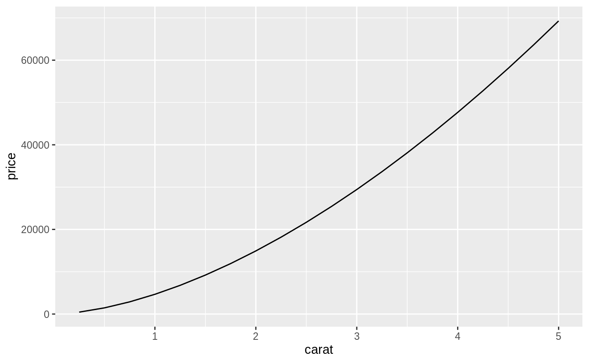

The plot shows that the estimated relationship between `carat` and `price` is not linear.
The exact relationship in this model is if $x$ increases $r$ times, then $y$ increases $r^{a_1}$ times.
For example, a two times increase in `carat` is associated with the following increase in `price`:


```r
2^coef(mod_log)[2]
#> log2(carat) 
#>         3.2
```

Let's confirm this relationship by checking it for a few values of the `carat` variable.
Let's increase `carat` from 1 to 2.


```r
2^(predict(mod_log, newdata = tibble(carat = 2)) -
  predict(mod_log, newdata = tibble(carat = 1)))
#>   1 
#> 3.2
```

Note that, since `predict()` predicts `log2(carat)` rather than `carat`, the prediction is exponentiated by 2.
Now let's increase `carat` from 4 to 2.


```r
2^(predict(mod_log, newdata = tibble(carat = 4)) -
  predict(mod_log, newdata = tibble(carat = 2)))
#>   1 
#> 3.2
```

Finally, let's increase `carat` from 0.5 to 1.


```r
2^(predict(mod_log, newdata = tibble(carat = 1)) -
  predict(mod_log, newdata = tibble(carat = 0.5)))
#>   1 
#> 3.2
```

All of these examples return the same value, $2 ^ {a_1} = 3.2$.

So why is this?
Let's ignore the names of the variables in this case and consider the equation:
$$
\log_b y = a_0 + a_1 \log x
$$
We want to understand how the difference in $y$ is related to the difference in $x$.
Now, consider this equation at two different values $x_1$ and $x_0$,
$$
\log_b y_0 = a_0 + \log_b x_0 \\
\log_b y_1 = a_0 + \log_b y_1
$$
What is the value of the difference, $\log y_1 - \log y_0$? 
$$
\begin{aligned}[t]
\log_b(y_1) - \log_b(y_0) &= (a_0 + a_1 \log_b x_1) - (a_0 + a_1 \log x_0) ,\\
&= a_1 (\log_b x_1 - \log x_0) , \\
\log_b \left(\frac{y_1}{y_0} \right) &= \log_b \left(\frac{x_1}{x_0} \right)^{a_1} , \\
\frac{y_1}{y_0} &=  \left( \frac{x_1}{x_0} \right)^{a_1} .
\end{aligned}
$$
Let $s = y_1 / y_0$ and $r = x_1 / x_0$. Then,
$$
s =  r^{a_1} \text{.}
$$
In other words, an $r$ times increase in $x$, is associated with a $r^{a_1}$ times  increase in $y$. 
Note that this relationship does not depend on the base of the logarithm, $b$.

There is another approximation that is commonly used when logarithms appear in regressions.

The first way to show this is using the approximation that $x$ is small, meaning that $x \approx 0$,
$$
\log (1 + x) \approx x
$$
This approximation is the first order Taylor expansion of the function at $x = 0$.
Now consider the relationship between the percent change in $x$ and the percent change in $y$,
$$
\begin{aligned}[t]
\log (y + \Delta y) - \log y &= (\alpha + \beta \log (x + \Delta x)) - (\alpha + \beta \log x) \\
\log \left(\frac{y + \Delta y}{y} \right) &=  \beta \log\left( \frac{x + \Delta x}{x} \right) \\
\log \left(1 + \frac{\Delta y}{y} \right) &= \beta  \log\left( 1 + \frac{\Delta x}{x} \right) \\
\frac{\Delta y}{y} &\approx \beta \left(\frac{\Delta x}{x} \right)
\end{aligned} 
$$
Thus a 1% percentage change in $x$ is associated with a $\beta$ percent change in $y$.

This relationship can also be derived by taking the derivative of $\log y$ with respect to $x$.
First, rewrite the equation in terms of $y$,
$$
y = \exp(a_0 + a_1 \log(x))
$$
Then differentiate $y$ with respect to $x$,
$$
\begin{aligned}[t]
dy &= \exp(a_0 + a_1 \log x) \left(\frac{a_1}{x}\right) dx \\
&= a_1 y \left(\frac{dx}{x} \right) \\
(dy / y) &= a_1 (dx / x) \\
\%\Delta y &= a_1\%\Delta x
\end{aligned}
$$

</div>

### Exercise 24.2.3 {.unnumbered .exercise data-number="24.2.3"}

<div class="question">
Extract the diamonds that have very high and very low residuals. Is there anything unusual about these diamonds? Are they particularly bad or good, or do you think these are pricing errors?
</div>

<div class="answer">

The answer to this question is provided in section [24.2.2](https://r4ds.had.co.nz/model-building.html#a-more-complicated-model).


```r
diamonds2 %>%
  filter(abs(lresid2) > 1) %>%
  add_predictions(mod_diamond2) %>%
  mutate(pred = round(2^pred)) %>%
  select(price, pred, carat:table, x:z) %>%
  arrange(price)
#> # A tibble: 16 x 11
#>   price  pred carat cut     color clarity depth table     x     y     z
#>   <int> <dbl> <dbl> <ord>   <ord> <ord>   <dbl> <dbl> <dbl> <dbl> <dbl>
#> 1  1013   264  0.25 Fair    F     SI2      54.4    64  4.3   4.23  2.32
#> 2  1186   284  0.25 Premium G     SI2      59      60  5.33  5.28  3.12
#> 3  1186   284  0.25 Premium G     SI2      58.8    60  5.33  5.28  3.12
#> 4  1262  2644  1.03 Fair    E     I1       78.2    54  5.72  5.59  4.42
#> 5  1415   639  0.35 Fair    G     VS2      65.9    54  5.57  5.53  3.66
#> 6  1415   639  0.35 Fair    G     VS2      65.9    54  5.57  5.53  3.66
#> # … with 10 more rows
```

<div class="alert alert-primary hints-alert">
I did not see anything too unusual. Do you?
</div>

</div>

### Exercise 24.2.4 {.unnumbered .exercise data-number="24.2.4"}

<div class="question">

Does the final model, `mod_diamonds2`, do a good job of predicting diamond prices? 
Would you trust it to tell you how much to spend if you were buying a diamond?

</div>

<div class="answer">

Section [24.2.2](https://r4ds.had.co.nz/model-building.html#a-more-complicated-model) already provides part of the answer to this question.

Plotting the residuals of the model shows that there are some large outliers for small carat sizes.
The largest of these residuals are a little over two, which means that the true value was four times lower; see [Exercise 24.2.2](#exercise-24.2.2).
Most of the mass of the residuals is between -0.5 and 0.5, which corresponds to about $\pm 40%$.
There seems to be a slight downward bias in the residuals as carat size increases.


```r
ggplot(diamonds2, aes(lcarat, lresid2)) +
  geom_hex(bins = 50)
```


```r
lresid2_summary <- summarise(diamonds2,
  rmse = sqrt(mean(lresid2^2)),
  mae = mean(abs(lresid2)),
  p025 = quantile(lresid2, 0.025),
  p975 = quantile(lresid2, 0.975)
)
lresid2_summary
#> # A tibble: 1 x 4
#>    rmse   mae   p025  p975
#>   <dbl> <dbl>  <dbl> <dbl>
#> 1 0.192 0.149 -0.369 0.384
```

While in some cases the model can be wrong, overall the model seems to perform well. 
The root mean squared error is 0.19 meaning that the 
average error is about -14%.
Another summary statistics of errors is the mean absolute error (MAE), which is the 
mean of the absolute values of the errors.
The MAE is 0.15, which is -11%.
Finally, 95% of the residuals are between -0.37 and
0.38, which correspond to  23---31.

Whether you think that this is a good model depends on factors outside the statistical model itself.
It will depend on the how the model is being used.
I have no idea how to price diamonds, so this would be useful to me in order to understand a reasonable price range for a diamond, so I don't get ripped off.
However, if I were buying and selling diamonds as a business, I would probably require a better model.

</div>

## What affects the number of daily flights? {#what-affects-the-number-of-daily-flights .r4ds-section}

This code is copied from the book and needed for the exercises.


```r
library("nycflights13")
daily <- flights %>%
  mutate(date = make_date(year, month, day)) %>%
  group_by(date) %>%
  summarise(n = n())
#> `summarise()` ungrouping output (override with `.groups` argument)
daily
#> # A tibble: 365 x 2
#>   date           n
#>   <date>     <int>
#> 1 2013-01-01   842
#> 2 2013-01-02   943
#> 3 2013-01-03   914
#> 4 2013-01-04   915
#> 5 2013-01-05   720
#> 6 2013-01-06   832
#> # … with 359 more rows

daily <- daily %>%
  mutate(wday = wday(date, label = TRUE))

term <- function(date) {
  cut(date,
    breaks = ymd(20130101, 20130605, 20130825, 20140101),
    labels = c("spring", "summer", "fall")
  )
}

daily <- daily %>%
  mutate(term = term(date))

mod <- lm(n ~ wday, data = daily)

daily <- daily %>%
  add_residuals(mod)

mod1 <- lm(n ~ wday, data = daily)
mod2 <- lm(n ~ wday * term, data = daily)
```

### Exercise 24.3.1 {.unnumbered .exercise data-number="24.3.1"}

<div class="question">
Use your Google sleuthing skills to brainstorm why there were fewer than expected flights on Jan 20, May 26, and Sep 1. 
(Hint: they all have the same explanation.) 
How would these days generalize to another year?
</div>

<div class="answer">

These are the Sundays before Monday holidays Martin Luther King Jr. Day, Memorial Day, and Labor Day.
For other years, use the dates of the holidays for those years---the third Monday of January for Martin Luther King Jr. Day, the last Monday of May for Memorial Day, and the first Monday in September for Labor Day.

</div>

### Exercise 24.3.2 {.unnumbered .exercise data-number="24.3.2"}

<div class="question">

What do the three days with high positive residuals represent?
How would these days generalize to another year?

</div>

<div class="answer">

The top three days correspond to the Saturday after Thanksgiving (November 30th),
the Sunday after Thanksgiving (December 1st), and the Saturday after Christmas (December 28th).

```r
top_n(daily, 3, resid)
#> # A tibble: 3 x 5
#>   date           n wday  term  resid
#>   <date>     <int> <ord> <fct> <dbl>
#> 1 2013-11-30   857 Sat   fall  112. 
#> 2 2013-12-01   987 Sun   fall   95.5
#> 3 2013-12-28   814 Sat   fall   69.4
```
We could generalize these to other years using the dates of those holidays on those
years.

</div>

### Exercise 24.3.3 {.unnumbered .exercise data-number="24.3.3"}

<div class="question">

Create a new variable that splits the `wday` variable into terms, but only for Saturdays, i.e., it should have `Thurs`, `Fri`, but `Sat-summer`, `Sat-spring`, `Sat-fall` 
How does this model compare with the model with every combination of `wday` and `term`?

</div>

<div class="answer">

I'll use the function `case_when()` to do this, though there are other ways which it could be solved.

```r
daily <- daily %>%
  mutate(
    wday2 =
      case_when(
        wday == "Sat" & term == "summer" ~ "Sat-summer",
        wday == "Sat" & term == "fall" ~ "Sat-fall",
        wday == "Sat" & term == "spring" ~ "Sat-spring",
        TRUE ~ as.character(wday)
      )
  )
```


```r
mod3 <- lm(n ~ wday2, data = daily)

daily %>%
  gather_residuals(sat_term = mod3, all_interact = mod2) %>%
  ggplot(aes(date, resid, colour = model)) +
  geom_line(alpha = 0.75)
```

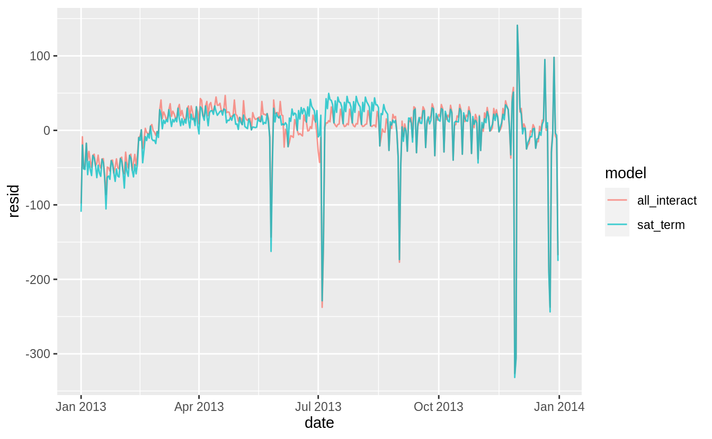

I think the overlapping plot is hard to understand.
If we are interested in the differences, it is better to plot the differences directly.
In this code, I use `spread_residuals()` to add one *column* per model, rather than `gather_residuals()` which creates a new row for each model.

```r
daily %>%
  spread_residuals(sat_term = mod3, all_interact = mod2) %>%
  mutate(resid_diff = sat_term - all_interact) %>%
  ggplot(aes(date, resid_diff)) +
  geom_line(alpha = 0.75)
```


The model with terms × Saturday has higher residuals in the fall and lower residuals in the spring than the model with all interactions.

Comparing models, `mod3` has a lower $R^2$ and regression standard error, $\hat{\sigma}$, despite using fewer variables.
More importantly for prediction purposes, this model has a higher AIC, which is an estimate of the out of sample error.

```r
glance(mod3) %>% select(r.squared, sigma, AIC, df)
#> # A tibble: 1 x 4
#>   r.squared sigma   AIC    df
#>       <dbl> <dbl> <dbl> <int>
#> 1     0.736  47.4 3863.     9
```

```r
glance(mod2) %>% select(r.squared, sigma, AIC, df)
#> # A tibble: 1 x 4
#>   r.squared sigma   AIC    df
#>       <dbl> <dbl> <dbl> <int>
#> 1     0.757  46.2 3856.    21
```

</div>

### Exercise 24.3.4 {.unnumbered .exercise data-number="24.3.4"}

<div class="question">

Create a new `wday` variable that combines the day of week, term (for Saturdays), and public holidays. 
What do the residuals of that model look like?

</div>

<div class="answer">

The question is unclear how to handle public holidays. There are several questions to consider.

First, what are the public holidays? I include all [federal holidays in the United States](https://en.wikipedia.org/wiki/Federal_holidays_in_the_United_States) in 2013.
Other holidays to consider would be Easter and Good Friday which is US stock market holiday and widely celebrated religious holiday, Mothers Day, Fathers Day,
and Patriots' Day, which is a holiday in several states, and other state holidays.

```r
holidays_2013 <-
  tribble(
    ~holiday, ~date,
    "New Year's Day", 20130101,
    "Martin Luther King Jr. Day", 20130121,
    "Washington's Birthday", 20130218,
    "Memorial Day", 20130527,
    "Independence Day", 20130704,
    "Labor Day", 20130902,
    "Columbus Day", 20131028,
    "Veteran's Day", 20131111,
    "Thanksgiving", 20131128,
    "Christmas", 20131225
  ) %>%
  mutate(date = lubridate::ymd(date))
```

The model could include a single dummy variable which indicates a day was a public holiday.
Alternatively, I could include a dummy variable for each public holiday.
I would expect that Veteran's Day and Washington's Birthday have a different effect on travel than Thanksgiving, Christmas, and New Year's Day.

Another question is whether and how I should handle the days before and after holidays.
Travel could be lighter on the day of the holiday,
but heavier the day before or after.


```r
daily <- daily %>%
  mutate(
    wday3 =
      case_when(
        date %in% (holidays_2013$date - 1L) ~ "day before holiday",
        date %in% (holidays_2013$date + 1L) ~ "day after holiday",
        date %in% holidays_2013$date ~ "holiday",
        .$wday == "Sat" & .$term == "summer" ~ "Sat-summer",
        .$wday == "Sat" & .$term == "fall" ~ "Sat-fall",
        .$wday == "Sat" & .$term == "spring" ~ "Sat-spring",
        TRUE ~ as.character(.$wday)
      )
  )

mod4 <- lm(n ~ wday3, data = daily)

daily %>%
  spread_residuals(resid_sat_terms = mod3, resid_holidays = mod4) %>%
  mutate(resid_diff = resid_holidays - resid_sat_terms) %>%
  ggplot(aes(date, resid_diff)) +
  geom_line(alpha = 0.75)
```

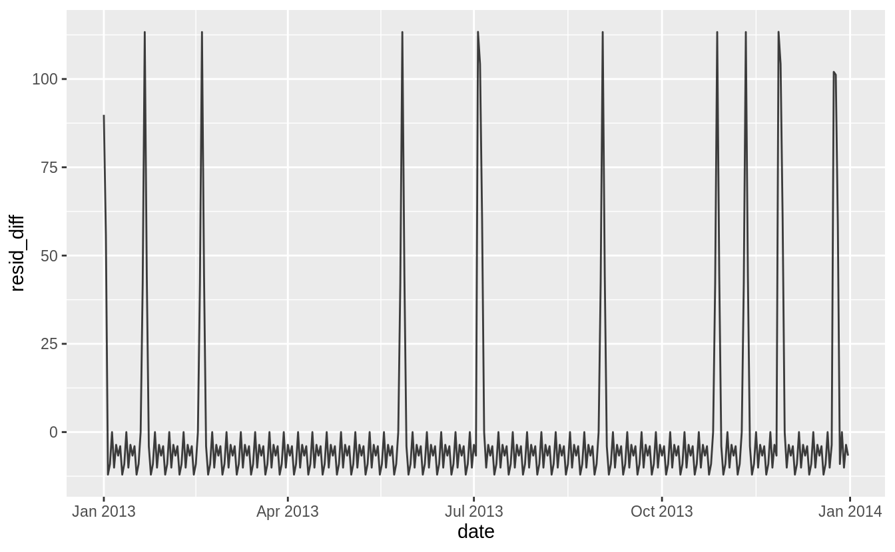

</div>

### Exercise 24.3.5 {.unnumbered .exercise data-number="24.3.5"}

<div class="question">

What happens if you fit a day of week effect that varies by month (i.e., `n ~ wday * month`)?
Why is this not very helpful?

</div>

<div class="answer">


```r
daily <- mutate(daily, month = factor(lubridate::month(date)))
mod6 <- lm(n ~ wday * month, data = daily)
print(summary(mod6))
#> 
#> Call:
#> lm(formula = n ~ wday * month, data = daily)
#> 
#> Residuals:
#>    Min     1Q Median     3Q    Max 
#> -269.2   -5.0    1.5    8.8  113.2 
#> 
#> Coefficients:
#>                Estimate Std. Error t value Pr(>|t|)    
#> (Intercept)     867.400      7.598  114.16  < 2e-16 ***
#> wday.L          -64.074     20.874   -3.07  0.00235 ** 
#> wday.Q         -165.600     20.156   -8.22  7.8e-15 ***
#> wday.C          -68.259     20.312   -3.36  0.00089 ***
#> wday^4          -92.081     20.499   -4.49  1.0e-05 ***
#> wday^5            9.793     19.733    0.50  0.62011    
#> wday^6          -20.438     18.992   -1.08  0.28280    
#> month2           23.707     10.995    2.16  0.03191 *  
#> month3           67.886     10.746    6.32  1.0e-09 ***
#> month4           74.593     10.829    6.89  3.7e-11 ***
#> month5           56.279     10.746    5.24  3.2e-07 ***
#> month6           80.307     10.829    7.42  1.4e-12 ***
#> month7           77.114     10.746    7.18  6.4e-12 ***
#> month8           81.636     10.746    7.60  4.5e-13 ***
#> month9           51.371     10.829    4.74  3.3e-06 ***
#> month10          60.136     10.746    5.60  5.2e-08 ***
#> month11          46.914     10.829    4.33  2.1e-05 ***
#> month12          38.779     10.746    3.61  0.00036 ***
#> wday.L:month2    -3.723     29.627   -0.13  0.90009    
#> wday.Q:month2    -3.819     29.125   -0.13  0.89578    
#> wday.C:month2     0.490     29.233    0.02  0.98664    
#> wday^4:month2     4.569     29.364    0.16  0.87646    
#> wday^5:month2    -4.255     28.835   -0.15  0.88278    
#> wday^6:month2    12.057     28.332    0.43  0.67076    
#> wday.L:month3   -14.571     28.430   -0.51  0.60870    
#> wday.Q:month3    15.439     28.207    0.55  0.58458    
#> wday.C:month3     8.226     28.467    0.29  0.77282    
#> wday^4:month3    22.720     28.702    0.79  0.42926    
#> wday^5:month3   -15.330     28.504   -0.54  0.59113    
#> wday^6:month3    11.373     28.268    0.40  0.68776    
#> wday.L:month4   -16.668     29.359   -0.57  0.57067    
#> wday.Q:month4    10.725     28.962    0.37  0.71142    
#> wday.C:month4    -0.245     28.725   -0.01  0.99320    
#> wday^4:month4    23.288     28.871    0.81  0.42056    
#> wday^5:month4   -17.872     28.076   -0.64  0.52494    
#> wday^6:month4     5.352     27.888    0.19  0.84794    
#> wday.L:month5     3.666     29.359    0.12  0.90071    
#> wday.Q:month5   -20.665     28.670   -0.72  0.47163    
#> wday.C:month5     4.634     28.725    0.16  0.87196    
#> wday^4:month5     5.999     28.511    0.21  0.83349    
#> wday^5:month5   -16.912     28.076   -0.60  0.54742    
#> wday^6:month5    12.764     27.194    0.47  0.63916    
#> wday.L:month6    -4.526     28.651   -0.16  0.87459    
#> wday.Q:month6    23.813     28.207    0.84  0.39927    
#> wday.C:month6    13.758     28.725    0.48  0.63234    
#> wday^4:month6    24.118     29.187    0.83  0.40932    
#> wday^5:month6   -17.648     28.798   -0.61  0.54048    
#> wday^6:month6    10.526     28.329    0.37  0.71051    
#> wday.L:month7   -28.791     29.359   -0.98  0.32760    
#> wday.Q:month7    49.585     28.670    1.73  0.08482 .  
#> wday.C:month7    54.501     28.725    1.90  0.05881 .  
#> wday^4:month7    50.847     28.511    1.78  0.07559 .  
#> wday^5:month7   -33.698     28.076   -1.20  0.23106    
#> wday^6:month7   -13.894     27.194   -0.51  0.60979    
#> wday.L:month8   -20.448     28.871   -0.71  0.47938    
#> wday.Q:month8     6.765     28.504    0.24  0.81258    
#> wday.C:month8     6.001     28.467    0.21  0.83319    
#> wday^4:month8    19.074     28.781    0.66  0.50806    
#> wday^5:month8   -19.312     28.058   -0.69  0.49183    
#> wday^6:month8     9.507     27.887    0.34  0.73341    
#> wday.L:month9   -30.341     28.926   -1.05  0.29511    
#> wday.Q:month9   -42.034     28.670   -1.47  0.14373    
#> wday.C:month9   -20.719     28.725   -0.72  0.47134    
#> wday^4:month9   -20.375     28.791   -0.71  0.47973    
#> wday^5:month9   -18.238     28.523   -0.64  0.52308    
#> wday^6:month9    11.726     28.270    0.41  0.67861    
#> wday.L:month10  -61.051     29.520   -2.07  0.03954 *  
#> wday.Q:month10  -26.235     28.504   -0.92  0.35815    
#> wday.C:month10  -32.435     28.725   -1.13  0.25979    
#> wday^4:month10  -12.212     28.990   -0.42  0.67389    
#> wday^5:month10  -27.686     27.907   -0.99  0.32201    
#> wday^6:month10    0.123     26.859    0.00  0.99634    
#> wday.L:month11  -54.947     28.926   -1.90  0.05851 .  
#> wday.Q:month11   16.012     28.670    0.56  0.57696    
#> wday.C:month11   54.950     28.725    1.91  0.05677 .  
#> wday^4:month11   47.286     28.791    1.64  0.10164    
#> wday^5:month11  -44.740     28.523   -1.57  0.11787    
#> wday^6:month11  -20.688     28.270   -0.73  0.46491    
#> wday.L:month12   -9.506     28.871   -0.33  0.74221    
#> wday.Q:month12   75.209     28.504    2.64  0.00879 ** 
#> wday.C:month12  -25.026     28.467   -0.88  0.38010    
#> wday^4:month12  -23.780     28.781   -0.83  0.40938    
#> wday^5:month12   20.447     28.058    0.73  0.46676    
#> wday^6:month12    9.586     27.887    0.34  0.73128    
#> ---
#> Signif. codes:  0 '***' 0.001 '**' 0.01 '*' 0.05 '.' 0.1 ' ' 1
#> 
#> Residual standard error: 42 on 281 degrees of freedom
#> Multiple R-squared:  0.836,	Adjusted R-squared:  0.787 
#> F-statistic: 17.2 on 83 and 281 DF,  p-value: <2e-16
```

If we fit a day of week effect that varies by month, there will be `12 * 7 = 84` parameters in the model.
Since each month has only four to five weeks, each of these day of week $\times$ month effects is the average of only four or five observations.
These estimates have large standard errors and likely not generalize well beyond the sample data, since they are estimated from only a few observations.

</div>

### Exercise 24.3.6 {.unnumbered .exercise data-number="24.3.6"}

<div class="question">
What would you expect the model `n ~ wday + ns(date, 5)` to look like?
Knowing what you know about the data, why would you expect it to be not particularly effective?
</div>

<div class="answer">

Previous models fit in the chapter and exercises show that the effects of days of the week vary across different times of the year. 
The model `wday + ns(date, 5)` does not interact the day of week effect (`wday`) with the time of year effects (`ns(date, 5)`).

I estimate a model which does not interact the day of week effects (`mod7`) with the spline to that which does (`mod8`).
I need to load the splines package to use the `ns()` function.

```r
mod7 <- lm(n ~ wday + ns(date, 5), data = daily)
mod8 <- lm(n ~ wday * ns(date, 5), data = daily)
```

The residuals of the model that does not interact day of week with time of year (`mod7`) are larger than those of the model that does (`mod8`). 
The model `mod7` underestimates weekends during the summer and overestimates weekends during the autumn.

```r
daily %>%
  gather_residuals(mod7, mod8) %>%
  ggplot(aes(x = date, y = resid, color = model)) +
  geom_line(alpha = 0.75)
```

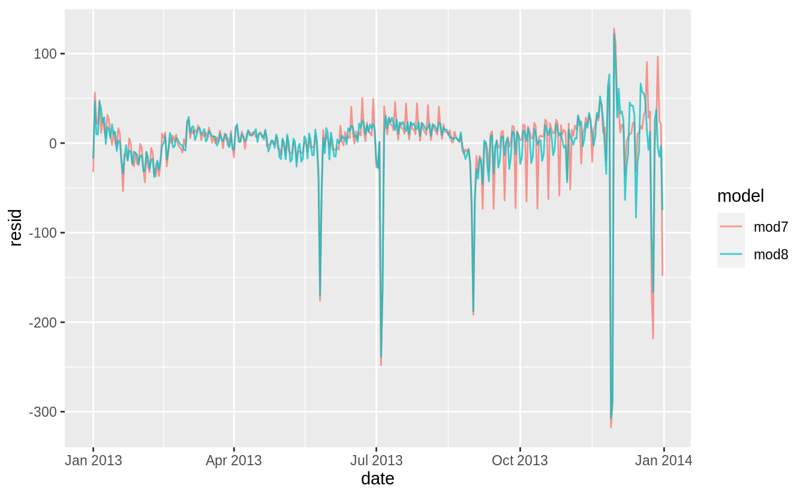

</div>

### Exercise 24.3.7 {.unnumbered .exercise data-number="24.3.7"}

<div class="question">

We hypothesized that people leaving on Sundays are more likely to be business travelers who need to be somewhere on Monday.
Explore that hypothesis by seeing how it breaks down based on distance and time: 
if it’s true, you’d expect to see more Sunday evening flights to places that are far away.

</div>

<div class="answer">

Comparing the average distances of flights by day of week, Sunday flights are the second longest.
Saturday flights are the longest on average.
Saturday may have the longest flights on average because there are fewer regularly scheduled short business/commuter flights on the weekends but that is speculation.


```r
flights %>%
  mutate(
    date = make_date(year, month, day),
    wday = wday(date, label = TRUE)
  ) %>%
  ggplot(aes(y = distance, x = wday)) +
  geom_boxplot() +
  labs(x = "Day of Week", y = "Average Distance")
```

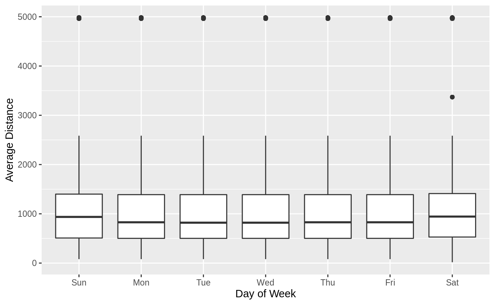

Hide outliers.

```r
flights %>%
  mutate(
    date = make_date(year, month, day),
    wday = wday(date, label = TRUE)
  ) %>%
  ggplot(aes(y = distance, x = wday)) +
  geom_boxplot(outlier.shape = NA) +
  labs(x = "Day of Week", y = "Average Distance")
```

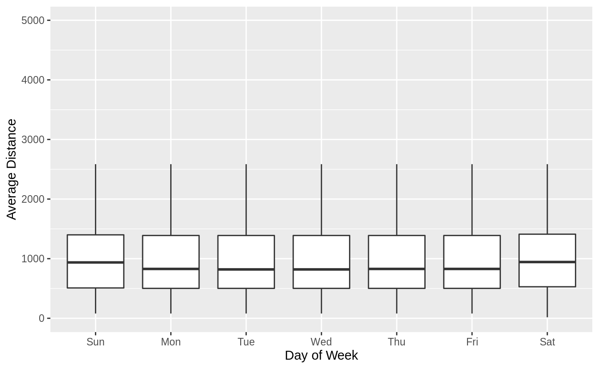

Try pointrange with mean and standard error of the mean (sd / sqrt(n)).

```r
flights %>%
  mutate(
    date = make_date(year, month, day),
    wday = wday(date, label = TRUE)
  ) %>%
  ggplot(aes(y = distance, x = wday)) +
  stat_summary() +
  labs(x = "Day of Week", y = "Average Distance")
#> No summary function supplied, defaulting to `mean_se()`
```

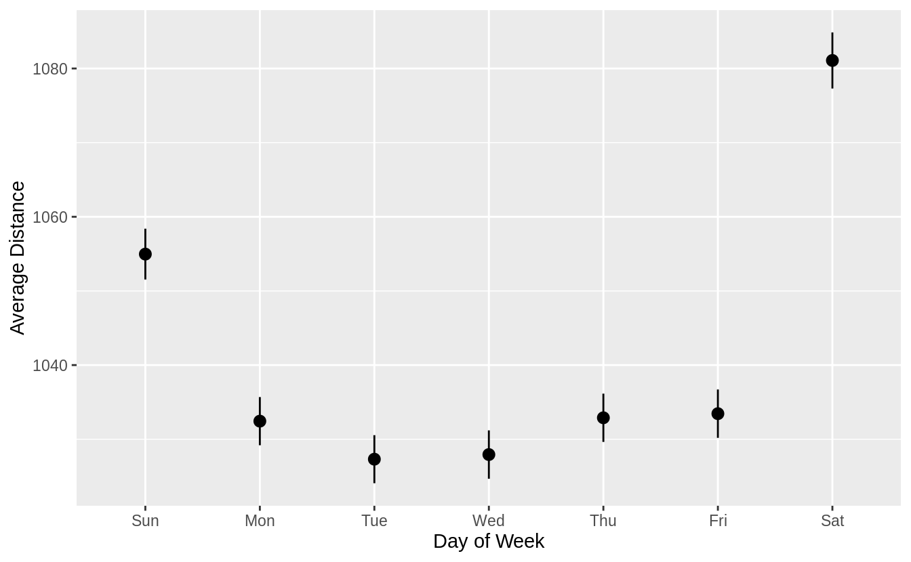

Try pointrange with mean and standard error of the mean (sd / sqrt(n)).

```r
flights %>%
  mutate(
    date = make_date(year, month, day),
    wday = wday(date, label = TRUE)
  ) %>%
  ggplot(aes(y = distance, x = wday)) +
  geom_violin() +
  labs(x = "Day of Week", y = "Average Distance")
```

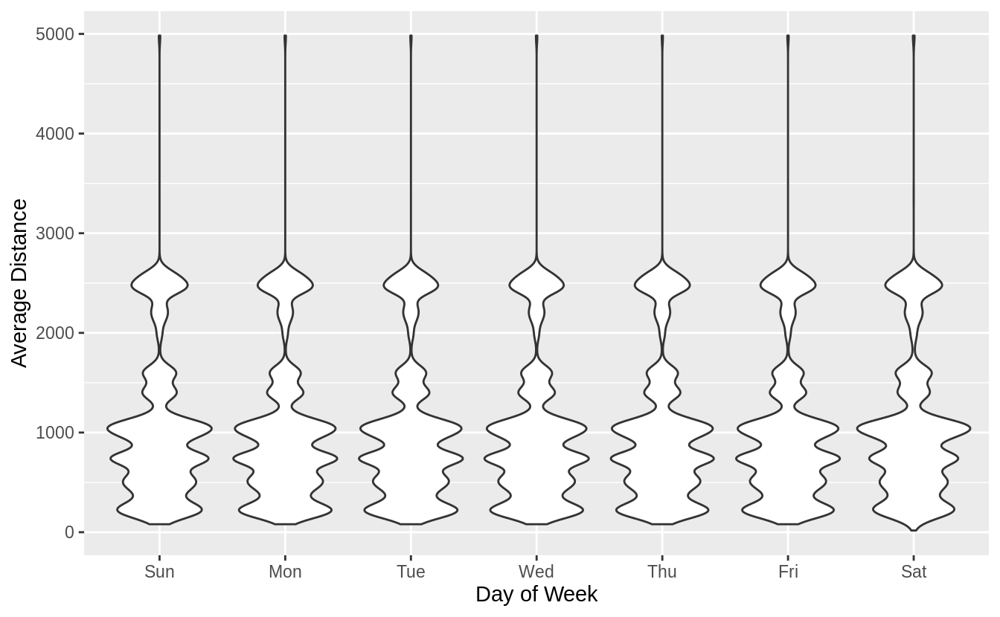


```r
flights %>%
  mutate(
    date = make_date(year, month, day),
    wday = wday(date, label = TRUE)
  ) %>%
  filter(
    distance < 3000,
    hour >= 5, hour <= 21
  ) %>%
  ggplot(aes(x = hour, color = wday, y = ..density..)) +
  geom_freqpoly(binwidth = 1)
```

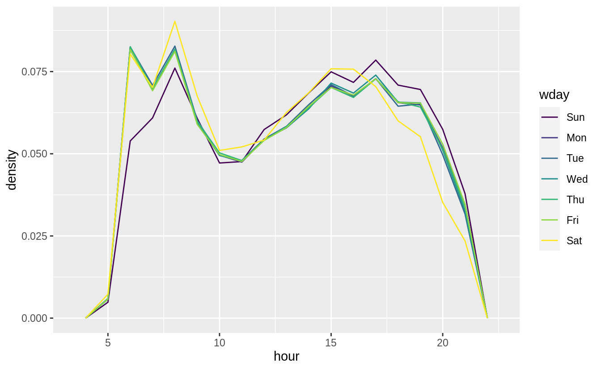


```r
flights %>%
  mutate(
    date = make_date(year, month, day),
    wday = wday(date, label = TRUE)
  ) %>%
  filter(
    distance < 3000,
    hour >= 5, hour <= 21
  ) %>%
  group_by(wday, hour) %>%
  summarise(distance = mean(distance)) %>%
  ggplot(aes(x = hour, color = wday, y = distance)) +
  geom_line()
#> `summarise()` regrouping output by 'wday' (override with `.groups` argument)
```

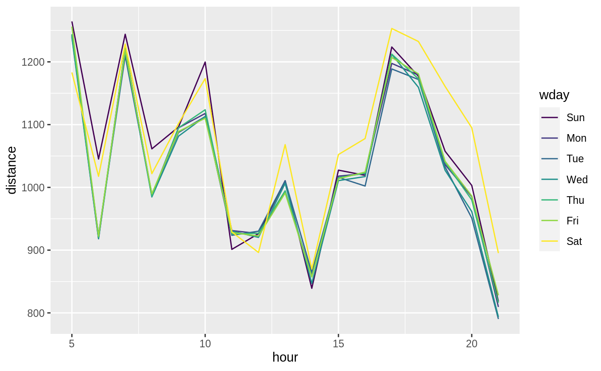


```r
flights %>%
  mutate(
    date = make_date(year, month, day),
    wday = wday(date, label = TRUE)
  ) %>%
  filter(
    distance < 3000,
    hour >= 5, hour <= 21
  ) %>%
  group_by(wday, hour) %>%
  summarise(distance = sum(distance)) %>%
  group_by(wday) %>%
  mutate(prop_distance = distance / sum(distance)) %>%
  ungroup() %>%
  ggplot(aes(x = hour, color = wday, y = prop_distance)) +
  geom_line()
#> `summarise()` regrouping output by 'wday' (override with `.groups` argument)
```


<!--
|time of day    | start time | end time |
|:--------------|:-----------|:---------|
| Early morning | 12 am      |    5 am  |
| Morning       | 5 am       |    12 pm |
| Afternoon     | 12 pm      |    6 pm  |
| Evening       | 6 pm       |    12 pm |


```r
flights %>%
  mutate(
    date = make_date(year, month, day),
    wday = wday(date, label = TRUE),
    time = factor(case_when(
      hour < 5 ~ "Early morning",
      hour < 12 ~ "Morning",
      hour < 18 ~ "Afternoon",
      TRUE ~ "Evening"
    ),
    levels = c(
      "Early morning", "Morning",
      "Afternoon", "Evening"
    )
    )
  ) %>%
  group_by(wday, time) %>%
  filter(time != "Early morning") %>%
  summarise(distance = mean(distance)) %>%
  ggplot(aes(color = wday, y = distance, x = time)) +
  geom_point()
#> `summarise()` regrouping output by 'wday' (override with `.groups` argument)
```

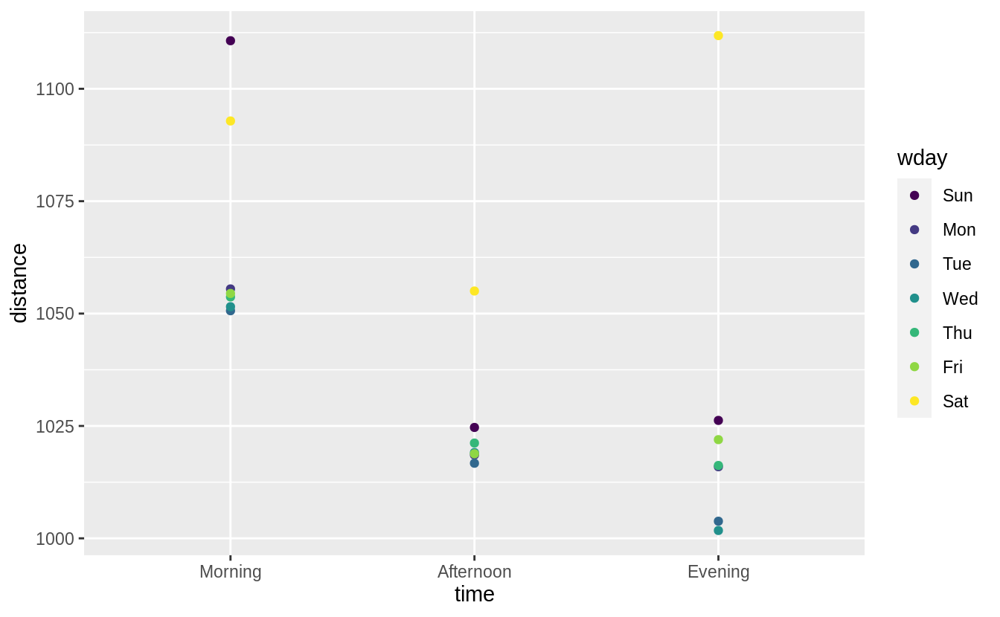
-->

</div>

### Exercise 24.3.8 {.unnumbered .exercise data-number="24.3.8"}

<div class="question">

It’s a little frustrating that Sunday and Saturday are on separate ends of the plot.
Write a small function to set the levels of the factor so that the week starts on Monday.

</div>

<div class="answer">

See the chapter [Factors](https://r4ds.had.co.nz/factors.html) for the function `fct_relevel()`.
Use `fct_relevel()` to put all levels in-front of the first level ("Sunday").


```r
monday_first <- function(x) {
  fct_relevel(x, levels(x)[-1])
}
```

Now Monday is the first day of the week.

```r
daily <- daily %>%
  mutate(wday = wday(date, label = TRUE))
ggplot(daily, aes(monday_first(wday), n)) +
  geom_boxplot() +
  labs(x = "Day of Week", y = "Number of flights")
```

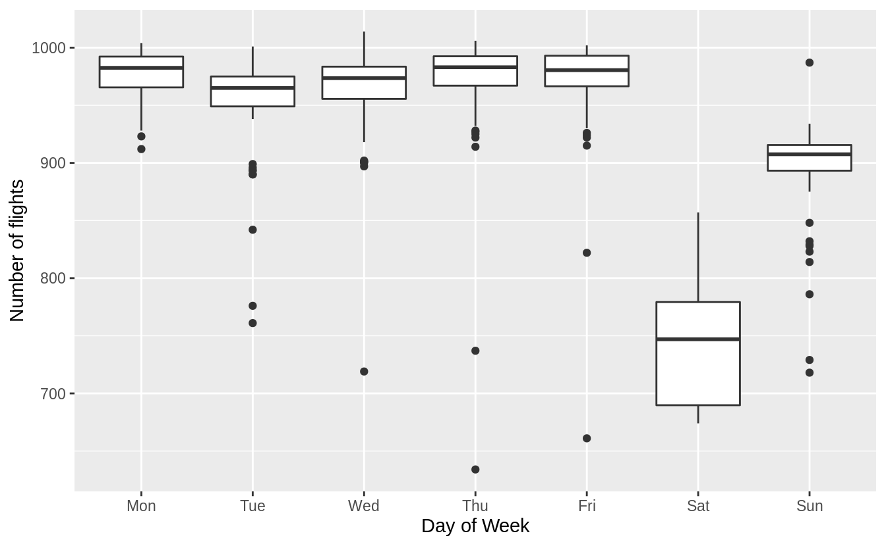

</div>

## Learning more about models {#learning-more-about-models .r4ds-section}

<!--html_preserve--><div class="alert alert-warning hints-alert">
<div class="hints-icon">
<i class="fa fa-exclamation-circle"></i>
</div>
<div class="hints-container">No exercises</div>
</div><!--/html_preserve-->
