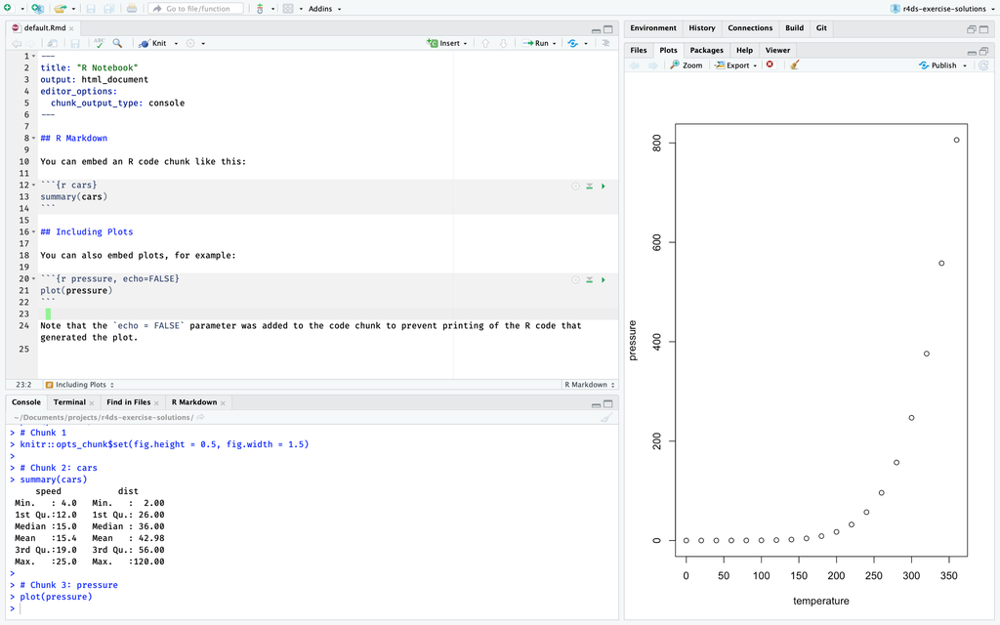
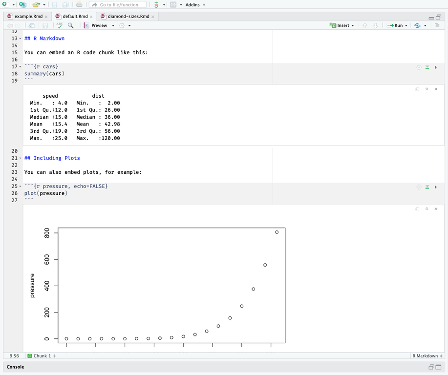
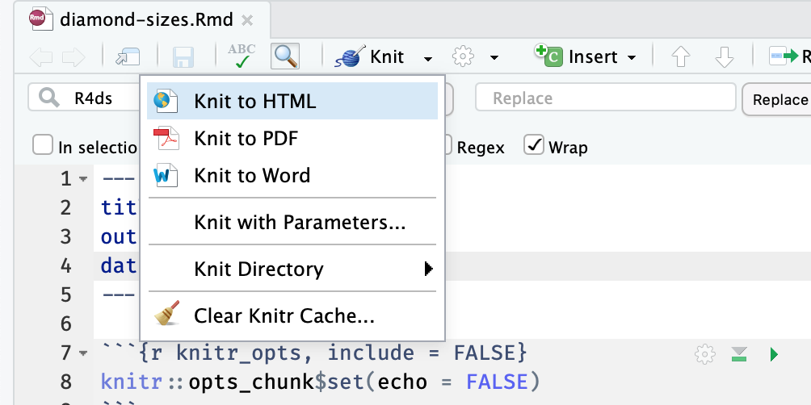

# R Markdown {#r-markdown .r4ds-section}

## Introduction {#introduction-18 .r4ds-section}

## R Markdown basics {#r-markdown-basics .r4ds-section}

### Exercise 27.2.1 {.unnumbered .exercise data-number="27.2.1"}

<div class="question">

Create a new notebook using *File > New File > R Notebook*. Read the instructions. Practice running the chunks. Verify that you can modify the code, re-run it, and see modified output.

</div>

<div class="answer">

This exercise is left to the reader.

</div>

### Exercise 27.2.2 {.unnumbered .exercise data-number="27.2.2"}

<div class="question">

Create a new R Markdown document with *File > New File > R Markdown ...*.
Knit it by clicking the appropriate button.
Knit it by using the appropriate keyboard short cut.
Verify that you can modify the input and see the output update.

</div>

<div class="answer">

This exercise is mostly left to the reader.
Recall that the keyboard shortcut to knit a file is `Cmd/Ctrl + Alt + K`.

</div>

### Exercise 27.2.3 {.unnumbered .exercise data-number="27.2.3"}

<div class="question">
Compare and contrast the R notebook and R markdown files you created above.
How are the outputs similar? How are they different?
How are the inputs similar? How are they different?
What happens if you copy the YAML header from one to the other?
</div>

<div class="answer">

R notebook files show the output of code chunks inside the editor, while hiding the console, when they are edited in RStudio.
This contrasts with R markdown files, which show their output inside the console, and do not show output inside the editor.
This makes R notebook documents appealing for interactive exploration.
In this R markdown file, the plot is displayed in the "Plot" tab, while the output of `summary()` is displayed in the tab.
```{r echo=FALSE,purl=FALSE}

```
However, when this same file is converted to a R notebook, the plot and `summary()` output are displayed in the "Editor" below the chunk of code which created them.
```{r echo=FALSE,purl=FALSE}

```

Both R notebooks and R markdown files and can be knit to produce HTML output.
R markdown files can be knit to a variety of formats including HTML, PDF, and DOCX.
However, R notebooks can only be knit to HTML files, which are given the extension `.nb.html`.
However, unlike R markdown files knit to HTML, the HTML output of an R notebook includes copy of the original `.Rmd` source.
If a `.nb.html` file is opened in RStudio, the source of the `.Rmd` file can be extracted and edited.
In contrast, there is no way to recover the original source of an R markdown file from its output, except through the parts that are displayed in the output itself.

R markdown files and R notebooks differ in the value of `output` in their YAML headers.
The YAML header for the R notebook will have the line,
```
---
ouptut: html_notebook
---
```
For example, this is a R notebook,
```
---
title: "Diamond sizes"
date: 2016-08-25
output: html_notebook
---

Text of the document.
```

The YAML header for the R markdown file will have the line,
```
ouptut: html_document
```
For example, this is a R markdown file.
```
---
title: "Diamond sizes"
date: 2016-08-25
output: html_document
---

Text of the document.
```

Copying the YAML header from an R notebook to a R markdown file changes it to an R notebook, and vice-versa.
More specifically, an `.Rmd` file can be changed to R markdown file or R notebook by changing the value of the `output` key in the header.

The RStudio IDE and the rmarkdown package both use the YAML header of an `.Rmd` file to determine the document-type of the file.

For more information on R markdown notebooks see the following sources:

-   [R Markdown: The Definitive Guide](https://bookdown.org/yihui/rmarkdown/) section), Chapter [Notebook](https://bookdown.org/yihui/rmarkdown/notebook.html)
-   [Difference between R MarkDown and R NoteBook](https://stackoverflow.com/questions/43820483/difference-between-r-markdown-and-r-notebook/43898504#43898504) StackOverflow thread.

</div>

### Exercise 27.2.4 {.unnumbered .exercise data-number="27.2.4"}

<div class="question">

Create one new R Markdown document for each of the three built-in formats:
HTML, PDF and Word.
Knit each of the three documents.
How does the output
differ? How does the input differ?
(You may need to install LaTeX in order to
build the PDF output — RStudio will prompt you if this is necessary.)

</div>

<div class="answer">

They produce different outputs, both in the final documents and intermediate
files (notably the type of plots produced). The only difference in the inputs
is the value of `output` in the YAML header.
The following `.Rmd` would be knit to HTML.
```
---
title: "Diamond sizes"
date: 2016-08-25
output: html_document
---

Text of the document.
```
If the value of the `output` key is changed to `word_document`, knitting the file will create a Word document (DOCX).
```
---
title: "Diamond sizes"
date: 2016-08-25
output: word_document
---

Text of the document.
```
Similarly, if the value of the `output` key is changed to `pdf_document`, knitting the file will create a PDF.
```
---
title: "Diamond sizes"
date: 2016-08-25
output: pdf_document
---

Text of the document.
```

If you click on the *Knit* menu button and then on one of *Knit to HTML*, *Knit to PDF*, or *Knit to Word*,
you will see that the value of the `output` key will change to `html_document`, `pdf_document`, or `word_document`, respectively.

```{r echo=FALSE,purl=FALSE}

```

You will see that the value of `output` will look a little different than the previous examples.
It will add a new line with a value like, `pdf_document: default`.

```yaml
---
title: "Diamond sizes"
date: 2016-08-25
output:
  pdf_document: default
---

Text of the document.
```

This format is more general, allows the document have multiple output formats as well as configuration settings that allow more fine-grained control over the look of the output format.
The chapter [R Markdown Formats](https://r4ds.had.co.nz/r-markdown-formats.html) discusses output formats for R markdown files in more detail.

</div>

## Text formatting with Markdown {#text-formatting-with-markdown .r4ds-section}

### Exercise 27.3.1 {.unnumbered .exercise data-number="27.3.1"}

<div class="question">
Practice what you’ve learned by creating a brief CV.
The title should be your name, and you should include headings for (at least) education or employment.
Each of the sections should include a bulleted list of jobs/degrees.
Highlight the year in bold.
</div>

<div class="answer">

A minimal example is the following CV.
```{r cv,echo=FALSE,comment='',purl=FALSE}
cat(readr::read_file(here::here("rmarkdown", "cv.Rmd")))
```

Your own example could be much more detailed.

</div>

### Exercise 27.3.2 {.unnumbered .exercise data-number="27.3.2"}

<div class="question">

Using the R Markdown quick reference, figure out how to:

1.  Add a footnote.
1.  Add a horizontal rule.
1.  Add a block quote.

</div>

<div class="answer">

```{r example,echo=FALSE,comment='',purl=FALSE}
cat(readr::read_file(here::here("rmarkdown", "example.Rmd")))
```

</div>

### Exercise 27.3.3 {.unnumbered .exercise data-number="27.3.3"}

<div class="question">

Copy and paste the contents of `diamond-sizes.Rmd` from <https://github.com/hadley/r4ds/tree/master/rmarkdown> in to a local R markdown document.
Check that you can run it, then add text after the frequency polygon that describes its most striking features.
</div>

<div class="answer">

The following R markdown document answers this question as well as exercises [Exercise 27.4.1](#exercise-27.4.1), [Exercise 27.4.2](#exercise-27.4.2), and [Exercise 27.4.3](#exercise-27.4.3).

```{r diamond-sizes,echo=FALSE,comment='',purl=FALSE}
cat(readr::read_file(here::here("rmarkdown", "diamond-sizes.Rmd")))
```

</div>

## Code chunks {#code-chunks .r4ds-section}

### Exercise 27.4.1 {.unnumbered .exercise data-number="27.4.1"}

<div class="question">
Add a section that explores how diamond sizes vary by cut, color, and clarity.
Assume you’re writing a report for someone who doesn’t know R, and instead of setting `echo = FALSE` on each chunk, set a global option.
</div>

<div class="answer">

See the answer to [Exercise 27.3.3](#exercise-27.3.3).

</div>

### Exercise 27.4.2 {.unnumbered .exercise data-number="27.4.2"}

<div class="question">
Download `diamond-sizes.Rmd` from <https://github.com/hadley/r4ds/tree/master/rmarkdown>.
Add a section that describes the largest 20 diamonds, including a table that displays their most important attributes.
</div>

<div class="answer">

See the answer to [Exercise 27.3.3](#exercise-27.3.3).
I use `arrange()` and `slice()` to select the largest twenty diamonds, and
`knitr::kable()` to produce a formatted table.

</div>

### Exercise 27.4.3 {.unnumbered .exercise data-number="27.4.3"}

<div class="question">
Modify `diamonds-sizes.Rmd` to use `comma()` to produce nicely formatted output.
Also include the percentage of diamonds that are larger than 2.5 carats.
</div>

<div class="answer">

See the answer to [Exercise 27.3.3](#exercise-27.3.3).

I moved the computation of the number larger and percent of diamonds larger than 2.5 carats into a code chunk.
I find that it is best to keep inline R expressions simple, usually consisting of an object and a formatting function.
This makes it both easier to read and test the R code, while simultaneously making the prose easier to read.
It helps the readability of the code and document to keep the computation of objects used in prose close to their use.
Calculating those objects in a code chunk with the `include = FALSE` option (as is done in `diamonds-size.Rmd`) is useful in this regard.

</div>

### Exercise 27.4.4 {.unnumbered .exercise data-number="27.4.4"}

<div class="question">

Set up a network of chunks where `d` depends on `c` and `b`, and both `b` and `c` depend on `a`. Have each chunk print lubridate::now(), set cache = TRUE, then verify your understanding of caching.

</div>

<div class="answer">

```{r caching,echo=FALSE,comment='',purl=FALSE}
cat(readr::read_file(here::here("rmarkdown", "caching.Rmd")))
```

</div>

## Troubleshooting {#troubleshooting .r4ds-section}

`r no_exercises()`

## YAML header {#yaml-header .r4ds-section}

`r no_exercises()`

## Learning more {#learning-more-3 .r4ds-section}

`r no_exercises()`
