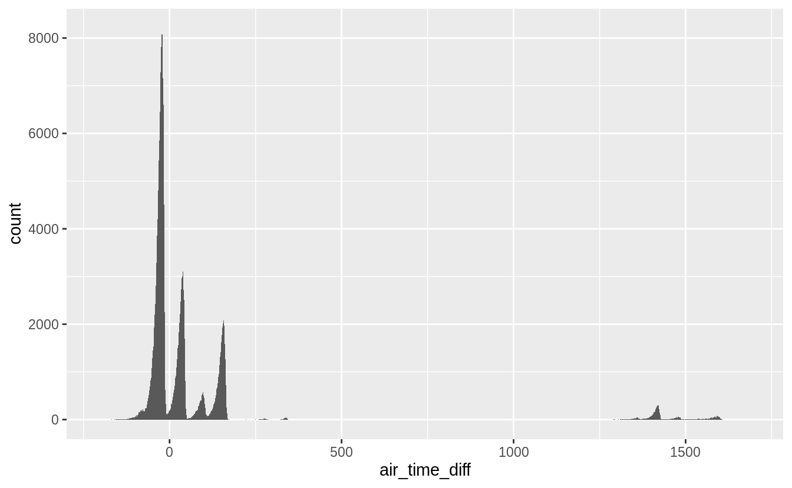
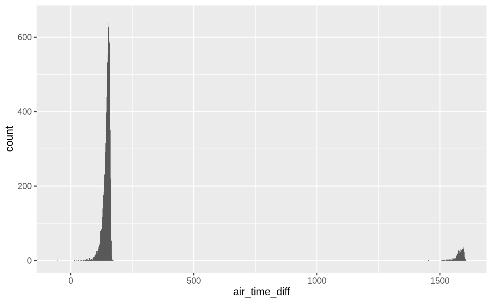
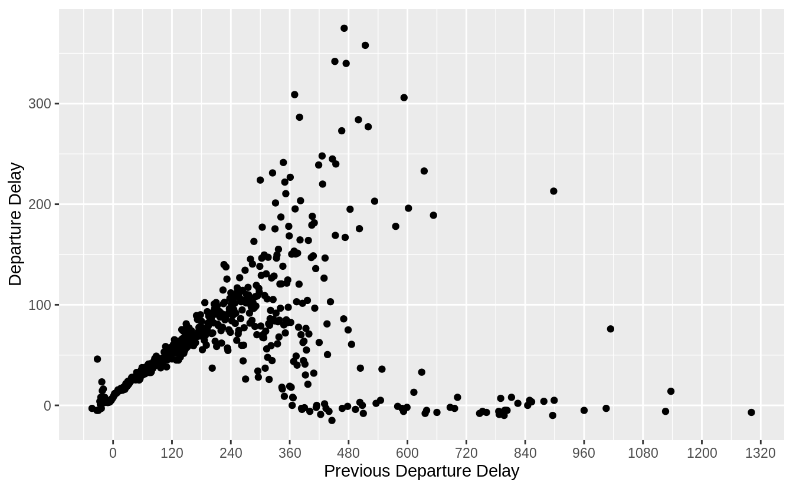
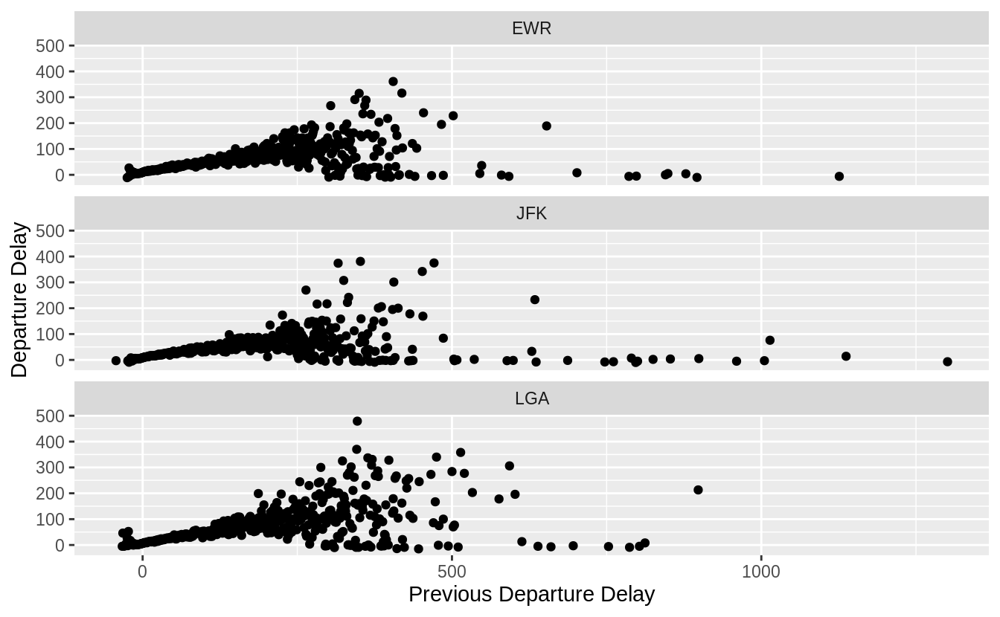

# Data transformation {#transform .r4ds-section}

## Introduction {#introduction-2 .r4ds-section}


```r
library("nycflights13")
library("tidyverse")
```

## Filter rows with `filter()` {#filter-rows-with-filter .r4ds-section}

### Exercise 5.2.1 {.unnumbered .exercise data-number="5.2.1"}

<div class="question">
Find all flights that

1.  Had an arrival delay of two or more hours
1.  Flew to Houston (IAH or HOU)
1.  Were operated by United, American, or Delta
1.  Departed in summer (July, August, and September)
1.  Arrived more than two hours late, but didn’t leave late
1.  Were delayed by at least an hour, but made up over 30 minutes in flight
1.  Departed between midnight and 6 am (inclusive)

</div>

<div class="answer">

The answer to each part follows.

1.  Since the `arr_delay` variable is measured in minutes, find
    flights with an arrival delay of 120 or more minutes.

    
    ```r
    filter(flights, arr_delay >= 120)
    #> # A tibble: 10,200 x 19
    #>    year month   day dep_time sched_dep_time dep_delay arr_time sched_arr_time
    #>   <int> <int> <int>    <int>          <int>     <dbl>    <int>          <int>
    #> 1  2013     1     1      811            630       101     1047            830
    #> 2  2013     1     1      848           1835       853     1001           1950
    #> 3  2013     1     1      957            733       144     1056            853
    #> 4  2013     1     1     1114            900       134     1447           1222
    #> 5  2013     1     1     1505           1310       115     1638           1431
    #> 6  2013     1     1     1525           1340       105     1831           1626
    #> # … with 10,194 more rows, and 11 more variables: arr_delay <dbl>,
    #> #   carrier <chr>, flight <int>, tailnum <chr>, origin <chr>, dest <chr>,
    #> #   air_time <dbl>, distance <dbl>, hour <dbl>, minute <dbl>, time_hour <dttm>
    ```

1.  The flights that flew to Houston are those flights where the 
    destination (`dest`) is either "IAH" or "HOU".
    
    ```r
    filter(flights, dest == "IAH" | dest == "HOU")
    #> # A tibble: 9,313 x 19
    #>    year month   day dep_time sched_dep_time dep_delay arr_time sched_arr_time
    #>   <int> <int> <int>    <int>          <int>     <dbl>    <int>          <int>
    #> 1  2013     1     1      517            515         2      830            819
    #> 2  2013     1     1      533            529         4      850            830
    #> 3  2013     1     1      623            627        -4      933            932
    #> 4  2013     1     1      728            732        -4     1041           1038
    #> 5  2013     1     1      739            739         0     1104           1038
    #> 6  2013     1     1      908            908         0     1228           1219
    #> # … with 9,307 more rows, and 11 more variables: arr_delay <dbl>,
    #> #   carrier <chr>, flight <int>, tailnum <chr>, origin <chr>, dest <chr>,
    #> #   air_time <dbl>, distance <dbl>, hour <dbl>, minute <dbl>, time_hour <dttm>
    ```
    However, using `%in%` is more compact and would scale to cases where 
    there were more than two airports we were interested in.
    
    ```r
    filter(flights, dest %in% c("IAH", "HOU"))
    #> # A tibble: 9,313 x 19
    #>    year month   day dep_time sched_dep_time dep_delay arr_time sched_arr_time
    #>   <int> <int> <int>    <int>          <int>     <dbl>    <int>          <int>
    #> 1  2013     1     1      517            515         2      830            819
    #> 2  2013     1     1      533            529         4      850            830
    #> 3  2013     1     1      623            627        -4      933            932
    #> 4  2013     1     1      728            732        -4     1041           1038
    #> 5  2013     1     1      739            739         0     1104           1038
    #> 6  2013     1     1      908            908         0     1228           1219
    #> # … with 9,307 more rows, and 11 more variables: arr_delay <dbl>,
    #> #   carrier <chr>, flight <int>, tailnum <chr>, origin <chr>, dest <chr>,
    #> #   air_time <dbl>, distance <dbl>, hour <dbl>, minute <dbl>, time_hour <dttm>
    ```
    

1.  In the `flights` dataset, the column `carrier` indicates the airline, but it uses two-character carrier codes.
    We can find the carrier codes for the airlines in the `airlines` dataset.
    Since the carrier code dataset only has 16 rows, and the names
    of the airlines in that dataset are not exactly "United", "American", or "Delta",
    it is easiest to manually look up their carrier codes in that data.

    
    ```r
    airlines
    #> # A tibble: 16 x 2
    #>   carrier name                    
    #>   <chr>   <chr>                   
    #> 1 9E      Endeavor Air Inc.       
    #> 2 AA      American Airlines Inc.  
    #> 3 AS      Alaska Airlines Inc.    
    #> 4 B6      JetBlue Airways         
    #> 5 DL      Delta Air Lines Inc.    
    #> 6 EV      ExpressJet Airlines Inc.
    #> # … with 10 more rows
    ```

    The carrier code for Delta is `"DL"`, for American is `"AA"`, and for United is `"UA"`.
    Using these carriers codes, we check whether `carrier` is one of those.

    
    ```r
    filter(flights, carrier %in% c("AA", "DL", "UA"))
    #> # A tibble: 139,504 x 19
    #>    year month   day dep_time sched_dep_time dep_delay arr_time sched_arr_time
    #>   <int> <int> <int>    <int>          <int>     <dbl>    <int>          <int>
    #> 1  2013     1     1      517            515         2      830            819
    #> 2  2013     1     1      533            529         4      850            830
    #> 3  2013     1     1      542            540         2      923            850
    #> 4  2013     1     1      554            600        -6      812            837
    #> 5  2013     1     1      554            558        -4      740            728
    #> 6  2013     1     1      558            600        -2      753            745
    #> # … with 139,498 more rows, and 11 more variables: arr_delay <dbl>,
    #> #   carrier <chr>, flight <int>, tailnum <chr>, origin <chr>, dest <chr>,
    #> #   air_time <dbl>, distance <dbl>, hour <dbl>, minute <dbl>, time_hour <dttm>
    ```

1.  The variable `month` has the month, and it is numeric.
    So, the summer flights are those that departed in months 7 (July), 8 (August), and 9 (September).
    
    ```r
    filter(flights, month >= 7, month <= 9)
    #> # A tibble: 86,326 x 19
    #>    year month   day dep_time sched_dep_time dep_delay arr_time sched_arr_time
    #>   <int> <int> <int>    <int>          <int>     <dbl>    <int>          <int>
    #> 1  2013     7     1        1           2029       212      236           2359
    #> 2  2013     7     1        2           2359         3      344            344
    #> 3  2013     7     1       29           2245       104      151              1
    #> 4  2013     7     1       43           2130       193      322             14
    #> 5  2013     7     1       44           2150       174      300            100
    #> 6  2013     7     1       46           2051       235      304           2358
    #> # … with 86,320 more rows, and 11 more variables: arr_delay <dbl>,
    #> #   carrier <chr>, flight <int>, tailnum <chr>, origin <chr>, dest <chr>,
    #> #   air_time <dbl>, distance <dbl>, hour <dbl>, minute <dbl>, time_hour <dttm>
    ```
    The `%in%` operator is an alternative. If the `:` operator is used to specify
    the integer range, the expression is readable and compact.
    
    ```r
    filter(flights, month %in% 7:9)
    #> # A tibble: 86,326 x 19
    #>    year month   day dep_time sched_dep_time dep_delay arr_time sched_arr_time
    #>   <int> <int> <int>    <int>          <int>     <dbl>    <int>          <int>
    #> 1  2013     7     1        1           2029       212      236           2359
    #> 2  2013     7     1        2           2359         3      344            344
    #> 3  2013     7     1       29           2245       104      151              1
    #> 4  2013     7     1       43           2130       193      322             14
    #> 5  2013     7     1       44           2150       174      300            100
    #> 6  2013     7     1       46           2051       235      304           2358
    #> # … with 86,320 more rows, and 11 more variables: arr_delay <dbl>,
    #> #   carrier <chr>, flight <int>, tailnum <chr>, origin <chr>, dest <chr>,
    #> #   air_time <dbl>, distance <dbl>, hour <dbl>, minute <dbl>, time_hour <dttm>
    ```
    We could also use the `|` operator. However, the `|` does not scale to 
    many choices. 
    Even with only three choices, it is quite verbose.
    
    ```r
    filter(flights, month == 7 | month == 8 | month == 9)
    #> # A tibble: 86,326 x 19
    #>    year month   day dep_time sched_dep_time dep_delay arr_time sched_arr_time
    #>   <int> <int> <int>    <int>          <int>     <dbl>    <int>          <int>
    #> 1  2013     7     1        1           2029       212      236           2359
    #> 2  2013     7     1        2           2359         3      344            344
    #> 3  2013     7     1       29           2245       104      151              1
    #> 4  2013     7     1       43           2130       193      322             14
    #> 5  2013     7     1       44           2150       174      300            100
    #> 6  2013     7     1       46           2051       235      304           2358
    #> # … with 86,320 more rows, and 11 more variables: arr_delay <dbl>,
    #> #   carrier <chr>, flight <int>, tailnum <chr>, origin <chr>, dest <chr>,
    #> #   air_time <dbl>, distance <dbl>, hour <dbl>, minute <dbl>, time_hour <dttm>
    ```
    We can also use the `between()` function as shown in [Exercise 5.2.2](#exercise-5.2.2).

1.  Flights that arrived more than two hours late, but didn’t leave late will 
    have an arrival delay of more than 120 minutes (`arr_delay > 120`) and 
    a non-positive departure delay (`dep_delay <= 0`).
    
    ```r
    filter(flights, arr_delay > 120, dep_delay <= 0)
    #> # A tibble: 29 x 19
    #>    year month   day dep_time sched_dep_time dep_delay arr_time sched_arr_time
    #>   <int> <int> <int>    <int>          <int>     <dbl>    <int>          <int>
    #> 1  2013     1    27     1419           1420        -1     1754           1550
    #> 2  2013    10     7     1350           1350         0     1736           1526
    #> 3  2013    10     7     1357           1359        -2     1858           1654
    #> 4  2013    10    16      657            700        -3     1258           1056
    #> 5  2013    11     1      658            700        -2     1329           1015
    #> 6  2013     3    18     1844           1847        -3       39           2219
    #> # … with 23 more rows, and 11 more variables: arr_delay <dbl>, carrier <chr>,
    #> #   flight <int>, tailnum <chr>, origin <chr>, dest <chr>, air_time <dbl>,
    #> #   distance <dbl>, hour <dbl>, minute <dbl>, time_hour <dttm>
    ```

1.  Were delayed by at least an hour, but made up over 30 minutes in flight.
    If a flight was delayed by at least an hour, then `dep_delay >= 60`. 
    If the flight didn't make up any time in the air, then its arrival would be delayed by the same amount as its departure, meaning `dep_delay == arr_delay`, or alternatively, `dep_delay - arr_delay == 0`. 
    If it makes up over 30 minutes in the air, then the arrival delay must be at least 30 minutes less than the departure delay, which is stated as `dep_delay - arr_delay > 30`.
    
    ```r
    filter(flights, dep_delay >= 60, dep_delay - arr_delay > 30)
    #> # A tibble: 1,844 x 19
    #>    year month   day dep_time sched_dep_time dep_delay arr_time sched_arr_time
    #>   <int> <int> <int>    <int>          <int>     <dbl>    <int>          <int>
    #> 1  2013     1     1     2205           1720       285       46           2040
    #> 2  2013     1     1     2326           2130       116      131             18
    #> 3  2013     1     3     1503           1221       162     1803           1555
    #> 4  2013     1     3     1839           1700        99     2056           1950
    #> 5  2013     1     3     1850           1745        65     2148           2120
    #> 6  2013     1     3     1941           1759       102     2246           2139
    #> # … with 1,838 more rows, and 11 more variables: arr_delay <dbl>,
    #> #   carrier <chr>, flight <int>, tailnum <chr>, origin <chr>, dest <chr>,
    #> #   air_time <dbl>, distance <dbl>, hour <dbl>, minute <dbl>, time_hour <dttm>
    ```

1.  Finding flights that departed between midnight and 6 a.m. is complicated by 
    the way in which times are represented in the data.  
    In `dep_time`, midnight is represented by `2400`, not `0`.
    You can verify this by checking the minimum and maximum of `dep_time`.
    
    ```r
    summary(flights$dep_time)
    #>    Min. 1st Qu.  Median    Mean 3rd Qu.    Max.    NA's 
    #>       1     907    1401    1349    1744    2400    8255
    ```
    This is an example of why it is always good to check the summary statistics of your data.
    Unfortunately, this means we cannot simply check that `dep_time < 600`, because we also have
    to consider the special case of midnight.
    
    
    ```r
    filter(flights, dep_time <= 600 | dep_time == 2400)
    #> # A tibble: 9,373 x 19
    #>    year month   day dep_time sched_dep_time dep_delay arr_time sched_arr_time
    #>   <int> <int> <int>    <int>          <int>     <dbl>    <int>          <int>
    #> 1  2013     1     1      517            515         2      830            819
    #> 2  2013     1     1      533            529         4      850            830
    #> 3  2013     1     1      542            540         2      923            850
    #> 4  2013     1     1      544            545        -1     1004           1022
    #> 5  2013     1     1      554            600        -6      812            837
    #> 6  2013     1     1      554            558        -4      740            728
    #> # … with 9,367 more rows, and 11 more variables: arr_delay <dbl>,
    #> #   carrier <chr>, flight <int>, tailnum <chr>, origin <chr>, dest <chr>,
    #> #   air_time <dbl>, distance <dbl>, hour <dbl>, minute <dbl>, time_hour <dttm>
    ```

    Alternatively, we could use the [modulo operator](https://en.wikipedia.org/wiki/Modulo_operation), `%%`. 
    The modulo operator returns the remainder of division.
    Let's see how this affects our times.
    
    ```r
    c(600, 1200, 2400) %% 2400
    #> [1]  600 1200    0
    ```

    Since `2400 %% 2400 == 0` and all other times are left unchanged, 
    we can compare the result of the modulo operation to `600`,

    
    ```r
    filter(flights, dep_time %% 2400 <= 600)
    #> # A tibble: 9,373 x 19
    #>    year month   day dep_time sched_dep_time dep_delay arr_time sched_arr_time
    #>   <int> <int> <int>    <int>          <int>     <dbl>    <int>          <int>
    #> 1  2013     1     1      517            515         2      830            819
    #> 2  2013     1     1      533            529         4      850            830
    #> 3  2013     1     1      542            540         2      923            850
    #> 4  2013     1     1      544            545        -1     1004           1022
    #> 5  2013     1     1      554            600        -6      812            837
    #> 6  2013     1     1      554            558        -4      740            728
    #> # … with 9,367 more rows, and 11 more variables: arr_delay <dbl>,
    #> #   carrier <chr>, flight <int>, tailnum <chr>, origin <chr>, dest <chr>,
    #> #   air_time <dbl>, distance <dbl>, hour <dbl>, minute <dbl>, time_hour <dttm>
    ```

    This filter expression is more compact, but its readability depends on the 
    familiarity of the reader with modular arithmetic.

</div>

### Exercise 5.2.2 {.unnumbered .exercise data-number="5.2.2"}

<div class="question">
Another useful dplyr filtering helper is `between()`. What does it do? Can you use it to simplify the code needed to answer the previous challenges?
</div>

<div class="answer">

The expression `between(x, left, right)` is equivalent to `x >= left & x <= right`.

Of the answers in the previous question, we could simplify the statement of *departed in summer* (`month >= 7 & month <= 9`) using the `between()` function.

```r
filter(flights, between(month, 7, 9))
#> # A tibble: 86,326 x 19
#>    year month   day dep_time sched_dep_time dep_delay arr_time sched_arr_time
#>   <int> <int> <int>    <int>          <int>     <dbl>    <int>          <int>
#> 1  2013     7     1        1           2029       212      236           2359
#> 2  2013     7     1        2           2359         3      344            344
#> 3  2013     7     1       29           2245       104      151              1
#> 4  2013     7     1       43           2130       193      322             14
#> 5  2013     7     1       44           2150       174      300            100
#> 6  2013     7     1       46           2051       235      304           2358
#> # … with 86,320 more rows, and 11 more variables: arr_delay <dbl>,
#> #   carrier <chr>, flight <int>, tailnum <chr>, origin <chr>, dest <chr>,
#> #   air_time <dbl>, distance <dbl>, hour <dbl>, minute <dbl>, time_hour <dttm>
```

</div>

### Exercise 5.2.3 {.unnumbered .exercise data-number="5.2.3"}

<div class="question">
How many flights have a missing `dep_time`? What other variables are missing? What might these rows represent?
</div>

<div class="answer">

Find the rows of flights with a missing departure time (`dep_time`) using the `is.na()` function.

```r
filter(flights, is.na(dep_time))
#> # A tibble: 8,255 x 19
#>    year month   day dep_time sched_dep_time dep_delay arr_time sched_arr_time
#>   <int> <int> <int>    <int>          <int>     <dbl>    <int>          <int>
#> 1  2013     1     1       NA           1630        NA       NA           1815
#> 2  2013     1     1       NA           1935        NA       NA           2240
#> 3  2013     1     1       NA           1500        NA       NA           1825
#> 4  2013     1     1       NA            600        NA       NA            901
#> 5  2013     1     2       NA           1540        NA       NA           1747
#> 6  2013     1     2       NA           1620        NA       NA           1746
#> # … with 8,249 more rows, and 11 more variables: arr_delay <dbl>,
#> #   carrier <chr>, flight <int>, tailnum <chr>, origin <chr>, dest <chr>,
#> #   air_time <dbl>, distance <dbl>, hour <dbl>, minute <dbl>, time_hour <dttm>
```

Notably, the arrival time (`arr_time`) is also missing for these rows. These seem to be cancelled flights.

The output of the function `summary()` includes the number of missing values for all non-character variables.

```r
summary(flights)
#>       year          month            day          dep_time    sched_dep_time
#>  Min.   :2013   Min.   : 1.00   Min.   : 1.0   Min.   :   1   Min.   : 106  
#>  1st Qu.:2013   1st Qu.: 4.00   1st Qu.: 8.0   1st Qu.: 907   1st Qu.: 906  
#>  Median :2013   Median : 7.00   Median :16.0   Median :1401   Median :1359  
#>  Mean   :2013   Mean   : 6.55   Mean   :15.7   Mean   :1349   Mean   :1344  
#>  3rd Qu.:2013   3rd Qu.:10.00   3rd Qu.:23.0   3rd Qu.:1744   3rd Qu.:1729  
#>  Max.   :2013   Max.   :12.00   Max.   :31.0   Max.   :2400   Max.   :2359  
#>                                                NA's   :8255                 
#>    dep_delay       arr_time    sched_arr_time   arr_delay      carrier         
#>  Min.   : -43   Min.   :   1   Min.   :   1   Min.   : -86   Length:336776     
#>  1st Qu.:  -5   1st Qu.:1104   1st Qu.:1124   1st Qu.: -17   Class :character  
#>  Median :  -2   Median :1535   Median :1556   Median :  -5   Mode  :character  
#>  Mean   :  13   Mean   :1502   Mean   :1536   Mean   :   7                     
#>  3rd Qu.:  11   3rd Qu.:1940   3rd Qu.:1945   3rd Qu.:  14                     
#>  Max.   :1301   Max.   :2400   Max.   :2359   Max.   :1272                     
#>  NA's   :8255   NA's   :8713                  NA's   :9430                     
#>      flight       tailnum             origin              dest          
#>  Min.   :   1   Length:336776      Length:336776      Length:336776     
#>  1st Qu.: 553   Class :character   Class :character   Class :character  
#>  Median :1496   Mode  :character   Mode  :character   Mode  :character  
#>  Mean   :1972                                                           
#>  3rd Qu.:3465                                                           
#>  Max.   :8500                                                           
#>                                                                         
#>     air_time       distance         hour          minute    
#>  Min.   : 20    Min.   :  17   Min.   : 1.0   Min.   : 0.0  
#>  1st Qu.: 82    1st Qu.: 502   1st Qu.: 9.0   1st Qu.: 8.0  
#>  Median :129    Median : 872   Median :13.0   Median :29.0  
#>  Mean   :151    Mean   :1040   Mean   :13.2   Mean   :26.2  
#>  3rd Qu.:192    3rd Qu.:1389   3rd Qu.:17.0   3rd Qu.:44.0  
#>  Max.   :695    Max.   :4983   Max.   :23.0   Max.   :59.0  
#>  NA's   :9430                                               
#>    time_hour                  
#>  Min.   :2013-01-01 05:00:00  
#>  1st Qu.:2013-04-04 13:00:00  
#>  Median :2013-07-03 10:00:00  
#>  Mean   :2013-07-03 05:22:54  
#>  3rd Qu.:2013-10-01 07:00:00  
#>  Max.   :2013-12-31 23:00:00  
#> 
```

</div>

### Exercise 5.2.4 {.unnumbered .exercise data-number="5.2.4"}

<div class="question">
Why is `NA ^ 0` not missing? Why is `NA | TRUE` not missing?
Why is `FALSE & NA` not missing? Can you figure out the general rule?
(`NA * 0` is a tricky counterexample!)
</div>

<div class="answer">


```r
NA ^ 0
#> [1] 1
```

`NA ^ 0 == 1` since for all numeric values $x ^ 0 = 1$.


```r
NA | TRUE
#> [1] TRUE
```

`NA | TRUE` is `TRUE` because anything **or** `TRUE` is `TRUE`. 
If the missing value were `TRUE`, then `TRUE | TRUE == TRUE`,
and if the missing value was `FALSE`, then `FALSE | TRUE == TRUE`.


```r
NA & FALSE
#> [1] FALSE
```

The value of `NA & FALSE` is `FALSE` because anything **and** `FALSE` is always `FALSE`.
If the missing value were `TRUE`, then `TRUE & FALSE == FALSE`,
and if the missing value was `FALSE`, then `FALSE & FALSE == FALSE`.


```r
NA | FALSE
#> [1] NA
```

For `NA | FALSE`, the value is unknown since `TRUE | FALSE == TRUE`, but `FALSE | FALSE == FALSE`.


```r
NA & TRUE
#> [1] NA
```

For `NA & TRUE`, the value is unknown since `FALSE & TRUE== FALSE`, but `TRUE & TRUE == TRUE`.


```r
NA * 0
#> [1] NA
```

Since $x * 0 = 0$ for all finite numbers we might expect `NA * 0 == 0`, but that's not the case.
The reason that `NA * 0 != 0` is that $0 \times \infty$ and $0 \times -\infty$ are undefined.
R represents undefined results as `NaN`, which is an abbreviation of "[not a number](https://en.wikipedia.org/wiki/NaN)".


```r
Inf * 0
#> [1] NaN
-Inf * 0
#> [1] NaN
```

</div>

## Arrange rows with `arrange()` {#arrange-rows-with-arrange .r4ds-section}

### Exercise 5.3.1 {.unnumbered .exercise data-number="5.3.1"}

<div class="question">
How could you use `arrange()` to sort all missing values to the start? (Hint: use `is.na()`).
</div>

<div class="answer">

The `arrange()` function puts `NA` values last.

```r
arrange(flights, dep_time) %>%
  tail()
#> # A tibble: 6 x 19
#>    year month   day dep_time sched_dep_time dep_delay arr_time sched_arr_time
#>   <int> <int> <int>    <int>          <int>     <dbl>    <int>          <int>
#> 1  2013     9    30       NA           1842        NA       NA           2019
#> 2  2013     9    30       NA           1455        NA       NA           1634
#> 3  2013     9    30       NA           2200        NA       NA           2312
#> 4  2013     9    30       NA           1210        NA       NA           1330
#> 5  2013     9    30       NA           1159        NA       NA           1344
#> 6  2013     9    30       NA            840        NA       NA           1020
#> # … with 11 more variables: arr_delay <dbl>, carrier <chr>, flight <int>,
#> #   tailnum <chr>, origin <chr>, dest <chr>, air_time <dbl>, distance <dbl>,
#> #   hour <dbl>, minute <dbl>, time_hour <dttm>
```
Using `desc()` does not change that.

```r
arrange(flights, desc(dep_time))
#> # A tibble: 336,776 x 19
#>    year month   day dep_time sched_dep_time dep_delay arr_time sched_arr_time
#>   <int> <int> <int>    <int>          <int>     <dbl>    <int>          <int>
#> 1  2013    10    30     2400           2359         1      327            337
#> 2  2013    11    27     2400           2359         1      515            445
#> 3  2013    12     5     2400           2359         1      427            440
#> 4  2013    12     9     2400           2359         1      432            440
#> 5  2013    12     9     2400           2250        70       59           2356
#> 6  2013    12    13     2400           2359         1      432            440
#> # … with 336,770 more rows, and 11 more variables: arr_delay <dbl>,
#> #   carrier <chr>, flight <int>, tailnum <chr>, origin <chr>, dest <chr>,
#> #   air_time <dbl>, distance <dbl>, hour <dbl>, minute <dbl>, time_hour <dttm>
```

To put `NA` values first, we can add an indicator of whether the column has a missing value.
Then we sort by the missing indicator column and the column of interest. 
For example, to sort the data frame by departure time (`dep_time`) in ascending order but `NA` values first, run the following.

```r
arrange(flights, desc(is.na(dep_time)), dep_time)
#> # A tibble: 336,776 x 19
#>    year month   day dep_time sched_dep_time dep_delay arr_time sched_arr_time
#>   <int> <int> <int>    <int>          <int>     <dbl>    <int>          <int>
#> 1  2013     1     1       NA           1630        NA       NA           1815
#> 2  2013     1     1       NA           1935        NA       NA           2240
#> 3  2013     1     1       NA           1500        NA       NA           1825
#> 4  2013     1     1       NA            600        NA       NA            901
#> 5  2013     1     2       NA           1540        NA       NA           1747
#> 6  2013     1     2       NA           1620        NA       NA           1746
#> # … with 336,770 more rows, and 11 more variables: arr_delay <dbl>,
#> #   carrier <chr>, flight <int>, tailnum <chr>, origin <chr>, dest <chr>,
#> #   air_time <dbl>, distance <dbl>, hour <dbl>, minute <dbl>, time_hour <dttm>
```
The `flights`  will first be sorted by `desc(is.na(dep_time))`.
Since `desc(is.na(dep_time))` is either `TRUE` when `dep_time` is missing, or `FALSE`, when it is not, the rows with missing values of `dep_time` will come first, since `TRUE > FALSE`.

</div>

### Exercise 5.3.2 {.unnumbered .exercise data-number="5.3.2"}

<div class="question">
Sort flights to find the most delayed flights. Find the flights that left earliest.
</div>

<div class="answer">


Find the most delayed flights by sorting the table by departure delay, `dep_delay`, in descending order.

```r
arrange(flights, desc(dep_delay))
#> # A tibble: 336,776 x 19
#>    year month   day dep_time sched_dep_time dep_delay arr_time sched_arr_time
#>   <int> <int> <int>    <int>          <int>     <dbl>    <int>          <int>
#> 1  2013     1     9      641            900      1301     1242           1530
#> 2  2013     6    15     1432           1935      1137     1607           2120
#> 3  2013     1    10     1121           1635      1126     1239           1810
#> 4  2013     9    20     1139           1845      1014     1457           2210
#> 5  2013     7    22      845           1600      1005     1044           1815
#> 6  2013     4    10     1100           1900       960     1342           2211
#> # … with 336,770 more rows, and 11 more variables: arr_delay <dbl>,
#> #   carrier <chr>, flight <int>, tailnum <chr>, origin <chr>, dest <chr>,
#> #   air_time <dbl>, distance <dbl>, hour <dbl>, minute <dbl>, time_hour <dttm>
```
The most delayed flight was HA 51, JFK to HNL, which was scheduled to leave on January 09, 2013 09:00.
Note that the departure time is given as 641, which seems to be less than the scheduled departure time.
But the departure was delayed 1,301 minutes, which is 21 hours, 41 minutes.
The departure time is the day after the scheduled departure time.
Be happy that you weren't on that flight, and if you happened to have been on that flight and are reading this, I'm sorry for you.

Similarly, the earliest departing flight can be found by sorting `dep_delay` in ascending order.

```r
arrange(flights, dep_delay)
#> # A tibble: 336,776 x 19
#>    year month   day dep_time sched_dep_time dep_delay arr_time sched_arr_time
#>   <int> <int> <int>    <int>          <int>     <dbl>    <int>          <int>
#> 1  2013    12     7     2040           2123       -43       40           2352
#> 2  2013     2     3     2022           2055       -33     2240           2338
#> 3  2013    11    10     1408           1440       -32     1549           1559
#> 4  2013     1    11     1900           1930       -30     2233           2243
#> 5  2013     1    29     1703           1730       -27     1947           1957
#> 6  2013     8     9      729            755       -26     1002            955
#> # … with 336,770 more rows, and 11 more variables: arr_delay <dbl>,
#> #   carrier <chr>, flight <int>, tailnum <chr>, origin <chr>, dest <chr>,
#> #   air_time <dbl>, distance <dbl>, hour <dbl>, minute <dbl>, time_hour <dttm>
```
Flight B6 97 (JFK to DEN) scheduled to depart on December 07, 2013 at 21:23
departed 43 minutes early.

</div>

### Exercise 5.3.3 {.unnumbered .exercise data-number="5.3.3"}

<div class="question">
Sort flights to find the fastest flights.
</div>

<div class="answer">

There are actually two ways to interpret this question: one that can be solved by using `arrange()`, and a more complex interpretation that requires creation of a new variable using `mutate()`, which we haven't seen demonstrated before. 

The colloquial interpretation of "fastest" flight can be understood to mean "the flight with the shortest flight time". We can use arrange to sort our data by the `air_time` variable to find the shortest flights:


```r
head(arrange(flights, air_time))
#> # A tibble: 6 x 19
#>    year month   day dep_time sched_dep_time dep_delay arr_time sched_arr_time
#>   <int> <int> <int>    <int>          <int>     <dbl>    <int>          <int>
#> 1  2013     1    16     1355           1315        40     1442           1411
#> 2  2013     4    13      537            527        10      622            628
#> 3  2013    12     6      922            851        31     1021            954
#> 4  2013     2     3     2153           2129        24     2247           2224
#> 5  2013     2     5     1303           1315       -12     1342           1411
#> 6  2013     2    12     2123           2130        -7     2211           2225
#> # … with 11 more variables: arr_delay <dbl>, carrier <chr>, flight <int>,
#> #   tailnum <chr>, origin <chr>, dest <chr>, air_time <dbl>, distance <dbl>,
#> #   hour <dbl>, minute <dbl>, time_hour <dttm>
```

Another definition of the "fastest flight" is the flight with the highest average [ground speed](https://en.wikipedia.org/wiki/Ground_speed).
The ground speed is not included in the data, but it can be calculated from the `distance` and `air_time` of the flight.


```r
head(arrange(flights, desc(distance / air_time)))
#> # A tibble: 6 x 19
#>    year month   day dep_time sched_dep_time dep_delay arr_time sched_arr_time
#>   <int> <int> <int>    <int>          <int>     <dbl>    <int>          <int>
#> 1  2013     5    25     1709           1700         9     1923           1937
#> 2  2013     7     2     1558           1513        45     1745           1719
#> 3  2013     5    13     2040           2025        15     2225           2226
#> 4  2013     3    23     1914           1910         4     2045           2043
#> 5  2013     1    12     1559           1600        -1     1849           1917
#> 6  2013    11    17      650            655        -5     1059           1150
#> # … with 11 more variables: arr_delay <dbl>, carrier <chr>, flight <int>,
#> #   tailnum <chr>, origin <chr>, dest <chr>, air_time <dbl>, distance <dbl>,
#> #   hour <dbl>, minute <dbl>, time_hour <dttm>
```

<!-- note cannot use select() or mutate() in these answers since they are not introduced yet -->

</div>

### Exercise 5.3.4 {.unnumbered .exercise data-number="5.3.4"}

<div class="question">

Which flights traveled the longest?
Which traveled the shortest?

</div>

<div class="answer">


To find the longest flight, sort the flights by the `distance` column in descending order.

```r
arrange(flights, desc(distance))
#> # A tibble: 336,776 x 19
#>    year month   day dep_time sched_dep_time dep_delay arr_time sched_arr_time
#>   <int> <int> <int>    <int>          <int>     <dbl>    <int>          <int>
#> 1  2013     1     1      857            900        -3     1516           1530
#> 2  2013     1     2      909            900         9     1525           1530
#> 3  2013     1     3      914            900        14     1504           1530
#> 4  2013     1     4      900            900         0     1516           1530
#> 5  2013     1     5      858            900        -2     1519           1530
#> 6  2013     1     6     1019            900        79     1558           1530
#> # … with 336,770 more rows, and 11 more variables: arr_delay <dbl>,
#> #   carrier <chr>, flight <int>, tailnum <chr>, origin <chr>, dest <chr>,
#> #   air_time <dbl>, distance <dbl>, hour <dbl>, minute <dbl>, time_hour <dttm>
```
The longest flight is HA 51, JFK to HNL, which is 4,983 miles.

To find the shortest flight, sort the flights by the `distance` in ascending order, which is the default sort order.

```r
arrange(flights, distance)
#> # A tibble: 336,776 x 19
#>    year month   day dep_time sched_dep_time dep_delay arr_time sched_arr_time
#>   <int> <int> <int>    <int>          <int>     <dbl>    <int>          <int>
#> 1  2013     7    27       NA            106        NA       NA            245
#> 2  2013     1     3     2127           2129        -2     2222           2224
#> 3  2013     1     4     1240           1200        40     1333           1306
#> 4  2013     1     4     1829           1615       134     1937           1721
#> 5  2013     1     4     2128           2129        -1     2218           2224
#> 6  2013     1     5     1155           1200        -5     1241           1306
#> # … with 336,770 more rows, and 11 more variables: arr_delay <dbl>,
#> #   carrier <chr>, flight <int>, tailnum <chr>, origin <chr>, dest <chr>,
#> #   air_time <dbl>, distance <dbl>, hour <dbl>, minute <dbl>, time_hour <dttm>
```
The shortest flight is US 1632, EWR to LGA, which is only 17 miles.
This is a flight between two of the New York area airports.
However, since this flight is missing a departure time so it either did not actually fly or there is a problem with the data.

The terms "longest" and "shortest" could also refer to the time of the flight instead of the distance.
Now the longest and shortest flights by can be found by sorting by the `air_time` column.
The longest flights by airtime are the following.

```r
arrange(flights, desc(air_time))
#> # A tibble: 336,776 x 19
#>    year month   day dep_time sched_dep_time dep_delay arr_time sched_arr_time
#>   <int> <int> <int>    <int>          <int>     <dbl>    <int>          <int>
#> 1  2013     3    17     1337           1335         2     1937           1836
#> 2  2013     2     6      853            900        -7     1542           1540
#> 3  2013     3    15     1001           1000         1     1551           1530
#> 4  2013     3    17     1006           1000         6     1607           1530
#> 5  2013     3    16     1001           1000         1     1544           1530
#> 6  2013     2     5      900            900         0     1555           1540
#> # … with 336,770 more rows, and 11 more variables: arr_delay <dbl>,
#> #   carrier <chr>, flight <int>, tailnum <chr>, origin <chr>, dest <chr>,
#> #   air_time <dbl>, distance <dbl>, hour <dbl>, minute <dbl>, time_hour <dttm>
```
The shortest flights by airtime are the following.

```r
arrange(flights, air_time)
#> # A tibble: 336,776 x 19
#>    year month   day dep_time sched_dep_time dep_delay arr_time sched_arr_time
#>   <int> <int> <int>    <int>          <int>     <dbl>    <int>          <int>
#> 1  2013     1    16     1355           1315        40     1442           1411
#> 2  2013     4    13      537            527        10      622            628
#> 3  2013    12     6      922            851        31     1021            954
#> 4  2013     2     3     2153           2129        24     2247           2224
#> 5  2013     2     5     1303           1315       -12     1342           1411
#> 6  2013     2    12     2123           2130        -7     2211           2225
#> # … with 336,770 more rows, and 11 more variables: arr_delay <dbl>,
#> #   carrier <chr>, flight <int>, tailnum <chr>, origin <chr>, dest <chr>,
#> #   air_time <dbl>, distance <dbl>, hour <dbl>, minute <dbl>, time_hour <dttm>
```

</div>

## Select columns with `select()` {#select .r4ds-section}

### Exercise 5.4.1 {.unnumbered .exercise data-number="5.4.1"}

<div class="question">
Brainstorm as many ways as possible to select `dep_time`, `dep_delay`, `arr_time`, and `arr_delay` from flights.
</div>

<div class="answer">

These are a few ways to select columns.

-   Specify columns names as unquoted variable names.
    
    ```r
    select(flights, dep_time, dep_delay, arr_time, arr_delay)
    #> # A tibble: 336,776 x 4
    #>   dep_time dep_delay arr_time arr_delay
    #>      <int>     <dbl>    <int>     <dbl>
    #> 1      517         2      830        11
    #> 2      533         4      850        20
    #> 3      542         2      923        33
    #> 4      544        -1     1004       -18
    #> 5      554        -6      812       -25
    #> 6      554        -4      740        12
    #> # … with 336,770 more rows
    ```

-   Specify column names as strings.
    
    ```r
    select(flights, "dep_time", "dep_delay", "arr_time", "arr_delay")
    #> # A tibble: 336,776 x 4
    #>   dep_time dep_delay arr_time arr_delay
    #>      <int>     <dbl>    <int>     <dbl>
    #> 1      517         2      830        11
    #> 2      533         4      850        20
    #> 3      542         2      923        33
    #> 4      544        -1     1004       -18
    #> 5      554        -6      812       -25
    #> 6      554        -4      740        12
    #> # … with 336,770 more rows
    ```

-   Specify the column numbers of the variables.
    
    ```r
    select(flights, 4, 6, 7, 9)
    #> # A tibble: 336,776 x 4
    #>   dep_time dep_delay arr_time arr_delay
    #>      <int>     <dbl>    <int>     <dbl>
    #> 1      517         2      830        11
    #> 2      533         4      850        20
    #> 3      542         2      923        33
    #> 4      544        -1     1004       -18
    #> 5      554        -6      812       -25
    #> 6      554        -4      740        12
    #> # … with 336,770 more rows
    ```
    This works, but is not good practice for two reasons.
    First, the column location of variables may change, resulting in code that 
    may continue to run without error, but produce the wrong answer. 
    Second code is obfuscated, since it is not clear from the code which 
    variables are being selected. What variable does column 6 correspond to? 
    I just wrote the code, and I've already forgotten.

-   Specify the names of the variables with character vector and `any_of()` or `all_of()` 
    
    ```r
    select(flights, all_of(c("dep_time", "dep_delay", "arr_time", "arr_delay")))
    #> # A tibble: 336,776 x 4
    #>   dep_time dep_delay arr_time arr_delay
    #>      <int>     <dbl>    <int>     <dbl>
    #> 1      517         2      830        11
    #> 2      533         4      850        20
    #> 3      542         2      923        33
    #> 4      544        -1     1004       -18
    #> 5      554        -6      812       -25
    #> 6      554        -4      740        12
    #> # … with 336,770 more rows
    ```
    
    ```r
    select(flights, any_of(c("dep_time", "dep_delay", "arr_time", "arr_delay")))
    #> # A tibble: 336,776 x 4
    #>   dep_time dep_delay arr_time arr_delay
    #>      <int>     <dbl>    <int>     <dbl>
    #> 1      517         2      830        11
    #> 2      533         4      850        20
    #> 3      542         2      923        33
    #> 4      544        -1     1004       -18
    #> 5      554        -6      812       -25
    #> 6      554        -4      740        12
    #> # … with 336,770 more rows
    ```
    This is useful because the names of the variables can be stored in a 
    variable and passed to `all_of()` or `any_of()`.
    
    ```r
    variables <- c("dep_time", "dep_delay", "arr_time", "arr_delay")
    select(flights, all_of(variables))
    #> # A tibble: 336,776 x 4
    #>   dep_time dep_delay arr_time arr_delay
    #>      <int>     <dbl>    <int>     <dbl>
    #> 1      517         2      830        11
    #> 2      533         4      850        20
    #> 3      542         2      923        33
    #> 4      544        -1     1004       -18
    #> 5      554        -6      812       -25
    #> 6      554        -4      740        12
    #> # … with 336,770 more rows
    ```
    These two functions replace the deprecated function `one_of()`.

-   Selecting the variables by matching the start of their names using `starts_with()`.
    
    ```r
    select(flights, starts_with("dep_"), starts_with("arr_"))
    #> # A tibble: 336,776 x 4
    #>   dep_time dep_delay arr_time arr_delay
    #>      <int>     <dbl>    <int>     <dbl>
    #> 1      517         2      830        11
    #> 2      533         4      850        20
    #> 3      542         2      923        33
    #> 4      544        -1     1004       -18
    #> 5      554        -6      812       -25
    #> 6      554        -4      740        12
    #> # … with 336,770 more rows
    ```

-   Selecting the variables using regular expressions with `matches()`.
    Regular expressions provide a flexible way to match string patterns
    and are discussed in the [Strings](https://r4ds.had.co.nz/strings.html) chapter.
    
    ```r
    select(flights, matches("^(dep|arr)_(time|delay)$"))
    #> # A tibble: 336,776 x 4
    #>   dep_time dep_delay arr_time arr_delay
    #>      <int>     <dbl>    <int>     <dbl>
    #> 1      517         2      830        11
    #> 2      533         4      850        20
    #> 3      542         2      923        33
    #> 4      544        -1     1004       -18
    #> 5      554        -6      812       -25
    #> 6      554        -4      740        12
    #> # … with 336,770 more rows
    ```

-   Specify the names of the variables with a character vector and use the bang-bang operator (`!!`). 
    
    ```r
    variables <- c("dep_time", "dep_delay", "arr_time", "arr_delay")
    select(flights, !!variables)
    #> # A tibble: 336,776 x 4
    #>   dep_time dep_delay arr_time arr_delay
    #>      <int>     <dbl>    <int>     <dbl>
    #> 1      517         2      830        11
    #> 2      533         4      850        20
    #> 3      542         2      923        33
    #> 4      544        -1     1004       -18
    #> 5      554        -6      812       -25
    #> 6      554        -4      740        12
    #> # … with 336,770 more rows
    ```
    This and the following answers use the features of **tidy evaluation** not covered in R4DS but covered in the [Programming with dplyr](https://dplyr.tidyverse.org/articles/programming.html) vignette.

-   Specify the names of the variables in a character or list vector and use the bang-bang-bang operator.
    
    ```r
    variables <- c("dep_time", "dep_delay", "arr_time", "arr_delay")
    select(flights, !!!variables)
    #> # A tibble: 336,776 x 4
    #>   dep_time dep_delay arr_time arr_delay
    #>      <int>     <dbl>    <int>     <dbl>
    #> 1      517         2      830        11
    #> 2      533         4      850        20
    #> 3      542         2      923        33
    #> 4      544        -1     1004       -18
    #> 5      554        -6      812       -25
    #> 6      554        -4      740        12
    #> # … with 336,770 more rows
    ```

-   Specify the unquoted names of the variables in a list using `syms()` and use the bang-bang-bang operator.
    
    ```r
    variables <- syms(c("dep_time", "dep_delay", "arr_time", "arr_delay"))
    select(flights, !!!variables)
    #> # A tibble: 336,776 x 4
    #>   dep_time dep_delay arr_time arr_delay
    #>      <int>     <dbl>    <int>     <dbl>
    #> 1      517         2      830        11
    #> 2      533         4      850        20
    #> 3      542         2      923        33
    #> 4      544        -1     1004       -18
    #> 5      554        -6      812       -25
    #> 6      554        -4      740        12
    #> # … with 336,770 more rows
    ```

Some things that **don't** work are:

-   Matching the ends of their names using `ends_with()` since this will incorrectly
    include other variables. For example,
    
    ```r
    select(flights, ends_with("arr_time"), ends_with("dep_time"))
    #> # A tibble: 336,776 x 4
    #>   arr_time sched_arr_time dep_time sched_dep_time
    #>      <int>          <int>    <int>          <int>
    #> 1      830            819      517            515
    #> 2      850            830      533            529
    #> 3      923            850      542            540
    #> 4     1004           1022      544            545
    #> 5      812            837      554            600
    #> 6      740            728      554            558
    #> # … with 336,770 more rows
    ```

-   Matching the names using `contains()` since there is not a pattern that can
    include all these variables without incorrectly including others.
    
    ```r
    select(flights, contains("_time"), contains("arr_"))
    #> # A tibble: 336,776 x 6
    #>   dep_time sched_dep_time arr_time sched_arr_time air_time arr_delay
    #>      <int>          <int>    <int>          <int>    <dbl>     <dbl>
    #> 1      517            515      830            819      227        11
    #> 2      533            529      850            830      227        20
    #> 3      542            540      923            850      160        33
    #> 4      544            545     1004           1022      183       -18
    #> 5      554            600      812            837      116       -25
    #> 6      554            558      740            728      150        12
    #> # … with 336,770 more rows
    ```

</div>

### Exercise 5.4.2 {.unnumbered .exercise data-number="5.4.2"}

<div class="question">
What happens if you include the name of a variable multiple times in a `select()` call?
</div>

<div class="answer">

The `select()` call ignores the duplication. Any duplicated variables are only included once, in the first location they appear. The `select()` function does not raise an error or warning or print any message if there are duplicated variables.

```r
select(flights, year, month, day, year, year)
#> # A tibble: 336,776 x 3
#>    year month   day
#>   <int> <int> <int>
#> 1  2013     1     1
#> 2  2013     1     1
#> 3  2013     1     1
#> 4  2013     1     1
#> 5  2013     1     1
#> 6  2013     1     1
#> # … with 336,770 more rows
```

This behavior is useful because it means that we can use `select()` with `everything()` 
in order to easily change the order of columns without having to specify the names 
of all the columns.

```r
select(flights, arr_delay, everything())
#> # A tibble: 336,776 x 19
#>   arr_delay  year month   day dep_time sched_dep_time dep_delay arr_time
#>       <dbl> <int> <int> <int>    <int>          <int>     <dbl>    <int>
#> 1        11  2013     1     1      517            515         2      830
#> 2        20  2013     1     1      533            529         4      850
#> 3        33  2013     1     1      542            540         2      923
#> 4       -18  2013     1     1      544            545        -1     1004
#> 5       -25  2013     1     1      554            600        -6      812
#> 6        12  2013     1     1      554            558        -4      740
#> # … with 336,770 more rows, and 11 more variables: sched_arr_time <int>,
#> #   carrier <chr>, flight <int>, tailnum <chr>, origin <chr>, dest <chr>,
#> #   air_time <dbl>, distance <dbl>, hour <dbl>, minute <dbl>, time_hour <dttm>
```

</div>

### Exercise 5.4.3 {.unnumbered .exercise data-number="5.4.3"}

<div class="question">
What does the `one_of()` function do? Why might it be helpful in conjunction with this vector?
</div>

<div class="answer">

The `one_of()` function selects variables with a character vector rather than unquoted variable name arguments.
This function is useful because it is easier to programmatically generate character vectors with variable names than to generate unquoted variable names, which are easier to type.


```r
vars <- c("year", "month", "day", "dep_delay", "arr_delay")
select(flights, one_of(vars))
#> # A tibble: 336,776 x 5
#>    year month   day dep_delay arr_delay
#>   <int> <int> <int>     <dbl>     <dbl>
#> 1  2013     1     1         2        11
#> 2  2013     1     1         4        20
#> 3  2013     1     1         2        33
#> 4  2013     1     1        -1       -18
#> 5  2013     1     1        -6       -25
#> 6  2013     1     1        -4        12
#> # … with 336,770 more rows
```

In the most recent versions of **dplyr**, `one_of` has been deprecated in favor of two functions: `all_of()` and `any_of()`.
These functions behave similarly if all variables are present in the data frame.

```r
select(flights, any_of(vars))
#> # A tibble: 336,776 x 5
#>    year month   day dep_delay arr_delay
#>   <int> <int> <int>     <dbl>     <dbl>
#> 1  2013     1     1         2        11
#> 2  2013     1     1         4        20
#> 3  2013     1     1         2        33
#> 4  2013     1     1        -1       -18
#> 5  2013     1     1        -6       -25
#> 6  2013     1     1        -4        12
#> # … with 336,770 more rows
```

```r
select(flights, all_of(vars))
#> # A tibble: 336,776 x 5
#>    year month   day dep_delay arr_delay
#>   <int> <int> <int>     <dbl>     <dbl>
#> 1  2013     1     1         2        11
#> 2  2013     1     1         4        20
#> 3  2013     1     1         2        33
#> 4  2013     1     1        -1       -18
#> 5  2013     1     1        -6       -25
#> 6  2013     1     1        -4        12
#> # … with 336,770 more rows
```

These functions differ in their strictness. 
The function `all_of()` will raise an error if one of the variable names is not present, while `any_of()` will ignore it.

```r
vars2 <- c("year", "month", "day", "variable_not_in_the_dataframe")
select(flights, all_of(vars2))
#> Error: Can't subset columns that don't exist.
#> ✖ Column `variable_not_in_the_dataframe` doesn't exist.
```

```r
select(flights, any_of(vars2))
#> # A tibble: 336,776 x 3
#>    year month   day
#>   <int> <int> <int>
#> 1  2013     1     1
#> 2  2013     1     1
#> 3  2013     1     1
#> 4  2013     1     1
#> 5  2013     1     1
#> 6  2013     1     1
#> # … with 336,770 more rows
```
The deprecated function `one_of()` will raise a warning if an unknown column is encountered.

```r
select(flights, one_of(vars2))
#> Warning: Unknown columns: `variable_not_in_the_dataframe`
#> # A tibble: 336,776 x 3
#>    year month   day
#>   <int> <int> <int>
#> 1  2013     1     1
#> 2  2013     1     1
#> 3  2013     1     1
#> 4  2013     1     1
#> 5  2013     1     1
#> 6  2013     1     1
#> # … with 336,770 more rows
```

In the most recent versions of **dplyr**, the `one_of()` function is less necessary due to new behavior in the selection functions.
The `select()` function can now accept the name of a vector containing the variable names you wish to select:

```r
select(flights, vars)
#> Note: Using an external vector in selections is ambiguous.
#> ℹ Use `all_of(vars)` instead of `vars` to silence this message.
#> ℹ See <https://tidyselect.r-lib.org/reference/faq-external-vector.html>.
#> This message is displayed once per session.
#> # A tibble: 336,776 x 5
#>    year month   day dep_delay arr_delay
#>   <int> <int> <int>     <dbl>     <dbl>
#> 1  2013     1     1         2        11
#> 2  2013     1     1         4        20
#> 3  2013     1     1         2        33
#> 4  2013     1     1        -1       -18
#> 5  2013     1     1        -6       -25
#> 6  2013     1     1        -4        12
#> # … with 336,770 more rows
```
However there is a problem with the previous code.
The name `vars` could refer to a column named `vars` in `flights` or a different variable named `vars`.
What th code does will depend on whether or not `vars` is a column in `flights`.
If `vars` was a column in `flights`, then that code would only select the `vars` column. 
For example:

```r
flights <- mutate(flights, vars = 1)
select(flights, vars)
#> # A tibble: 336,776 x 1
#>    vars
#>   <dbl>
#> 1     1
#> 2     1
#> 3     1
#> 4     1
#> 5     1
#> 6     1
#> # … with 336,770 more rows
```


However,  `vars` is not a column in `flights`, as is the case, then `select` will use the value the value of the , and select those columns.
If it has the same name or to ensure that it will not conflict with the names of the columns in the data frame, use the `!!!` (bang-bang-bang) operator.

```r
select(flights, !!!vars)
#> # A tibble: 336,776 x 5
#>    year month   day dep_delay arr_delay
#>   <int> <int> <int>     <dbl>     <dbl>
#> 1  2013     1     1         2        11
#> 2  2013     1     1         4        20
#> 3  2013     1     1         2        33
#> 4  2013     1     1        -1       -18
#> 5  2013     1     1        -6       -25
#> 6  2013     1     1        -4        12
#> # … with 336,770 more rows
```
This behavior, which is used by many **tidyverse** functions, is an example of what is called non-standard evaluation (NSE) in R. See the **dplyr** vignette, [Programming with dplyr](https://dplyr.tidyverse.org/articles/programming.html), for more information on this topic.

</div>

### Exercise 5.4.4 {.unnumbered .exercise data-number="5.4.4"}

<div class="question">
Does the result of running the following code surprise you? How do the select helpers deal with case by default? How can you change that default?
</div>

<div class="answer">


```r
select(flights, contains("TIME"))
#> # A tibble: 336,776 x 6
#>   dep_time sched_dep_time arr_time sched_arr_time air_time time_hour          
#>      <int>          <int>    <int>          <int>    <dbl> <dttm>             
#> 1      517            515      830            819      227 2013-01-01 05:00:00
#> 2      533            529      850            830      227 2013-01-01 05:00:00
#> 3      542            540      923            850      160 2013-01-01 05:00:00
#> 4      544            545     1004           1022      183 2013-01-01 05:00:00
#> 5      554            600      812            837      116 2013-01-01 06:00:00
#> 6      554            558      740            728      150 2013-01-01 05:00:00
#> # … with 336,770 more rows
```

The default behavior for `contains()` is to ignore case.
This may or may not surprise you.
If this behavior does not surprise you, that could be why it is the default.
Users searching for variable names probably have a better sense of the letters
in the variable than their capitalization.
A second, technical, reason is that dplyr works with more than R data frames.
It can also work with a variety of [databases](https://db.rstudio.com/dplyr/).
Some of these database engines have case insensitive column names, so making functions that match variable names
case insensitive by default will make the behavior of
`select()` consistent regardless of whether the table is
stored as an R data frame or in a database.

To change the behavior add the argument `ignore.case = FALSE`.


```r
select(flights, contains("TIME", ignore.case = FALSE))
#> # A tibble: 336,776 x 0
```

</div>

## Add new variables with `mutate()` {#add-new-variables-with-mutate .r4ds-section}

### Exercise 5.5.1 {.unnumbered .exercise data-number="5.5.1"}

<div class="question">
Currently `dep_time` and `sched_dep_time` are convenient to look at, but hard to compute with because they’re not really continuous numbers. Convert them to a more convenient representation of number of minutes since midnight.
</div>

<div class="answer">

To get the departure times in the number of minutes, divide `dep_time` by 100 to get the hours since midnight and multiply by 60 and add the remainder of `dep_time` divided by 100.
For example, `1504` represents 15:04 (or 3:04 PM), which is 904 minutes after midnight.
To generalize this approach, we need a way to split out the hour-digits from the minute-digits.
Dividing by 100 and discarding the remainder using the integer division operator, `%/%` gives us the following.

```r
1504 %/% 100
#> [1] 15
```
Instead of `%/%` could also use `/` along with `trunc()` or `floor()`, but `round()` would not work.
To get the minutes, instead of discarding the remainder of the division by `100`,
we only want the remainder.
So we use the modulo operator, `%%`, discussed in the [Other Useful Functions](https://r4ds.had.co.nz/transform.html#select) section.

```r
1504 %% 100
#> [1] 4
```
Now, we can combine the hours (multiplied by 60 to convert them to minutes) and
minutes to get the number of minutes after midnight.

```r
1504 %/% 100 * 60 + 1504 %% 100
#> [1] 904
```

There is one remaining issue. Midnight is represented by `2400`, which would 
correspond to `1440` minutes since midnight, but it should correspond to `0`.
After converting all the times to minutes after midnight, `x %% 1440` will convert
`1440` to zero while keeping all the other times the same.

Now we will put it all together.
The following code creates a new data frame `flights_times` with columns `dep_time_mins` and `sched_dep_time_mins`.
These columns convert `dep_time` and `sched_dep_time`, respectively, to minutes since midnight.

```r
flights_times <- mutate(flights,
  dep_time_mins = (dep_time %/% 100 * 60 + dep_time %% 100) %% 1440,
  sched_dep_time_mins = (sched_dep_time %/% 100 * 60 +
    sched_dep_time %% 100) %% 1440
)
# view only relevant columns
select(
  flights_times, dep_time, dep_time_mins, sched_dep_time,
  sched_dep_time_mins
)
#> # A tibble: 336,776 x 4
#>   dep_time dep_time_mins sched_dep_time sched_dep_time_mins
#>      <int>         <dbl>          <int>               <dbl>
#> 1      517           317            515                 315
#> 2      533           333            529                 329
#> 3      542           342            540                 340
#> 4      544           344            545                 345
#> 5      554           354            600                 360
#> 6      554           354            558                 358
#> # … with 336,770 more rows
```

Looking ahead to the [Functions](https://r4ds.had.co.nz/functions.html) chapter,
this is precisely the sort of situation in which it would make sense to write 
a function to avoid copying and pasting code.
We could define a function `time2mins()`, which converts a vector of times in
from the format used in `flights` to minutes since midnight.

```r
time2mins <- function(x) {
  (x %/% 100 * 60 + x %% 100) %% 1440
}
```
Using `time2mins`, the previous code simplifies to the following.

```r
flights_times <- mutate(flights,
  dep_time_mins = time2mins(dep_time),
  sched_dep_time_mins = time2mins(sched_dep_time)
)
# show only the relevant columns
select(
  flights_times, dep_time, dep_time_mins, sched_dep_time,
  sched_dep_time_mins
)
#> # A tibble: 336,776 x 4
#>   dep_time dep_time_mins sched_dep_time sched_dep_time_mins
#>      <int>         <dbl>          <int>               <dbl>
#> 1      517           317            515                 315
#> 2      533           333            529                 329
#> 3      542           342            540                 340
#> 4      544           344            545                 345
#> 5      554           354            600                 360
#> 6      554           354            558                 358
#> # … with 336,770 more rows
```

</div>

### Exercise 5.5.2 {.unnumbered .exercise data-number="5.5.2"}

<div class="question">

Compare `air_time` with `arr_time - dep_time`. 
What do you expect to see? 
What do you see? 
What do you need to do to fix it?

</div>

<div class="answer">

I expect that `air_time` is the difference between the arrival (`arr_time`) and departure times (`dep_time`).
In other words, `air_time = arr_time - dep_time`.

To check that this relationship, I'll first need to convert the times to a form more amenable to arithmetic operations using the same calculations as the [previous exercise](#exercise-5.5.1).

```r
flights_airtime <-
  mutate(flights,
    dep_time = (dep_time %/% 100 * 60 + dep_time %% 100) %% 1440,
    arr_time = (arr_time %/% 100 * 60 + arr_time %% 100) %% 1440,
    air_time_diff = air_time - arr_time + dep_time
  )
```

So, does `air_time = arr_time - dep_time`?
If so, there should be no flights with non-zero values of `air_time_diff`.

```r
nrow(filter(flights_airtime, air_time_diff != 0))
#> [1] 327150
```

It turns out that there are many flights for which `air_time != arr_time - dep_time`.
Other than data errors, I can think of two reasons why `air_time` would not equal `arr_time - dep_time`.

1.  The flight passes midnight, so `arr_time < dep_time`.
    In these cases, the difference in airtime should be by 24 hours (1,440 minutes).

1.  The flight crosses time zones, and the total air time will be off by hours (multiples of 60). 
    All flights in `flights` departed from New York City and are domestic flights in the US.
    This means that flights will all be to the same or more westerly time zones.
    Given the time-zones in the US, the differences due to time-zone should be 60 minutes (Central)
    120 minutes (Mountain), 180 minutes (Pacific), 240 minutes (Alaska), or 300 minutes (Hawaii).
    
Both of these explanations have clear patterns that I would expect to see if they 
were true. 
In particular, in both cases, since time-zones and crossing midnight only affects the hour part of the time, all values of `air_time_diff` should be divisible by 60.
I'll visually check this hypothesis by plotting the distribution of `air_time_diff`.
If those two explanations are correct, distribution of `air_time_diff` should comprise only spikes at multiples of 60.

```r
ggplot(flights_airtime, aes(x = air_time_diff)) +
  geom_histogram(binwidth = 1)
#> Warning: Removed 9430 rows containing non-finite values (stat_bin).
```


This is not the case.
While, the distribution of `air_time_diff` has modes at multiples of 60 as hypothesized, 
it shows that there are many flights in which the difference between air time and local arrival and departure times is not divisible by 60.

Let's also look at flights with Los Angeles as a destination.
The discrepancy should be 180 minutes.

```r
ggplot(filter(flights_airtime, dest == "LAX"), aes(x = air_time_diff)) +
  geom_histogram(binwidth = 1)
#> Warning: Removed 148 rows containing non-finite values (stat_bin).
```



To fix these time-zone issues, I would want to convert all the times to a date-time to handle overnight flights, and from local time to a common time zone, most likely [UTC](https://en.wikipedia.org/wiki/Coordinated_Universal_Time), to handle flights crossing time-zones.
The `tzone` column of `nycflights13::airports` gives the time-zone of each airport.
See the ["Dates and Times"](https://r4ds.had.co.nz/dates-and-times.html) for an introduction on working with date and time data.

But that still leaves the other differences unexplained. 
So what else might be going on? 
There seem to be too many problems for this to be data entry problems, so I'm probably missing something. 
So, I'll reread the documentation to make sure that I understand the definitions of `arr_time`, `dep_time`, and
`air_time`. 
The documentation contains a link to the source of the `flights` data, <https://www.transtats.bts.gov/DL_SelectFields.asp?Table_ID=236>.
This documentation shows that the `flights` data does not contain the variables `TaxiIn`, `TaxiOff`, `WheelsIn`, and `WheelsOff`.
It appears that the `air_time` variable refers to flight time, which is defined as the time between wheels-off (take-off) and wheels-in (landing).
But the flight time does not include time spent on the runway taxiing to and from gates.
With this new understanding of the data, I now know that the relationship between `air_time`, `arr_time`, and `dep_time` is `air_time <= arr_time - dep_time`, supposing that the time zones of `arr_time` and `dep_time` are in the same time zone.

</div>

### Exercise 5.5.3 {.unnumbered .exercise data-number="5.5.3"}

<div class="question">
Compare `dep_time`, `sched_dep_time`, and `dep_delay`. How would you expect those three numbers to be related?
</div>

<div class="answer">

I would expect the departure delay (`dep_delay`) to be equal to the difference between  scheduled departure time (`sched_dep_time`), and actual departure time (`dep_time`),
`dep_time - sched_dep_time = dep_delay`.

As with the previous question, the first step is to convert all times to the 
number of minutes since midnight.
The column, `dep_delay_diff`, is the difference between the column, `dep_delay`, and 
departure delay calculated directly from the scheduled and actual departure times.

```r
flights_deptime <-
  mutate(flights,
    dep_time_min = (dep_time %/% 100 * 60 + dep_time %% 100) %% 1440,
    sched_dep_time_min = (sched_dep_time %/% 100 * 60 +
      sched_dep_time %% 100) %% 1440,
    dep_delay_diff = dep_delay - dep_time_min + sched_dep_time_min
  )
```
Does `dep_delay_diff` equal zero for all rows? 

```r
filter(flights_deptime, dep_delay_diff != 0)
#> # A tibble: 1,236 x 22
#>    year month   day dep_time sched_dep_time dep_delay arr_time sched_arr_time
#>   <int> <int> <int>    <int>          <int>     <dbl>    <int>          <int>
#> 1  2013     1     1      848           1835       853     1001           1950
#> 2  2013     1     2       42           2359        43      518            442
#> 3  2013     1     2      126           2250       156      233           2359
#> 4  2013     1     3       32           2359        33      504            442
#> 5  2013     1     3       50           2145       185      203           2311
#> 6  2013     1     3      235           2359       156      700            437
#> # … with 1,230 more rows, and 14 more variables: arr_delay <dbl>,
#> #   carrier <chr>, flight <int>, tailnum <chr>, origin <chr>, dest <chr>,
#> #   air_time <dbl>, distance <dbl>, hour <dbl>, minute <dbl>, time_hour <dttm>,
#> #   dep_time_min <dbl>, sched_dep_time_min <dbl>, dep_delay_diff <dbl>
```
No. Unlike the last question, time zones are not an issue since we are only 
considering departure times.[^daylight]
However, the discrepancies could be because a flight was scheduled to depart 
before midnight, but was delayed after midnight.
All of these discrepancies are exactly equal to 1440 (24 hours), and the flights with these discrepancies were scheduled to depart later in the day.

```r
ggplot(
  filter(flights_deptime, dep_delay_diff > 0),
  aes(y = sched_dep_time_min, x = dep_delay_diff)
) +
  geom_point()
```


Thus the only cases in which the departure delay is not equal to the difference
in scheduled departure and actual departure times is due to a quirk in how these
columns were stored.

</div>

### Exercise 5.5.4 {.unnumbered .exercise data-number="5.5.4"}

<div class="question">

Find the 10 most delayed flights using a ranking function.
How do you want to handle ties? 
Carefully read the documentation for `min_rank()`.

</div>

<div class="answer">

The **dplyr** package provides multiple functions for ranking, which differ in how they handle tied values: `row_number()`, `min_rank()`, `dense_rank()`.
To see how they work, let's create a data frame with duplicate values in a vector and see how ranking functions handle ties.

```r
rankme <- tibble(
  x = c(10, 5, 1, 5, 5)
)
```
<!-- don't use 1-3 in order to avoid confusion with the rank function itself,
     don't have them in order -->


```r
rankme <- mutate(rankme,
  x_row_number = row_number(x),
  x_min_rank = min_rank(x),
  x_dense_rank = dense_rank(x)
)
arrange(rankme, x)
#> # A tibble: 5 x 4
#>       x x_row_number x_min_rank x_dense_rank
#>   <dbl>        <int>      <int>        <int>
#> 1     1            1          1            1
#> 2     5            2          2            2
#> 3     5            3          2            2
#> 4     5            4          2            2
#> 5    10            5          5            3
```

The function `row_number()` assigns each element a unique value.
The result is equivalent to the index (or row) number of each element after sorting the vector, hence its name.

The`min_rank()` and `dense_rank()` assign tied values the same rank, but differ in how they assign values to the next rank.
For each set of tied values the `min_rank()` function assigns a rank equal to the number of values less than that tied value plus one.
In contrast, the `dense_rank()` function assigns a rank equal to the number of distinct values less than that tied value plus one.
To see the difference between `dense_rank()` and `min_rank()` compare the value of `rankme$x_min_rank` and `rankme$x_dense_rank` for `x = 10`.

If I had to choose one for presenting rankings to someone else, I would use `min_rank()` since its results correspond to the most common usage of rankings in sports or other competitions.
In the code below, I use all three functions, but since there are no ties in the top 10 flights, the results don't differ.


```r
flights_delayed <- mutate(flights, 
                          dep_delay_min_rank = min_rank(desc(dep_delay)),
                          dep_delay_row_number = row_number(desc(dep_delay)),
                          dep_delay_dense_rank = dense_rank(desc(dep_delay))
                          )
flights_delayed <- filter(flights_delayed, 
                          !(dep_delay_min_rank > 10 | dep_delay_row_number > 10 |
                              dep_delay_dense_rank > 10))
flights_delayed <- arrange(flights_delayed, dep_delay_min_rank)
print(select(flights_delayed, month, day, carrier, flight, dep_delay, 
             dep_delay_min_rank, dep_delay_row_number, dep_delay_dense_rank), 
      n = Inf)
#> # A tibble: 10 x 8
#>    month   day carrier flight dep_delay dep_delay_min_r… dep_delay_row_n…
#>    <int> <int> <chr>    <int>     <dbl>            <int>            <int>
#>  1     1     9 HA          51      1301                1                1
#>  2     6    15 MQ        3535      1137                2                2
#>  3     1    10 MQ        3695      1126                3                3
#>  4     9    20 AA         177      1014                4                4
#>  5     7    22 MQ        3075      1005                5                5
#>  6     4    10 DL        2391       960                6                6
#>  7     3    17 DL        2119       911                7                7
#>  8     6    27 DL        2007       899                8                8
#>  9     7    22 DL        2047       898                9                9
#> 10    12     5 AA         172       896               10               10
#> # … with 1 more variable: dep_delay_dense_rank <int>
```

In addition to the functions covered here, the `rank()` function provides several more ways of ranking elements.

There are other ways to solve this problem that do not using ranking functions.
To select the top 10, sort values with `arrange()` and select the top values with `slice`:

```r
flights_delayed2 <- arrange(flights, desc(dep_delay))
flights_delayed2 <- slice(flights_delayed2, 1:10)
select(flights_delayed2,  month, day, carrier, flight, dep_delay)
#> # A tibble: 10 x 5
#>   month   day carrier flight dep_delay
#>   <int> <int> <chr>    <int>     <dbl>
#> 1     1     9 HA          51      1301
#> 2     6    15 MQ        3535      1137
#> 3     1    10 MQ        3695      1126
#> 4     9    20 AA         177      1014
#> 5     7    22 MQ        3075      1005
#> 6     4    10 DL        2391       960
#> # … with 4 more rows
```
Alternatively, we could use the `top_n()`.

```r
flights_delayed3 <- top_n(flights, 10, dep_delay)
flights_delayed3 <- arrange(flights_delayed3, desc(dep_delay))
select(flights_delayed3, month, day, carrier, flight, dep_delay)
#> # A tibble: 10 x 5
#>   month   day carrier flight dep_delay
#>   <int> <int> <chr>    <int>     <dbl>
#> 1     1     9 HA          51      1301
#> 2     6    15 MQ        3535      1137
#> 3     1    10 MQ        3695      1126
#> 4     9    20 AA         177      1014
#> 5     7    22 MQ        3075      1005
#> 6     4    10 DL        2391       960
#> # … with 4 more rows
```
 
The previous two approaches will always select 10 rows even if there are tied values. 
Ranking functions provide more control over how tied values are handled.
Those approaches will provide the 10 rows with the largest values of `dep_delay`, while ranking functions can provide all rows with the 10 largest values of `dep_delay`. 
If there are no ties, these approaches are equivalent.
If there are ties, then which is more appropriate depends on the use.

</div>

### Exercise 5.5.5 {.unnumbered .exercise data-number="5.5.5"}

<div class="question">
What does `1:3 + 1:10` return? Why?
</div>

<div class="answer">

The code given in the question returns the following.

```r
1:3 + 1:10
#> Warning in 1:3 + 1:10: longer object length is not a multiple of shorter object
#> length
#>  [1]  2  4  6  5  7  9  8 10 12 11
```
This is equivalent to the following.

```r
c(1 + 1, 2 + 2, 3 + 3, 1 + 4, 2 + 5, 3 + 6, 1 + 7, 2 + 8, 3 + 9, 1 + 10)
#>  [1]  2  4  6  5  7  9  8 10 12 11
```
When adding two vectors, R recycles the shorter vector's values to create a vector of the same length as the longer vector.
The code also raises a warning that the shorter vector is not a multiple of the longer vector.
A warning is raised since when this occurs, it is often unintended and may be a bug.

</div>

### Exercise 5.5.6 {.unnumbered .exercise data-number="5.5.6"}

<div class="question">
What trigonometric functions does R provide?
</div>

<div class="answer">

All trigonometric functions are all described in a single help page, named `Trig`.
You can open the documentation for these functions with `?Trig` or by using `?` with any of the following functions, for example:`?sin`.

R provides functions for the three primary trigonometric functions: sine (`sin()`), cosine (`cos()`), and tangent (`tan()`).
The input angles to all these functions are in [radians](https://en.wikipedia.org/wiki/Radian).

```r
x <- seq(-3, 7, by = 1 / 2)
sin(pi * x)
#>  [1] -3.67e-16 -1.00e+00  2.45e-16  1.00e+00 -1.22e-16 -1.00e+00  0.00e+00
#>  [8]  1.00e+00  1.22e-16 -1.00e+00 -2.45e-16  1.00e+00  3.67e-16 -1.00e+00
#> [15] -4.90e-16  1.00e+00  6.12e-16 -1.00e+00 -7.35e-16  1.00e+00  8.57e-16
cos(pi * x)
#>  [1] -1.00e+00  3.06e-16  1.00e+00 -1.84e-16 -1.00e+00  6.12e-17  1.00e+00
#>  [8]  6.12e-17 -1.00e+00 -1.84e-16  1.00e+00  3.06e-16 -1.00e+00 -4.29e-16
#> [15]  1.00e+00  5.51e-16 -1.00e+00 -2.45e-15  1.00e+00 -9.80e-16 -1.00e+00
tan(pi * x)
#>  [1]  3.67e-16 -3.27e+15  2.45e-16 -5.44e+15  1.22e-16 -1.63e+16  0.00e+00
#>  [8]  1.63e+16 -1.22e-16  5.44e+15 -2.45e-16  3.27e+15 -3.67e-16  2.33e+15
#> [15] -4.90e-16  1.81e+15 -6.12e-16  4.08e+14 -7.35e-16 -1.02e+15 -8.57e-16
```

In the previous code, I used the variable `pi`.
R provides the variable `pi` which is set to the value of the mathematical constant $\pi$ . [^pi]

```r
pi
#> [1] 3.14
```
Although R provides the `pi` variable, there is nothing preventing a user from changing its value.
For example, I could redefine `pi` to [3.14](https://en.wikipedia.org/wiki/Indiana_Pi_Bill) or 
any other value.

```r
pi <- 3.14
pi
#> [1] 3.14
pi <- "Apple"
pi
#> [1] "Apple"
```
For that reason, if you are using the builtin `pi` variable in computations and are paranoid, you may want to always reference it as `base::pi`.

```r
base::pi
#> [1] 3.14
```


In the previous code block, since the angles were in radians, I wrote them as $\pi$ times some number.
Since it is often easier to write radians multiple of $\pi$, R provides some convenience functions that do that. 
The function `sinpi(x)`, is equivalent to `sin(pi * x)`.
The functions `cospi()` and `tanpi()` are similarly defined for the sin and tan functions, respectively.

```r
sinpi(x)
#>  [1]  0 -1  0  1  0 -1  0  1  0 -1  0  1  0 -1  0  1  0 -1  0  1  0
cospi(x)
#>  [1] -1  0  1  0 -1  0  1  0 -1  0  1  0 -1  0  1  0 -1  0  1  0 -1
tanpi(x)
#> Warning in tanpi(x): NaNs produced
#>  [1]   0 NaN   0 NaN   0 NaN   0 NaN   0 NaN   0 NaN   0 NaN   0 NaN   0 NaN   0
#> [20] NaN   0
```

R provides the function arc-cosine (`acos()`), arc-sine (`asin()`), and arc-tangent (`atan()`).

```r
x <- seq(-1, 1, by = 1 / 4)
acos(x)
#> [1] 3.142 2.419 2.094 1.823 1.571 1.318 1.047 0.723 0.000
asin(x)
#> [1] -1.571 -0.848 -0.524 -0.253  0.000  0.253  0.524  0.848  1.571
atan(x)
#> [1] -0.785 -0.644 -0.464 -0.245  0.000  0.245  0.464  0.644  0.785
```

Finally, R provides the function `atan2()`.
Calling `atan2(y, x)` returns the angle between the x-axis and the vector from `(0,0)` to `(x, y)`.

```r
atan2(c(1, 0, -1, 0), c(0, 1, 0, -1))
#> [1]  1.57  0.00 -1.57  3.14
```

</div>

## Grouped summaries with `summarise()` {#grouped-summaries-with-summarise .r4ds-section}

### Exercise 5.6.1 {.unnumbered .exercise data-number="5.6.1"}

<div class="question">
Brainstorm at least 5 different ways to assess the typical delay characteristics of a group of flights. 
Consider the following scenarios:

-   A flight is 15 minutes early 50% of the time, and 15 minutes late 50% of the time.
-   A flight is always 10 minutes late.
-   A flight is 30 minutes early 50% of the time, and 30 minutes late 50% of the time.
-   99% of the time a flight is on time. 1% of the time it’s 2 hours late.

Which is more important: arrival delay or departure delay?

</div>

<div class="answer">

What this question gets at is a fundamental question of data analysis: the cost function.
As analysts, the reason we are interested in flight delay because it is costly to passengers.
But it is worth thinking carefully about how it is costly and use that information in ranking and measuring these scenarios.

In many scenarios, arrival delay is more important.
In most cases, being arriving late is more costly to the passenger since it could disrupt the next stages of their travel, such as connecting flights or scheduled meetings.  
If a departure is delayed without affecting the arrival time, this delay will not have those affects plans nor does it affect the total time spent traveling.
This delay could be beneficial, if less time is spent in the cramped confines of the airplane itself, or a negative, if that delayed time is still spent in the cramped confines of the airplane on the runway.

Variation in arrival time is worse than consistency.
If a flight is always 30 minutes late and that delay is known, then it is as if the arrival time is that delayed time.
The traveler could easily plan for this. 
But higher variation in flight times makes it harder to plan.

<!-- 
**TODO** (Add a better explanation and some examples)
-->

</div>

### Exercise 5.6.2 {.unnumbered .exercise data-number="5.6.2"}

<div class="question">

Come up with another approach that will give you the same output as `not_cancelled %>% count(dest)` and `not_cancelled %>% count(tailnum, wt = distance)` (without using `count()`).
</div>

<div class="answer">


```r
not_cancelled <- flights %>%
  filter(!is.na(dep_delay), !is.na(arr_delay))
```

The first expression is the following.


```r
not_cancelled %>% 
  count(dest)
#> # A tibble: 104 x 2
#>   dest      n
#>   <chr> <int>
#> 1 ABQ     254
#> 2 ACK     264
#> 3 ALB     418
#> 4 ANC       8
#> 5 ATL   16837
#> 6 AUS    2411
#> # … with 98 more rows
```

The `count()` function counts the number of instances within each group of variables.
Instead of using the `count()` function, we can combine the `group_by()` and `summarise()` verbs.


```r
not_cancelled %>%
  group_by(dest) %>%
  summarise(n = length(dest))
#> `summarise()` ungrouping output (override with `.groups` argument)
#> # A tibble: 104 x 2
#>   dest      n
#>   <chr> <int>
#> 1 ABQ     254
#> 2 ACK     264
#> 3 ALB     418
#> 4 ANC       8
#> 5 ATL   16837
#> 6 AUS    2411
#> # … with 98 more rows
```

An alternative method for getting the number of observations in a data frame is the function `n()`.


```r
not_cancelled %>%
  group_by(dest) %>%
  summarise(n = n())
#> `summarise()` ungrouping output (override with `.groups` argument)
#> # A tibble: 104 x 2
#>   dest      n
#>   <chr> <int>
#> 1 ABQ     254
#> 2 ACK     264
#> 3 ALB     418
#> 4 ANC       8
#> 5 ATL   16837
#> 6 AUS    2411
#> # … with 98 more rows
```

Another alternative to `count()` is to use `group_by()` followed by `tally()`.
In fact, `count()` is effectively a short-cut for `group_by()` followed by `tally()`.


```r
not_cancelled %>%
  group_by(tailnum) %>%
  tally()
#> # A tibble: 4,037 x 2
#>   tailnum     n
#>   <chr>   <int>
#> 1 D942DN      4
#> 2 N0EGMQ    352
#> 3 N10156    145
#> 4 N102UW     48
#> 5 N103US     46
#> 6 N104UW     46
#> # … with 4,031 more rows
```

The second expression also uses the `count()` function, but adds a `wt` argument.


```r
not_cancelled %>% 
  count(tailnum, wt = distance)
#> # A tibble: 4,037 x 2
#>   tailnum      n
#>   <chr>    <dbl>
#> 1 D942DN    3418
#> 2 N0EGMQ  239143
#> 3 N10156  109664
#> 4 N102UW   25722
#> 5 N103US   24619
#> 6 N104UW   24616
#> # … with 4,031 more rows
```

As before, we can replicate `count()` by combining the `group_by()` and `summarise()` verbs.
But this time instead of using `length()`, we will use `sum()` with the weighting variable.


```r
not_cancelled %>%
  group_by(tailnum) %>%
  summarise(n = sum(distance))
#> `summarise()` ungrouping output (override with `.groups` argument)
#> # A tibble: 4,037 x 2
#>   tailnum      n
#>   <chr>    <dbl>
#> 1 D942DN    3418
#> 2 N0EGMQ  239143
#> 3 N10156  109664
#> 4 N102UW   25722
#> 5 N103US   24619
#> 6 N104UW   24616
#> # … with 4,031 more rows
```

Like the previous example, we can also use the combination `group_by()` and `tally()`.
Any arguments to `tally()` are summed.


```r
not_cancelled %>%
  group_by(tailnum) %>%
  tally(distance)
#> # A tibble: 4,037 x 2
#>   tailnum      n
#>   <chr>    <dbl>
#> 1 D942DN    3418
#> 2 N0EGMQ  239143
#> 3 N10156  109664
#> 4 N102UW   25722
#> 5 N103US   24619
#> 6 N104UW   24616
#> # … with 4,031 more rows
```

</div>

### Exercise 5.6.3 {.unnumbered .exercise data-number="5.6.3"}

<div class="question">
Our definition of cancelled flights `(is.na(dep_delay) | is.na(arr_delay))` is slightly suboptimal. 
Why? 
Which is the most important column?
</div>

<div class="answer">

If a flight never departs, then it won't arrive.
A flight could also depart and not arrive if it crashes, or if it is redirected and lands in an airport other than its intended destination.
So the most important column is `arr_delay`, which indicates the amount of delay in arrival.

```r
filter(flights, !is.na(dep_delay), is.na(arr_delay)) %>%
  select(dep_time, arr_time, sched_arr_time, dep_delay, arr_delay)
#> # A tibble: 1,175 x 5
#>   dep_time arr_time sched_arr_time dep_delay arr_delay
#>      <int>    <int>          <int>     <dbl>     <dbl>
#> 1     1525     1934           1805        -5        NA
#> 2     1528     2002           1647        29        NA
#> 3     1740     2158           2020        -5        NA
#> 4     1807     2251           2103        29        NA
#> 5     1939       29           2151        59        NA
#> 6     1952     2358           2207        22        NA
#> # … with 1,169 more rows
```

In this data `dep_time` can be non-missing and `arr_delay` missing but `arr_time` not missing.
Some further [research](https://hyp.is/TsdRpofJEeqzs6-vUOfVBg/jrnold.github.io/r4ds-exercise-solutions/transform.html) found that these rows correspond to diverted flights.
The [BTS](https://www.transtats.bts.gov/DL_SelectFields.asp?Table_ID=236) database that is the source for the `flights` table contains additional information for diverted flights that is not included in the nycflights13 data. 
The source contains a column `DivArrDelay` with the description:

> Difference in minutes between scheduled and actual arrival time for a diverted flight reaching scheduled destination. 
> The `ArrDelay` column remains `NULL` for all diverted flights.

</div>

### Exercise 5.6.4 {.unnumbered .exercise data-number="5.6.4"}

<div class="question">
Look at the number of cancelled flights per day. 
Is there a pattern?
Is the proportion of cancelled flights related to the average delay?
</div>

<div class="answer">

One pattern in cancelled flights per day is that the number of cancelled flights increases with the total number of flights per day.
The proportion of cancelled flights increases with the average delay of flights.

To answer these questions, use definition of cancelled used in the 
chapter [Section 5.6.3](https://r4ds.had.co.nz/transform.html#counts) and the
relationship `!(is.na(arr_delay) & is.na(dep_delay))` is equal to 
`!is.na(arr_delay) | !is.na(dep_delay)` by [De Morgan's law](https://en.wikipedia.org/wiki/De_Morgan%27s_laws).

The first part of the question asks for any pattern in the number of cancelled flights per day.
I'll look at the relationship between the number of cancelled flights per day and the total number of flights in a day.
There should be an increasing relationship for two reasons.
First, if all flights are equally likely to be cancelled, then days with more flights should have a higher number of cancellations.
Second, it is likely that days with more flights would have a higher probability of cancellations because congestion itself can cause delays and any delay would affect more flights, and large delays can lead to cancellations.

```r
cancelled_per_day <- 
  flights %>%
  mutate(cancelled = (is.na(arr_delay) | is.na(dep_delay))) %>%
  group_by(year, month, day) %>%
  summarise(
    cancelled_num = sum(cancelled),
    flights_num = n(),
  )
#> `summarise()` regrouping output by 'year', 'month' (override with `.groups` argument)
```
Plotting `flights_num` against `cancelled_num` shows that the number of flights
cancelled increases with the total number of flights.

```r
ggplot(cancelled_per_day) +
  geom_point(aes(x = flights_num, y = cancelled_num)) 
```


The second part of the question asks whether there is a relationship between the proportion of flights cancelled and the average departure delay.
I implied this in my answer to the first part of the question, when I noted that increasing delays could result in increased cancellations.
The question does not specify which delay, so I will show the relationship for both.

```r
cancelled_and_delays <- 
  flights %>%
  mutate(cancelled = (is.na(arr_delay) | is.na(dep_delay))) %>%
  group_by(year, month, day) %>%
  summarise(
    cancelled_prop = mean(cancelled),
    avg_dep_delay = mean(dep_delay, na.rm = TRUE),
    avg_arr_delay = mean(arr_delay, na.rm = TRUE)
  ) %>%
  ungroup()
#> `summarise()` regrouping output by 'year', 'month' (override with `.groups` argument)
```

There is a strong increasing relationship between both average departure delay and  
and average arrival delay and the proportion of cancelled flights.

```r
ggplot(cancelled_and_delays) +
  geom_point(aes(x = avg_dep_delay, y = cancelled_prop))
```


```r
ggplot(cancelled_and_delays) +
  geom_point(aes(x = avg_arr_delay, y = cancelled_prop))
```


</div>

### Exercise 5.6.5 {.unnumbered .exercise data-number="5.6.5"}

<div class="question">
Which carrier has the worst delays? 
Challenge: can you disentangle the effects of bad airports vs. bad carriers? 
Why/why not? 
(Hint: think about `flights %>% group_by(carrier, dest) %>% summarise(n())`)
</div>

<div class="answer">


```r
flights %>%
  group_by(carrier) %>%
  summarise(arr_delay = mean(arr_delay, na.rm = TRUE)) %>%
  arrange(desc(arr_delay))
#> `summarise()` ungrouping output (override with `.groups` argument)
#> # A tibble: 16 x 2
#>   carrier arr_delay
#>   <chr>       <dbl>
#> 1 F9           21.9
#> 2 FL           20.1
#> 3 EV           15.8
#> 4 YV           15.6
#> 5 OO           11.9
#> 6 MQ           10.8
#> # … with 10 more rows
```

What airline corresponds to the `"F9"` carrier code?

```r
filter(airlines, carrier == "F9")
#> # A tibble: 1 x 2
#>   carrier name                  
#>   <chr>   <chr>                 
#> 1 F9      Frontier Airlines Inc.
```

You can get part of the way to disentangling the effects of airports versus bad carriers by comparing the average delay of each carrier to the average delay of flights within a route (flights from the same origin to the same destination).
Comparing delays between carriers and within each route disentangles the effect of carriers and airports.
A better analysis would compare the average delay of a carrier's flights to the average delay of *all other* carrier's flights within a route.


```r
flights %>%
  filter(!is.na(arr_delay)) %>%
  # Total delay by carrier within each origin, dest
  group_by(origin, dest, carrier) %>%
  summarise(
    arr_delay = sum(arr_delay),
    flights = n()
  ) %>%
  # Total delay within each origin dest
  group_by(origin, dest) %>%
  mutate(
    arr_delay_total = sum(arr_delay),
    flights_total = sum(flights)
  ) %>%
  # average delay of each carrier - average delay of other carriers
  ungroup() %>%
  mutate(
    arr_delay_others = (arr_delay_total - arr_delay) /
      (flights_total - flights),
    arr_delay_mean = arr_delay / flights,
    arr_delay_diff = arr_delay_mean - arr_delay_others
  ) %>%
  # remove NaN values (when there is only one carrier)
  filter(is.finite(arr_delay_diff)) %>%
  # average over all airports it flies to
  group_by(carrier) %>%
  summarise(arr_delay_diff = mean(arr_delay_diff)) %>%
  arrange(desc(arr_delay_diff))
#> `summarise()` regrouping output by 'origin', 'dest' (override with `.groups` argument)
#> `summarise()` ungrouping output (override with `.groups` argument)
#> # A tibble: 15 x 2
#>   carrier arr_delay_diff
#>   <chr>            <dbl>
#> 1 OO              27.3  
#> 2 F9              17.3  
#> 3 EV              11.0  
#> 4 B6               6.41 
#> 5 FL               2.57 
#> 6 VX              -0.202
#> # … with 9 more rows
```

There are more sophisticated ways to do this analysis, however comparing the delay of flights within each route goes a long ways toward disentangling airport and carrier effects.
To see a more complete example of this analysis, see this FiveThirtyEight [piece](https://fivethirtyeight.com/features/the-best-and-worst-airlines-airports-and-flights-summer-2015-update/).

</div>

### Exercise 5.6.6 {.unnumbered .exercise data-number="5.6.6"}

<div class="question">

What does the sort argument to `count()` do?
When might you use it?

</div>

<div class="answer">

The sort argument to `count()` sorts the results in order of `n`.
You could use this anytime you would run `count()` followed by `arrange()`.

For example, the following expression counts the number of flights to a destination and sorts the returned data from highest to lowest.

```r
flights %>%
  count(dest, sort = TRUE)
#> # A tibble: 105 x 2
#>   dest      n
#>   <chr> <int>
#> 1 ORD   17283
#> 2 ATL   17215
#> 3 LAX   16174
#> 4 BOS   15508
#> 5 MCO   14082
#> 6 CLT   14064
#> # … with 99 more rows
```

</div>

## Grouped mutates (and filters) {#grouped-mutates-and-filters .r4ds-section}

### Exercise 5.7.1 {.unnumbered .exercise data-number="5.7.1"}

<div class="question">

Refer back to the lists of useful mutate and filtering functions.
Describe how each operation changes when you combine it with grouping.

</div>

<div class="answer">

Summary functions (`mean()`), offset functions (`lead()`, `lag()`), ranking functions (`min_rank()`, `row_number()`), operate within each group when used with `group_by()` in 
`mutate()` or `filter()`.
Arithmetic operators (`+`, `-`), logical operators (`<`, `==`), modular arithmetic operators (`%%`, `%/%`), logarithmic functions (`log`) are not affected by `group_by`.

Summary functions like `mean()`, `median()`, `sum()`, `std()` and others covered
in the section [Useful Summary Functions](https://r4ds.had.co.nz/transform.html#summarise-funs) 
calculate their values within each group when used with `mutate()` or `filter()` and `group_by()`.

```r
tibble(x = 1:9,
       group = rep(c("a", "b", "c"), each = 3)) %>%
  mutate(x_mean = mean(x)) %>%
  group_by(group) %>%
  mutate(x_mean_2 = mean(x))
#> # A tibble: 9 x 4
#> # Groups:   group [3]
#>       x group x_mean x_mean_2
#>   <int> <chr>  <dbl>    <dbl>
#> 1     1 a          5        2
#> 2     2 a          5        2
#> 3     3 a          5        2
#> 4     4 b          5        5
#> 5     5 b          5        5
#> 6     6 b          5        5
#> # … with 3 more rows
```

Arithmetic operators `+`, `-`, `*`, `/`, `^` are not affected by `group_by()`.

```r
tibble(x = 1:9,
       group = rep(c("a", "b", "c"), each = 3)) %>%
  mutate(y = x + 2) %>%
  group_by(group) %>%
  mutate(z = x + 2)
#> # A tibble: 9 x 4
#> # Groups:   group [3]
#>       x group     y     z
#>   <int> <chr> <dbl> <dbl>
#> 1     1 a         3     3
#> 2     2 a         4     4
#> 3     3 a         5     5
#> 4     4 b         6     6
#> 5     5 b         7     7
#> 6     6 b         8     8
#> # … with 3 more rows
```

The modular arithmetic operators `%/%` and `%%` are not affected by `group_by()`

```r
tibble(x = 1:9,
       group = rep(c("a", "b", "c"), each = 3)) %>%
  mutate(y = x %% 2) %>%
  group_by(group) %>%
  mutate(z = x %% 2)
#> # A tibble: 9 x 4
#> # Groups:   group [3]
#>       x group     y     z
#>   <int> <chr> <dbl> <dbl>
#> 1     1 a         1     1
#> 2     2 a         0     0
#> 3     3 a         1     1
#> 4     4 b         0     0
#> 5     5 b         1     1
#> 6     6 b         0     0
#> # … with 3 more rows
```

The logarithmic functions `log()`, `log2()`, and `log10()` are not affected by
`group_by()`.

```r
tibble(x = 1:9,
       group = rep(c("a", "b", "c"), each = 3)) %>%
  mutate(y = log(x)) %>%
  group_by(group) %>%
  mutate(z = log(x))
#> # A tibble: 9 x 4
#> # Groups:   group [3]
#>       x group     y     z
#>   <int> <chr> <dbl> <dbl>
#> 1     1 a     0     0    
#> 2     2 a     0.693 0.693
#> 3     3 a     1.10  1.10 
#> 4     4 b     1.39  1.39 
#> 5     5 b     1.61  1.61 
#> 6     6 b     1.79  1.79 
#> # … with 3 more rows
```

The offset functions `lead()` and `lag()` respect the groupings in `group_by()`.
The functions `lag()` and `lead()` will only return values within each group.

```r
tibble(x = 1:9,
       group = rep(c("a", "b", "c"), each = 3)) %>%
  group_by(group) %>%
  mutate(lag_x = lag(x),
         lead_x = lead(x))
#> # A tibble: 9 x 4
#> # Groups:   group [3]
#>       x group lag_x lead_x
#>   <int> <chr> <int>  <int>
#> 1     1 a        NA      2
#> 2     2 a         1      3
#> 3     3 a         2     NA
#> 4     4 b        NA      5
#> 5     5 b         4      6
#> 6     6 b         5     NA
#> # … with 3 more rows
```

The cumulative and rolling aggregate functions `cumsum()`, `cumprod()`, `cummin()`, `cummax()`, and `cummean()` calculate values within each group.

```r
tibble(x = 1:9,
       group = rep(c("a", "b", "c"), each = 3)) %>%
  mutate(x_cumsum = cumsum(x)) %>%
  group_by(group) %>%
  mutate(x_cumsum_2 = cumsum(x))
#> # A tibble: 9 x 4
#> # Groups:   group [3]
#>       x group x_cumsum x_cumsum_2
#>   <int> <chr>    <int>      <int>
#> 1     1 a            1          1
#> 2     2 a            3          3
#> 3     3 a            6          6
#> 4     4 b           10          4
#> 5     5 b           15          9
#> 6     6 b           21         15
#> # … with 3 more rows
```

Logical comparisons, `<`, `<=`, `>`, `>=`, `!=`, and `==` are not affected by `group_by()`.

```r
tibble(x = 1:9,
       y = 9:1,
       group = rep(c("a", "b", "c"), each = 3)) %>%
  mutate(x_lte_y = x <= y) %>%
  group_by(group) %>%
  mutate(x_lte_y_2 = x <= y)
#> # A tibble: 9 x 5
#> # Groups:   group [3]
#>       x     y group x_lte_y x_lte_y_2
#>   <int> <int> <chr> <lgl>   <lgl>    
#> 1     1     9 a     TRUE    TRUE     
#> 2     2     8 a     TRUE    TRUE     
#> 3     3     7 a     TRUE    TRUE     
#> 4     4     6 b     TRUE    TRUE     
#> 5     5     5 b     TRUE    TRUE     
#> 6     6     4 b     FALSE   FALSE    
#> # … with 3 more rows
```

Ranking functions like `min_rank()` work within each group when used with `group_by()`.

```r
tibble(x = 1:9,
       group = rep(c("a", "b", "c"), each = 3)) %>%
  mutate(rnk = min_rank(x)) %>%
  group_by(group) %>%
  mutate(rnk2 = min_rank(x))
#> # A tibble: 9 x 4
#> # Groups:   group [3]
#>       x group   rnk  rnk2
#>   <int> <chr> <int> <int>
#> 1     1 a         1     1
#> 2     2 a         2     2
#> 3     3 a         3     3
#> 4     4 b         4     1
#> 5     5 b         5     2
#> 6     6 b         6     3
#> # … with 3 more rows
```

Though not asked in the question, note that `arrange()` ignores groups when sorting values.

```r
tibble(x = runif(9),
       group = rep(c("a", "b", "c"), each = 3)) %>%
  group_by(group) %>%
  arrange(x)
#> # A tibble: 9 x 2
#> # Groups:   group [3]
#>         x group
#>     <dbl> <chr>
#> 1 0.00740 b    
#> 2 0.0808  a    
#> 3 0.157   b    
#> 4 0.290   c    
#> 5 0.466   b    
#> 6 0.498   c    
#> # … with 3 more rows
```
However, the order of values from `arrange()` can interact with groups when 
used with functions that rely on the ordering of elements, such as `lead()`, `lag()`,
or `cumsum()`.

```r
tibble(group = rep(c("a", "b", "c"), each = 3), 
       x = runif(9)) %>%
  group_by(group) %>%
  arrange(x) %>%
  mutate(lag_x = lag(x))
#> # A tibble: 9 x 3
#> # Groups:   group [3]
#>   group      x   lag_x
#>   <chr>  <dbl>   <dbl>
#> 1 b     0.0342 NA     
#> 2 c     0.0637 NA     
#> 3 a     0.175  NA     
#> 4 c     0.196   0.0637
#> 5 b     0.320   0.0342
#> 6 b     0.402   0.320 
#> # … with 3 more rows
```

</div>

### Exercise 5.7.2 {.unnumbered .exercise data-number="5.7.2"}

<div class="question">
Which plane (`tailnum`) has the worst on-time record?
</div>

<div class="answer">

The question does not define a way to measure on-time record, so I will consider two metrics:

1.  proportion of flights not delayed or cancelled, and
1.  mean arrival delay.

The first metric is the proportion of not-cancelled and on-time flights.
I use the presence of an arrival time as an indicator that a flight was not cancelled.
However, there are many planes that have never flown an on-time flight.
Additionally, many of the planes that have the lowest proportion of on-time flights have only flown a small number of flights.

```r
flights %>%
  filter(!is.na(tailnum)) %>%
  mutate(on_time = !is.na(arr_time) & (arr_delay <= 0)) %>%
  group_by(tailnum) %>%
  summarise(on_time = mean(on_time), n = n()) %>%
  filter(min_rank(on_time) == 1)
#> `summarise()` ungrouping output (override with `.groups` argument)
#> # A tibble: 110 x 3
#>   tailnum on_time     n
#>   <chr>     <dbl> <int>
#> 1 N121DE        0     2
#> 2 N136DL        0     1
#> 3 N143DA        0     1
#> 4 N17627        0     2
#> 5 N240AT        0     5
#> 6 N26906        0     1
#> # … with 104 more rows
```

So, I will remove planes that flew at least 20 flights.
The choice of 20 was chosen because it round number near the first quartile of the number of flights by plane.[^delay][^count]

```r
quantile(count(flights, tailnum)$n)
#>   0%  25%  50%  75% 100% 
#>    1   23   54  110 2512
```

The plane with the worst on time record that flew at least 20 flights is:

```r
flights %>%
  filter(!is.na(tailnum), is.na(arr_time) | !is.na(arr_delay)) %>%
  mutate(on_time = !is.na(arr_time) & (arr_delay <= 0)) %>%
  group_by(tailnum) %>%
  summarise(on_time = mean(on_time), n = n()) %>%
  filter(n >= 20) %>%
  filter(min_rank(on_time) == 1)
#> `summarise()` ungrouping output (override with `.groups` argument)
#> # A tibble: 1 x 3
#>   tailnum on_time     n
#>   <chr>     <dbl> <int>
#> 1 N988AT    0.189    37
```

There are cases where `arr_delay` is missing but `arr_time` is not missing.
I have not debugged the cause of this bad data, so these rows are dropped for
the purposes of this exercise.

The second metric is the mean minutes delayed.
As with the previous metric, I will only consider planes which flew least 20 flights.
A different plane has the worst on-time record when measured as average minutes delayed.

```r
flights %>%
  filter(!is.na(arr_delay)) %>%
  group_by(tailnum) %>%
  summarise(arr_delay = mean(arr_delay), n = n()) %>%
  filter(n >= 20) %>%
  filter(min_rank(desc(arr_delay)) == 1)
#> `summarise()` ungrouping output (override with `.groups` argument)
#> # A tibble: 1 x 3
#>   tailnum arr_delay     n
#>   <chr>       <dbl> <int>
#> 1 N203FR       59.1    41
```

</div>

### Exercise 5.7.3 {.unnumbered .exercise data-number="5.7.3"}

<div class="question">
What time of day should you fly if you want to avoid delays as much as possible?
</div>

<div class="answer">

Let's group by the hour of the flight.
The earlier the flight is scheduled, the lower its expected delay.
This is intuitive as delays will affect later flights. 
Morning flights have fewer (if any) previous flights that can delay them.


```r
flights %>%
  group_by(hour) %>%
  summarise(arr_delay = mean(arr_delay, na.rm = TRUE)) %>%
  arrange(arr_delay)
#> `summarise()` ungrouping output (override with `.groups` argument)
#> # A tibble: 20 x 2
#>    hour arr_delay
#>   <dbl>     <dbl>
#> 1     7    -5.30 
#> 2     5    -4.80 
#> 3     6    -3.38 
#> 4     9    -1.45 
#> 5     8    -1.11 
#> 6    10     0.954
#> # … with 14 more rows
```

</div>

### Exercise 5.7.4 {.unnumbered .exercise data-number="5.7.4"}

<div class="question">

For each destination, compute the total minutes of delay. 
For each flight, compute the proportion of the total delay for its destination.

</div>

<div class="answer">

The key to answering this question is to only include delayed flights when calculating the total delay and proportion of delay.


```r
flights %>%
  filter(arr_delay > 0) %>%
  group_by(dest) %>%
  mutate(
    arr_delay_total = sum(arr_delay),
    arr_delay_prop = arr_delay / arr_delay_total
  ) %>%
  select(dest, month, day, dep_time, carrier, flight,
         arr_delay, arr_delay_prop) %>%
  arrange(dest, desc(arr_delay_prop))
#> # A tibble: 133,004 x 8
#> # Groups:   dest [103]
#>   dest  month   day dep_time carrier flight arr_delay arr_delay_prop
#>   <chr> <int> <int>    <int> <chr>    <int>     <dbl>          <dbl>
#> 1 ABQ       7    22     2145 B6        1505       153         0.0341
#> 2 ABQ      12    14     2223 B6          65       149         0.0332
#> 3 ABQ      10    15     2146 B6          65       138         0.0308
#> 4 ABQ       7    23     2206 B6        1505       137         0.0305
#> 5 ABQ      12    17     2220 B6          65       136         0.0303
#> 6 ABQ       7    10     2025 B6        1505       126         0.0281
#> # … with 132,998 more rows
```

There is some ambiguity in the meaning of the term *flights* in the question.
The first example defined a flight as a row in the `flights` table, which is a trip by an aircraft from an airport at a particular date and time. 
However, *flight* could also refer to the [flight number](https://en.wikipedia.org/wiki/Flight_number), which is the code a carrier uses for an airline service of a route.
For example, `AA1` is the flight number of the 09:00 American Airlines flight between JFK and LAX.
The flight number is contained in the `flights$flight` column, though what is called a "flight" is a combination of the `flights$carrier` and `flights$flight` columns.


```r
flights %>%
  filter(arr_delay > 0) %>%
  group_by(dest, origin, carrier, flight) %>%
  summarise(arr_delay = sum(arr_delay)) %>%
  group_by(dest) %>%
  mutate(
    arr_delay_prop = arr_delay / sum(arr_delay)
  ) %>%
  arrange(dest, desc(arr_delay_prop)) %>%
  select(carrier, flight, origin, dest, arr_delay_prop)
#> `summarise()` regrouping output by 'dest', 'origin', 'carrier' (override with `.groups` argument)
#> # A tibble: 8,834 x 5
#> # Groups:   dest [103]
#>   carrier flight origin dest  arr_delay_prop
#>   <chr>    <int> <chr>  <chr>          <dbl>
#> 1 B6        1505 JFK    ABQ           0.567 
#> 2 B6          65 JFK    ABQ           0.433 
#> 3 B6        1191 JFK    ACK           0.475 
#> 4 B6        1491 JFK    ACK           0.414 
#> 5 B6        1291 JFK    ACK           0.0898
#> 6 B6        1195 JFK    ACK           0.0208
#> # … with 8,828 more rows
```

</div>

### Exercise 5.7.5 {.unnumbered .exercise data-number="5.7.5"}

<div class="question">
Delays are typically temporally correlated: even once the problem that caused the initial delay has been resolved, later flights are delayed to allow earlier flights to leave. Using `lag()` explore how the delay of a flight is related to the delay of the immediately preceding flight.
</div>

<div class="answer">

This calculates the departure delay of the preceding flight from the same airport.

```r
lagged_delays <- flights %>%
  arrange(origin, month, day, dep_time) %>%
  group_by(origin) %>%
  mutate(dep_delay_lag = lag(dep_delay)) %>%
  filter(!is.na(dep_delay), !is.na(dep_delay_lag))
```

This plots the relationship between the mean delay of a flight for all values of the previous flight.
For delays less than two hours, the relationship between the delay of the preceding flight and the current flight is nearly a line.
After that the relationship becomes more variable, as long-delayed flights are interspersed with flights leaving on-time.
After about 8-hours, a delayed flight is likely to be followed by a flight leaving on time.


```r
lagged_delays %>%
  group_by(dep_delay_lag) %>%
  summarise(dep_delay_mean = mean(dep_delay)) %>%
  ggplot(aes(y = dep_delay_mean, x = dep_delay_lag)) +
  geom_point() +
  scale_x_continuous(breaks = seq(0, 1500, by = 120)) +
  labs(y = "Departure Delay", x = "Previous Departure Delay")
```



The overall relationship looks similar in all three origin airports.

```r
lagged_delays %>%
  group_by(origin, dep_delay_lag) %>%
  summarise(dep_delay_mean = mean(dep_delay)) %>%
  ggplot(aes(y = dep_delay_mean, x = dep_delay_lag)) +
  geom_point() +
  facet_wrap(~ origin, ncol=1) +
  labs(y = "Departure Delay", x = "Previous Departure Delay")
#> `summarise()` regrouping output by 'origin' (override with `.groups` argument)
```



</div>

### Exercise 5.7.6 {.unnumbered .exercise data-number="5.7.6"}

<div class="question">
Look at each destination. Can you find flights that are suspiciously fast? 
(i.e. flights that represent a potential data entry error).
Compute the air time of a flight relative to the shortest flight to that destination.
Which flights were most delayed in the air?
</div>

<div class="answer">

When calculating this answer we should only compare flights within the same (origin, destination) pair.

To find unusual observations, we need to first put them on the same scale.
I will [standardize](https://en.wikipedia.org/wiki/Standard_score)
values by subtracting the mean from each and then dividing each by the standard deviation.
$$
\mathsf{standardized}(x) = \frac{x - \mathsf{mean}(x)}{\mathsf{sd}(x)} .
$$
A standardized variable is often called a $z$-score.
The units of the standardized variable are standard deviations from the mean.
This will put the flight times from different routes on the same scale.
The larger the magnitude of the standardized variable for an observation, the more unusual the observation is.
Flights with negative values of the standardized variable are faster than the 
mean flight for that route, while those with positive values are slower than
the mean flight for that route.


```r
standardized_flights <- flights %>%
  filter(!is.na(air_time)) %>%
  group_by(dest, origin) %>%
  mutate(
    air_time_mean = mean(air_time),
    air_time_sd = sd(air_time),
    n = n()
  ) %>%
  ungroup() %>%
  mutate(air_time_standard = (air_time - air_time_mean) / (air_time_sd + 1))
```
I add 1 to the denominator and numerator to avoid dividing by zero.
Note that the `ungroup()` here is not necessary. However, I will be using 
this data frame later. Through experience, I have found that I have fewer bugs
when I keep a data frame grouped for only those verbs that need it.
If I did not `ungroup()` this data frame, the `arrange()` used later would 
not work as expected.  It is better to err on the side of using `ungroup()`
when unnecessary.

The distribution of the standardized air flights has long right tail.

```r
ggplot(standardized_flights, aes(x = air_time_standard)) +
  geom_density()
#> Warning: Removed 4 rows containing non-finite values (stat_density).
```


Unusually fast flights are those flights with the smallest standardized values.

```r
standardized_flights %>%
  arrange(air_time_standard) %>%
  select(
    carrier, flight, origin, dest, month, day,
    air_time, air_time_mean, air_time_standard
  ) %>%
  head(10) %>%
  print(width = Inf)
#> # A tibble: 10 x 9
#>   carrier flight origin dest  month   day air_time air_time_mean
#>   <chr>    <int> <chr>  <chr> <int> <int>    <dbl>         <dbl>
#> 1 DL        1499 LGA    ATL       5    25       65         114. 
#> 2 EV        4667 EWR    MSP       7     2       93         151. 
#> 3 EV        4292 EWR    GSP       5    13       55          93.2
#> 4 EV        3805 EWR    BNA       3    23       70         115. 
#> 5 EV        4687 EWR    CVG       9    29       62          96.1
#> 6 B6        2002 JFK    BUF      11    10       38          57.1
#>   air_time_standard
#>               <dbl>
#> 1             -4.56
#> 2             -4.46
#> 3             -4.20
#> 4             -3.73
#> 5             -3.60
#> 6             -3.38
#> # … with 4 more rows
```

I used `width = Inf` to ensure that all columns will be printed.


The fastest flight is DL1499 from LGA to
ATL which departed on 
2013-05-25 at 17:09.
It has an air time of 65 minutes, compared to an average
flight time of 114 minutes for its route.
This is 4.6 standard deviations below
the average flight on its route.

It is important to note that this does not necessarily imply that there was a data entry error. 
We should check these flights to see whether there was some reason for the difference.
It may be that we are missing some piece of information that explains these unusual times.

A potential issue with the way that we standardized the flights is that the mean and standard deviation used to calculate are sensitive to outliers and outliers is what we are looking for.
Instead of standardizing variables with the mean and variance, we could use the median
as a measure of central tendency and the interquartile range (IQR) as a measure of spread.
The median and IQR are more [resistant to outliers](https://en.wikipedia.org/wiki/Robust_statistics) than the mean and standard deviation.
The following method uses the median and inter-quartile range, which are less sensitive to outliers.


```r
standardized_flights2 <- flights %>%
  filter(!is.na(air_time)) %>%
  group_by(dest, origin) %>%
  mutate(
    air_time_median = median(air_time),
    air_time_iqr = IQR(air_time),
    n = n(),
    air_time_standard = (air_time - air_time_median) / air_time_iqr)
```

The distribution of the standardized air flights using this new definition
also has long right tail of slow flights.

```r
ggplot(standardized_flights2, aes(x = air_time_standard)) +
  geom_density()
#> Warning: Removed 4 rows containing non-finite values (stat_density).
```


Unusually fast flights are those flights with the smallest standardized values.

```r
standardized_flights2 %>%
  arrange(air_time_standard) %>%
  select(
    carrier, flight, origin, dest, month, day, air_time,
    air_time_median, air_time_standard
  ) %>%
  head(10) %>%
  print(width = Inf)
#> # A tibble: 10 x 9
#> # Groups:   dest, origin [10]
#>   carrier flight origin dest  month   day air_time air_time_median
#>   <chr>    <int> <chr>  <chr> <int> <int>    <dbl>           <dbl>
#> 1 EV        4667 EWR    MSP       7     2       93             149
#> 2 DL        1499 LGA    ATL       5    25       65             112
#> 3 US        2132 LGA    BOS       3     2       21              37
#> 4 B6          30 JFK    ROC       3    25       35              51
#> 5 B6        2002 JFK    BUF      11    10       38              57
#> 6 EV        4292 EWR    GSP       5    13       55              92
#>   air_time_standard
#>               <dbl>
#> 1             -3.5 
#> 2             -3.36
#> 3             -3.2 
#> 4             -3.2 
#> 5             -3.17
#> 6             -3.08
#> # … with 4 more rows
```

All of these answers have relied only on using a distribution of comparable observations to find unusual observations. 
In this case, the comparable observations were flights from the same origin to the same destination.
Apart from our knowledge that flights from the same origin to the same destination should have similar air times, we have not used any other domain-specific knowledge.
But we know much more about this problem.
The most obvious piece of knowledge we have is that we know that flights cannot travel back in time, so there should never be a flight with a negative airtime.
But we also know that aircraft have maximum speeds.
While different aircraft have different [cruising speeds](https://en.wikipedia.org/wiki/Cruise_(aeronautics)), commercial airliners
typically cruise at air speeds around 547–575 mph.
Calculating the ground speed of aircraft is complicated by the way in which winds, especially the influence of wind, especially jet streams, on the ground-speed of flights.
A strong tailwind can increase ground-speed of the aircraft by [200 mph](https://www.wired.com/story/norwegian-air-transatlantic-speed-record/).
Apart from the retired [Concorde](https://en.wikipedia.org/wiki/Concorde).
For example, in 2018, [a transatlantic flight](https://www.wired.com/story/norwegian-air-transatlantic-speed-record/) 
traveled at 770 mph due to a strong jet stream tailwind.
This means that any flight traveling at speeds greater than 800 mph is implausible, 
and it may be worth checking flights traveling at greater than 600 or 700 mph.
Ground speed could also be used to identify aircraft flying implausibly slow.
Joining flights data with the air craft type in the `planes` table and getting
information about typical or top speeds of those aircraft could provide a more 
detailed way to identify implausibly fast or slow flights.
Additional data on high altitude wind speeds at the time of the flight would further help.

Knowing the substance of the data analysis at hand is one of the most important 
tools of a data scientist. The tools of statistics are a complement, not a 
substitute, for that knowledge.

With that in mind, Let's plot the distribution of the ground speed of flights. 
The modal flight in this data has a ground speed of between 400 and 500 mph.
The distribution of ground speeds has a large left tail of slower flights below
400 mph constituting the majority.
There are very few flights with a ground speed over 500 mph.


```r
flights %>%
  mutate(mph = distance / (air_time / 60)) %>%
  ggplot(aes(x = mph)) +
  geom_histogram(binwidth = 10)
#> Warning: Removed 9430 rows containing non-finite values (stat_bin).
```


The fastest flight is the same one identified as the largest outlier earlier.
Its ground speed was 703 mph. 
This is fast for a commercial jet, but not impossible. 


```r
flights %>%
  mutate(mph = distance / (air_time / 60)) %>%
  arrange(desc(mph)) %>%
  select(mph, flight, carrier, flight, month, day, dep_time) %>%
  head(5)
#> # A tibble: 5 x 6
#>     mph flight carrier month   day dep_time
#>   <dbl>  <int> <chr>   <int> <int>    <int>
#> 1  703.   1499 DL          5    25     1709
#> 2  650.   4667 EV          7     2     1558
#> 3  648    4292 EV          5    13     2040
#> 4  641.   3805 EV          3    23     1914
#> 5  591.   1902 DL          1    12     1559
```

One explanation for unusually fast flights is that they are "making up time" in the air by flying faster.
Commercial aircraft do not fly at their top speed since the airlines are also concerned about fuel consumption.
But, if a flight is delayed on the ground, it may fly faster than usual in order to avoid a late arrival.
So, I would expect that some of the unusually fast flights were delayed on departure.


```r
flights %>%
  mutate(mph = distance / (air_time / 60)) %>%
  arrange(desc(mph)) %>%
  select(
    origin, dest, mph, year, month, day, dep_time, flight, carrier,
    dep_delay, arr_delay
  )
#> # A tibble: 336,776 x 11
#>   origin dest    mph  year month   day dep_time flight carrier dep_delay
#>   <chr>  <chr> <dbl> <int> <int> <int>    <int>  <int> <chr>       <dbl>
#> 1 LGA    ATL    703.  2013     5    25     1709   1499 DL              9
#> 2 EWR    MSP    650.  2013     7     2     1558   4667 EV             45
#> 3 EWR    GSP    648   2013     5    13     2040   4292 EV             15
#> 4 EWR    BNA    641.  2013     3    23     1914   3805 EV              4
#> 5 LGA    PBI    591.  2013     1    12     1559   1902 DL             -1
#> 6 JFK    SJU    564   2013    11    17      650    315 DL             -5
#> # … with 336,770 more rows, and 1 more variable: arr_delay <dbl>
head(5)
#> [1] 5
```

Five of the top ten flights had departure delays, and three of those were
able to make up that time in the air and arrive ahead of schedule.

Overall, there were a few flights that seemed unusually fast, but they all 
fall into the realm of plausibility and likely are not data entry problems.
[Ed. Please correct me if I am missing something]

<!--
Similarly, the longest [regularly scheduled flight](https://en.wikipedia.org/wiki/Longest_flights#Record_flights) is Newark
to Signapore with a duration of 18 hours 30--45 minutes.
Thus, we should never observe any commercial flight longer than 19 hours in our
data.
-->

The second part of the question asks us to compare flights to the fastest flight
on a route to find the flights most delayed in the air. I will calculate the 
amount a flight is delayed in air in two ways. 
The first is the absolute delay, defined as the number of minutes longer than the fastest flight on that route,`air_time - min(air_time)`. 
The second is the relative delay, which is the percentage increase in air time relative to the time of the fastest flight
along that route, `(air_time - min(air_time)) / min(air_time) * 100`.


```r
air_time_delayed <-
  flights %>%
  group_by(origin, dest) %>%
  mutate(
    air_time_min = min(air_time, na.rm = TRUE),
    air_time_delay = air_time - air_time_min,
    air_time_delay_pct = air_time_delay / air_time_min * 100
  )
#> Warning in min(air_time, na.rm = TRUE): no non-missing arguments to min;
#> returning Inf
```


The most delayed flight in air in minutes was DL841 
from JFK to SFO which departed on 
2013-07-28 at 17:27. It took
189 minutes longer than the flight with the shortest
air time on its route.


```r
air_time_delayed %>%
  arrange(desc(air_time_delay)) %>%
  select(
    air_time_delay, carrier, flight,
    origin, dest, year, month, day, dep_time,
    air_time, air_time_min
  ) %>%
  head() %>%
  print(width = Inf)
#> # A tibble: 6 x 11
#> # Groups:   origin, dest [5]
#>   air_time_delay carrier flight origin dest   year month   day dep_time air_time
#>            <dbl> <chr>    <int> <chr>  <chr> <int> <int> <int>    <int>    <dbl>
#> 1            189 DL         841 JFK    SFO    2013     7    28     1727      490
#> 2            165 DL         426 JFK    LAX    2013    11    22     1812      440
#> 3            163 AA         575 JFK    EGE    2013     1    28     1806      382
#> 4            147 DL          17 JFK    LAX    2013     7    10     1814      422
#> 5            145 UA         745 LGA    DEN    2013     9    10     1513      331
#> 6            143 UA         587 EWR    LAS    2013    11    22     2142      399
#>   air_time_min
#>          <dbl>
#> 1          301
#> 2          275
#> 3          219
#> 4          275
#> 5          186
#> 6          256
```

The most delayed flight in air as a percentage of the fastest flight along that
route was US2136 
from LGA to BOS departing on 2013-06-17 at 16:52.
It took 410% longer than the 
flight with the shortest air time on its route.


```r
air_time_delayed %>%
  arrange(desc(air_time_delay)) %>%
  select(
    air_time_delay_pct, carrier, flight,
    origin, dest, year, month, day, dep_time,
    air_time, air_time_min
  ) %>%
  head() %>%
  print(width = Inf)
#> # A tibble: 6 x 11
#> # Groups:   origin, dest [5]
#>   air_time_delay_pct carrier flight origin dest   year month   day dep_time
#>                <dbl> <chr>    <int> <chr>  <chr> <int> <int> <int>    <int>
#> 1               62.8 DL         841 JFK    SFO    2013     7    28     1727
#> 2               60   DL         426 JFK    LAX    2013    11    22     1812
#> 3               74.4 AA         575 JFK    EGE    2013     1    28     1806
#> 4               53.5 DL          17 JFK    LAX    2013     7    10     1814
#> 5               78.0 UA         745 LGA    DEN    2013     9    10     1513
#> 6               55.9 UA         587 EWR    LAS    2013    11    22     2142
#>   air_time air_time_min
#>      <dbl>        <dbl>
#> 1      490          301
#> 2      440          275
#> 3      382          219
#> 4      422          275
#> 5      331          186
#> 6      399          256
```

</div>

### Exercise 5.7.7 {.unnumbered .exercise data-number="5.7.7"}

<div class="question">
Find all destinations that are flown by at least two carriers. 
Use that information to rank the carriers.
</div>

<div class="answer">

To restate this question, we are asked to rank airlines by the number of destinations that they fly to, considering only those airports that are flown to by two or more airlines.
There are two steps to calculating this ranking.
First, find all airports serviced by two or more carriers.
Then, rank carriers by the number of those destinations that they service.


```r
flights %>%
   # find all airports with > 1 carrier
   group_by(dest) %>%
   mutate(n_carriers = n_distinct(carrier)) %>%
   filter(n_carriers > 1) %>%
   # rank carriers by numer of destinations
   group_by(carrier) %>%
   summarize(n_dest = n_distinct(dest)) %>%
   arrange(desc(n_dest))
#> `summarise()` ungrouping output (override with `.groups` argument)
#> # A tibble: 16 x 2
#>   carrier n_dest
#>   <chr>    <int>
#> 1 EV          51
#> 2 9E          48
#> 3 UA          42
#> 4 DL          39
#> 5 B6          35
#> 6 AA          19
#> # … with 10 more rows
```

The carrier `"EV"` flies to the most destinations, considering only airports flown to by two or more carriers. What airline does the `"EV"` carrier code correspond to?

```r
filter(airlines, carrier == "EV")
#> # A tibble: 1 x 2
#>   carrier name                    
#>   <chr>   <chr>                   
#> 1 EV      ExpressJet Airlines Inc.
```
Unless you know the airplane industry, it is likely that you don't recognize [ExpressJet](https://en.wikipedia.org/wiki/ExpressJet); I certainly didn't.
It is a regional airline that partners with major airlines to fly from hubs (larger airports) to smaller airports.
This means that many of the shorter flights of major carriers are operated by ExpressJet.
This business model explains why ExpressJet services the most destinations.

Among the airlines that fly to only one destination from New York are Alaska Airlines
and Hawaiian Airlines.

```r
filter(airlines, carrier %in% c("AS", "F9", "HA"))
#> # A tibble: 3 x 2
#>   carrier name                  
#>   <chr>   <chr>                 
#> 1 AS      Alaska Airlines Inc.  
#> 2 F9      Frontier Airlines Inc.
#> 3 HA      Hawaiian Airlines Inc.
```

</div>

### Exercise 5.7.8 {.unnumbered .exercise data-number="5.7.8"}

<div class="question">
For each plane, count the number of flights before the first delay of greater than 1 hour.
</div>

<div class="answer">

The question does not specify arrival or departure delay.
I consider `dep_delay` in this answer, though similar code could be used for `arr_delay`.


```r
flights %>%
  # sort in increasing order
  select(tailnum, year, month,day, dep_delay) %>%
  filter(!is.na(dep_delay)) %>%
  arrange(tailnum, year, month, day) %>%
  group_by(tailnum) %>%
  # cumulative number of flights delayed over one hour
  mutate(cumulative_hr_delays = cumsum(dep_delay > 60)) %>%
  # count the number of flights == 0
  summarise(total_flights = sum(cumulative_hr_delays < 1)) %>%
  arrange(total_flights)
#> `summarise()` ungrouping output (override with `.groups` argument)
#> # A tibble: 4,037 x 2
#>   tailnum total_flights
#>   <chr>           <int>
#> 1 D942DN              0
#> 2 N10575              0
#> 3 N11106              0
#> 4 N11109              0
#> 5 N11187              0
#> 6 N11199              0
#> # … with 4,031 more rows
```

</div>

[^daylight]: The exception is flights on the days on which daylight savings started (March 10) or
    ended (November 3). Since in the US, daylight savings goes into effect at 2 a.m.,
    and generally flights are not scheduled to depart between midnight and 2 a.m.,
    the only flights which would be scheduled to depart in Eastern Daylight Savings Time (Eastern Standard Time) time but departed in Eastern Standard Time (Eastern Daylight Savings Time), would have been scheduled before midnight, meaning they were delayed across days.
    If time zones seem annoying, it is not your imagination. They are.  
    I recommend this video, [The Problem with Time & Timezones - Computerphile](https://www.youtube.com/watch?v=-5wpm-gesOY).

[^pi]: Yes, technically, `base::pi` is an approximation of $\pi$ to seven digits of precision.
       Don't @ me.

[^delay]: We could address this issue using a statistical model, but that is outside
          the scope of this text.

[^count]: The `count()` function is introduced in [Chapter 5.6](https://r4ds.had.co.nz/transform.html#counts). It returns the count of 
          rows by group. In this case, the number of rows in `flights` for each
          `tailnum`. The data frame that `count()` returns has columns for the 
          groups, and a column `n`, which contains that count.
