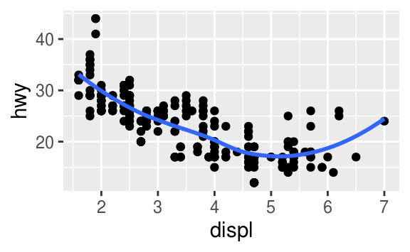
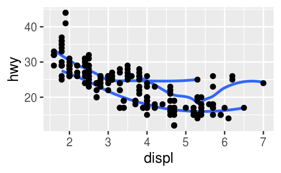
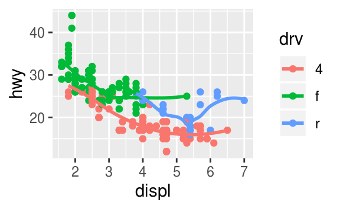
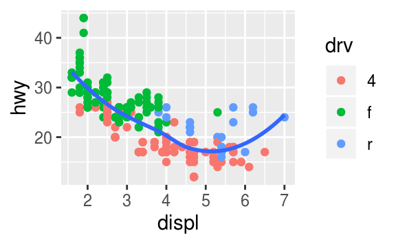
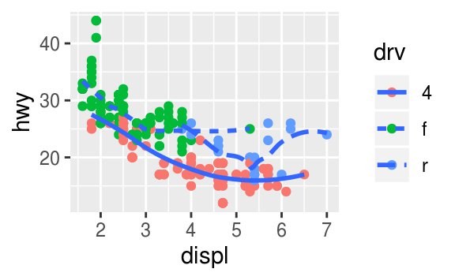
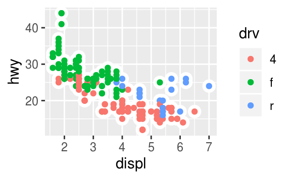

# Data visualisation {#data-visualisation .r4ds-section}

## Introduction {#introduction-1 .r4ds-section}

```{r, message=FALSE,cache=FALSE}
library("tidyverse")
```

## First steps {#first-steps .r4ds-section}

### Exercise 3.2.1{.unnumbered .exercise data-number="3.2.1"}

<div class="question">
Run `ggplot(data = mpg)` what do you see?
</div>

<div class="answer">

```{r}
ggplot(data = mpg)
```

This code creates an empty plot.
The `ggplot()` function creates the background of the plot,
but since no layers were specified with geom function, nothing is drawn.

</div>

### Exercise 3.2.2 {.unnumbered .exercise data-number="3.2.2"}

<div class="question">

How many rows are in `mtcars`?
How many columns?

</div>

<div class="answer">

There are `r nrow(mtcars)` rows and `r ncol(mtcars)` columns in the `mtcars` data frame.
```{r}
nrow(mtcars)
ncol(mtcars)
```

The `glimpse()` function also displays the number of rows and columns in a data frame.
```{r}
glimpse(mtcars)
```

</div>

### Exercise  3.2.3 {.unnumbered .exercise data-number="3.2.3"}

<div class="question">

What does the `drv` variable describe?
Read the help for `?mpg` to find out.

</div>

<div class="answer">

The `drv` variable is a categorical variable which categorizes cars into front-wheels, rear-wheels, or four-wheel drive.[^layout]

| Value      | Description                                                                                   |
|------------|-----------------------------------------------------------------------------------------------|
| `"f"`      | [front-wheel drive](https://en.wikipedia.org/wiki/Front-wheel_drive)                          |
| `"r"`      | [rear-wheel drive](https://en.wikipedia.org/wiki/Automobile_layout#Rear-wheel-drive_layouts)  |
| `"4"`      | [four-wheel drive](https://en.wikipedia.org/wiki/Four-wheel_drive)                            |

[^layout]: See the Wikipedia article on [Automobile layout](https://en.wikipedia.org/wiki/Automobile_layout).

</div>

### Exercise  3.2.4 {.unnumbered .exercise data-number="3.2.4"}

<div class="question">

Make a scatter plot of `hwy` vs. `cyl`.

</div>

<div class="answer">

```{r}
ggplot(mpg, aes(x = hwy, y = cyl)) +
  geom_point()
```

</div>

### Exercise  3.2.5 {.unnumbered .exercise data-number="3.2.5"}

<div class="question">

What happens if you make a scatter plot of `class` vs `drv`?
Why is the plot not useful?

</div>

<div class="answer">

The resulting scatterplot has only a few points.
```{r}
ggplot(mpg, aes(x = class, y = drv)) +
  geom_point()
```
```{r include=FALSE}
n_drv <- length(unique(mpg$drv))
n_class <- length(unique(mpg$class))
n_comb <- n_drv * n_class
n_comb_actual <- nrow(distinct(mpg, drv, class))
```

A scatter plot is not a useful display of these variables since both `drv` and `class` are categorical variables.
Since categorical variables typically take a small number of values,
there are a limited number of unique combinations of (`x`, `y`) values that can be displayed.
In this data, `drv` takes `r n_drv` values and `class` takes `r n_class` values,
meaning that there are only `r n_comb` values that could be plotted on a scatterplot of `drv` vs. `class`.
In this data, there `r n_comb_actual` values of (`drv`, `class`) are observed.

```{r}
count(mpg, drv, class)
```

A simple scatter plot does not show how many observations there are for each (`x`, `y`) value.
As such, scatterplots work best for plotting a continuous x and a continuous y variable, and when all (`x`, `y`) values are unique.

**Warning:** The following code uses functions introduced in a later section.
Come back to this after reading
section [7.5.2](https://r4ds.had.co.nz/exploratory-data-analysis.html#two-categorical-variables), which introduces methods for plotting two categorical variables.
The first is `geom_count()` which is similar to a scatterplot but uses the size of the points to show the number of observations at an (`x`, `y`) point.

```{r}
ggplot(mpg, aes(x = class, y = drv)) +
  geom_count()
```

The second is `geom_tile()` which uses a color scale to show the number of observations with each (`x`, `y`) value.

```{r}
mpg %>%
  count(class, drv) %>%
  ggplot(aes(x = class, y = drv)) +
    geom_tile(mapping = aes(fill = n))
```

In the previous plot, there are many missing tiles.
These missing tiles represent unobserved combinations of `class` and `drv` values.
These missing values are not unknown, but represent values of (`class`, `drv`) where `n = 0`.
The `complete()` function in the tidyr package adds new rows to a data frame for missing combinations of columns.
The following code adds rows for missing combinations of `class` and `drv` and uses the `fill` argument to set `n = 0` for those new rows.

```{r}
mpg %>%
  count(class, drv) %>%
  complete(class, drv, fill = list(n = 0L)) %>%
  ggplot(aes(x = class, y = drv)) +
    geom_tile(mapping = aes(fill = n))
```

</div>

## Aesthetic mappings {#aesthetic-mappings .r4ds-section}

### Exercise 3.3.1 {.unnumbered .exercise data-number="3.3.1"}

<div class="question">

What’s gone wrong with this code?
Why are the points not blue?

```{r}
ggplot(data = mpg) +
  geom_point(mapping = aes(x = displ, y = hwy, colour = "blue"))
```

</div>

<div class="answer">

The argument`colour = "blue"` is included within the `mapping` argument, and as such, it is treated as an aesthetic, which is a mapping between a variable and a value.
In the expression, `colour = "blue"`, `"blue"` is interpreted as a categorical variable which only takes a single value `"blue"`.
If this is confusing, consider how `colour = 1:234` and `colour = 1` are interpreted by `aes()`.

The following code does produces the expected result.

```{r}
ggplot(data = mpg) +
  geom_point(mapping = aes(x = displ, y = hwy), colour = "blue")
```

</div>

### Exercise 3.3.2 {.unnumbered .exercise data-number="3.3.2"}

<div class="question">

Which variables in `mpg` are categorical?
Which variables are continuous?
(Hint: type `?mpg` to read the documentation for the dataset).
How can you see this information when you run `mpg`?

</div>

<div class="answer">

The following list contains the categorical variables in `mpg`.

-   `model`
-   `trans`
-   `drv`
-   `fl`
-   `class`

The following list contains the continuous variables in `mpg`.

-   `displ`
-   `year`
-   `cyl`
-   `cty`
-   `hwy`

In the printed data frame, angled brackets at the top of each column provide type of each variable.

```{r}
mpg
```

Those with `<chr>` above their columns are categorical, while those with `<dbl>` or `<int>` are continuous.
The exact meaning of these types will be discussed in the [Vectors](https://jrnold.github.io/r4ds-exercise-solutions/vectors.html) chapter.

Alternatively, `glimpse()` displays the type of each column.
```{r}
glimpse(mpg)
```

</div>

### Exercise 3.3.3 {.unnumbered .exercise data-number="3.3.3"}

<div class="question">

Map a continuous variable to color, size, and shape.
How do these aesthetics behave differently for categorical vs. continuous variables?

</div>

<div class="answer">

The variable `cty`, city highway miles per gallon, is a continuous variable.

```{r}
ggplot(mpg, aes(x = displ, y = hwy, colour = cty)) +
  geom_point()
```

Instead of using discrete colors, the continuous variable uses a scale that varies from a light to dark blue color.

```{r}
ggplot(mpg, aes(x = displ, y = hwy, size = cty)) +
  geom_point()
```

When mapped to size, the sizes of the points vary continuously as a function of their size.

```{r error=TRUE}
ggplot(mpg, aes(x = displ, y = hwy, shape = cty)) +
  geom_point()
```

When a continuous value is mapped to shape, it gives an error.
Though we could split a continuous variable into discrete categories and use a shape aesthetic, this would conceptually not make sense.
A numeric variable has an order, but shapes do not.
It is clear that smaller points correspond to smaller values, or once the color scale is given, which colors correspond to larger or smaller values. But it is not clear whether a square is greater or less than a circle.

</div>

### Exercise 3.3.4 {.unnumbered .exercise data-number="3.3.4"}

<div class="question">

What happens if you map the same variable to multiple aesthetics?

</div>

<div class="answer">

```{r}
ggplot(mpg, aes(x = displ, y = hwy, colour = hwy, size = displ)) +
  geom_point()
```

In the above plot, `hwy` is mapped to both location on the y-axis and color, and `displ` is mapped to both location on the x-axis and size.
The code works and produces a plot, even if it is a bad one.
Mapping a single variable to multiple aesthetics is redundant.
Because it is redundant information, in most cases avoid mapping a single variable to multiple aesthetics.

</div>

### Exercise 3.3.5 {.unnumbered .exercise data-number="3.3.5"}

<div class="question">

What does the stroke aesthetic do?
What shapes does it work with?
(Hint: use `?geom_point`)

</div>

<div class="answer">

Stroke changes the size of the border for shapes (21-25).
These are filled shapes in which the color and size of the border can differ from that of the filled interior of the shape.

For example
```{r ex.3.3.1.5}
ggplot(mtcars, aes(wt, mpg)) +
  geom_point(shape = 21, colour = "black", fill = "white", size = 5, stroke = 5)
```

</div>

### Exercise  3.3.6 {.unnumbered .exercise data-number="3.3.6"}

<div class="question">

What happens if you map an aesthetic to something other than a variable name, like `aes(colour = displ < 5)`?

</div>

<div class="answer">

```{r ex.3.3.1.6}
ggplot(mpg, aes(x = displ, y = hwy, colour = displ < 5)) +
  geom_point()
```

Aesthetics can also be mapped to expressions like `displ < 5`.
The `ggplot()` function behaves as if a temporary variable was added to the data with with values equal to the result of the expression.
In this case, the result of `displ < 5` is a logical variable which takes values of `TRUE` or `FALSE`.

This also explains why, in [Exercise 3.3.1](#exercise-3.3.1), the expression `colour = "blue"` created a categorical variable with only one category: "blue".

</div>

## Common problems {#common-problems .r4ds-section}

`r no_exercises()`

## Facets

### Exercise 3.5.1 {.unnumbered .exercise data-number="3.5.1"}

<div class="question">

What happens if you facet on a continuous variable?

</div>

<div class="answer">

Let's see.
```{r ex.3.5.1}
ggplot(mpg, aes(x = displ, y = hwy)) +
  geom_point() +
  facet_grid(. ~ cty)
```

The continuous variable is converted to a categorical variable, and the plot contains a facet for each distinct value.

</div>

### Exercise 3.5.2 {.unnumbered .exercise data-number="3.5.2"}

<div class="question">

What do the empty cells in plot with `facet_grid(drv ~ cyl)` mean?
How do they relate to this plot?

```{r results='hide'}
ggplot(data = mpg) +
  geom_point(mapping = aes(x = drv, y = cyl))

```

</div>

<div class="answer">

```{r}
ggplot(data = mpg) +
  geom_point(mapping = aes(x = hwy, y = cty)) +
  facet_grid(drv ~ cyl)
```

The empty cells (facets) in this plot are combinations of `drv` and `cyl` that have no observations.
These are the same locations in the scatter plot of `drv` and `cyl` that have no plots.

```{r}
ggplot(data = mpg) +
  geom_point(mapping = aes(x = drv, y = cyl))
```

</div>

### Exercise 3.5.3 {.unnumbered .exercise data-number="3.5.3"}

<div class="question">

What plots does the following code make?
What does `.` do?

</div>

<div class="answer">

The symbol `.` ignores that dimension when faceting.
For example, `drv ~ .` facet by values of `drv` on the y-axis.

```{r ex.3.5.1.4.a}
ggplot(data = mpg) +
  geom_point(mapping = aes(x = displ, y = hwy)) +
  facet_grid(drv ~ .)
```

While, `. ~ cyl` will facet by values of `cyl` on the x-axis.

```{r ex.3.5.1.4.b}
ggplot(data = mpg) +
  geom_point(mapping = aes(x = displ, y = hwy)) +
  facet_grid(. ~ cyl)
```

</div>

### Exercise 3.5.4 {.unnumbered .exercise data-number="3.5.4"}

<div class="question">

Take the first faceted plot in this section:

```{r}
ggplot(data = mpg) +
  geom_point(mapping = aes(x = displ, y = hwy)) +
  facet_wrap(~class, nrow = 2)
```

What are the advantages to using faceting instead of the colour aesthetic?
What are the disadvantages?
How might the balance change if you had a larger dataset?

</div>

<div class="answer">

In the following plot the `class` variable is mapped to color.

```{r}
ggplot(data = mpg) +
  geom_point(mapping = aes(x = displ, y = hwy, color = class))
```

Advantages of encoding `class` with facets instead of color include the ability to encode more distinct categories.
For me, it is difficult to distinguish between the colors of `"midsize"` and `"minivan"`.

Given human visual perception, the max number of colors to use when encoding
unordered categorical (qualitative) data is nine, and in practice, often much less than that.
Displaying observations from different categories on different scales makes it difficult to directly compare values of observations across categories.
However, it can make it easier to compare the shape of the relationship between the x and y variables across categories.

Disadvantages of encoding the `class` variable with facets instead of the color aesthetic include the difficulty of comparing the values of observations between categories since the observations for each category are on different plots.
Using the same x- and y-scales for all facets makes it easier to compare values of observations across categories, but it is still more difficult than if they had been displayed on the same plot.
Since encoding class within color also places all points on the same plot,
it visualizes the unconditional relationship between the x and y variables;
with facets, the unconditional relationship is no longer visualized since the
points are spread across multiple plots.

The benefits encoding a variable through facetting over color become more advantageous as either the number of points or the number of categories increase.
In the former, as the number of points increases, there is likely to be more overlap.

It is difficult to handle overlapping points with color.
Jittering will still work with color.
But jittering will only work well if there are few points and the classes do not overlap much, otherwise, the colors of areas will no longer be distinct, and it will be hard to pick out the patterns of different categories visually.
Transparency (`alpha`) does not work well with colors since the mixing of overlapping transparent colors will no longer represent the colors of the categories.
Binning methods use already color to encode density, so color cannot be used to encode categories.

As noted before, as the number of categories increases, the difference between
colors decreases, to the point that the color of categories will no longer be
visually distinct.

</div>

### Exercise 3.5.5 {.unnumbered .exercise data-number="3.5.5"}

<div class="question">

Read `?facet_wrap`.
What does `nrow` do? What does `ncol` do?
What other options control the layout of the individual panels?
Why doesn’t `facet_grid()` have `nrow` and `ncol` variables?

</div>

<div class="answer">

The arguments `nrow` (`ncol`) determines the number of rows (columns) to use when laying out the facets.
It is necessary since `facet_wrap()` only facets on one variable.

The `nrow` and `ncol` arguments are unnecessary for `facet_grid()` since the number of unique values of the variables specified in the function determines the number of rows and columns.

</div>

### Exercise 3.5.6 {.unnumbered .exercise data-number="3.5.6"}

<div class="question">

When using `facet_grid()` you should usually put the variable with more unique levels in the columns.
Why?

</div>

<div class="answer">

There will be more space for columns if the plot is laid out horizontally (landscape).

</div>

## Geometric objects {#geometric-objects .r4ds-section}

### Exercise 3.6.1 {.unnumbered .exercise data-number="3.6.1"}

<div class="question">

What geom would you use to draw a line chart?
A boxplot?
A histogram?
An area chart?

</div>

<div class="answer">

-   line chart: `geom_line()`
-   boxplot: `geom_boxplot()`
-   histogram: `geom_histogram()`
-   area chart: `geom_area()`

</div>

### Exercise 3.6.2 {.unnumbered .exercise data-number="3.6.2"}

<div class="question">

Run this code in your head and predict what the output will look like.
Then, run the code in R and check your predictions.

```{r ex-3-6-2,results='hide'}
ggplot(data = mpg, mapping = aes(x = displ, y = hwy, colour = drv)) +
  geom_point() +
  geom_smooth(se = FALSE)
```

</div>

<div class="answer">

This code produces a scatter plot with `displ` on the x-axis, `hwy` on the y-axis, and the points colored by `drv`.
There will be a smooth line, without standard errors, fit through each `drv` group.

```{r echo=TRUE}
ggplot(data = mpg, mapping = aes(x = displ, y = hwy, colour = drv)) +
  geom_point() +
  geom_smooth(se = FALSE)
```

</div>

### Exercise 3.6.3 {.unnumbered .exercise data-number="3.6.3"}

<div class="question">

What does `show.legend = FALSE` do?
What happens if you remove it?
Why do you think I used it earlier in the chapter?

</div>

<div class="answer">

The theme option `show.legend = FALSE` hides the legend box.

Consider this example earlier in the chapter.
```{r}
ggplot(data = mpg) +
  geom_smooth(
    mapping = aes(x = displ, y = hwy, colour = drv),
    show.legend = FALSE
  )
```

In that plot, there is no legend.
Removing the `show.legend` argument or setting `show.legend = TRUE` will result in the plot having  a legend displaying the mapping between colors and `drv`.

```{r}
ggplot(data = mpg) +
  geom_smooth(mapping = aes(x = displ, y = hwy, colour = drv))
```

In the chapter, the legend is suppressed because with three plots,
adding a legend to only the last plot would make the sizes of plots different.
Different sized plots would make it more difficult to see how arguments change the appearance of the plots.
The purpose of those plots is to show the difference between no groups, using a `group` aesthetic, and using a `color` aesthetic, which creates implicit groups.
In that example, the legend isn't necessary since looking up the values associated with each color isn't necessary to make that point.

</div>

### Exercise 3.6.4 {.unnumbered .exercise data-number="3.6.4"}

<div class="question">

What does the `se` argument to `geom_smooth()` do?

</div>

<div class="answer">

It adds standard error bands to the lines.

```{r}
ggplot(data = mpg, mapping = aes(x = displ, y = hwy, colour = drv)) +
  geom_point() +
  geom_smooth(se = TRUE)
```

By default `se = TRUE`:

```{r}
ggplot(data = mpg, mapping = aes(x = displ, y = hwy, colour = drv)) +
  geom_point() +
  geom_smooth()
```

</div>

### Exercise 3.6.5 {.unnumbered .exercise data-number="3.6.5"}

<div class="question">

Will these two graphs look different?
Why/why not?

```{r eval=FALSE}
ggplot(data = mpg, mapping = aes(x = displ, y = hwy)) +
  geom_point() +
  geom_smooth()

ggplot() +
  geom_point(data = mpg, mapping = aes(x = displ, y = hwy)) +
  geom_smooth(data = mpg, mapping = aes(x = displ, y = hwy))
```

</div>

<div class="answer">

No.
Because both `geom_point()` and `geom_smooth()` will use the same data and mappings.
They will inherit those options from the `ggplot()` object, so the mappings don't need to specified again.

```{r}
ggplot(data = mpg, mapping = aes(x = displ, y = hwy)) +
  geom_point() +
  geom_smooth()
```

```{r}
ggplot() +
  geom_point(data = mpg, mapping = aes(x = displ, y = hwy)) +
  geom_smooth(data = mpg, mapping = aes(x = displ, y = hwy))
```

</div>

### Exercise 3.6.6 {.unnumbered .exercise data-number="3.6.6"}

<div class="question">

Recreate the R code necessary to generate the following graphs.

```{r echo=FALSE, fig.width = 3, out.width = "40%", fig.align = "default", purl = FALSE}

```
```{r echo=FALSE, fig.width = 3, out.width = "40%", fig.align = "default", purl = FALSE}

```
```{r echo=FALSE, fig.width = 3, out.width = "40%", fig.align = "default", purl = FALSE}

```
```{r echo=FALSE, fig.width = 3, out.width = "40%", fig.align = "default", purl = FALSE}

```
```{r echo=FALSE, fig.width = 3, out.width = "40%", fig.align = "default", purl = FALSE}

```
```{r echo=FALSE, fig.width = 3, out.width = "40%", fig.align = "default", purl = FALSE}

```

</div>

<div class="answer">

The following code will generate those plots.

```{r message=FALSE}
ggplot(mpg, aes(x = displ, y = hwy)) +
  geom_point() +
  geom_smooth(se = FALSE)
```

```{r message=FALSE}
ggplot(mpg, aes(x = displ, y = hwy)) +
  geom_smooth(mapping = aes(group = drv), se = FALSE) +
  geom_point()
```

```{r message=FALSE}
ggplot(mpg, aes(x = displ, y = hwy, colour = drv)) +
  geom_point() +
  geom_smooth(se = FALSE)
```

```{r message=FALSE}
ggplot(mpg, aes(x = displ, y = hwy)) +
  geom_point(aes(colour = drv)) +
  geom_smooth(se = FALSE)
```

```{r}
ggplot(mpg, aes(x = displ, y = hwy)) +
  geom_point(aes(colour = drv)) +
  geom_smooth(aes(linetype = drv), se = FALSE)
```

```{r}
ggplot(mpg, aes(x = displ, y = hwy)) +
  geom_point(size = 4, color = "white") +
  geom_point(aes(colour = drv))
```

</div>

## Statistical transformations {#statistical-transformations .r4ds-section}

### Exercise 3.7.1 {.unnumbered .exercise data-number="3.7.1"}

<div class="question">

What is the default geom associated with `stat_summary()`?
How could you rewrite the previous plot to use that geom function instead of the stat function?

</div>

<div class="answer">

The "previous plot" referred to in the question is the following.
```{r}
ggplot(data = diamonds) +
  stat_summary(
    mapping = aes(x = cut, y = depth),
    fun.ymin = min,
    fun.ymax = max,
    fun.y = median
  )
```

The default geom for [`stat_summary()`](https://ggplot2.tidyverse.org/reference/stat_summary.html) is `geom_pointrange()`.
The default stat for [`geom_pointrange()`](https://ggplot2.tidyverse.org/reference/geom_linerange.html) is `identity()` but we can add the argument `stat = "summary"` to use `stat_summary()` instead of `stat_identity()`.
```{r}
ggplot(data = diamonds) +
  geom_pointrange(
    mapping = aes(x = cut, y = depth),
    stat = "summary"
  )
```

The resulting message says that `stat_summary()` uses the `mean` and `sd` to calculate the middle point and endpoints of the line.
However, in the original plot the min and max values were used for the endpoints.
To recreate the original plot we need to specify values for `fun.ymin`, `fun.ymax`, and `fun.y`.
```{r}
ggplot(data = diamonds) +
  geom_pointrange(
    mapping = aes(x = cut, y = depth),
    stat = "summary",
    fun.ymin = min,
    fun.ymax = max,
    fun.y = median
  )
```

</div>

### Exercise 3.7.2 {.unnumbered .exercise data-number="3.7.2"}

<div class="question">
What does `geom_col()` do? How is it different to `geom_bar()`?
</div>

<div class="answer">

The `geom_col()` function has different default stat than `geom_bar()`.
The default stat of `geom_col()` is `stat_identity()`, which leaves the data as is.
The `geom_col()` function expects that the data contains `x` values and `y` values which represent the bar height.

The default stat of `geom_bar()` is `stat_count()`.
The `geom_bar()` function only expects an `x` variable.
The stat, `stat_count()`,  preprocesses input data by counting the number of observations for each value of `x`.
The `y` aesthetic uses the values of these counts.

</div>

### Exercise 3.7.3 {.unnumbered .exercise data-number="3.7.3"}

<div class="question">

Most geoms and stats come in pairs that are almost always used in concert.
Read through the documentation and make a list of all the pairs.
What do they have in common?

</div>

<div class="answer">

The following tables lists the pairs of geoms and stats that are almost always used in concert.

| geom                | stat                |
|---------------------|---------------------|
| `geom_bar()`        | `stat_count()`      |
| `geom_bin2d()`      | `stat_bin_2d()`     |
| `geom_boxplot()`    | `stat_boxplot()`    |
| `geom_contour()`    | `stat_contour()`    |
| `geom_count()`      | `stat_sum()`        |
| `geom_density()`    | `stat_density()`    |
| `geom_density_2d()` | `stat_density_2d()` |
| `geom_hex()`        | `stat_hex()`        |
| `geom_freqpoly()`   | `stat_bin()`        |
| `geom_histogram()`  | `stat_bin()`        |
| `geom_qq_line()`    | `stat_qq_line()`    |
| `geom_qq()`         | `stat_qq()`         |
| `geom_quantile()`   | `stat_quantile()`   |
| `geom_smooth()`     | `stat_smooth()`     |
| `geom_violin()`     | `stat_violin()`     |
| `geom_sf()`         | `stat_sf()`         |

Table: Complementary geoms and stats

They tend to have their names in common, `stat_smooth()` and `geom_smooth()`.
However, this is not always the case, with `geom_bar()` and `stat_count()` and `geom_histogram()` and `geom_bin()` as notable counter-examples.
Also, the pairs of geoms and stats that are used in concert almost always have each other as the default stat (for a geom) or geom (for a stat).

The following tables contain the geoms and stats in [ggplot2](https://ggplot2.tidyverse.org/reference/).

| geom                | default stat        | shared docs |
|:--------------------|:--------------------|-------------|
| `geom_abline()`     |                     |             |
| `geom_hline()`      |                     |             |
| `geom_vline()`      |                     |             |
| `geom_bar()`        | `stat_count()`      | x           |
| `geom_col()`        |                     |             |
| `geom_bin2d()`      | `stat_bin_2d()`     | x           |
| `geom_blank()`      |                     |             |
| `geom_boxplot()`    | `stat_boxplot()`    | x           |
| `geom_countour()`   | `stat_countour()`   | x           |
| `geom_count()`      | `stat_sum()`        | x           |
| `geom_density()`    | `stat_density()`    | x           |
| `geom_density_2d()` | `stat_density_2d()` | x           |
| `geom_dotplot()`    |                     |             |
| `geom_errorbarh()`  |                     |             |
| `geom_hex()`        | `stat_hex()`        | x           |
| `geom_freqpoly()`   | `stat_bin()`        | x           |
| `geom_histogram()`  | `stat_bin()`        | x           |
| `geom_crossbar()`   |                     |             |
| `geom_errorbar()`   |                     |             |
| `geom_linerange()`  |                     |             |
| `geom_pointrange()` |                     |             |
| `geom_map()`        |                     |             |
| `geom_point()`      |                     |             |
| `geom_map()`        |                     |             |
| `geom_path()`       |                     |             |
| `geom_line()`       |                     |             |
| `geom_step()`       |                     |             |
| `geom_point()`      |                     |             |
| `geom_polygon()`    |                     |             |
| `geom_qq_line()`    | `stat_qq_line()`    | x           |
| `geom_qq()`         | `stat_qq()`         | x           |
| `geom_quantile()`   | `stat_quantile()`   | x           |
| `geom_ribbon()`     |                     |             |
| `geom_area()`       |                     |             |
| `geom_rug()`        |                     |             |
| `geom_smooth()`     | `stat_smooth()`     | x           |
| `geom_spoke()`      |                     |             |
| `geom_label()`      |                     |             |
| `geom_text()`       |                     |             |
| `geom_raster()`     |                     |             |
| `geom_rect()`       |                     |             |
| `geom_tile()`       |                     |             |
| `geom_violin()`     | `stat_ydensity()`   | x           |
| `geom_sf()`         | `stat_sf()`         | x           |

Table: ggplot2 geom layers and their default stats.

| stat                 | default geom        | shared docs |
|:---------------------|:--------------------|-------------|
| `stat_ecdf()`        | `geom_step()`       |             |
| `stat_ellipse()`     | `geom_path()`       |             |
| `stat_function()`    | `geom_path()`       |             |
| `stat_identity()`    | `geom_point()`      |             |
| `stat_summary_2d()`  | `geom_tile()`       |             |
| `stat_summary_hex()` | `geom_hex()`        |             |
| `stat_summary_bin()` | `geom_pointrange()` |             |
| `stat_summary()`     | `geom_pointrange()` |             |
| `stat_unique()`      | `geom_point()`      |             |
| `stat_count()`       | `geom_bar()`        | x           |
| `stat_bin_2d()`      | `geom_tile()`       | x           |
| `stat_boxplot()`     | `geom_boxplot()`    | x           |
| `stat_countour()`    | `geom_contour()`    | x           |
| `stat_sum()`         | `geom_point()`      | x           |
| `stat_density()`     | `geom_area()`       | x           |
| `stat_density_2d()`  | `geom_density_2d()` | x           |
| `stat_bin_hex()`     | `geom_hex()`        | x           |
| `stat_bin()`         | `geom_bar()`        | x           |
| `stat_qq_line()`     | `geom_path()`       | x           |
| `stat_qq()`          | `geom_point()`      | x           |
| `stat_quantile()`    | `geom_quantile()`   | x           |
| `stat_smooth()`      | `geom_smooth()`     | x           |
| `stat_ydensity()`    | `geom_violin()`     | x           |
| `stat_sf()`          | `geom_rect()`       | x           |

Table: ggplot2 stat layers and their default geoms.

</div>

### Exercise  3.7.4 {.unnumbered .exercise data-number="3.7.4"}

<div class="question">

What variables does `stat_smooth()` compute?
What parameters control its behavior?

</div>

<div class="answer">

The function `stat_smooth()` calculates the following variables:

-   `y`: predicted value
-   `ymin`: lower value of the confidence interval
-   `ymax`: upper value of the confidence interval
-   `se`: standard error

The "Computed Variables" section of the `stat_smooth()` documentation contains these variables.

The parameters that control the behavior of `stat_smooth()` include

-   `method`: the method used to
-   `formula`: the formula are parameters such as `method` which determines which method is used to calculate the predictions and confidence interval, and some other arguments that are passed to that.
-   `na.rm`:

</div>

### Exercise  3.7.5 {.unnumbered .exercise data-number="3.7.5"}

<div class="question">

In our proportion bar chart, we need to set `group = 1` Why?
In other words, what is the problem with these two graphs?

</div>

<div class="answer">

If `group = 1` is not included, then all the bars in the plot will have the same height, a height of 1.
The function `geom_bar()` assumes that the groups are equal to the `x` values since the stat computes the counts within the group.

```{r}
ggplot(data = diamonds) +
  geom_bar(mapping = aes(x = cut, y = ..prop..))
```

The problem with these two plots is that the proportions are calculated within the groups.
```{r}
ggplot(data = diamonds) +
  geom_bar(mapping = aes(x = cut, y = ..prop..))

ggplot(data = diamonds) +
  geom_bar(mapping = aes(x = cut, fill = color, y = ..prop..))
```

The following code will produce the intended stacked bar charts for the case with no `fill` aesthetic.
```{r}
ggplot(data = diamonds) +
  geom_bar(mapping = aes(x = cut, y = ..prop.., group = 1))
```

With the `fill` aesthetic, the heights of the bars need to be normalized.
```{r}
ggplot(data = diamonds) + 
  geom_bar(aes(x = cut, y = ..count.. / sum(..count..), fill = color))
```

</div>

## Position adjustments {#position-adjustments .r4ds-section}

### Exercise  3.8.1 {.unnumbered .exercise data-number="3.8.1"}

<div class="question">

What is the problem with this plot?
How could you improve it?

```{r}
ggplot(data = mpg, mapping = aes(x = cty, y = hwy)) +
  geom_point()
```

</div>

<div class="answer">

There is overplotting because there are multiple observations for each combination of `cty` and `hwy` values.

I would improve the plot by using a jitter position adjustment to decrease overplotting.

```{r}
ggplot(data = mpg, mapping = aes(x = cty, y = hwy)) +
  geom_point(position = "jitter")
```

The relationship between `cty` and `hwy` is clear even without jittering the points
but jittering shows the locations where there are more observations.

</div>

### Exercise  3.8.2 {.unnumbered .exercise data-number="3.8.2"}

<div class="question">

What parameters to `geom_jitter()` control the amount of jittering?

</div>

<div class="answer">

From the [`geom_jitter()`](https://ggplot2.tidyverse.org/reference/geom_jitter.html) documentation, there are two arguments to jitter:

-   `width` controls the amount of vertical displacement, and
-   `height` controls the amount of horizontal displacement.

The defaults values of `width` and `height` will introduce noise in both directions.
Here is what the plot looks like with the default values of `height` and `width`.

```{r}
ggplot(data = mpg, mapping = aes(x = cty, y = hwy)) +
  geom_point(position = position_jitter())
```

However, we can adjust them. Here are few a examples to understand how these
parameters affects jittering.
When`width = 0` there is no horizontal jitter.

```{r}
ggplot(data = mpg, mapping = aes(x = cty, y = hwy)) +
  geom_jitter(width = 0)
```

When `width = 20`, there is too much horizontal jitter.

```{r}
ggplot(data = mpg, mapping = aes(x = cty, y = hwy)) +
  geom_jitter(width = 20)
```

When `height = 0`, there is no vertical jitter.

```{r}
ggplot(data = mpg, mapping = aes(x = cty, y = hwy)) +
  geom_jitter(height = 0)
```

When `height = 15`, there is too much vertical jitter.

```{r}
ggplot(data = mpg, mapping = aes(x = cty, y = hwy)) +
  geom_jitter(height = 15)
```

When `width = 0` and `height = 0`, there is neither horizontal or vertical jitter,
and the plot produced is identical to the one produced with `geom_point()`.

```{r}
ggplot(data = mpg, mapping = aes(x = cty, y = hwy)) +
  geom_jitter(height = 0, width = 0)
```

Note that the `height` and `width` arguments are in the units of the data.
Thus `height = 1` (`width = 1`) corresponds to different relative amounts of jittering depending on the scale of the `y` (`x`) variable.
The default values of `height` and `width` are defined to be 80% of the `resolution()` of the data, which is the smallest non-zero distance between adjacent values of a variable.
When `x` and `y` are discrete variables,
their resolutions are both equal to 1, and `height = 0.4` and `width = 0.4` since the jitter moves points in both positive and negative directions.

</div>

### Exercise  3.8.3 {.unnumbered .exercise data-number="3.8.3"}

<div class="question">

Compare and contrast `geom_jitter()` with `geom_count()`.

</div>

<div class="answer">

The geom `geom_jitter()` adds random variation to the locations points of the graph.
In other words, it "jitters" the locations of points slightly.
This method reduces overplotting since two points with the same location are unlikely to have the same random variation.

```{r}
ggplot(data = mpg, mapping = aes(x = cty, y = hwy)) +
  geom_jitter()
```

However, the reduction in overlapping comes at the cost of slightly changing the `x` and `y` values of the points.

The geom `geom_count()` sizes the points relative to the number of observations.
Combinations of (`x`, `y`) values with more observations will be larger than those with fewer observations.

```{r}
ggplot(data = mpg, mapping = aes(x = cty, y = hwy)) +
  geom_count()
```

The `geom_count()` geom does not change `x` and `y` coordinates of the points.
However, if the points are close together and counts are large, the size of some
points can itself create overplotting.
For example, in the following example, a third variable mapped to color is added to the plot. In this case, `geom_count()` is less readable than `geom_jitter()` when adding a third variable as a color aesthetic.

```{r}
ggplot(data = mpg, mapping = aes(x = cty, y = hwy, color = class)) +
  geom_jitter()
```

```{r}  
ggplot(data = mpg, mapping = aes(x = cty, y = hwy, color = class)) +
  geom_count()
```

As that example shows, unfortunately, there is no universal solution to overplotting.
The costs and benefits of different approaches will depend on the structure of the data and the goal of the data scientist.

</div>

### Exercise  3.8.4 {.unnumbered .exercise data-number="3.8.4"}

<div class="question">

What’s the default position adjustment for `geom_boxplot()`?
Create a visualization of the `mpg` dataset that demonstrates it.

</div>

<div class="answer">

The default position for `geom_boxplot()` is `"dodge2"`, which is a shortcut for `position_dodge2`.
This position adjustment does not change the vertical position of a geom but moves the geom horizontally to avoid overlapping other geoms.
See the documentation for [`position_dodge2()`](https://ggplot2.tidyverse.org/reference/position_dodge.html) for additional discussion on how it works.

When we add `colour = class` to the box plot, the different levels of the `drv` variable are placed side by side, i.e., dodged.
```{r}
ggplot(data = mpg, aes(x = drv, y = hwy, colour = class)) +
  geom_boxplot()
```
If `position_identity()` is used the boxplots overlap.
```{r}
ggplot(data = mpg, aes(x = drv, y = hwy, colour = class)) +
  geom_boxplot(position = "identity")
```

</div>

## Coordinate systems {#coordinate-systems .r4ds-section}

### Exercise 3.9.1 {.unnumbered .exercise data-number="3.9.1"}

<div class="question">

Turn a stacked bar chart into a pie chart using `coord_polar()`.

</div>

<div class="answer">

A pie chart is a stacked bar chart with the addition of polar coordinates.
Take this stacked bar chart with a single category.

```{r}
ggplot(mpg, aes(x = factor(1), fill = drv)) +
  geom_bar()
```

Now add `coord_polar(theta="y")` to create pie chart.

```{r}
ggplot(mpg, aes(x = factor(1), fill = drv)) +
  geom_bar(width = 1) +
  coord_polar(theta = "y")
```

The argument `theta = "y"` maps `y` to the angle of each section.
If `coord_polar()` is specified without `theta = "y"`, then the resulting plot is called a bulls-eye chart.

```{r}
ggplot(mpg, aes(x = factor(1), fill = drv)) +
  geom_bar(width = 1) +
  coord_polar()
```

</div>

### Exercise 3.9.2 {.unnumbered .exercise data-number="3.9.2"}

<div class="question">

What does `labs()` do?
Read the documentation.

</div>

<div class="answer">

The `labs` function adds axis titles, plot titles, and a caption to the plot.

```{r}
ggplot(data = mpg, mapping = aes(x = class, y = hwy)) +
  geom_boxplot() +
  coord_flip() +
  labs(y = "Highway MPG",
       x = "Class",
       title = "Highway MPG by car class",
       subtitle = "1999-2008",
       caption = "Source: http://fueleconomy.gov")
```

The arguments to `labs()` are optional, so you can add as many or as few of these as are needed.
```{r}
ggplot(data = mpg, mapping = aes(x = class, y = hwy)) +
  geom_boxplot() +
  coord_flip() +
  labs(y = "Highway MPG",
       x = "Year",
       title = "Highway MPG by car class")
```

The `labs()` function is not the only function that adds titles to plots.
The `xlab()`, `ylab()`, and x- and y-scale functions can add axis titles.
The `ggtitle()` function adds plot titles.

</div>

### Exercise 3.9.3 {.unnumbered .exercise data-number="3.9.3"}

<div class="question">

What’s the difference between `coord_quickmap()` and `coord_map()`?

</div>

<div class="answer">

The `coord_map()` function uses map projections to project the three-dimensional Earth onto a two-dimensional plane.
By default, `coord_map()` uses the [Mercator projection](https://en.wikipedia.org/wiki/Mercator_projection).
This projection is applied to all the geoms in the plot.
The `coord_quickmap()` function uses an approximate but faster map projection.
This approximation ignores the curvature of Earth and adjusts the map for the  latitude/longitude ratio.
The `coord_quickmap()` project is faster than `coord_map()` both because the projection is computationally easier, and unlike `coord_map()`, the coordinates of the individual geoms do not need to be transformed.

See the [coord_map()](https://ggplot2.tidyverse.org/reference/coord_map.html) documentation for more information on these functions and some examples.

</div>

### Exercise 3.9.4 {.unnumbered .exercise data-number="3.9.4"}

<div class="question">

What does the plot below tell you about the relationship between city and highway mpg?
Why is `coord_fixed()` important?
What does `geom_abline()` do?

</div>

<div class="answer">

The function `coord_fixed()` ensures that the line produced by `geom_abline()` is at a 45-degree angle.
A 45-degree line makes it easy to compare the highway and city mileage to the case in which city and highway MPG were equal.

```{r}
p <- ggplot(data = mpg, mapping = aes(x = cty, y = hwy)) +
  geom_point() +
  geom_abline()
p + coord_fixed()
```

If we didn't include `geom_coord()`, then the line would no longer have an angle of 45 degrees.
```{r}
p
```

On average, humans are best able to perceive differences in angles relative to 45 degrees.
See @Cleveland1993, @Cleveland1994,@Cleveland1993a, @ClevelandMcGillMcGill1988,  @HeerAgrawala2006 for discussion on how the aspect ratio of a plot affects perception of the values it encodes, evidence that 45-degrees is generally optimal, and methods to calculate the an aspect ratio to achieve it.
The function `ggthemes::bank_slopes()` will calculate the optimal aspect ratio to bank slopes to 45-degrees.

</div>

## The layered grammar of graphics {#the-layered-grammar-of-graphics .r4ds-section}

`r no_exercises()`
